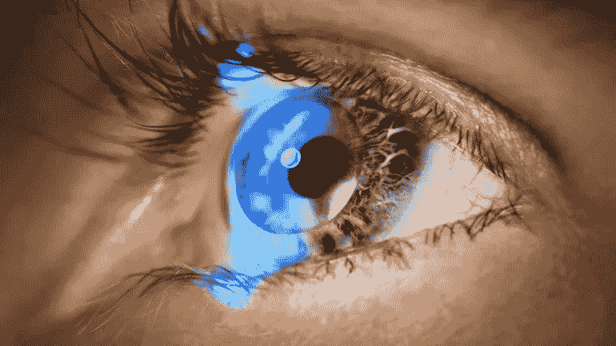
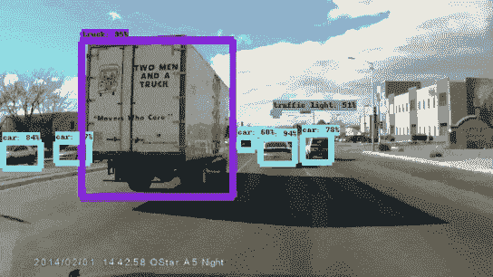
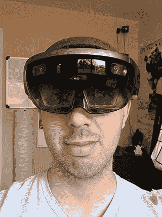
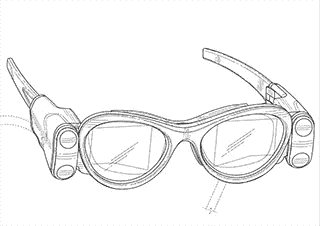

# 消费者增强现实之路

> 原文：<https://medium.com/swlh/the-road-to-consumer-augmented-reality-4ff502a7a1b6>

随着虚拟现实(VR)的幻灭低谷的到来，我们的行业已经转向增强现实(AR)作为下一个巨大的希望。与虚拟现实相比，增强现实在技术上更具挑战性，但提供的回报可能更大。如何才能建立一个强大、充满活力的 AR 生态系统，与 iPhone 的应用商店相媲美？我们需要四个组件来创建广泛采用 AR 的平台:**空间服务、人工智能(AI)、用户界面(UI)和硬件**。有了软件开发工具包(SDK)形式的这四个组件，开发人员就可以开始构建真正有用和引人注目的 AR 应用程序了。

**空间服务**

真正有用的 AR 需要设备理解你在世界中的语境；不仅仅是像谷歌地图这样的地球表面的二维位置，而是对你的位置和方向，以及你周围的特征和物体的三维理解。这需要一张详细的室内 3D 地图:住宅、商业和公共空间。目前没有可用的基于服务的内部 3d 特征数据集，设备可以用来定位— [奥里·因巴尔将其称为 ar 云](/super-ventures-blog/arkit-and-arcore-will-not-usher-massive-adoption-of-mobile-ar-da3d87f7e5ad)。阅读他的博客文章，了解关于这种工作方式的有趣的技术细节。

虽然构建 3D 空间服务在技术上具有挑战性，但从开发人员的角度来看，构建这一服务需要做些什么是显而易见的:平台需要为开发人员提供 3D 高分辨率版本的 iPhone 定位服务——融合了 GPS、摄像头和惯性测量单元(IMU)数据，以确定您在世界任何地方的准确位置和方向，无论是在室内还是室外。你可以认为最终结果类似于大型多人在线角色扮演游戏，但我们不是同步游戏世界，而是在用户之间同步物理空间(特征)中的 3D 点。

也许比构建全球范围的空间服务技术更具挑战性的是，首先要构建生成和收集数据集的商业策略。与谷歌地图不同的是，谷歌让员工带着地图设备进入世界，通过驾驶它们来绘制道路，公司不能简单地让员工进入你的家或你的工作场所来绘制内部地图。虽然这可能适用于商场和主题公园等公共室内，但不适用于私有企业，更不用说私人住宅了。我们必须找到令人信服的理由来说服消费者和企业扫描他们的内部，并将这些数据存储在某人的云服务上。

对于消费者来说，最有可能的方式将是游戏等娱乐应用。当你在你的空间里玩 AR 游戏时，你将绘制并优化你家的特征。目前，它保存在您的设备上，但需要存储在服务器上，以允许无限量的映射空间，以及同一物理空间中不同 AR 设备之间的同步。对于企业来说，似乎可能会有针对该领域消费者的营销和广告用例的混合，以及企业内部的企业用例。

这对创业公司来说是一个很好的机会，因为这个问题在很大程度上还没有解决；大型科技公司只是刚刚准备好解决这个问题，最重要的是，通过 ARKit 和 ARCore,*为什么*人们应该使用 AR 的价值主张才刚刚开始探索。一家初创公司创建一个商业广告平台只是时间问题，该平台使用 ARKit/Core 使企业可以轻松提供 3D/AR 促销，作为交换，可以获得有价值的室内地图数据。下一个可以在室内玩的口袋妖怪 Go 病毒感觉将产生大量的室内住宅数据，这些数据将具有难以置信的价值。

**人工智能**

对于 AR 来说，要充分发挥其潜力，设备和应用程序只知道它们在哪个位置以及空间中有哪些一般功能是不够的。我们必须对空间中的单个物体有更详细的了解，它们如何相互关联，以及它们如何与用户关联。这将通过擅长 [**异议检测和识别**](/towards-data-science/is-google-tensorflow-object-detection-api-the-easiest-way-to-implement-image-recognition-a8bd1f500ea0) 的人工智能(AI)系统来实现。最新的人工智能技术使得[机器在某些视觉识别任务中超越人类](https://www.entrepreneur.com/article/283990)成为可能。

如果我在杂货店购物，我可能想在购物时运行视觉产品搜索，让我知道在商店的其他地方、另一家商店或网上是否有更好的价格。为此，我的设备必须快速可靠地理解我正在查看的产品。亚马逊在这一领域取得了巨大的进步。

更广泛的视觉搜索是一个雄心勃勃的问题，包括谷歌、 [Pinterest](https://techcrunch.com/2017/02/08/pinterest-adds-visual-search-for-elements-in-images-and-through-your-camera/) 和 [Blippar](https://blippar.com/en/resources/blog/2016/06/09/introducing-new-blippar-app-power-visual-discovery/) 在内的公司都在努力解决这个问题。这将允许设备识别所有类型的对象。它可以识别城市公交车，并自动搜索公交车路线，以查看这是哪辆公交车，以及它是否是您需要准时到达日历中的下一场活动的公交车。它能识别你家的门，并在你靠近时为你开门。这是我们多年来在书籍和电影中想象的高度感知上下文的 AR 类型。

对于拥有机器学习专业知识的公司来说，这是一个机会，他们可以访问或生成大型视觉训练数据集来构建这些类型的识别器。此外，我们将看到更多通用的人工智能，它从 AR 可穿戴设备中获取输入，并将它们与个人数据(日历、偏好)相结合，以实时确定你当前的背景，并在你需要时向你推送相关数据。这种按需虚拟助理将进一步增加与我们的数字世界和自我的无缝和自然的互动。

**用户界面**

AR 平台的下一个关键组件是下一代用户界面。在[自然计算](/@peterawilkins/natural-computing-the-convergence-of-augmented-and-virtual-reality-adde8226ea36)中，我讨论了 AR/VR 技术如何消除我们和数字世界之间的人为障碍和抽象，使我们能够以与自然世界互动的方式与数字世界互动。

理想的 AR 界面不需要控制器、棒或其他机械输入设备。它应该利用我们本能地知道如何使用的控制器:我们的手。苹果开创了造型设计，将 2D 用户界面与我们已经熟悉的物理类比联系起来。当我们可以使用我们已经熟悉的触摸和手势的 3d 类比进行交互时，AR 将是最好的。这是 ARKit/Core 的一个重大倒退；虽然它提供了对 AR 世界的一瞥，但我们仍然使用昨天的移动计算手势进行交互。

这种互动的一个很好的例子来自 [Leap Motion](https://www.leapmotion.com/) 。他们的设备允许自然的手跟踪，即使你的手在视线之外。此外，他们还展示了一些对增强现实很有意义的人机界面范例。

对于公司来说，这是一个很好的机会来构建跨平台的用户界面框架(想想 [Qt](https://www.qt.io/) 或用于 AR 的 Cocoa Touch ),这些框架可以发现并传播未来将成为标准的用户交互范式。一些用户界面将依赖于硬件平台及其感知能力的细节，但是其他的将是跨平台通用的。找到这些通用的 3d 交互范例，并将它们打包成 SDK 供开发人员使用可能是有价值的。在 VR 中使用 Leap Motion tracker 将是开始构建明天的 AR 界面系统的一种方式。

**硬件**

最后，我们需要一种比智能手机提供的“神奇窗口”更好的外形或设备。长期以来，AR 硬件一直被视为某种可穿戴设备，通常被描述为眼镜。我们目前有来自微软、DAQRI 和 Meta 的第一代可穿戴 AR 显示器。这些都是昂贵的，对消费者不友好的，并且在某些情况下需要一台连接的计算机来运行。在很大程度上，当前这一代 AR 可穿戴设备是为企业使用而设计的。

Consumer-unfriendly Microsoft Hololens

ARkit 和 ARCore 试图通过利用当今的智能手机解锁 AR 用例的子集来扮演消费者 AR 可穿戴设备的角色。这是一个聪明的方法，因为它允许以前有 2D 开发(web 和移动)经验的开发人员习惯于 3D 开发(Unity，Unreal)，并允许开发人员开始思考什么样的应用程序在这种范式中有意义，以及需要什么样的服务来实现这些应用程序。

Magic Leap 已经筹集了超过 10 亿美元的资金，而且一直有传言说它正在开发一款更实用的可穿戴设备，供消费者使用。

硬件还有很长的路要走，硬件的开发成本也是出了名的昂贵，这使得这个领域成为初创公司的一个具有挑战性的目标。

**结论**

一旦硬件、空间服务、AI/对象识别器和自然用户界面被结合到一个设备和 SDK 中，我们所知道的计算世界将永远改变。在这一点上，每个人都可以开始试验和构建新的用例及应用程序，为用户带来真正的价值。

基于消费者 VR 的大肆宣传和随后的缓慢发展，我们应该小心确保 AR 不是“寻找问题的解决方案”。而不是指望新硬件功能的新奇(“哇，我可以四处看看”或“哇，那个动物/人/物体离我的脸这么近！”)，我们应该像[斯蒂芬·科维建议的那样](https://www.stephencovey.com/7habits/7habits.php)“从心中的目的开始”。让 AR 如此有用的价值主张是什么？在这种新的计算模式中，什么样的应用程序或内容有意义？有哪些事情我们只能在 AR 中做，而在其他任何格式中都没有意义？

肯定会有类似于旧游戏类型的新型游戏体验；在 [Emergent VR](http://www.emergentvr.com) 上，我们使用 HoloLens 和 ARKit 制作了一个世界规模的 AR 第一人称射击游戏的原型:

但是也会有我们还没有想到的新游戏类型。这是任何新平台或计算范式最令人兴奋的机会之一:找到尚未被发现的用例的能力。除了娱乐和游戏，AR 的实用性可能是它最大的贡献。

拥有一个始终在线并持续了解您的空间环境和其中的对象的平台，将使强大的人工智能能够充分理解您，以实时推送您需要的数据和信息。先进的硬件显示器将这些信息无缝、自然地呈现在你周围的真实世界中。最后，您可以以直观和自然的方式与这些信息进行交互。这个平台将为企业和消费者带来变革，并为愿意冒险开发实现这一目标所需的系统的初创公司和后期公司提供巨大的机会。

## 这篇文章发表在《创业》杂志上，有 258，400 多人聚集在一起阅读 Medium 关于创业的主要报道。

## 在这里订阅接收[我们的头条新闻](http://growthsupply.com/the-startup-newsletter/)。

