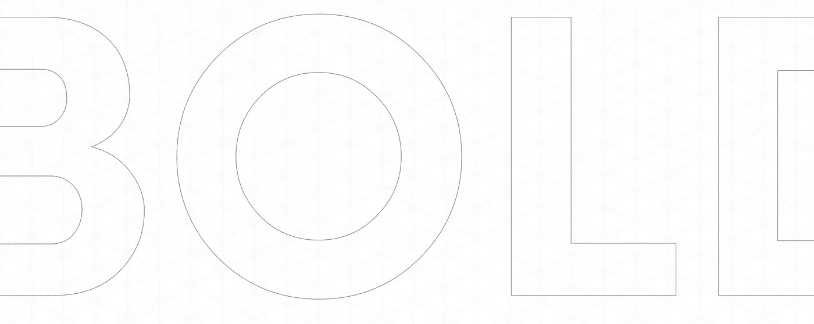
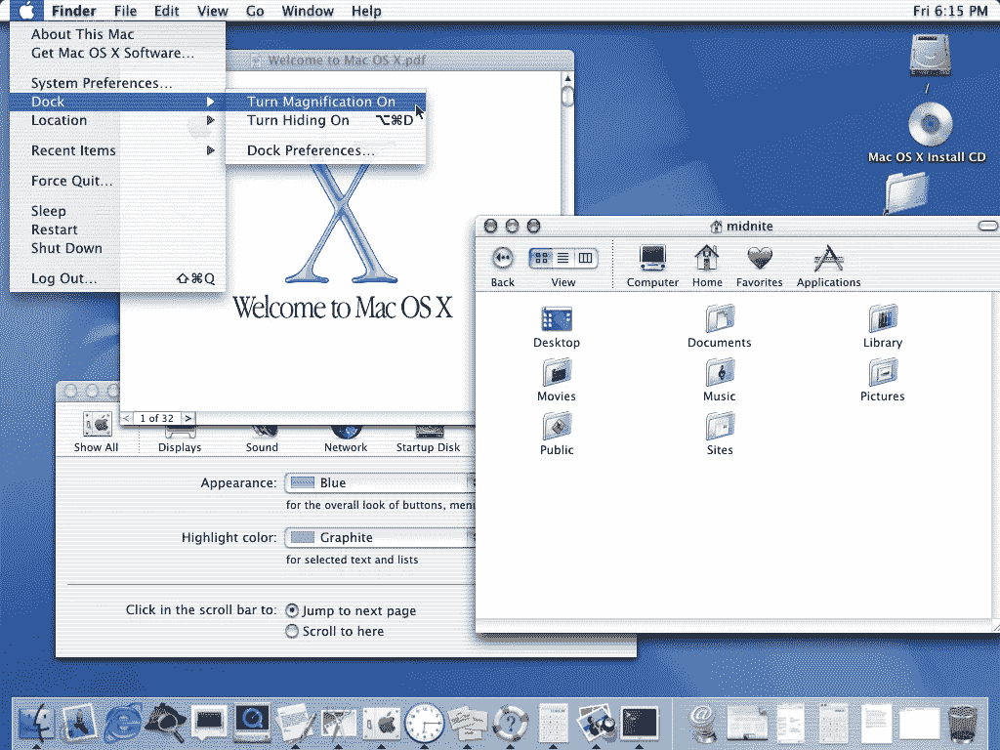
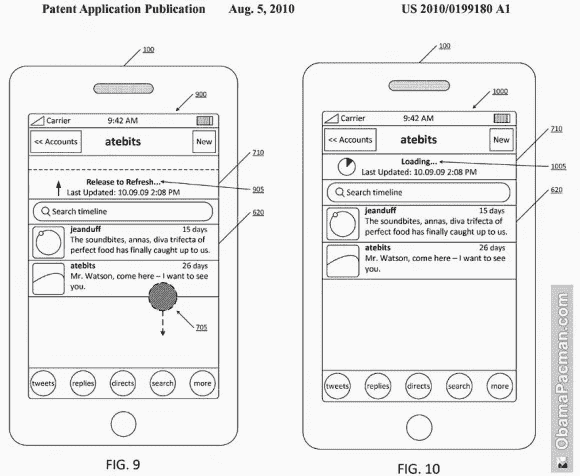

# 大胆在产品设计中的作用

> 原文：<https://medium.com/swlh/the-role-of-being-bold-in-product-design-4540f540211>

最近有人在 Quora 上问了这个问题，我想我应该分享一下我的想法。

> “大胆在产品设计中有什么作用？”

想一个你认为具有颠覆性的产品。这是什么？又是什么让某样东西开始变得"**粗体**？

Bold 通常暗指新奇。人们不会认为外观和功能与现有产品相似的产品是新颖的、原创的或卓越的。

这是产品设计师面临的最大挑战之一:*你怎样才能设计出既实用、易用又大胆的东西？*

一些关键的区别是视觉设计、用户体验和产品本身的核心功能。

让我们来看看每一种因素是如何影响认知的，以及你通常会遇到的一系列挑战:

## **视觉设计**

产品的外观是区分它的最切实可行的方式。想想 OS X·阿卡。操作系统的整个语言被特别设计成流动的。这是一种全新的视觉风格。

OS X Aqua screenshot

Aqua 以一种引人注目的方式传达了一种新的信息。

在当今世界，交互设计和视觉设计是密不可分的。你不可能拥有一个而不影响另一个。因此，在这方面真正创新变得具有挑战性。

为什么？

因为研究反复表明，在你看到用户性能下降之前，你只能在某一点上偏离既定的模式。所以，你会发现自己面临着可用性和视觉设计之间的权衡。想出一个*新颖的*导航概念用户需要花时间学习，或者让它看起来和工作起来和别人差不多，被人感觉不那么“大胆”。

关键的挑战是设计和创造一些我们期望的外观和工作方式，同时又感觉新颖独特的东西。没有指南可以解释如何做到这一点。正是这种能力，将优秀的设计师与伟大的设计师区分开来。经验是不可替代的。

## **核心功能**

改变一个产品的核心是创新和“大胆”的另一种方式。设计是关于解决一个问题。然而，随着今天对设计的盲目崇拜，它的角色已经发生了变化。已经不是特色了。这是期望。这是进入大众消费市场的门槛。

如今，核心差异化往往需要发生在更深、更基本的层面上。

世界上最大的在线太阳镜零售商之一 Warby Parker 由几个学生创办。他们的想法很简单。他们观察了其他企业如何在网上销售鞋子和时装。所以他们想知道:为什么不把同样的概念应用到太阳镜和处方眼镜上呢？

朋友甚至投资者告诉他们，他们疯了。但是他们有足够的勇气坚持到底，将想法变成现实。大胆的设计往往是大胆想法的体现。

他们采用了网上销售产品的核心理念，但将其应用于一个以前没有人认为可行的行业。

## **UX**

产品的最终用户体验可能是大胆的，当它涉及以前看不到的模式或解决现有问题的新方法时。

虽然，拉刷新只是一个微交互，但我还是觉得这是一个很棒的例子。由 [Loren Brichter](https://medium.com/u/de48cbcc3e8b?source=post_page-----4540f540211--------------------------------) 发明的简单交互是今天请求新内容的标准方式。

Pull to refresh patent

是什么让这种模式如此引人注目？这不需要任何解释。它的功能是如此无缝地嵌入到体验中，以至于几乎看不见。将这些不同的细节结合起来，可以塑造一个产品的更大的感知。

但显然这不仅仅适用于微观互动。良好的 UX 发生在更基础的层面上，并从精心构建的信息架构开始。没有良好的结构、清晰的信息和对本质的还原，伟大的 UX 就不会发生。

用户体验正变得越来越难以作为一个关键的差异化因素，并迅速变成一种商品。我们可能需要探索新的方法，在更基本的层面上区分我们自己和我们构建的产品。

# **什么是大胆的产品设计？**

大胆的产品要么解决一系列全新的问题，要么以新的方式解决现有的问题。艺术就是让不熟悉的东西看起来熟悉，但又没有陈旧的感觉。

感谢阅读！💯

## 这个故事发表在 [The Startup](https://medium.com/swlh) 上，Medium 的出版物有超过 256，410 人关注。

# 订阅[在此获取头条](http://growthsupply.com/the-startup-newsletter/)。

