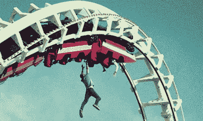

# 企业家精神的过山车

> 原文：<https://medium.com/swlh/the-roller-f-cking-coaster-of-entrepreneurship-2a37f9d7d4b0>

你有没有想过为自己创业是什么感觉
发自内心的想法

我们都有一个目标
至少他们是这么说的
但是在你自己的生意中
你会忘记时间和日子

一切都是一种折磨
看不到希望
不停地战斗
只是为了看到光明

这是多年的艰苦奋斗
它很可能会失败
但这是他们不会告诉你的
它总是去地狱

这是旅程的一部分
也是我们经常了解
我们到底是由什么组成的
何时轮到我们

经历了许多失败之后，你才能最终看到成功。一夜之间的感觉那只是压力的一个原因

你多久被打一次并不重要，唯一重要的是从那次事故中爬起来

这有点像商业
地狱，这就是生活
这个世界会让你失望
然后用刀捅你

当你的世界在旋转，你的企业在流血，许多企业家想知道，死了是不是更好？

但是战斗到明天
就再来一轮我发誓
真正成功的人总是在那里寻找

无论是为了寻求灵感还是躲避风暴，改变世界的人们总是打破常规

你知道他们是怎么做的
他们毫无头绪
他们总是吓得屁滚尿流
然后像你一样逃跑

只要你不放弃，你就不会真正死去。失败不是永久的，只要你敢于尝试

所以我再问一次
你有企业家的潜质吗
这真的很糟糕
但也很充实

在你最黑暗的时候
记住那是低谷，每个人都去的地方，是停留的地方

因为如果你继续战斗，很少有人会坚持下去。继续战斗的勇气是一场精神的战争

这并不是为了吓唬
只是为了告诉
当孩子们知道这一规范时，他们就不那么害怕了

所以在你开始之前，记得问为什么让你想尝试的激情是什么

因为没有执念
没有动力
在汹涌的大海中
很难坚持到底

但是这里有一个小秘密
你可以改变世界
你可能不相信我
我没想到你会

环顾四周，我的朋友
告诉我你看到了什么
我看到很多创业公司都在盯着我

另一个小秘密是，他们就像我和你一样，生活在动物园里，绕着圈子跑

对未来感到困惑
对一切感到恐惧
但是真正重要的是愿意跌倒

尝试一些大胆的事情
把你他妈的最好的
戴在你跳动的胸膛上

如果你能做到这一点，你就能赢得这场比赛，但是无论你做什么，记住你为什么来

希望你从中有所收获，让你跳出框框思考。如果你喜欢这个，请鼓掌并订阅我的时事通讯，以获得更多精彩的文章和偶尔的活动邀请。

如果你对这些话题感兴趣，一定要订阅 [Fringe。FM](https://fringe.fm) ，在这个播客中，我汇集了人工智能、遗传学、太空、长寿、伦理等领域的世界顶尖人才，讨论人类的发展方向和我们所有人面临的重大问题。

最初发布于:[https://mattward . io/the-rollerfckingcoaster-of-entrepreneurs hip/](https://mattward.io/the-rollerfckingcoaster-of-entrepreneurship/)

*如果你从这篇文章中得到了一些可操作的或有价值的东西，或者对圆桌会议感到兴奋，请点击* ***并在*** *下方“鼓掌”。*

## 这篇文章发表在 [The Startup](https://medium.com/swlh) 上，这是 Medium 最大的创业刊物，拥有+367，192 名读者。

## 在此订阅接收[我们的头条新闻](http://growthsupply.com/the-startup-newsletter/)。

