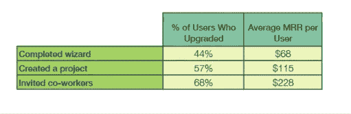

# 增加 SaaS 客户终身价值的综合指南(LTV)

> 原文：<https://medium.com/swlh/the-saas-guide-to-increasing-customer-lifetime-value-ltv-f6c7f1d74ac4>

My Handy Guide for Increasing LTV

客户终身价值是一种很容易计算但很难改变的预测指标。

你把钱投入到你的收购渠道中。你尝试不同的方法进行追加销售、交叉销售，以及最新营销博客上出现的任何其他新策略。

似乎什么都不管用。几个月来，你的平均客户终身价值似乎没有变化。

虽然网上有很多建议可以快速提高你的平均 LTV，但现实是，你往往需要重新考虑你的整个策略。

在本文中，我将详细介绍如何利用数据统一、行为分析和个性化的力量来提高您的平均 LTV，但首先，让我们深入了解如何快速轻松地计算您的 LTV，因为似乎有不同的计算方法。当我有疑问时，我总是会参考一些资源，比如来自 Matrix partners 的大卫·斯科或者来自 Redpoint 的 T2·托马斯·东古兹

**计算你的平均 LTV**

用更专业的术语来说，平均 LTV 等于每个账户的平均收入乘以毛利润，然后除以流失率。

要计算每个账户的平均收入，先计算所有用户的平均订阅成本，然后乘以每个账户的毛利润。

毛利润通常以百分点计算，这意味着利润是你从每个客户身上获得的利润的百分比。

例如，如果您客户的订阅费用是 30 美元，但您运行产品的服务器每月每个客户的费用是 15 美元，那么毛利润是 15 美元或 50%。

最后，你的平均流失率是在一个月内没有续订服务的客户数量。虽然这个公式假设流失率遵循线性趋势，但事实几乎从来不是这样。由于流失率可能相当不可预测，所以密切关注这一指标是确保您的支出不会超过利润的可靠方法。

Chartmogul [展示了真实世界中客户流失的情况。](https://blog.chartmogul.com/calculate-ltv-negative-churn/)

保持你的 SaaS 安全盈利意味着不断比较你的 LTV 和你的客户获取成本(CAC)。让你的客户订阅的成本不应该超过该客户的终身价值。

前面提到的大卫·斯科克的博客:关于[forentrepreuners.com](http://www.forentrepreneurs.com/saas-metrics-2/)的比率指南

如果你的 LTV 与 CAC 的比率保持在 3:1 或更高，你就是黄金；你应该可以自由地尝试更高风险的方式来增加收入。

计算平均 LTV 是确保你的 SaaS 业务稳定盈利的第一步。然而，优化是另一回事。为了获得有价值的见解，帮助你提高你的平均 LTV，你需要关注四个关键领域，这四个领域对你的平均 LTV 有细微的理解。

**优化客户 LTV 需要关注的 4 个关键领域**

虽然有多种方法来建立一个 LTV 优化策略，我们发现这四个领域是最重要的基石，当你开始从零开始建立你的战略。

通过统一您的数据和集中您的所有分析流，您将能够细分您的用户，个性化您的服务，并有效地货币化您的战略。

好吧，首先，让我们谈谈如何统一您的所有数据流，以便从您的信息中获得可操作的见解。

# 1.统一您的数据

如果您成功地将所有数据合并到一个存储解决方案中，比如数据仓库，您将能够找到 LTV 优化策略中的弱点。

我们所说的**数据统一**是什么意思？好吧，让我们说你的服务目前有几个营销获取渠道，如脸书广告，AdWords，甚至用户推荐。

虽然您可以通过内置于这些服务中的每个仪表板来获取所有的采购指标，但利用这些指标的力量意味着将它们放在一起并相互比较。

为此，您需要构建一个[数据仓库](https://www.cooladata.com/cost-of-building-a-data-warehouse/)或者购买一个预构建的选项。如果你有兴趣听到更多关于数据仓库和这些服务可以提供的见解，请查看我的公司 CoolaData 的[数据统一服务](https://www.cooladata.com/product-managers/)。

无论您使用何种解决方案，通过统一您的数据，您的见解将变得更有价值。

让所有数据唾手可得意味着能够快速轻松地进行复杂的 LTV 计算。例如，你可以立即看到通过脸书获得的用户是否比通过 AdWords 获得的用户更有价值(拥有更高的 LTV)。

分析和划分你的平均 LTV 也变得容易多了。只需点击几下鼠标，您就可以发现 LTV 优化策略中以前看不到的痛点。在一个全面的数据仓库中，LTV 可以通过许多不同的获取渠道或行为指标来衡量。

如果你想要**有效的分析洞察力**，没有比让每一点用户数据都在你的支配之下更好的方法来优化你的 LTV。

因此，将所有数据统一起来会使人口细分变得更加容易。

# 2.使用行为细分

如果你把你的人口分成有意义的几类，你就能对如何提高你的平均 LTV 产生强有力的见解。

根据我们的经验，**行为细分**是划分用户的最佳方式之一，主要是因为行为方法对你的客户实际使用你的应用的方式有反应。

根据用户的行为对他们进行细分意味着了解他们如何使用你的应用程序的功能。这可能意味着了解他们是否完成了介绍向导，是否创建了项目，或者是否建立了个人资料。

沿着这些思路计算价值可以让你找到最有价值和最有吸引力的客户群。反过来，这可以让你降低最佳客户的流失率，并为他们提供特定的津贴、福利或其他品牌忠诚度奖励。

以下是根据用户行为对其进行分类的一些有用的初步步骤。

# 总体使用情况

对你的客户进行细分的第一个也是最简单的方法是看他们使用你的服务的程度。您可以通过定义**重度、**中度和**低度使用段**来划分您的客户群，然后分别计算这些组的 LTV。

确定哪个群体包含最长期的客户可以帮助您锁定这些客户，并通过各种不同的策略降低流失率，这些策略包括但不限于促销、激励、折扣和各种其他类型的津贴和福利。

虽然策略本身将取决于你所在的行业，但通常你希望降低低使用率细分市场的参与门槛，并让高使用率细分市场参与某种忠诚度计划。

# 参与度得分

另一个很好的行为细分指标是用户参与各种服务的数量。

虽然这个指标看起来与我们刚刚讨论的使用指标相同，但参与度分数是不同的，因为它们跟踪用户如何参与您的产品。

例如，如果您的服务有一个介绍性教程，您可以发现完成它的用户是否更有可能在更长的时间内使用您的应用程序。然后，你可以看到这些用户是否更有可能流失，提供有价值的反馈，说明你的教程在留住客户方面有多有效。

通过这种方式，我们发现参与度分数可以区分快乐和参与的用户与准备流失的用户。

# 消费习惯

您的客户何时、何地以及为何购买您的 SaaS 产品是一个很好的衡量标准，可以帮助您提高平均 LTV，而不必承诺对您的服务本身做出改变。

通过在用户最有可能花钱的时候(例如月初或月末)发出行动号召(CTA)通知，可能意味着客户是购买下一个定价层，还是彻底转向。

如果你知道你的客户每天、每周和每年的消费习惯，那么你可以通过适当地发布 CTA 通知和在适当的时间追加销售更多的溢价计划来提高 LTV。

# 断代分析

虽然**群组分析**是用户细分的一个不同分支，但将它与您的行为指标结合使用可以为您的优化策略提供一些有价值的见解。

群组分析与行为细分有何不同？嗯，群组分析侧重于用户的外部特征，而不是他们的内在行为。例如，群组分析可以让你看到你的用户在哪个地理区域，或者你的用户是通过哪个获取渠道获得的。

通过将群组分析与行为细分结合使用，您可以真正看到每项措施如何相互作用，从而真正提高 LTV 优化策略的效率。

归根结底，每个 SaaS 公司都是不同的。上面提出的指标和问题是构建全面的 LTV 优化策略的良好开端，但是这些指标本身并不是目的。

这里的关键要点是确定你最有价值的客户以及他们的特别之处，然后优化你的获取策略以获得更多的这些用户。

最后，通过个性化用户体验来让你最有价值的用户开心。

# 3.个性化您的服务

所以你已经确定了你的完美用户:他们创造了最大的价值，你知道他们来自哪里，是什么让他们产生兴趣。现在，你如何使你的产品成为市场上对他们来说最好的产品*？*

*假设你是一家手机游戏公司。你的高价值用户群通过脸书发现了你的游戏，并喜欢每天挖掘硬币。*

**

*现在，您需要以一种促进参与和互动的方式来定制这种用户体验。*

*这可能意味着向这些用户提供额外的奖励，如前述的硬币，或者可能意味着提供一个月的免费高级订阅作为对他们忠诚度的奖励。*

*这也可能意味着为这些用户生成额外的内容，以确保他们在你的虚构幻想世界中永远不会没有事情可做。*

*在现实世界的例子中，苹果慷慨的维修和更换计划保持了用户的忠诚度，因为他们对自己的投资感到安全。*

*个性化服务意味着**传达价值**。例如，通过了解你的用户群中哪些部分对哪一个行动号召通知的反应最好，你可以用尊重和体贴的方式与你的客户联系。*

*在最近由 [Harris Interactive](http://www.1to1media.com/customer-loyalty/customer-loyalty-wanes-experience-gains-momentum) 进行的一项研究中，研究人员发现，如果另一家公司提供更多与他们联系的方式，56%的受访者可能会转投该公司。*

*以下是一些个性化服务的好方法，以确保您的高价值客户保持满意和盈利。*

# *测试不同类型的行动号召通知*

*ClickFox 的[研究](http://www.1to1media.com/customer-loyalty/understanding-building-blocks-brand-loyalty)在 2013 年显示，75%的受访者更喜欢通过电子邮件或短信而不是电话联系。*

**

*测试更改您为特定群体使用的行动号召通知的类型，以提高参与度。*

*例如，如果你的某一群用户对电子邮件的反应比他们对应用内通知的反应更强烈，尝试完全摆脱对该群体的电子邮件宣传，看看他们的参与度得分会发生什么变化。*

# *调查用户最喜欢参与的时间*

*使用**行为分析**，我们可以找出您的用户在一天、一月或一年中的什么时间最活跃，并获得有针对性的 CTA 警报的好处。这种个性化策略可以让你的用户更有可能使用你的应用，如果他们已经休眠了一段时间的话。*

*然而，让通知在正确的时间弹出可能会更棘手一些。知道你的客户在哪个时区真的很有帮助，因为这样你就可以在午餐时间或其他他们可能在打电话的时间给他们发通知。*

# *通过 CTA 提供特殊津贴*

*为你最有价值的客户提供额外的津贴和福利可以帮助建立**品牌忠诚度**并增加这些客户的 LTV。品牌忠诚度，或者说你的客户愿意坚持使用你的服务而不是转向竞争对手的可能性有多大，能够真正增加你收入战略的稳定性。*

*提供免费的月度促销，或者给你的忠实客户大幅折扣，可以帮助确保这些客户长期留在你身边。*

# *重新吸引你的客户*

*最后，为那些被遗漏的客户制定一个策略是很好的。已经翻盘的客户并不总是注定失败。*

*使用行为细分，您可以尝试并找到重新吸引这些客户的方法。你可以给他们一个促销或者打折。你可以给他们发一个博客帖子或者其他能让他们充满激情和参与的东西。*

*不过要小心这种方法——在让之前的客户离开之前，要确保对你联系他们的次数保持理智。*

*通过使用行为细分吸引用户，并改变您的方法，您可以锁定特定的细分市场，从而提高您的整体 LTV。*

# *4.改善你的盈利策略*

*提高你的平均 LTV 的最后也是最重要的关注点是你的货币化策略。*

*然而，在所有客户的平均 LTV 范围内创造价值可能会很困难。
因此，行为细分是带来微观层面变化的另一种方式，这种变化会产生宏观层面的结果。*

*以下是一些方法，你可以针对特定群体，提高你的平均 LTV。*

# *随着时间的推移跟踪 CTA 转换*

*绘制几个月内不同形式的 **CTA** (如电子邮件、应用内通知、短信)可以描绘出你与客户沟通货币化程度的“全貌”。*

**

*如果您通过电子邮件转换的用户取消了他们的订阅，您应该知道并尽快解决这些问题。另一方面，如果对应用内通知反应最快的用户更有可能购买你的产品，你可以在下一次营销活动中尝试获得更多这样的客户。*

# *调整您的定价模式*

*也许您最便宜的订阅费用仍然太贵，或者您可以为您的群体中的某个部分创建一个单独的企业解决方案。*

*无论哪种方式，了解您的 LTV 在多层定价模式中的差异可以帮助您为这些客户最大化您的 LTV。*

# *超额促销*

*追加销售通常意味着让您的客户购买更贵的订阅版本。*

*了解你的**目标市场**和你的客户/用户群的不同部分可以帮助你决定哪些用户更有可能转换到你的服务的更昂贵版本，以及哪些特定服务会使更高价格的订阅对特定群体更有吸引力。*

*尝试使用付费计划中的功能，看看哪类用户更有可能购买下一级服务。这样，你就可以找到将低价值客户转化为高价值客户的最佳时间、价格和方法。*

# *交叉销售*

*交叉销售意味着向现有客户销售不同的产品或服务。*

*你的一些客户是博客的狂热读者吗？如果是这样的话，这是一个很好的机会向你的用户群中的一部分交叉销售另一种服务——比如一本**电子书**或另一段内容。*

*如果你非常了解你的客户和他们的需求，交叉销售和追加销售都可以大大提高你的平均 LTV。*

*这些只是利用你从客户那里获得的洞察力来改进你的盈利策略的一些想法。归根结底，所有这些调整都是一个持续过程的一部分；你尝试一种方法，然后看看你的平均 LTV 是否改变，然后再尝试其他方法。*

*随着时间的推移，我们发现花时间个性化您的客户体验从长远来看会带来巨大的回报。*

# *结论*

*因为每个企业都是不同的，优化你的 LTV 有时意味着尝试新的和非常规的策略。*

*通过统一您的数据和简化您的行为分析，您可以通过各种新的措施来优化 LTV，例如成功的不同营销获取渠道和最适合您客户的不同类型的 CTA。*

*从用户行为中获得洞见是非常有益的——看到用户如何交互会让你对用户实际参与应用程序的方式有所了解。*

*最后，跨用户行为群体测试不同的货币化策略，让我们对谁对转化或搅动更敏感有了深入的了解。将这些测试作为品牌忠诚度的试金石，通过促销、折扣和激励来锁定最有价值的客户，从而帮助留住他们。*

*我真诚地希望你发现这篇文章是全面的，信息丰富的。你有哪些提高客户 LTV 的方法？行为细分或群组分析在你的方法中发挥了重要作用吗？*

*给我写信——我很乐意听到你的反馈和任何问题。*

*谢谢你的阅读，丹*

**

## *这个故事发表在 [The Startup](https://medium.com/swlh) 上，这是 Medium 最大的创业刊物，有 295，232+人关注。*

## *订阅接收[我们的头条新闻](http://growthsupply.com/the-startup-newsletter/)。*

**