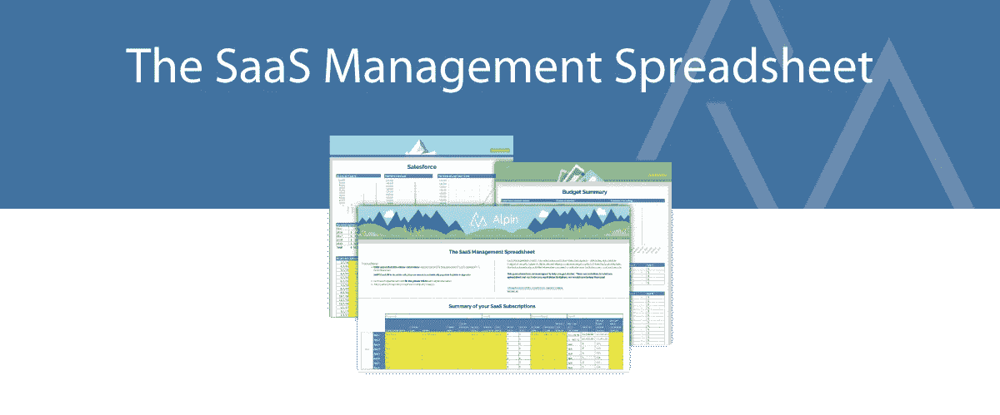

# SaaS 管理电子表格

> 原文：<https://medium.com/swlh/the-saas-management-spreadsheet-d5197de2ba59>

这个免费的 SaaS 管理电子表格旨在帮助您开始跟踪整个组织使用的 SaaS /云应用程序。记录许可证详细信息、用户、付款、即将到来的续订和安全风险。查看未使用和未充分使用的许可证造成的浪费。管理您的 SaaS！

在 Alpin，我们帮助您获得 SaaS 订阅的可见性和控制权。Alpin 是一个自动化的工具，它可以作为一个单一的仪表盘来管理所有的云应用程序。它不仅跟踪已存在的和正在发生的情况，还允许您采取措施降低成本，避免意外，协商更好的交易，并保护您的数据。

这个 SaaS 管理电子表格应该是有帮助的，但是任何电子表格能做的事情都是有限制的。*一旦你达到那些限制，我们希望你将* [*给 Alpin 一个尝试*](https://alpin.io/) *！*

## 这篇文章发表在 [The Startup](https://medium.com/swlh) 上，这是 Medium 最大的创业刊物，有 317，629+人关注。

## 在此订阅接收[我们的头条新闻](http://growthsupply.com/the-startup-newsletter/)。

