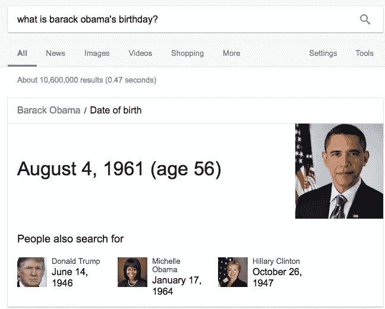

# 萨曼莎效应:近距离观察机器人的未来

> 原文：<https://medium.com/swlh/the-samantha-effect-a-closer-look-into-the-future-of-bots-97fba11e852d>

2013 年，斯派克·琼斯发布了独立科幻剧《她》。

这部电影讲述了世界上第一个人工智能操作系统“萨曼莎”的进化轨迹。

抛开斯嘉丽·约翰逊的参考资料不谈，萨曼莎是每个开发人员的白日梦:完美的' ***'真实'*** 人工智能(AI)的例子。一个令人印象深刻的健谈者，她掌握上下文、自然语言、情感和常识。

很明显，现代机器人还没有达到萨曼莎的水平。[充其量](/swlh/why-chatbots-will-change-marketing-as-we-know-it-7fa140aa2e58)，他们能够通过对话界面提供特定的结果。在最坏的情况下，他们会把你的手机扔向墙壁，令人沮丧。

随着技术以闪电般的速度发展，我们会走向一个像萨曼莎一样的机器人存在的时代吗？

# 情感智能数据

今天的人工智能将符号处理(使用显式规则和逻辑的人工智能)与机器学习结合起来，利用它们各自的优势，减少它们的弱点。

例如，符号处理让我们能够明确知识和行为，而仅仅从数据中学习这些知识和行为可能很困难。机器学习通过帮助系统适应意外情况和新概念来补充这一点。

这种组合除了加速学习过程之外，还有其他有用的特性。在未来，它可以让我们以更像人类的方式与机器人互动。

因为，尽管有其诱人的品质，机器学习基本上仍然是一个统计过程。这意味着它反映了它所依赖的数据的质量。

这是福也是祸。机器学习对其输入数据特征的敏感性意味着它很容易学习错误的东西，正如微软自己的种族主义机器人 [Tay](https://en.wikipedia.org/wiki/Tay_(bot)) 的案例所示。

[还有人认为](https://www.google.com/url?q=https://psmag.com/news/are-robots-susceptible-to-racial-bias&sa=D&ust=1519470478294000&usg=AFQjCNFb4UpIOfrdew8qr7I1jI6YQZuHDw)为机器学习选择的数据往往反映了研究人员/开发人员(通常是年轻的白人男性)的无意识偏见。

为了接近萨曼莎的自省和推理能力，我们需要给我们的机器人设计某种人工情感智能:让它们能够回答问题

> “你为什么选择这样做？”

甚至今天相对简单的系统也在朝着综合个人主义问题答案的方向前进[步](https://www.chatbots.org/features/speech_synthesis/)。

但与此同时，确保我们在密切监控的环境中，将我们的机器学习算法应用于高质量的数据，是我们最接近情感智能机器的方式。

# 语义网

万维网创始人蒂姆·伯纳斯·李早在 2001 年就提出了[语义网](https://www.w3.org/standards/semanticweb/)，他走在了时代的前列:

> 允许计算机从网络资源之间的关系中推断出意义的系统。

从本质上讲，机器将能够把想法、概念和事实联系在一起，而不是文件和页面。

这将允许像萨曼莎一样的“计算机助理”来“读取”我们的信息，并代表我们进行操作:自主安排我们的约会，组织我们的旅行，预订晚餐。你好，我们的梦中情人。

伯纳斯-李的愿景已经通过谷歌的[知识图](https://en.wikipedia.org/wiki/Knowledge_Graph)在一定程度上实现了，这需要谷歌雇佣数千人将明确的规则输入到常识知识的符号表示中。

这使得谷歌可以用一个小盒子的结构化数据(如下)来回答问题，而不仅仅是网页列表。

图像识别技术也可能是语义网的先驱；这个人工智能已经可以识别图像中的关键词、人口统计数据、颜色和人脸。

# 自然语音识别

理解自然语言的能力是一个成功机器人的核心；有文字，也有语音识别。

理想情况下，机器人应该能够通过自动填充对话空白来达到其目标。

Siri、Cortana 和 Alexa 还没有完全达到萨曼莎的标准。但她在这方面的表现似乎也不是遥不可及。

语音识别错误率每年大约下降 20%，谷歌的[最近](https://venturebeat.com/2017/05/17/googles-speech-recognition-technology-now-has-a-4-9-word-error-rate/)仅达到 4.1%——几乎和人类的准确率一样。

这些改进可以归功于一系列创新:多麦克风阵列、定向波束、复杂的噪声处理和语音生物识别技术的应用。

[听觉场景分析](http://www.phon.ucl.ac.uk/courses/spsci/AUDL4007/Scene_analysis.pdf)是另一种尝试分离不同声源的有前途的技术。

语音识别也受益于日益庞大的数据池，这些数据池用于使用机器学习技术训练统计模型:其中一种被称为[深度神经网络](https://www.google.co.id/search?q=Deep+Neural+Networks&oq=Deep+Neural+Networks&aqs=chrome..69i57.461j0j4&sourceid=chrome&ie=UTF-8) (DNNs)。

DNNs 由多层连接的处理单元组成，灵感来自人脑的神经网络。

他们可以将各种输入——图像、单词序列、位置和语音话语——分类成所需的类别，如单词、物体和意义表示。

# 语境和抽象

我们人类的推理类型依赖于对上下文的理解和推理。有时这些是合乎逻辑的，但更多的时候，它们是基于我们对世界的常识:认识到 X 可能会导致 y。

当应用于人工智能时，理想的虚拟助理应该能够在面临约束时提出替代方案，考虑不同的可能性并了解它们的优点:

> 我:“今天我想在梅丽莎买双鞋”
> 
> 机器人:“对不起，梅丽莎关门了。要不你试试 Office，差不多，也近。”

原则上，机器人可以通过试错来学习这些关联，但这需要很长时间:每一次交互都有一百万种不同的变化。

一些人工智能研究者[认为](https://www.google.com/url?q=http://www.mccormick.northwestern.edu/news/articles/2016/06/making-computers-reason-and-learn-by-analogy.html&sa=D&ust=1519469889801000&usg=AFQjCNFAZK09jd4KLko50e7v_n2ER5g6mw)计算机通过类比学习的关键。正是这种能力允许人类从一种情况归纳到另一种情况，从上下文中抽象出更高层次的理解

# 听起来像人的机器人

萨曼莎声音的情感范围和音调变化仍然超出了我们的能力范围，但新的语音生成模型，如[谷歌 WaveNet](https://techcrunch.com/2016/09/09/googles-wavenet-uses-neural-nets-to-generate-eerily-convincing-speech-and-music/) 能够产生“令人难以置信”的人工声音。

不再有机器人 Siri。

听起来自然的声音大大增加了我们对机器智能的印象。这样做的缺点是，它提高了用户的期望值，可能会导致对话失败和沮丧。

*我们都知道***与人类相比，我们对机器的耐心要少得多……**

*无论机器人是否能达到我们的期望，我们都倾向于相信那些表现出类似人类行为(文字游戏、双关语、笑话、引用和情感推理)的机器。*

*这让人想起了图灵测试，其中一名人类法官与另一名人类和一台机器进行对话。如果法官不能区分机器和人，机器就通过了测试。*

# *洞察力*

*AI 能帮助我们发展‘洞察力’吗？*

*洞察力的核心是给你新的有价值的东西。然而，最重要的是，它有助于指导未来的决策和行动——这对于软件来说很难理解。*

*当我们看到一个洞察力时，我们知道它，但很难定义它或在它周围画出清晰的界限。发展洞察力包括识别模式、关系和相关性。*

*一些机器学习项目已经深入研究了这一领域。*

*比如谷歌的 [Deep Mind](https://en.wikipedia.org/wiki/DeepMind) (也使用 DNNs)擅长识别新模式，复杂程度在一种情况下(游戏***Go****)*超过人类。但是像这样的技术只有在我们告诉机器目标是什么(在这种情况下:赢得比赛)时才有效。*

**

*只有人类能够在没有预设目标的情况下识别出有趣的新模式。如果机器理解了目标，它就能识别模式；只有人类才能创造性地识别模式。*

*另一方面，人类面临的一个问题是，当我们专注于一项特定的任务时，我们依赖于大量的信息。有些信息是通过经验无意识获得的；有些是通过刻意的学习。*

*但是随着信息量的增加，我们能够筛选的信息量也相应地变得越来越少。*

*所以，这就是机器有优势的地方。他们更擅长处理海量数据。*

*当我们收集和整合这些数据时，机器可以在我们努力的领域与我们合作。*

*目前，大多数数字信息是以文本的形式存在的——也就是说，数据是非结构化的，而不是传统数据库中的结构化数据。*

# *文本数据*

*这就把我们带到了[机器阅读](https://news.microsoft.com/stories/explanimators/machine-reading/)的领域，在过去的 20 多年里，这一领域已经走出了研究实验室，进入了商业应用。*

*[尽管还远非完美](https://www.theverge.com/2018/1/17/16900292/ai-reading-comprehension-machines-humans)，但在人工智能新发展的推动下，理解书面文本的自动化技术最近已经迅速成熟。*

**这里有一个例子。**

*一个病人带着一种医生不熟悉的罕见疾病走进医生的办公室。医生咨询他的数字助理，他的数字助理在几秒钟内扫描了所有关于这种疾病的医学期刊、事实和信息。*

*然后，它总结这些信息，并以小块的形式呈现给医生。*

*[最近被微软收购的深度学习初创公司 Maluuba](https://www.microsoft.com/en-us/research/lab/microsoft-research-montreal/) ，正在尝试开发一种能够阅读文本并在此基础上学习交流的‘识字机器’。*

*从本质上讲，计算机可以用我们做梦也想不到的方式调查、管理和总结大量的文本。*

*我们不必使用高度技术化的计算机编程语言或数据库查询来说出我们在寻找什么:[最近开发的系统](https://www.google.co.id/search?q=recently+developed+systems+can+also+use+natural+language+to+ask+questions+about+a+text&oq=recently+developed+systems+can+also+use+natural+language+to+ask+questions+about+a+text&aqs=chrome..69i57.300j0j7&sourceid=chrome&ie=UTF-8)也可以使用自然语言来询问关于文本的问题。*

*这在某种程度上我们已经很熟悉了，这要归功于在 Google 之类的网站上输入查询(自动完成功能让这变得更加容易)。*

*所有这些使得机器人成为这一传统的天然继承者。*

*最后一招是，我们现在有了通过[交互学习的个性化应用。](https://www.sciencedirect.com/science/article/pii/S1319157813000372)*

**

*例如， [Replika](https://replika.ai) 基于对过去聊天会话的扫描，开发了特殊的语言模式，创建了用户偏好和优先事项的知识。*

*这让我们非常接近萨曼莎的领地。*

# *人工智能驱动的人类智能*

*在第一次工业革命期间，机器开始取代体力劳动。*

*今天，随着工业 4.0 的出现，他们也开始接管体力劳动和脑力劳动。*

*几乎任何基于常规的任务都可以自动化。*

*而且，作为销售人员和营销人员，有很多日常任务我们不介意摆脱，比如:*

**……手动输入数据条目、搜索主题和创意文章、涉水查看没完没了的电子邮件……**

*通过将这些传递给人工智能“头脑”，我们能够将我们的努力集中在我们(作为人类)擅长的领域，并将我们(作为人类)与机器区分开来。*

*这是我们开发 [GrowthBot](https://growthbot.org/) 的起点，我们的销售和营销机器人旨在帮助您发展业务。*

*AI 无法产生新的见解；但是它可以帮助我们更有效地发挥我们的创造力。*

*我们可能会看一堆数据、关系和相关性，并认为我们看到了一些新的东西，一些有助于我们更好地理解世界的东西。*

*毕竟这是人类擅长的。*

*但是，这种洞察力仅仅是一种直觉，还是不止于此？这就是我们可以指导自动化介入的地方，以消除假设并创造透明度。*

*在我们看来，人工智能最有前途的方面不是复制像萨曼莎这样栩栩如生的伴侣的能力，而是放大我们作为人类的智慧。*

*感谢阅读。*

> *如果你喜欢这篇文章，请随意点击那个按钮👏帮助其他人找到它。*

*.*

**最初发表于*[*blog.growthbot.org*](https://blog.growthbot.org/the-samantha-effect-a-closer-look-into-the-future-of-bots)*。**