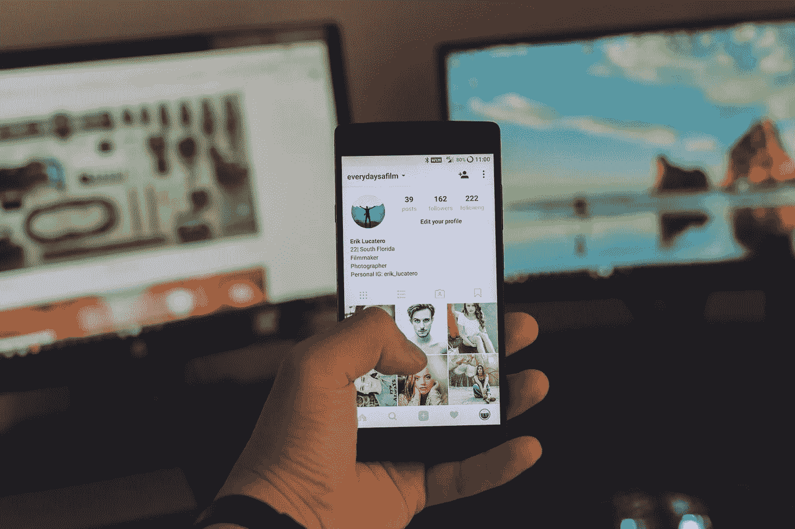
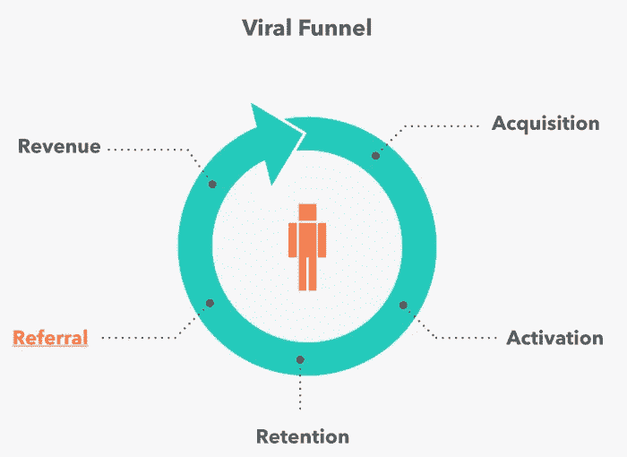
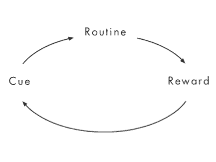
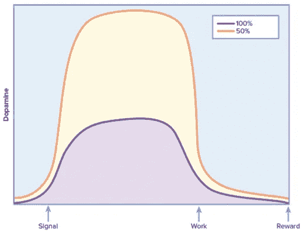
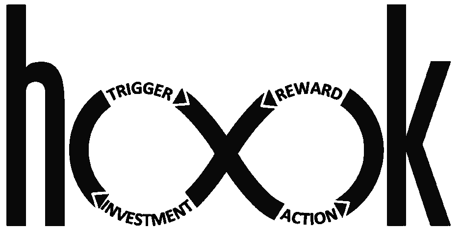
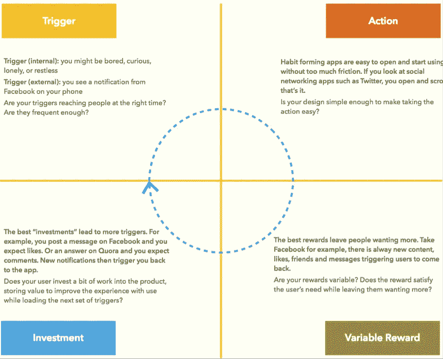
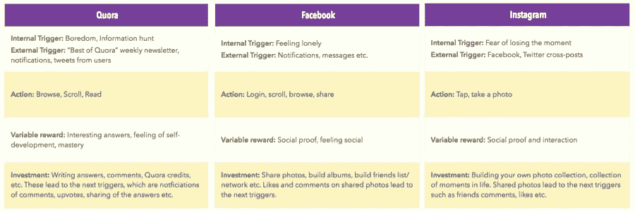
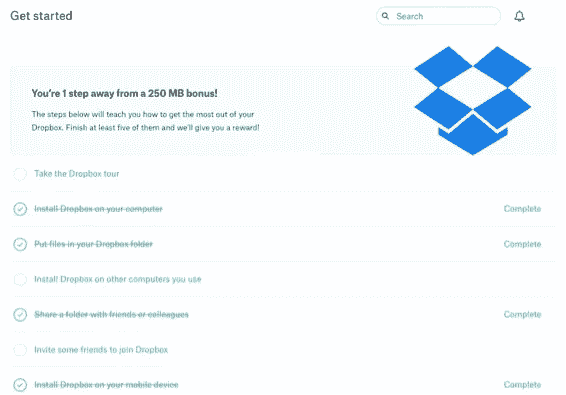
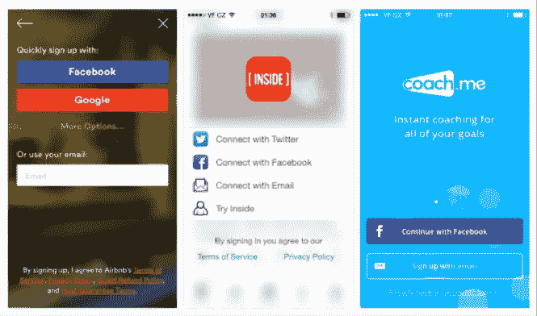

# 病毒应用背后的科学(以及如何构建)

> 原文：<https://medium.com/swlh/the-science-behind-viral-apps-and-how-to-build-one-6a0a7d0591ab>

Originally published on [http://www.appsterhq.com](http://www.appsterhq.com/?utm_source=CP&utm_medium=Medium)/

尽管目前在谷歌的 Play Store 和苹果的 App Store 上总共有[500 万个可供下载的应用程序](https://www.statista.com/statistics/276623/number-of-apps-available-in-leading-app-stores/)，智能手机用户将大约 [85%的总使用时间](https://techcrunch.com/2015/06/22/consumers-spend-85-of-time-on-smartphones-in-apps-but-only-5-apps-see-heavy-use/)分配给了 5 个或更少的应用程序。

此外，近五分之四的用户[在首次安装应用程序 72 小时后再也不会使用它](http://www.androidauthority.com/77-percent-users-dont-use-an-app-after-three-days-678107/)。显然，绝大多数移动应用公司都没能留住他们的用户。

相比之下，成功的移动应用公司创造出引人入胜、形成习惯的应用程序，这些应用程序可以病毒式传播，并帮助创建大规模的新用户社区。

但是，你究竟如何才能创建一个令人上瘾的病毒式应用程序呢？在这篇文章中，我将讨论构建真正令人上瘾的移动应用背后的心理科学。

# 绘制地形图

我最近强调了采用整体策略来创建移动应用的重要性:

> *“打造一款高质量、强大且能引起最终用户共鸣的令人上瘾的应用的关键在于，明确地处理应用的开发、测试、发布、营销和销售，目的是在一个**饥渴的市场**中创造一款* **受欢迎的产品**，解决一个**紧迫的客户痛点**，并有机地鼓励**病毒式**和**习惯性参与**。

简而言之，这些核心动力代表了当代科技初创公司如果希望建立和维持高增长业务必须关注的主要因素。

在过去的 4 到 5 个月里，我们在 Appster 已经发表了许多非常详细的文章，从各种商业和开发角度探索移动应用程序的创建。

今天的文章将主要关注初创公司如何利用习惯形成背后的心理科学来开发用户既喜欢又愿意与他人分享的上瘾应用。

在讨论这些不同的想法和策略时，我想当然地认为您已经熟悉了以下核心原则——如果您还不熟悉这些关键想法，请务必点击下面的链接并通读相应的 Appster 文章:

1.  令人上瘾的移动应用有效地解决了**紧迫的用户问题**(例如，人际关系的需求)，并响应了**重大的市场需求**(例如，对易于使用的、基于位置的移动约会服务的需求)( [1](http://www.appsterhq.com/blog/early-stage-entrepreneurs-launch-profitable-startup) 、 [2](http://www.appsterhq.com/blog/markets-fancy-ideas-create-successful-start-ups) 、[3](http://www.appsterhq.com/blog/costly-mistakes-avoid-first-time-entrepreneur))；
2.  病毒式应用从根本上植根于在现实世界中经过“压力测试”的**最小可行产品**([1](http://www.appsterhq.com/blog/mvp-app)， [2](http://www.appsterhq.com/blog/test-product-idea-real-world-feedback) ，3)；
3.  成功的应用在正确的时间向正确的人群发布和营销**，也就是说，这些应用背后的公司起初有意瞄准特定的用户(早期采用者)，只有在适当的时候才“跨越鸿沟”(进入主流)( [1](http://www.appsterhq.com/blog/build-successful-mobile-app-startup) 、 [2](http://www.appsterhq.com/blog/3-crucial-features-high-growth-startups) 、[3](http://www.appsterhq.com/blog/realities-21st-century-start-ups))；**
4.  **病毒性应用通常基于一个或多个有效的 [**盈利策略**](http://www.appsterhq.com/blog/app-monetization-models)；和**
5.  **上瘾 app 背后的创业公司定期分析(并响应)各种关键的 [**财务**](http://www.appsterhq.com/blog/4-financial-metrics-startups-measure) 和 [**移动专用**](http://www.appsterhq.com/blog/track-5-mobile-app-marketing-metrics) **指标**。**

**有了这些初步的梳理，让我们从应用程序流行的角度来探讨“病毒式传播”的含义。**

**然后，我们将深入研究习惯形成的心理学(和神经生物学)的细节，利用这种理解来指导关于构建和营销成瘾应用的讨论。**

# **什么是「病毒式」？**

****

**当我们谈论某个东西“病毒式传播”或实现“病毒式增长”，或者某个应用成为“病毒式应用”时，我们指的是什么？**

**“病毒式传播”是公司扩大运营规模的关键驱动力，可以从两个方面来理解:**

1.  **作为应用于互联网的一般术语:*“图像、视频或信息片段从一个互联网用户向另一个互联网用户快速广泛传播的趋势；被病毒感染的性质或事实"* ( [来源](https://en.oxforddictionaries.com/definition/virality))；和**
2.  **作为一个应用于客户获取的特定术语:*“一种用户获取其他用户的现象，通常是通过一些内置于所提供产品中的推荐机制”* ( [来源](https://s3.amazonaws.com/startupcompass-public/StartupGenomeReport1_Why_Startups_Succeed_v2.pdf))。**

**通过对比传统和非传统营销渠道，我们可以理解病毒式营销的本质，因为它适用于客户获取。**

**传统的营销漏斗:企业支付大量资金(例如，通过广告)来推动其产品(网站、应用程序等)的流量。)努力将一小部分流量转化为活跃的付费客户。**

**病毒式营销漏斗:不是大量潜在客户转化为少量实际客户，而是少量实际客户通过产品或服务(如 app)的有机使用和共享，帮助带来指数级更多的客户。**

**病毒式营销的运作方式是，每个新用户带来一个或多个新用户，然后新用户自己带来一个或多个新用户，以此类推:**

****

**通常，病毒式增长要么来自产品的有机使用——例如，一名新的脸书用户自然会建议他的朋友尝试一下社交媒体网站——要么来自推荐系统的运营——例如，一名 [Lyft 用户](https://help.lyft.com/hc/en-us/articles/214216977-Refer-New-Passengers-and-Get-Rewarded)传播一个推荐代码，允许她和将她的代码应用于每笔现金的人免费搭车。**

**更专业地说，病毒增长通常用大于 1.0 的“[病毒系数](https://www.geckoboard.com/learn/kpi-examples/marketing-kpis/viral-coefficient/#.WWVjJHfMyRs)来标识。**

**你的病毒系数代表了每个现有用户为你的公司带来的新用户的数量。**

**例如，病毒系数 3.0(顺便说一下，这相当于高)意味着平均而言:**

*   **100 个用户指额外的 300 个用户；**
*   **这 300 个用户又带来了 900 多个用户，以此类推。**

**为什么 1.0 以上的病毒系数如此重要？**

**因为，正如[我在过去](http://www.appsterhq.com/blog/3-crucial-features-high-growth-startups)提到的，“如果你的初创公司能够保持 1.0 以上的病毒系数，那么你就不需要任何种类的大量营销预算来保持增长”。**

**我们在这里讨论的这种病毒式增长，即“口口相传”将越来越多的用户指数级地带入不断增长的用户群的情况，被“病毒循环”的概念所捕捉。**

**这个术语描述了一个用户从第一次接触到你的产品，然后被鼓励向其他人推荐它的过程(来源: [1](http://andrewchen.co/whats-your-viral-loop-understanding-the-engine-of-adoption/) 、 [2](https://www.apptamin.com/blog/app-viral-loop/) 、 [3](https://www.inc.com/sujan-patel/creating-viral-loops-to-drive-your-2017-business-growth.html) )。**

**下面是 Tapdaq 的萨姆·休金斯对病毒循环过程的简单说明:**

****

**如下图所示，病毒增长需要:**

*   **购买一些初始流量，让你的应用吸引眼球，从而获得一些初始用户；**
*   **构建一个养成习惯的应用程序(稍后会有更多相关内容！)即说服你的初始用户开始使用你的 app(即“激活”)；**
*   **激励你的初始用户免费向你的公司推荐额外的流量；和**
*   **再次重复这个过程。**

****

**建立有效病毒循环的关键是提供一个或多个功能或奖励，激励你的用户与他人分享你的应用。**

**你应该为你的用户提供一些有价值的东西，而不是依赖烦人的广告和其他形式的垃圾邮件。**

**有价值的激励是有形的和直接的；他们让你的用户愿意带他们的朋友、家人和/或同事来你的应用。**

**让奖励发放过程尽可能地简单易懂、易于完成，这一点至关重要。**

**如果你把奖励激活弄得太混乱而无法执行，你将会失去扩大用户群的机会。**

**Dropbox 和优步是两个成功利用病毒营销来显著增加用户群规模和产品/服务受欢迎程度的创业公司。**

**当 Dropbox 首次推出时，这个文件共享网站向所有将他人推荐到该平台的用户提供免费的额外存储空间，帮助该公司在运营的前 7 个月获得了 100 万用户。**

**优步的双向推荐代码系统——当同样获得 10 美元骑行积分的人 B 使用个人 A 的唯一推荐代码注册优步时，个人 A 获得免费的 10 美元骑行积分——在[非常成功](https://www.referralsaasquatch.com/how-uber-taught-me-everything-about-referrals/),大约 50%的新优步客户是通过推荐到达的。**

**优步的双向转诊制度:**

****

**到目前为止，我所讨论的一切都是基于这样一个假设，即你实际上已经开发了一个人们真正想要使用的应用程序。**

**如果你的用户不想使用你的应用程序，更不用说在他们的朋友中传播了，那么你提供的奖励再诱人也没用，因为没人会在意，你的应用程序也会失败。**

**例如，如果你手机上的优步应用程序经常崩溃，10 美元的免费优步乘车券还有什么用？显然一点用都没有。**

**我们可以把激励用户与他人分享你的应用程序的努力想象成甜点的最终装饰:再多的糖霜，无论多么漂亮或诱人，也不会让某人心甘情愿地咬一口难吃的蛋糕。**

**同样，在你试图鼓励你的用户招募其他人加入你的应用之前，你需要建立一个完全“美味”的应用，也就是说，一个你的用户不能没有的应用。**

**只有这样，你才应该专注于实施营销努力，帮助你实现病毒循环。**

**因此，我们必须探索上瘾的心理，以便了解如何创建用户真正喜欢的养成习惯的应用程序。**

# **习惯形成的心理学**

****

**设计和开发你的应用程序时，你的首要目标应该是创建一个你的用户会习惯使用*的应用程序*。**

**这听起来可能很明显，但值得一提的是:你必须开发一个你的用户会一次又一次回来的应用程序。**

**想想脸书、Instagram 和 Spotify:这些是单一用途的应用吗？还是人们每天都花几个小时在上面？**

**当你在脸书上发布状态更新，在 Instagram 上分享一张新照片，或者在 Spotify 上听一首歌时，你会永远关闭这个应用程序，并且一次拒绝返回几个月吗？**

**你不太可能知道。**

**相反，你浏览你朋友的状态更新，评论和/或喜欢其他人的图片，听与当前曲目相似的歌曲或专辑，等等。**

**你知道人们早上一醒来就抓起手机，立即打开他们喜欢的新闻、社交、财经等。应用程序？**

**这正是你应该瞄准的习惯性使用——一种“上瘾”。**

**这不是试图欺骗或操纵人们违背他们的意愿或他们的最大利益。**

**相反，它是关于理解人类心理学(和神经生物学)，以便创造一种产品，同时为你的用户提供真正的价值*和*使你的创业公司作为一个企业运营和发展成为可能。**

**[英语牛津生活词典](https://en.oxforddictionaries.com/definition/habit)将“习惯”定义为“一种固定的或常规的倾向或习惯，尤其是难以放弃的”。**

**《T4:习惯的力量》一书的作者查尔斯·杜希格认为“一个简单的神经回路存在于每个习惯的核心，这个回路由三部分组成:提示、常规和奖励”。**

****

**暗示，即触发，提示或刺激正在讨论的行为；套路代表习惯动作本身；回报是“我们的神经学如何学会为未来编码这种模式”([来源](http://charlesduhigg.com/how-habits-work/))。**

**为了养成习惯，这三个要素都必须具备。**

**[Hazel Gale](https://thecoffeelicious.com/habit-loops-the-mechanics-of-behaviour-programming-d3c9ba657bba) 对 Duhigg 的模型提供了更详细的解释，指出:**

> **线索是引发习惯行为的东西。它可能是一种负面情绪，如孤独、无聊或压力。或者，可能是某个特定的情况，一群朋友，一天中的某个时间，等等。**
> 
> **例行公事就是习惯本身:咬指甲，抽烟，或者走到冰箱前吃一大块奶酪。**
> 
> **奖励可以是任何令人愉快的事情。它可能像尼古丁或糖的物理刺激一样明显。它可能与接受感、归属感或成就感有关；或者这只是一个离开办公桌的借口。”**

**这是习惯形成的一个非常基本的概述；让我们更专业一点。**

**几千年来，人类在大脑中发展了各种系统，这些系统的功能是激励我们做某些事情，包括吃饭、睡觉和生育。**

**具体来说，我们的猿类大脑设置为鼓励我们寻找(假设)有助于我们生存和繁荣的活动，当我们做这些事情时，各种神经系统(即化学)奖励会补偿我们。**

**简而言之，这就是为什么像性和吃饭这样的活动是令人愉快的经历(也就是说，这是大自然奖励我们生存和传递基因的方式)。**

**现在，为了真正理解习惯形成和成瘾的动力学，我们必须讨论两种关键神经递质的基础。**

**(“T2”神经递质是一种大脑化学物质，在神经元突触之间传递信息——本质上，它帮助大脑的不同部分相互交流)。**

**第一个值得注意的神经递质是“[多巴胺](https://www.psychologytoday.com/basics/dopamine)”，它:**

> **“…有助于控制大脑的奖赏和愉悦中枢。多巴胺还有助于调节运动和情绪反应，它不仅能让我们看到回报，还能让我们采取行动实现回报。”**

**多巴胺能系统经常被随意地称为大脑的“快乐传感器”，但这并不是一个完全准确的描述。**

**多巴胺主要在*起作用，导致*愉悦的体验:**

> ***“多巴胺导致寻求行为。多巴胺让你想要、渴望、寻找和搜寻。它提高了你的总体觉醒水平和你的目标导向行为。多巴胺搜寻系统让你有动力在你的世界中穿梭，学习和生存。不仅仅是食物或性等生理需求，还有抽象的概念。多巴胺让你对想法充满好奇，为你搜索信息提供燃料”(* [*来源*](https://www.psychologytoday.com/blog/brain-wise/201209/why-were-all-addicted-texts-twitter-and-google) *)。***

**多巴胺与渴望有关:它驱使你采取行动，追求目标，在对预期回报的预期中“追求某物”。**

**第二类重要的神经递质是“[阿片类物质](https://www.psychologytoday.com/blog/neuroscience-in-everyday-life/201702/the-neuroscience-wanting-and-pleasure)”，这是当你积极体验愉快的事情(比如吃一碗美味的冰淇淋)时，你的大脑产生的“感觉良好”的化学物质。**

**鸦片制剂与喜欢和成就有关:它们是实际体验快乐的产物，即当你完成某件事时产生的欣快状态(来源: [1](https://www.psychologytoday.com/blog/brain-wise/201209/why-were-all-addicted-texts-twitter-and-google) ， [2](https://www.psychologytoday.com/blog/neuroscience-in-everyday-life/201702/the-neuroscience-wanting-and-pleasure) )。**

**多巴胺和鸦片制剂都与习惯形成行为有关:**

*   **第一个是“想要”系统，表示寻找某物的驱动力(例如，开车去银行，取钱，然后去便利店买包香烟或加载网络浏览器，在搜索引擎中键入短语或问题，并试图定位特定的信息)；和**
*   **第二个是“喜欢”系统，代表渴望的满足感(例如，在吸入香烟烟雾或找到你需要的信息后体验到的愉悦感觉)。**

**当谈到创建令人上瘾的应用程序时，重要的是要认识到多巴胺能系统比阿片系统 [*更强*](https://www.psychologytoday.com/blog/brain-wise/201209/why-were-all-addicted-texts-twitter-and-google) ，也就是说，它对我们的行为产生更大的影响。**

**换句话说，**人们更多的是被*寻求快乐*所驱使，而不是被快乐本身的实际体验所驱使**。**

**进化使得我们人类有一种更强烈的寻找事物的冲动——解决难题，发现新信息，计划行动路线，编辑模式等等。—而不是实现目标([来源](https://www.psychologytoday.com/blog/brain-wise/201209/why-were-all-addicted-texts-twitter-and-google))。**

**在我们继续探索所有这些科学对构建病毒式传播的上瘾应用程序的影响之前，我们需要解决心理学/神经生物学的最后一个问题。**

**当我们从事充满*不可预测性*和*预期性*的活动时，多巴胺对我们的行为产生了最大的影响。**

**简而言之，当我们试图实现成功机会不明确的目标时，我们的大脑会释放更多的多巴胺，也就是说，当我们对结果的可能性有着坚实的理解时，我们会更加兴奋:**

> ***“因为兴奋随着频繁和可预测的暴露而减少，科学家现在明白，奖励预期是比刺激本身的结果评估更强大的强烈成瘾的中介”(* [*来源*](https://www.psychologytoday.com/blog/culture-mind-and-brain/201610/addicted-your-phone-science-has-good-news) *)。***

**换句话说，你做某事的次数越多，过程就变得越不令人兴奋，因为你可以准确地预测结果。**

**神经科学家罗伯特·萨波尔斯基在猴子身上进行的实验证实了这一点。**

**Sapolsky 训练他的猴子认识到，如果他们在附近的灯亮了(即“信号”)之后按下杠杆(即“工作”)十次(即“T12”)，那么在第十次按下杠杆之后，就会分发食物奖励(即“奖励”)。**

**即:*见光* → *按压杠杆十次* → *治疗被分配*。**

**萨波斯基随后测量了猴子的多巴胺水平，发现了以下模式:**

****

**这个图表显示，猴子在信号(即光线)出现后立即开始释放多巴胺，然后在他们开始按下水平(即工作)后急剧停止释放多巴胺。**

**这表明多巴胺主要关心寻求，而不是赚钱或成就。**

**然而，更有趣的是，当萨波尔斯基修改实验，使猴子在按下控制杆后只有 50%的时间得到食物时发生了什么:**

****

**令人惊讶的是，这表明当猴子们不确定完成工作后是否会得到奖励时，它们的多巴胺水平急剧上升(T21)。**

**这些结果表明，类人猿(包括我们人类！)而类猿生物对新奇刺激和不可预测刺激的反应远比熟悉和可预期的事件强烈。**

**你只需要考虑你第一次和一个新的浪漫伙伴约会时的兴奋和紧张，并将这些感觉与在一段长达数年的关系中的感觉进行比较，就可以认识到这种见解的有效性。**

**为了理解这一重要科学发现的意义——即人类似乎更倾向于寻找、搜索和计划活动，体验新奇和不可预测性，而不是完成活动和遇到可预测性和熟悉性——现在让我们看看心理学家和企业家 [Nir Eyal 的](https://www.nirandfar.com/)关于形成习惯的产品的有影响力的想法。**

# **习惯形成产品的“钩子模型”**

****

**将我们迄今为止讨论的科学原理和发现应用到商业领域，Nir Eyal 概述了一个“通过引导用户通过一系列旨在创造习惯的体验来制造欲望”的[模型](https://www.nirandfar.com/2012/03/how-to-manufacture-desire.html)。**

**Eyal 将这些习惯称为“钩子”，它们旨在产生自我生成的反馈循环，用户越来越有可能“自动”使用产品或服务(即，以类似反射的方式)。**

**挂钩模型包含四个关键要素，每个要素都有助于用户对产品或服务“上瘾”:**

1.  ****触发器:刺激行动的东西。**触发器有两种形式。*外部*触发器，产生于一个人所处的环境。例如:广告、电子邮件和互联网链接。*内在*触发器，从一个人的内部产生。例子:饥饿、无聊和好奇的感觉。Eyal 认为，从商业角度来看，目标是利用外部触发因素(如广告)在用户中自然地逐步形成内部触发因素(如每当饥饿时就想吃某种食物的“即时”愿望)。**
2.  ****动作:期望的行为**。例如:点击在线广告或打开刚收到的电子邮件。用户必须既有*动机*又有*能力*采取预期的行动。动机是由一个或多个激励因素驱动的，例如，解决问题、满足好奇心或获得奖励的愿望。能力取决于完成给定操作的难易程度，例如，在能够使用下载的应用程序之前完成三个步骤与十二个步骤。**
3.  ****可变报酬:采取行动的不可预测/随机报酬**。研究表明，当新奇和意想不到的环境出现时，多巴胺会急剧增加(见上文)，Eyal 明确指出，“可变的奖励计划是公司用来吸引用户的最有力工具之一”。例如:提供各种歌曲、艺术家和专辑的音乐流媒体应用程序，Twitter 自动生成的建议关注者链接，或者 Pinterest 不断变化的“大头针”显示。**
4.  ****投资:鼓励更深入、更持久地参与产品或服务的进一步行为**。这一切都是为了说服用户做一些事情，增加他们继续使用你的产品的可能性，与他人分享，并一次又一次地通过整个钩子过程。目标是尽可能消除摩擦，以激励用户“坚持”你的公司。Eyal:“邀请朋友、陈述偏好、建立虚拟资产和学习使用新功能都是改善用户服务的承诺”。例子:在 Instagram 上收集照片、评论和喜欢的东西，或者加入脸书小组，参与讨论([来源](https://www.nirandfar.com/2012/03/how-to-manufacture-desire.html))。**

**以下是 Eyal 的 hook 模型的总结:**

****

**如下图所示，当今最流行的应用程序都利用 hook 方法来创建养成习惯的应用程序:**

****

**(**注**:以上两张图片来自我们 20 多页的非常详细的关于创建令人上瘾的应用程序的专家白皮书[！)](http://lp.appsterhq.com/how-to-make-an-addictive-app-new)**

# **将所有这些放在一起:实用指南**

****

**既然我们已经追溯了成瘾背后的理论原则和创建习惯形成应用背后的关键商业模式，那么让我们通过讨论一些你可以用来开发下一个真正“成瘾”应用的实用策略来结束这篇文章。**

**首先，**在你的应用程序中包含尽可能多的新奇、不可预测和解谜元素**。**

**正如我们已经讨论过的，人类特别被寻求、研究和计划活动所激励，被想出一些东西的愿望所激励，特别是当一个意想不到的挑战或困惑出现的时候。**

**因此，你的应用应该利用“我们是这个星球上最好奇的物种”这一事实。**

**如果你正在开发一款手机游戏，那么有很多不同的方法可以在体验中引入新的、令人惊讶的元素，包括让用户发现特殊物品，遇到意想不到的老板，以及因完成任务而获得意想不到的奖励。**

**非游戏应用也可以利用新奇和解决问题。**

**的确，“在你的收件箱中删除新消息会刺激神经元，类似于玩星际争霸所刺激的神经元”([来源](https://www.nirandfar.com/2012/03/want-to-hook-your-users-drive-them-crazy.html))。**

**例如，优步为其司机提供实时 GPS 跟踪，这一功能激发了乘客的好奇心，并在他们等待汽车到来时激发了他们的规划能力:**

*   **"她打算走这条路还是那条路？"**
*   **"如果他在那条街上转弯，会不会更快到达？"**
*   **“为什么她的车不动了？那个十字路口是不是发生了什么事故？”等等。**

**最后，你应该在你的应用中绝对(小心地)使用触发器，例如推送通知。**

**[推送通知](https://www.lifewire.com/what-is-push-notification-1994351)允许应用程序向用户的智能手机发送通知，而不需要用户采取任何措施来发送消息。**

**我[最近指出](http://www.appsterhq.com/blog/how-to-boost-app-user-retention-rates)在移动应用中设计这样的触发器的重要性:**

> ***“这类触发因素令人难以置信地上瘾，不仅因为它们让一个人无论何时出现都会体验到短暂的快感，还因为它们让那个人“准备好”去期待更多的通知，以便体验类似的快感。你需要不断让用户回到你的应用，而推送通知是一种非常有效的方式。”***

**同样，当我们参与搜索和预测活动时，多巴胺的主导地位和它发挥的强大作用使推送通知如此诱人和分散注意力。**

**每当用户收到一个意想不到的通知，大脑中产生欲望的化学物质就会变得疯狂，因为用户会采取行动来找出等待着的特殊信息。**

**请务必将此类触发器整合到您的移动应用程序中。**

**然而，与此同时，最重要的是你不能因为“做得过分”而吓跑你的用户。**

**在这种情况下，遵循这些[指南](http://www.appsterhq.com/blog/how-to-boost-app-user-retention-rates)取得成功:**

1.  **使用选择加入/选择退出系统，而不是任意强制通知用户的手机；**
2.  **围绕最常见和最有价值的数字事件设计你的触发器，而不是把它们用于发生的每一个单独的行为；**
3.  **不要在推送通知中添加振动——这既烦人又没用；和**
4.  **个性化你的通知，使它们不那么烦人(例如，“凯文只是喜欢你的照片，马克！”)**

**第二个关键策略是利用游戏化的力量。**

**“[游戏化](https://www.researchgate.net/profile/Juho_Hamari/publication/259841647_Defining_Gamification_-_A_Service_Marketing_Perspective/links/0c96052e13e865be00000000/Defining-Gamification-A-Service-Marketing-Perspective.pdf)”，一种越来越受移动应用开发者欢迎的策略，涉及将类似游戏的元素融入到一系列任务的完成中，旨在利用人类的驱动力来克服障碍，积累成就，并获得对我们成功的认可。**

**我们是一个解谜和征服的物种，这意味着如果任务要求我们通过不同的阶段来实现提供潜在回报的目标，人们会自然而然地被任务吸引。**

**Dropbox 的 250mb 免费服务是游戏化的一个很好的例子。**

**它为用户提供了要求额外免费存储的能力，如果他们“征服”了各种任务，事实上，这鼓励了用户对 Dropbox 服务的更多投资(因此对双方来说是“双赢”的):**

****

**four square/Swarm 根据用户签到的数量和类型授予不同的“[徽章](http://mashable.com/2015/05/04/foursquare-brings-back-game/#3hYRVERrkPqD)，这代表了移动应用对游戏化的又一次流行和成功的运用。**

**第三，**让你的应用入职体验尽可能地精简、吸引人、无摩擦**。**

**App onboarding 指的是向用户介绍你的 App，让他们熟悉它的工作方式，并说服他们成为长期用户(或者更好的是，主动向他人推广你的 app 的“app 大使”)的过程(来源: [1](http://info.localytics.com/blog/app-onboarding-101) 、 [2](https://www.shopify.com/partners/blog/mobile-app-onboarding) 、 [3](http://www.elasticode.com/what-is-onboarding.php) )。**

**app onboarding 的主要目标是引导用户使用你的应用，直到他们达到“啊哈！“时刻”，即他们开始相信你的应用为他们的生活提供的价值，然后成为忠实用户的时刻。**

**在[之前的一篇文章](http://www.appsterhq.com/blog/app-user-onboarding)中，我描述了初创公司可以用来最大化用户的应用入职体验的六个具体策略:**

1.  ****通过消除注册过程中不必要的障碍来减少摩擦**；**
2.  ****通过向用户展示在应用程序可以自由使用之前必须完成多少步骤来提供进度的清晰指示**；**
3.  ****通过推特、脸书等使用社交注册**。为了让注册登录过程尽可能的无痛；**
4.  ****通过赠送赠品提供激励**(例如，免费存储空间或折扣代码)；**
5.  ****提供用例**，清楚地说明他人成功且轻松地使用该应用程序；和**
6.  ****使用简短而有用的教程**，快速解决常见问题或澄清困惑。**

**为用户提供社交注册的移动应用示例:**

****

**最后，**一定要鼓励用户投资你的应用**。**

**正如 [Nir Eyal](https://www.nirandfar.com/2012/03/how-to-manufacture-desire.html) 所强调的，说服用户采取具体行动，与你的应用程序建立更深层次的联系，有助于“让触发更吸引人，行动更容易，每次经历的回报更令人兴奋”。**

**如何让你的用户投资你的应用？**

**这里你需要利用沉没成本陷阱的概念。**

**“沉没成本陷阱”指的是这样一种现象，我们投入的资源越多，就越容易坚持(或完成)某个系统、任务或行为。**

**实际上，我们都很熟悉这是如何工作的:**

*   **如果你在过去两年里一直在建立自己的 Instagram 个人资料，使用特定的标签，关注朋友等，你就不太可能放弃 Instagram 而加入竞争对手的手机摄影应用。比你 36 个小时前才加入要好得多。**
*   **如果你只使用了 Dropbox 几天，而不是过去的 10 个月，你更有可能放弃 Dropbox，去加入一个与之竞争的在线文件存储服务。为了实现这一转变，在你的所有设备上移动、重新组织和重新共享你在 Dropbox 上存储了近一年的所有文件太麻烦了。**

**例子不胜枚举。**

**那么，关键是你必须代表你的用户鼓励投资，这样才能增加用户留存率，从而提升你的应用的病毒式传播。**

**你可以通过奖励用户更多地使用和分享你的应用来做到这一点，例如，通过推荐系统，奖励完成特定步骤的数字产品(例如，在设定的时间内分享 10 张新照片)，明确的进度指示(例如，在教育应用中进展到新的学习水平)等。**

**一旦你在你的应用程序中设计和开发了令人上瘾的特性，并向公众发布，接下来就是启动公关和营销活动的时候了。**

****//****

****如果你喜欢阅读这篇文章，并且你正在寻找一个更全面的关于构建习惯养成应用的概述，那么我强烈建议看看我们 20 多页的关于创建上瘾应用的专家白皮书******！******

*****原载于*[*www.appsterhq.com*](https://www.appsterhq.com/blog/build-viral-apps/)*。*****

****//****

## ****感谢阅读！****

# ****如果你喜欢这篇文章，请随意点击下面的按钮👏去帮助别人找到它！****

****************

# ****对应用程序有想法吗？让我们谈谈。****

****在过去的几年里，我们已经帮助建立了超过 12 个数百万美元的创业公司。查看我们如何为您提供帮助。****

********