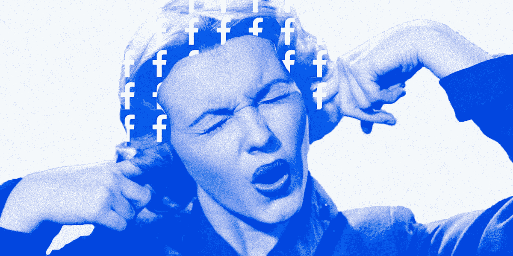
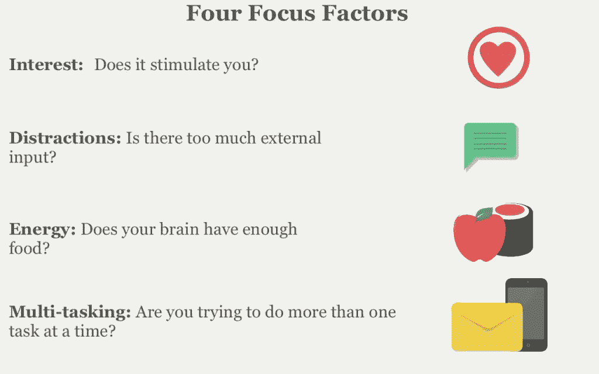

# 保持专注的科学

> 原文：<https://medium.com/swlh/the-science-of-staying-focused-652bbc47df66>

## 这一切都归结于心理、习惯和口香糖的奇怪组合

*Sorry. Doesn’t work like that. But at least you can* [*get more posts like this on the Crew blog*](https://crew.co/blog/)*.*

现代科技给了我们这么多令人惊奇的东西，但其中一个令人尴尬的副作用一直是，不管我们愿不愿意，它都有能力干扰我们。

通知之外的通知不断威胁着把我们从[做重要的事情](https://crew.co/blog/how-to-do-your-best-work/)中拉出来，让我们陷入繁忙的工作中。

普通上班族每隔 3 分钟就会分心[。根据卡耐基梅隆大学人机交互研究所的研究，分心后需要 25 分钟才能重新集中注意力。](http://online.wsj.com/news/articles/SB10001424127887324339204578173252223022388?mg=reno64-wsj&url=http%3A%2F%2Fonline.wsj.com%2Farticle%2FSB10001424127887324339204578173252223022388.html)

失去注意力很容易，真的很容易，把它找回来才是难的部分。

然而，尽管知道分心的危险，我们却很少采取措施来保护自己免受其害。让我们改变这一点。

你的大脑总是在接收信息，这意味着它必须不断地选择关注什么和过滤掉什么。神经科学家称之为[‘选择性注意’](http://science.sciencemag.org/content/315/5820/1860)，它有两种不同的形式:

# 1.自上而下(或“自愿聚焦”)

这是焦点的圣杯。自上而下的关注是面向目标的。它负责看到更大的画面，并利用你过去的经验来解决问题。

**发生在:**你正在为考试而学习或者试图解决一个难题。

# 2.自下而上(或“刺激驱动的焦点”)

当一个想法悄悄出现在你身上，或者你周围的某个东西吸引了你的注意力(比如 ping、bing 或通知),你就患上了自下而上的专注。你会不由自主地关注正在发生的事情。

**发生在:**你听到一声巨响，有人从灌木丛中冒出来，或者你的手机嗡嗡作响。

# 那么问题出在哪里？

我们无法控制大脑使用哪种焦点。尽管我们想保持自上而下的模式，但自下而上的关注能够超越我们大脑的过滤器。

归咎于我们的[战斗或逃跑反应](https://en.wikipedia.org/wiki/Fight-or-flight_response):巨大的噪音和突然的移动与危险有关。在你最初的想法中，危险比你正在读的书或正在写的重要邮件更重要。

研究表明，意志力和注意力是有限的资源——这意味着你越是分心，就越难回到正轨。

但是科学也告诉我们，有一些方法可以尽可能快速有效地让我们重新集中注意力。

让我们来看几个:

# 帮助你找回注意力的 7 种方法

如果你曾经被困在一个没有焦点的无限循环中，你就会知道要出去有多难。

以下是一些有用的建议，下次你在整理思路时要记住:

# 1.在你大脑的自然时间表内工作

你可能已经注意到，在一天的不同时间，你能够更加集中注意力。

对大多数人来说，我们分心的高峰时间[发生在下午 12-4 点之间](http://online.wsj.com/news/articles/SB10000872396390444180004578018294057070544)，我们在下午 2 点左右感觉到特别强烈的“崩溃”

你的大脑在上午晚些时候(10 点以后)处理棘手的认知负荷[最佳](http://online.wsj.com/news/articles/SB10000872396390444180004578018294057070544)。在一天中的这个时候，你的大脑是完全清醒的，它(希望)被喂饱了，并且嗡嗡作响。

**在上午晚些时候专注于密集的任务，下午休息一下或者去散步。**

# 2.奖励你保持专注的头脑

你的大脑通过实践来学习。这意味着你参与[破坏性](http://www.psychologytoday.com/blog/your-brain-work/200910/easily-distracted-why-its-hard-focus-and-what-do-about-it)行为越多(比如一天查看你的电子邮件或推特 20，000 次)，继续参与就越容易。你已经训练你的思维去感受分心的某种回报，这需要停止。

相反，在你陷入坏习惯之前，通过抓住自己来训练你的大脑保持专注。每当你感到自己被分散注意力时，尽快停下来。

你越难分心，你的思维就越能保持专注。

# 3.休息(真正的休息)

虽然我们的大部分生活都围绕着接收尽可能多的输入——一次打开 15 个标签，不停的电子邮件、电话和同事的消息——尽可能快地工作并不能让我们工作得更好。事实上，[它做的和](http://psychminds.com/is-the-internet-destroying-our-attentions-span/)完全相反。

为了加强你的注意力，找一个不受干扰的地方。无论是在房子的另一个地方还是没有 wifi 的咖啡馆，这里的重点是给你的注意力一个充电的机会。

**如果你没有经常去的地方，** [**你甚至可以下载应用程序来帮助你从互联网上转移注意力**](http://99u.com/articles/6969/10-online-tools-for-better-attention-focus) **。**

# 4.忘记多重任务

多任务实际上是一个误称——它并不意味着我们所认为的那样。

我们的大脑无法同时专注于一件以上的事情，事实上，“多任务”只是意味着非常非常快速地从一件事情切换到另一件事情。我们转换得越多，消耗的能量就越多(消耗的能量越多，我们就越不能专注于重要的事情)。

按照重要程度列出需要完成的任务，并尽可能坚持下去。你尝试一次做的越少，你整体工作得就越好。

# 5.找到让你真正投入的工作

你有没有过这样的经历:刚要开始另一项任务，10 分钟后却发现自己在做白日梦？

当你不相信手头的任务重要到足以保证你全神贯注时，你的大脑开始处理其他刺激。这是你的大脑激活了它的[默认网络](http://www.psychologytoday.com/blog/fulfillment-any-age/201301/why-and-how-you-daydream)，当你的大脑不再专注于外部世界时，你就使用它。

当你失去注意力时，问问是你还是手头的任务。如果它不那么吸引人，它可能更适合你有更多自然能量的时候(比如傍晚！)

# 6.练习正念

压力是空前绝后的注意力杀手。考虑到我们在最需要集中注意力的时候最有可能感到压力，这真的很糟糕。

相反，正念训练，像冥想一样，教导我们不要被压力或强烈的情绪冲昏头脑，要更加意识到我们在做什么和在想什么。

试着给自己五分钟时间，选择你的一种感觉，只专注于这种感觉。识别你的身体和思想在感受什么，你在触摸什么，闻什么，看什么，听什么，尝什么？

**如果你想更进一步，试试这个** [**练习**](http://www.forbes.com/sites/drewhansen/2012/10/31/a-guide-to-mindfulness-at-work/) **来帮助提高工作中的正念。**

# 7.口香糖

是的，这听起来很奇怪，但是[研究](http://www.scientificamerican.com/podcast/episode/gum-chewing-may-improve-concentrati-13-03-26/)显示，嚼口香糖增加了大脑中负责注意力的部分的氧气流量。它还[改善你的长期记忆，并向你的血液中注入一点胰岛素，这可能有助于给你的大脑增加能量。](http://www.telegraph.co.uk/news/uknews/1387660/Chewing-gum-boosts-brains-performance.html)

如果你不喜欢口香糖，那就吃点零食吧。你的大脑从葡萄糖中获取能量，你需要大约 420 千卡来维持正常功能。大约有 100 个开心果或 4 根香蕉。

**如果你觉得自己的注意力在减弱，吃点零食，给自己的大脑补充能量。我要 19 包三叉戟…**

当你读完这篇文章的时候，你至少已经分心两次了。

找到你的焦点真的很简单，只是让你的大脑变得简单一点。减少大脑必须忍受的刺激量，按照大脑的时间表工作，并保持警惕。

对于所有的建议和技巧，我真正想说的是:创造一个能让你集中注意力的环境，而不是一个把注意力带走的环境。

*原载于 2017 年 2 月 13 日*[*crew.co*](https://crew.co/blog/science-of-how-to-stay-focused/)*。*

# 现在我们已经引起了你的注意，我们能帮你什么忙吗？

## 查看 Crew，在这里您可以与最好的设计师和开发人员一起工作。超过 1000 万人使用了剧组生产的[产品。超过 300 万人阅读了我们的博客。在这里](http://crew.co/?utm_source=Medium&utm_medium=CTA&utm_campaign=MediumCTAs)加入他们。