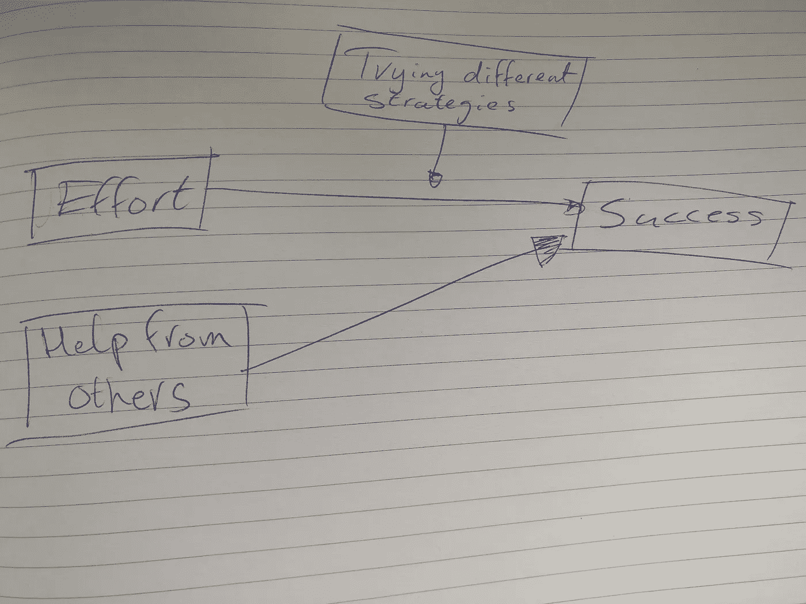

# 非凡企业家的秘密

> 原文：<https://medium.com/swlh/the-secret-of-extraordinary-entrepreneurs-800afe7fb066>

Photo by [Hello I’m Nik](https://unsplash.com/photos/MAgPyHRO0AA?utm_source=unsplash&utm_medium=referral&utm_content=creditCopyText) on [Unsplash](https://unsplash.com/@helloimnik?utm_source=unsplash&utm_medium=referral&utm_content=creditCopyText)

## 采取这种态度会为你创造 10 倍的成果。

想象一下典型的企业家。

一些英雄人物，打破所有规则，逆风而行，顶着岩石的表面。

我们获得了伟大的感觉，超越这个世界的成就，对巨大的价值观和目标的誓言。

尽管可能有这样的人，但我几乎从未见过他们。

在我有幸遇到的数百名企业家中，“真正的”企业家很少。

对我见过的大多数企业家来说，这更准确:

*   他们的热情已经变成了冷漠。
*   他们曾经为之奋斗和起床的愿景几乎完全消失了。
*   他们对进步的热情变成了对未来的焦虑。

怎么会这样

# 问题是

这些创始人经常问我的问题是:

> “有什么是非凡的企业家知道而我不知道的？”

有趣的是:成功企业家和普通企业家的主要区别不在于他们知道什么。

**是关于他们对自己不了解的事物的态度。**

他们贪得无厌地想知道更多。他们拥抱并探索未知。他们寻求与他们的世界观不一致的反馈。

具体地说，这会导致以下行为差异。

普通企业家:

*   回避挑战
*   遇到障碍时，变得保守或放弃
*   认为付出很多努力是他们缺乏潜力的表现
*   忽略有用的负面反馈
*   感觉受到他人成功的威胁

成功的企业家:

*   拥抱挑战
*   面对挫折坚持不懈
*   我认为投入大量的努力对于达到精通是至关重要的
*   从负面反馈中学习
*   感受到他人成功的鼓舞，并从中吸取教训

## 由此产生的结果差异是巨大的

一般的企业家很早就停滞不前，他们的热情变成了冷漠和恐惧，他们曾经追求的愿景蒸发了，他们对进步的热情变成了对未来的焦虑。

成功的企业家达到了更高的成就水平，掌握了控制权，做了异常改变游戏规则的工作，不断受到可能导致他们愿景的新路径的激励，随着他们的愿景变得越来越清晰，他们变得越来越有激情

与大多数等待外部奇迹发生的企业家不同，你也可以掌控局面，做一些改变游戏规则的工作。你可以解决最大的挑战，改善他人的生活！

你能取得什么成就，能走多远，完全在你的掌控之中。然而，**你不能坐等成功降临——你必须成为吸引成功的企业家。**

方法如下:

# 将学习置于成就之上

成功就是你跌到谷底时反弹的高度—乔治·S·巴顿

在一项著名的研究中，德韦克教授发现，以学习为目标的孩子比注重成绩的孩子更有优势。

有学习目标的孩子喜欢失败，因为它代表着成长的机会。有表现驱动目标的孩子害怕它们，因为它们代表了他们的缺点。

从长远来看，这些孩子表现出明显更高水平的努力、进步和最终结果。

当你把成就看得比学习更重要时，你就制造了一种不断证明自己的紧迫感。你不从你内在的**“为什么”开始工作。**

但是当你优先考虑学习的时候，你可以从失败中恢复过来，继续前进。这不是即时的完美。它是关于随着时间的推移学习一些东西:面对挑战和取得进展。

# 将心态转化为行动

有正确的目标只会让你开始。这需要有目的的参与，才能真正付诸实施。

你需要开始确定在哪些方面学习比成长更重要。带着学习的想法处理每个项目。

具体来说，一些提示:

*   在一天开始的时候，为你自己和你周围的人确定学习和成长的机会。就何时、何地以及如何开始你的计划提出具体的步骤。
*   在一天结束时，反思你把成就看得比学习更重要的情况，并思考你如何以一种更能促进成长的方式来处理这种情况。
*   在一天结束的时候，看看下面的草图，问问自己:为了哪些结果我可以付出更多的努力？我可以应用哪些不同的策略？对于哪些挑战，我可以向他人寻求帮助？

# 结论

创业界有一句流行的话，“失败得快，失败得勤。”只有当你的心态正确时，这才有可能。

将学习置于成就之上需要时间。然而，当你开始做正确的事情时，失败就成为可能，如果你想成功，这是必不可少的。正如温斯顿·丘吉尔和汤姆·沃森所说:

> "成功是从一次失败到另一次失败的磕磕绊绊，但热情不减."——温斯顿·丘吉尔
> 
> “你想让我给你一个成功的公式吗？很简单，真的。双倍的失败率。你认为失败是成功的敌人。但根本不是。你可以因失败而气馁，也可以从中吸取教训。所以继续犯错吧。尽你所能。因为，记住那是你会找到成功的地方。”—汤姆·沃森，IBM 的创始人

# 行动呼吁

为了取得成果，你需要不断设定目标——成长和学习的目标。要做到这一点，问问自己:

> 我的学习目标是什么，明天我可以做些什么来实现它？

这些关于何时、何地以及如何做某事的具体计划会带来高水平的跟进。随着时间的推移，这将把你从一个普通人变成一个成功的企业家。

## 最后两件事…

如果你喜欢这篇文章，请👏并分享给你的朋友。记住，你最多可以鼓掌 **50 次**——这对我真的很重要。

## 如果你想读更多我的“哦，狗屎”和“啊哈”，在这里订阅。

## 这篇文章发表在[《创业](https://medium.com/swlh)》上，这是 Medium 最大的创业刊物，有 309392+人关注。

## 在这里订阅接收[我们的头条新闻](http://growthsupply.com/the-startup-newsletter/)。

