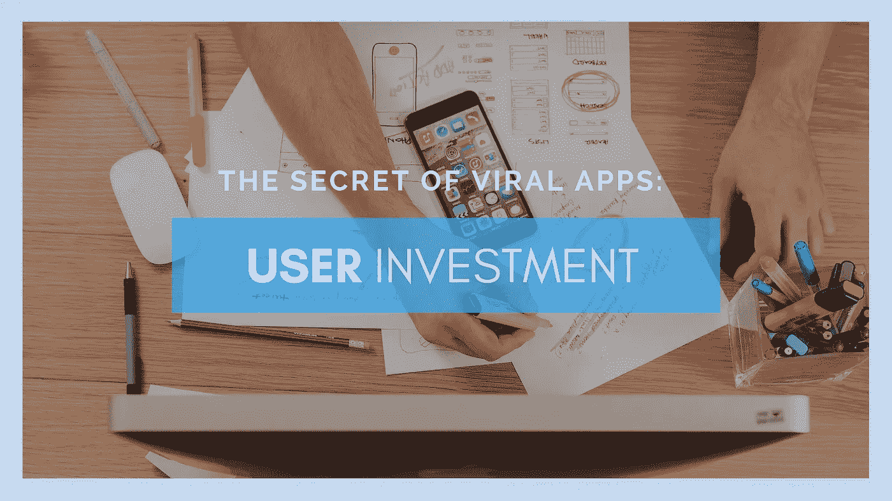

# 病毒式应用的秘密:用户投资

> 原文：<https://medium.com/swlh/the-secret-of-viral-apps-user-investment-10f6a7e0b96f>

让我给你介绍一下这个圈子。它始于内部触发(你无聊时浏览了这个博客)或外部触发(应用程序通知)。接下来是一个响应触发器的动作(你点击链接或应用程序)和一个对你执行的动作的奖励(见消息或带标签的图片)。现在，第四步很关键。这一步有助于我们巩固新习惯。第四步，我们要么选择增加你的奖励，要么让触发器变得更常见。想想今天堵车时你是如何打发时间的。也许你打开了 Twitter 或 LinkedIn，无论哪一个先给了你一个提示。当你打开它时，欢迎你的不仅仅是邮件或标签。有新的更新，有趣的链接和有趣的迷因充斥着你的时间线。这是你选择投资的时候。你通过关注更多的人，增加触发(通知)和奖励(也许是有更多宠物视频的时间线？).我们称之为习惯循环，用户投资的基石。

当我们说 ***用户投资*** 时，它指的是激励你的用户花更多时间和精力与你的产品互动，最终让你的产品对他们更有价值的所有活动。不要把它和用户参与度混淆，尽管用户参与度在你的用户愿意投资多少方面起着不可或缺的作用。在这篇博客中，我们将帮助你了解如何让你的用户投资你的产品。[用户入职](https://www.cognitiveclouds.com/insights/mobile-app-onboarding-best-practices/)是客户旅程中最重要的组成部分之一。[为用户投资设计](https://www.zibtek.com/services/UIUX-design-services) it 是第一步，将对您的用户保留和参与度产生最大影响。

# 用户入职

就拿 Twitter 来说，它不仅要求你在注册时选择一个账号、邮箱和密码，还鼓励你关注平台上的五到十个人。传统智慧已经向我们灌输了简化注册流程的重要性。那么为什么要让新用户马上关注人呢？答案在于对他们用户留存率的分析。新注册用户转变为常规用户的最强指标是，这些用户在加入后立即关注了五个或更多其他推特用户。从一开始就关注其他推特用户意味着他们可以立即看到他们时间线中的内容，随着时间的推移，源源不断的新内容将他们吸引回这项服务。

为了激励能给他们带来长期价值的用户投资，Dropbox 选择提供短期奖励。与他人分享内容的功能是 Dropbox 的主要价值之一，但这一功能的价值取决于可以分享内容的人。因此，通过提供额外存储容量的短期奖励，Dropbox 鼓励用户让他们的朋友和同事注册。LinkedIn 采用了一种略有不同的策略来鼓励用户投资。它显示了“个人资料完整性”分数，该分数延伸到入职流程之外。LinkedIn 不是鼓励你输入更多关于你的职业经历，并通过提供免费赠品让你联系更多的人，而是显示一个关于你如何尚未完成设置个人资料的视觉提醒。通过这样做，他们利用了人性的某一部分，无法抗拒增加我们的“分数”

# 用户投资与用户参与

衡量投资有点棘手。就我个人而言，对我来说，最好的例子是脸书对 Twitter。我投资了推特。我用它来搜索信息。我用它来推广我的博客。我投资 Twitter，期待回报。当退货停止时，我会停止使用它。另一方面，我和脸书订婚了。我大概一天打开一次。如果是下市，我的作息不会受到太大影响。当然，在社交媒体上与朋友保持联系很好，但有更好的方式做到这一点，不知道我的大多数高中朋友在做什么不会杀了我。脸书可能会吸引我，但我投资了 Twitter。因此，对 Twitter 而言，我比脸书更有价值。

这对你来说可能正好相反。你看，人们投资给他们提供最大价值的网络。你的网络的效用或价值越大，你的用户就越会投资它。当你的用户开始投资的时候，你的产品开始嵌入他们的生活，他们开始有机地与他们的圈子分享，宣扬它的价值。参与在这里很重要。可以导致用户投资。然而，你会注意到基于网络的企业不仅仅拥有参与用户，他们还拥有投资用户。

# 这难道不意味着让我的用户工作吗？

在这个世界上，设计思维的兴起和 iPhone 等产品主导的市场让我们相信产品应该尽可能易于使用。但是，你会看到关于我们必须如何与技术互动的绝对规则，就像设计必须总是减少用户必须花费的工作的定律并不总是成立。让你的用户发挥作用对于打造人们有归属感的产品至关重要。这是用户投资的标志。

在一项任务上花费精力使我们致力于它。如果你已经读到这里，你很可能会读得更远一点。这些承诺的升级有时会让我们的大脑做出一些令人不安的事情。回想一下我们十几岁时的视频游戏阶段，我们中的一些人仍然沉迷于游戏，并致力于我们已经达到的水平和我们已经建立的角色。承诺是一种强大的动力，在我们做的事情、购买的产品以及我们对自己的认知中扮演着不可或缺的角色。

# 超越惊喜因素

你还记得上一次一个应用程序让你大吃一惊吗？也许这发生在你第一次预订优步的时候，出租车两分钟内就出现在你家门口？或者当你打开脸书查看儿时好友的好友请求时？您的应用程序可能真的会带来这样的惊喜，并为用户提供价值。然而，真正吸引用户的产品不仅仅是最初的惊喜。作为用户，我们倾向于不断寻找奖励，所以你的应用必须适应。通常，新奇有趣的东西很快就会变得普通而乏味。为了跟上用户摇摆不定的注意力，形成习惯的产品必须通过反复使用来改进。这是投资阶段变得至关重要的时候。

投资不是为了眼前的满足，而是对回报的预期。投资是你让你的用户做的一点工作，让用户更有可能在未来使用产品。如果你让你的用户输入一点点信息，他们更有可能回来。当你在 LinkedIn 注册时输入你现在的头衔和职位，他们可以用这个把你拉回来。与提供工作场所信息相关的工作创建了一个系统可以用来让用户返回的钩子。

# 将“承诺”作为一种策略

形成习惯的技术倾向于创造一个内在的触发器或使用产品的渴望，而没有明确的行动号召。当受到某种情境或情绪的暗示时，用户会参与到服务中。投资是拉用户回来的线。你的目标应该是让用户主动返回。为此，您可以通过两种方式为系统增加价值。

每次你的用户输入数据，他们都在创造存储价值。像视频游戏这样的储值技术，通过让用户每次玩游戏时都进行投资，来创造上瘾的用户。朝着更高的分数努力，提升到下一个级别，或者在虚拟媒介中获得商品，如摩托车或虚拟化身上的衣服，都是承诺力量的例子。最终，人们会将这些储值产品作为日常生活的一部分。用户投资越多，他们就越不需要考虑如何使用它们。另一方面，网络效应是当更多的人开始使用你的产品，从而增加其价值。智能手机、传真机等技术，以及 Instagram、Airbnb、Skype、Pinterest 等公司。加入网络的用户越多越好。

当储值满足网络效应时，用户投资开始变得真正有价值。例如，脸书作为一种储值产品，当网络效应的力量站稳脚跟时，它就像病毒一样传播开来。储值和网络效应的结合，伴随着定期添加内容的用户的持续投资，为你的大部分用户创造了强大的吸引力。形成习惯的技术在循环中工作，从触发、行动、奖励和投资开始，在给用户创造需求的同时增加价值。你的用户在通过小工作做事情的方式上投入得越多，你的服务对他们就越有价值，他们就越少质疑他们必须投入的工作。

# 鼓励用户投资你的产品

为了在你自己的产品中成功运用这个概念，你需要从分析是什么让你最频繁和最赚钱的用户不同于那些注册后就再也不出现的人开始。他们是否更频繁地使用某项功能？他们是否在花时间定制他们的警报首选项？他们是否与大量其他用户建立了联系？一旦你理解了他们的动机，想出鼓励所有用户采取这些步骤的方法，无论是通过适时的建议，像“我们 85%的客户使用这个功能”这样的社交证明，免费赠品还是其他什么。

但是要确保你不会让这些投资步骤变得太麻烦，或者是强制性的。这更有可能适得其反，降低用户留存率。没有人喜欢被告知该做什么。找到平衡，你就能破解用户投资。另一方面，病毒式传播是你必须从一开始就设计好的。病毒式传播比制造一个伟大的产品更难实现。

*原载于* [***CognitiveClouds 产品见解博客***](https://www.cognitiveclouds.com/insights/the-secret-of-viral-apps-user-investment/)

## 这个故事发表在 [The Startup](https://medium.com/swlh) 上，这是 Medium 最大的企业家出版物，拥有 291，182+人。

## 在这里订阅接收[我们的头条新闻](http://growthsupply.com/the-startup-newsletter/)。

