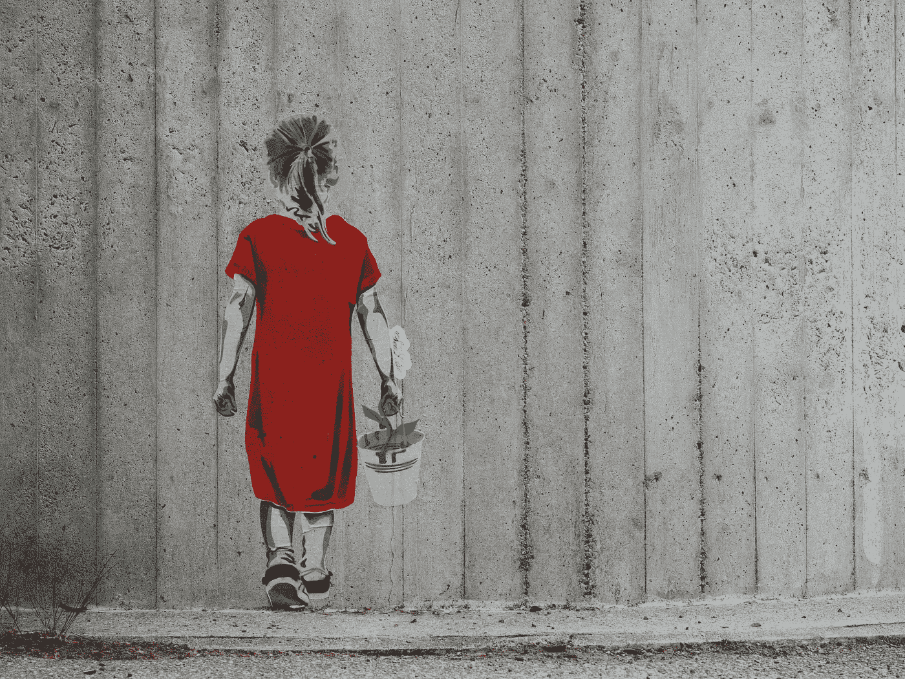

# 幸福未来的秘密可以归结为这一项技能

> 原文：<https://medium.com/swlh/the-secret-to-a-happy-future-boils-down-to-this-one-skill-b73c22570f8d>

Photo by Dnaiel-Von-Appen

> “一旦感官输入(你看到的/听到的/感觉到的/尝到的)进入你的大脑，它就被解释。你赋予它一个意义。这真的很重要，因为这发生得太快了，你甚至都没有意识到。有趣的是，一旦一个意义被赋予，你就会有一种情绪。你创造了一种感觉。”—硅谷传奇首席执行官兼人类工程学大师汤姆·胡拜尔

# 介绍

幸福的未来可以归结为一项深刻的技能，在本文中，我将通过讲述我如何在创业五年后为自己找到这一点的故事来证明这一点，以及它如何启发我的下一个 Aram 3.0 迭代——从选择我的想法到我的日常活动——我将解释这一切。

当我在 2013 年创办我的第一家公司时，六年后我刚刚离开一家快速增长的初创公司。它做得非常好，我带着第一次创业的所有天真，满怀信心和兴奋地开始了我的事业。当我意识到创办一家公司的风险有多大，进入市场有多难，以及一切需要多长时间时，我做了你所期望的，也是我不希望任何人经历的事情，【to】倾听并认同我的生存大脑和自我想象成真理的每一个想法和由此产生的情感。在我第一家公司期间，我是这样做的。

“每个人都会认为我是个失败者。”

“我父母不会以我为荣的。”

“我犯了一个大错，每年留下 30 万美元。”

"如果我失败了，那就是世界末日。"

我背靠着墙，一只受惊的老鼠被逼到角落里，每天早上我醒来，每天晚上我睡觉，一直在战斗或逃跑模式中渗出——它显示出来，我当然感觉到了。压力大到了极点。

我犯了太多的错误，从我为什么创业到这个行业是什么，这还不包括商业本身的基本原则，但从中吸取的教训是:

你创业的理由是正确的(因为热爱这门手艺而热爱它)

闪亮的东西和成就并不能带来快乐和满足。他们带来的只是想要更多闪亮的东西和更多的成就。

关闭那家公司后，我做了大量的自我反省，受到了生存危机的沉重打击。

我想做什么？

这是创业的被迫和艰难的祝福，这是一个漫长而艰难的旅程，所以你要深入挖掘，找到你想要做的事情。

在这一点上，我看了看我当时最擅长的是生产力和生活方式黑客。我开发了一些应用，包括 Gmail 的 7 分钟晨间程序和 Sprint。

引出你应该问的深刻问题的最大教训是:

**不管你在你的工作/公司做了什么，不管是成功还是失败，你总是会停下来问:“我为什么要做这件事，为什么它(对我)很重要？”**

在创业中，无论你做得多好，你都是在推石头上山，因为风险和日复一日的障碍。所以你真的深挖，问“就算这个成功了，我在乎吗？”。

我的第二家公司更好。我搬到了硅谷，与一位联合创始人建立了联系，并更好地管理了整个事情。我应用了从第一家公司学到的痛苦教训，并且做得更好。

我联系了两位联合创始人，筹集了 7 位数的资金，开发了一个企业产品，卖给了财富 500 强公司、领先的制药公司和世界知名的初创企业。

下一轮挑战稍微复杂一点，但仍然存在。害怕领导 7 个非常聪明的人，一个与投资者和政治打交道的综合体。

那时我才意识到什么是重要的。那时我意识到你能把小东西做得有多好吃。终极技能——你能够从存在中获得的快乐。

是你的[心态让你快乐](/swlh/the-key-to-being-the-best-in-the-world-at-what-you-do-364c98d8b75a)，带着火。

然后你[期待旅程](/swlh/the-surprising-secret-to-changing-the-world-dd4d2519f940)。

你期待痛苦，因为它被框定为一场游戏。

你不需要所有的成就和荣誉，因为你知道什么是重要的，如何实现。

## 创造幸福的未来

创业 11 年后，我现在冷静地相信我的业务将会爆发并掀起波澜，因为我终于掌握了自己和自己的生活——我保证，这归结于这一技能。

我将这种情况下的掌控定义为永远不会有情绪将你的感觉和决定引向错误的方向，对你的存在完全满意，每天通过选择体验和学习制造快乐，如此热爱你的工作，以至于你甚至不需要在你所做的事情上成为世界上最好的，你成为最好的只是因为你如此热爱你的工作。

创造你想要的幸福和繁荣的未来可以归结为这一点— ***解释你的感官输入(你感知事物的内容和方式，以及你对它们的过滤)，并以一种创造积极情绪的方式赋予它们意义*** *。*

正是这种无意识的习惯有能力整天创造积极的感觉，而不是消极的感觉(是的，来自一个默认反应是消极和丑陋的人，这很有效)，并选择将这个世界和其中的每一件事都视为积极的，引导我走向我应该去的地方。

我的感知将“好”或“坏”的结果转化为简单的“反馈”——两者都不是。

我的感知将“好”或“坏”的结果转化为“指南”——简单地说，就是显示下一步该去哪里的结果。

发生的每件事都应该发生，因为我从每件事中寻找教训。

正如韦恩·戴尔博士所说，“如果你改变看待事物的方式，你看待的事物也会改变。”

这就是承认，当关键员工离开你时，由你来体现引进新人才和替换不想留在那里或没有空间与你一起成长的人才的好处。

这是承认当关系结束时，这是一个很好的时间进化到你的下一个版本，并向更新，更进化的人开放，他们被更新，更进化的你所吸引。

这是承认当一个所爱的人去世时，我们在这里进化，这样做有时需要旧的死亡，所以新的可以蓬勃发展。

你一遍又一遍地这样做，你会陷入最美丽的心流中，并意识到所有的事情都按照它应该发生的那样发生。

## 带着这个习惯生活在敬畏的巅峰状态

现在我知道这一切都是幻觉，我们应该创造出带着喜悦和敬畏去感知周围一切的巅峰状态。

现在我知道该由我来实现我想要发生的事情。

他们已经——我每天都写作，这是我最喜欢的活动，并就我所写的确切主题进行咨询——指导高风险决策者在他们的巅峰时期执行任务。

我的公司正式自筹资金，为纽约的生活方式买单。诀窍是满足于自己的现状，并为了自己的利益而做到最好。如果我能保持现在的状态，我会很高兴。就在今天早上，我做了一个培训，我知道它会让我的销售对象大吃一惊。

这就是为什么我矛盾地知道这个行业将会非常有吸引力，并将会爆炸式增长。我已经可以看到，在一次辅导课程后，主要高管会推荐我，朋友们会突然打电话向我寻求帮助。

**以授权和教导的方式解释事件。**

养成习惯，从最痛苦的事情中寻找积极的一面。

这样做一段时间，很快它就变成了一个成长的游戏。

一个越难越吸引人的游戏。

这就是你不可阻挡的时候。

我离开了上一家公司，开始了这家新公司，只有三个月的银行存款。就像在，我决定放弃我需要的工资去支付住在纽约的账单，只有三个月的时间去找客户和支付我每月的开销。

我能够做到的原因是我有信心知道无论结果如何，我都会看到其中的美好。即使这意味着“失败”——尽管我已经把这个词从我的程序中删除了。

这给了我勇气去做这件事。这是因为在过去的几年里，我习惯性地练习塑造我的感知，并发现我可以创造我想要的未来，而且我现在已经做到了。

你也可以。

## 点击此处每周收到一篇我承诺的改变游戏规则的文章，这是你在互联网上其他地方找不到的。你还会收到我的 36 条原则指南，指导你如何掌控他人，以你希望被对待的方式被对待——并在你所做的事情上成为世界上最好的。我保证你不会后悔的！

## 这个故事发表在[的创业](https://medium.com/swlh)上，这是 Medium 最大的创业刊物，有 358，974+人关注。

## 订阅接收[我们的头条新闻](http://growthsupply.com/the-startup-newsletter/)。

