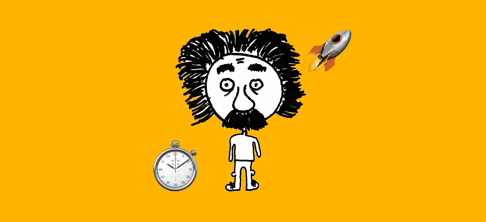
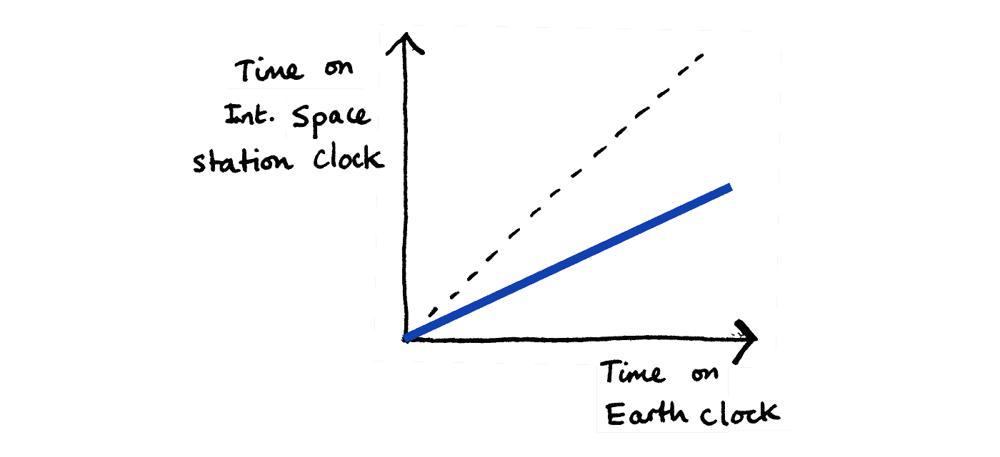
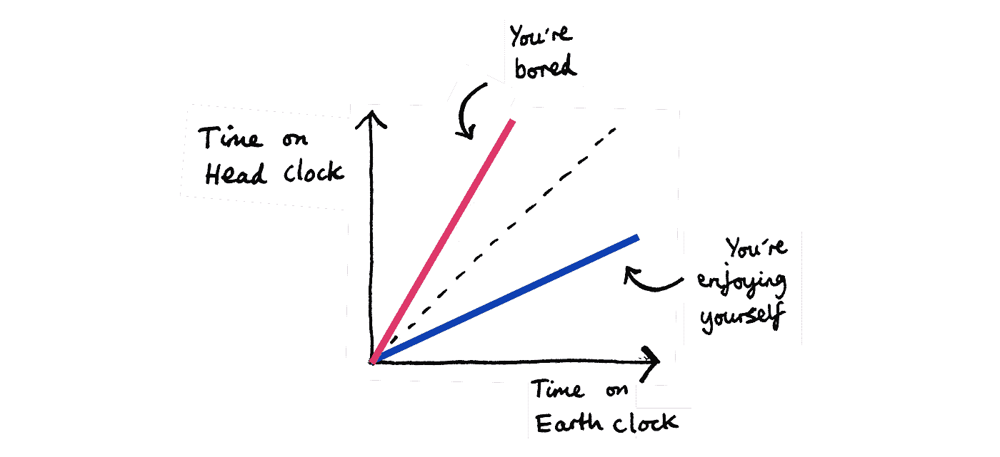
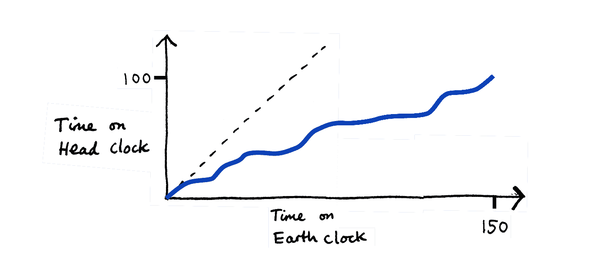

# 更长寿更幸福的秘密隐藏在爱因斯坦的相对论中

> 原文：<https://medium.com/swlh/the-secret-to-a-longer-and-happier-life-is-hidden-in-einsteins-theory-of-relativity-85bc2e07ce48>

当我们与吸引我们的人交谈时，或者当我们做我们喜欢的事情时，时间似乎过得很快。

当我们做一些我们觉得无聊的事情时，它似乎也会慢下来。

也许这比看起来要复杂得多。

事实证明，我们对时间的日常体验与爱因斯坦的研究和他的相对论是一致的。

特别是，它与一种叫做**时间膨胀**的现象相一致。

# 时间膨胀

如果你看过电影《星际穿越》，有一个场景是三个太空旅行者在一艘大飞船上。其中两人登上一艘较小的登陆艇，降落到一个引力场非常强的星球。

他们在这个星球的表面停留了几分钟的时间**。在此期间，他们面临一些巨大的海浪，在勉强回到他们的登陆艇后，他们飞回在太空中等待他们的更大的宇宙飞船。一进入更大的飞船，他们发现一直在等他们的第三位太空旅行者已经老了**很多年**。**

这是时间膨胀的一个例子。

每个太空旅行者都在他们自己的环境中以正常速度体验时间。但是，相对而言，在更大的宇宙飞船中受到更小引力的那个人经历的时间比拜访引力行星的两个人多得多。

令人震惊！

## 为什么会这样？

受到不同重力作用的人以相对不同的速度体验时间，即使在他们自己的经历中，时间似乎以正常速度流逝。

不仅仅是重力会导致时间膨胀。速度也能导致它。

也就是说，如果一对双胞胎站在地球上，其中一个乘坐宇宙飞船快速旅行了一段时间，然后返回地球，那么他们会发现他们呆在家里的双胞胎变得更老了。

# 那么时间膨胀到底是什么？

根据爱因斯坦的相对论，时间膨胀表明，与静止在地球上的人相比，如果你去一个重力更大的地方，或者你移动得非常快(速度更快)，那么你会比静止在地球上的人相对更年轻。

# 例子

当英国宇航员蒂姆·皮克去国际空间站生活 6 个月时，他经历了以下方式的时间膨胀。

1.  他所处的位置重力较小(离地心越近，重力越大)，所以他比静止在地球上的人衰老得相对更快。
2.  因为他绕着地球运行，所以他移动得非常快，所以他比静止在地球上的人衰老得相对慢。

把两者放在一起，由于轨道速度的时间膨胀稍微超过了由于重力变化的时间膨胀，所以他回来时比静止在地球上的人相对年轻。

Time passes by relatively slower on the ISS clock

# 这和我们日常的时间体验有什么关系呢？

嗯，这种时间膨胀现象似乎与我们在日常生活中体验时间的方式一致。

当我们(带着工作或想法)快速移动时，或者当我们受到吸引我们的人或物的引力时，我们经历的时间相对比地球上静止不动的人慢。

# 啊？

为了解释我的意思，我们必须分离出我们用来测量时间的特定时钟。

首先是**地球时钟**。这是地球表面的任何一个时钟。比如伦敦的大本钟。

在上面 Tim Peake 的例子中，我们将地球时钟上的时间与国际空间站上的时钟测量的时间进行了比较。

但现在让我们假设每个人的脑袋里都有想象中的**【头部时钟】**。

当你感觉时间飞逝或者被拖着走，那么你就经历了**你的生物钟和地球时钟**之间的差异。

Time can either fly or drag

# 例子

让我们假设你花了几个小时和你真正感兴趣的人交谈。当大本钟滴答作响时，你的生物钟走得相对较慢，就像黑洞(大量重力)附近的钟走得比大本钟慢一样。

但是在你自己的头脑中，在你全神贯注的谈话中，你正正常地体验着时间。你不会觉得时间在那一刻慢了下来。

但是当你抬头看时，你的生物钟感觉像是，比如说，30 分钟过去了，你注意到地球的生物钟已经走了，比如说，2 小时。当你说话的时候，地球时间已经飞逝。

当你全神贯注于工作，或者已经屈服于睡眠的引力时，情况也是如此。地球时间似乎过得相对较快。

# 那又怎样？

一方面，可以说通过做吸引我们的事情和加快步伐，生命将会飞逝。

从长远来看，这可能意味着我们似乎会更快地到达终点，因为我们只活了一定数量的“地球时钟年”。

但是如果人类真的被设定活一定的“头钟年”，而不是地球钟年呢？

假设你会活 100 年。然后，通过花时间和你所吸引的人在一起，通过更快的移动，通过睡觉，通过全神贯注于你感兴趣的工作，你将会活得相对更长，以地球时钟来衡量，可能是 150 年或更长！

If you move fast and towards things that attract you, you can live for more Earth clock years

也许蒂姆·皮克从国际空间站回来时比我们想象的还要年轻，因为他可能在那里度过了一段美好的时光。

# 概括起来

如果你做了以下事情…

1.  花更多的时间和你喜欢的人在一起，
2.  花更多的时间做你感兴趣的事情，
3.  动作要快(但不要急！),
4.  多睡觉，
5.  任何能让地球时钟上的时间飞逝的东西

…那么当你用地球时钟(我们都这样做)来衡量你的寿命时，你会活得更久。

*(除非损害身体健康！某些事情真的可以让地球时钟飞逝，但其中一些事情也可能是有害的，就像离黑洞太近不会有好结果一样。)

最后，引用爱因斯坦自己关于这个问题的话。

> “把你的手放在热炉子上一分钟，感觉就像一个小时。和一个漂亮的女孩坐一个小时，感觉就像一分钟。这就是相对论。”——阿尔伯特·爱因斯坦

如果你认为这个博客延长了你的寿命，请点击👏并与他人分享。

*如果你觉得阅读我的另一篇博客有吸引力，请看看我之前的博客* [*《棉花糖法:一种提高生产率的新技术》。*](/swlh/the-marshmallow-method-a-new-technique-to-increase-productivity-80bd085b9d95)

*此外，请查看我的公司*[*www.pilcro.com*](https://www.pilcro.com/?utm_source=medium&utm_medium=einstein&utm_campaign=awareness)*了解如何在组织、分享和访问您的品牌资产时节省时间(以地球时钟衡量)。*

## 这个故事发表在 [The Startup](https://medium.com/swlh) 上，这是 Medium 最大的企业家出版物，拥有 281，454+人。

## 在这里订阅接收[我们的头条新闻](http://growthsupply.com/the-startup-newsletter/)。

