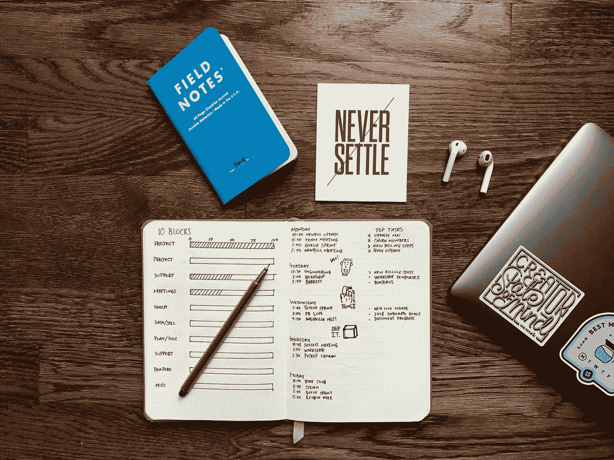

# 成为一个仍然拥有活跃社交生活的高产者的秘密

> 原文：<https://medium.com/swlh/the-secret-to-becoming-an-enormously-productive-person-who-still-has-a-vibrant-social-life-771f75bd08bf>

## 为什么结构化的一天对你的人际关系至关重要的 3 个原因

Photo by [Matt Ragland](https://unsplash.com/photos/8OVDzMGB_kw?utm_source=unsplash&utm_medium=referral&utm_content=creditCopyText) on [Unsplash](https://unsplash.com/search/photos/productivity?utm_source=unsplash&utm_medium=referral&utm_content=creditCopyText)

我的朋友指责我是一个非常自律和勤奋的人(即使我认为我在某一天没有完成足够的工作)。他们总是痛骂和取笑我，因为我几乎每天都在挖沟里，为的是写出一篇新文章。

我甚至刚刚锁定了我的第一份自由职业，这份工作将帮助我在不久的将来从事进一步的顾问/自由职业工作。

我做这些事情的同时，还在高级餐厅工作，有一个女朋友，一大早就训练拳击，花时间和朋友一起娱乐，我刚刚开始了一项严格的举重计划，以增加我的力量和整体健康。

我的许多朋友认为我能做到这一切是因为以下一个或多个原因:

Photo by [Jared Rice](https://unsplash.com/photos/NTyBbu66_SI?utm_source=unsplash&utm_medium=referral&utm_content=creditCopyText) on [Unsplash](https://unsplash.com/search/photos/atom?utm_source=unsplash&utm_medium=referral&utm_content=creditCopyText)

*   **我天生精力充沛，注意力更加集中。**(呃，错了。每天早上醒来，我都想按下*贪睡*键，像其他人一样进入放松状态。
*   我对 Adderall 或 Vyvanse 等兴奋剂上瘾。(还是那句话，完全错误。当然，我在大学期间服用了相当多的兴奋剂，如 Adderall，我很快就知道这类药物对整体健康和生产力的不可持续性。

我确信，有社会生活的有生产力的人存在和繁荣的原因与他们的基因线路和使用认知增强兴奋剂没有多大关系。当你问那些似乎正在挑战世界并真正赢得战斗的人时，他们似乎不会对日常追求中遇到的障碍撒尿、抱怨和呻吟——事实上，大多数人都欢迎挑战。

所以，如果这不是用药物欺骗你达到顶峰，并且没有证据支持你是一个基因优越的超级英雄，那么这是怎么回事呢？

在与这些人的交谈中，通过研究书籍和文章，并将这些原则应用到我自己的生活中，我发现有一个特征和习惯是不变的:**将某些*深度工作*活动常规化以获得最大产出，减少*浅层工作*活动以获得最佳时间余量的能力。**

记住这一点，让我们打开包装，深入了解这个想法可能是什么样子。此外，我还将解释为什么要采用一种常规的、深思熟虑的时间表来发展富有成效的工作生活，同时又能开启充满活力的社交生活。

# 原因 1:优化你的时间表

Photo by [Rutger Geleijnse](https://unsplash.com/photos/YlJe1x4S0Cg?utm_source=unsplash&utm_medium=referral&utm_content=creditCopyText) on [Unsplash](https://unsplash.com/search/photos/vitamins?utm_source=unsplash&utm_medium=referral&utm_content=creditCopyText)

为什么我们每天工作 8 小时？

我是认真的…

这似乎是应该作为法律的东西:

> “……第 11 条戒律“上帝保佑”应该是从早上 9 点到下午 5 点工作！”

在我们的日常生活中，我们需要工作 8 个小时，我们通常会想办法用适当的工作量来填补这 8 个小时。这项工作包括:

*   会议。
*   发送和接收看似无穷无尽的电子邮件。
*   准备各种项目的大纲、表格和计划。
*   给潜在客户打电话。

当我们盘点上面的工作时，我们可以看到这项工作不一定会给我们的日常生活带来有意义的、创造性的和勤奋的变化。借用《T2》深度作品的作者[卡尔·纽波特](http://www.artofwellbeing.com/2017/04/28/deepwork/)的话，这部作品将被称为*浅层作品:*

> **浅层次工作:**不需要认知的、逻辑式的任务，经常在分心的情况下完成。这些努力往往不会在世界上创造多少新的价值，而且很容易复制。

在我们的一天中，我们暴露在肤浅工作的冲击下，除了耗尽我们的意志力储备，扼杀我们的创造力，增加我们对更有成效和更有意义的工作的注意力。

另一方面，还有*深度工作:*

> **深度工作:**专注于一项认知要求高的任务而不分心的能力。结果是有价值的，难以复制。

这是一个人需要完成的工作类型，以便在一天中以指数级的速度完成他们的任务和职责。这类工作包括:

*   一篇有深度的博客文章的简明概要和完成。
*   研究和实现具体的编码语言，以建立下一个最好的应用程序。
*   今日之画*蒙娜丽莎*

这项工作需要专注于强度和调整你的时间表。在这里，电子邮件、会议和不必要的肤浅工作需要退居其次。专注是最重要的。**当你能够消除大部分外部噪音，从事需要大量认知能力和需求的工作时，你就能够提高创造力和生产力，从而更高效地完成任务。**

# 理由二:套路，套路，套路

Photo by [Zoltan Tasi](https://unsplash.com/photos/6vEqcR8Icbs?utm_source=unsplash&utm_medium=referral&utm_content=creditCopyText) on [Unsplash](https://unsplash.com/search/photos/atom?utm_source=unsplash&utm_medium=referral&utm_content=creditCopyText)

虽然制定你的时间表并最大限度地利用你拥有的每一分钟可能是最困难也是最关键的方面，但灌输一个正确的日常生活应该是首要的。

大多数创意者认为自发性是在工作和生活中发展创造力的关键。如果你一天中接触到不同的刺激，你会有更多的东西可以借鉴，从而创造出引人注目和令人敬畏的作品。

然而，就创造性工作的成效而言，这与事实相去甚远。

那些根据自己的时间表创造机会的人是通过最大化他们的生产产出，以及将各种各样的仪式与他们的日常追求常规化来做到这一点的。

> "你未来的秘密隐藏在你的日常生活中."
> 
> —迈克·默多克

通过将你一天中的各种低级决策程序化，你正在保存你的认知能量水平:

*   在你准备睡觉的前一天晚上，选择你在某一天要穿的衣服。
*   从同一家咖啡店买同一杯黑咖啡，这样就不会浪费时间和精力去想买什么了(或者更好的是每天早上让一个定时咖啡机为你冲一杯新咖啡)。
*   将你的早餐常规化，以获得有益的营养和能量。
*   在一天中的特定时间写你的博客文章，拍摄你的 Youtube 视频，录制你的播客等，以保持一致性并封锁这些富有成效的时间。

# 原因 3:制定正确的攻击计划

Photo by [Chase Moyer](https://unsplash.com/photos/YlUAJ0YdD-4?utm_source=unsplash&utm_medium=referral&utm_content=creditCopyText) on [Unsplash](https://unsplash.com/search/photos/telescope?utm_source=unsplash&utm_medium=referral&utm_content=creditCopyText)

虽然优化一天中与其他人一样的 24 小时，并在一天中安排琐碎的检查点是建立富有成效和有活力的生活的关键，但除非我们有一个适当的计划来规划我们的一天，否则它不会帮助我们走得很远。

超高产和社会人的一个主要特点是，他们有一个总体和一致的攻击计划，反映了他们在任何特定的一天开始征服的有意义的工作。这些计划通常可以推断出周计划、月计划和年计划。

现在，我不认为我在这篇文章中有足够的篇幅来阐述这些人被拉去制定这样一个为他们的*目的设定路线的计划的真正令人信服的原因；然而，知道你需要一个计划来创造引人注目的工作并为充实的社交生活打开自由之门就足够了。*

然后你可能会制定一个需要几个小时、几天甚至几周的计划。

相反，我们在这里处理的实际上只是一个简明清晰的指导计划，它将帮助我们制定出我们的日常目标。我将把我最近的每日计划作为任何想发展自己的人的起点。：

*   为我这周的 5 篇中型文章集思广益 15 篇文章的想法。
*   读完我正在读的书的最后一章。
*   给自由职业者发邮件，告知他收到下一篇文章的最新大纲。
*   花一个小时做 HIIT 拳击练习，在沉重的袋子上练习身体出拳。

现在，在我的日常目标过程中，我仍然会在一家高级餐厅全职工作，会见并发展与我女朋友的关系，并找到闲暇时间与朋友一起娱乐。

只有完成我上面计划中列出的任务，我才能在一天中的几个小时内完成这些目标。

# 关键要点:

就像生活中的任何事情一样，好事总是降临到那些埋头苦干，努力实现特定目标的人身上。

生活中许多巨大的快乐似乎离我们太远，因为一天中没有足够的时间来完成任何事情。我断言这是错误的，我们被欺骗了，因为我们在某一天对自己的能力缺乏了解。

*   有意识地专注于进行有意义和深入的工作活动可以解除我们每天经历的许多时间限制。
*   我们的日子需要常规化，以过滤掉任何可能会消耗我们认知能力和时间资源的低级活动。
*   “如果你没有计划，你就计划失败。”我知道这是老生常谈，但这是事实。如果你在一天中没有一个需要完成的具体指南，你会发现自己在原地踏步，而不是前进。

**从更广泛的意义上来说，我认为这里的要点是理解如何在我们的时代聪明地工作*,有一个计算好的方法，并有纪律去解决我们一直在躲避的事情，可以打开我们的生活，走向我们秘密寻求的辉煌和享受。***

# *👋🏻你好，我是乔恩*

*我是一名作家、思想家和葡萄酒爱好者，写一些关于个人成长和心理优化的文章。我也经常写我是如何把我的博客变成$$$。获取我的个人 6 天“创业博客”课程:*

## *🚨[【免费】世卫组织还想自己当老板？课程:现在就开始用你的博客赚钱，你需要知道的 6 件事](https://mailchi.mp/4b982beed325/free-6-step-course)*

**

## *这篇文章发表在 [The Startup](https://medium.com/swlh) 上，这是 Medium 最大的创业刊物，拥有 352，974+人关注。*

## *在此订阅接收[我们的头条新闻](http://growthsupply.com/the-startup-newsletter/)。*

**