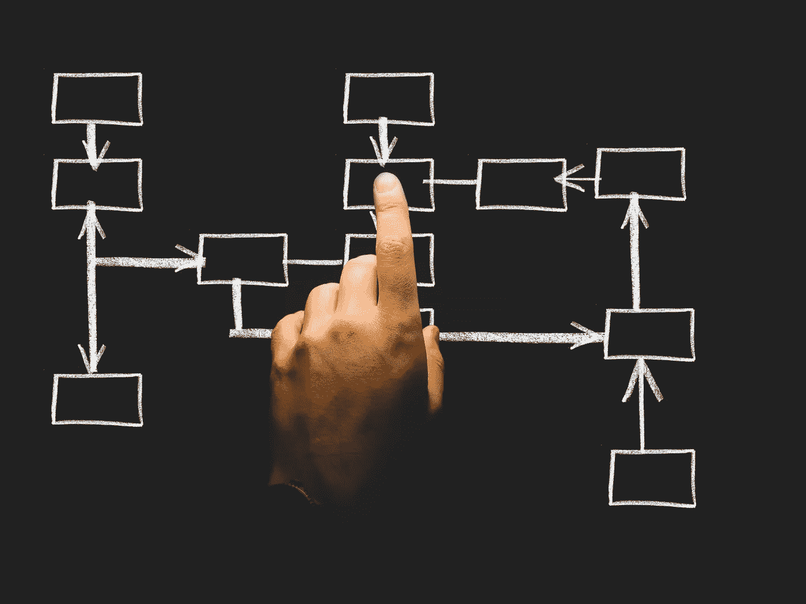
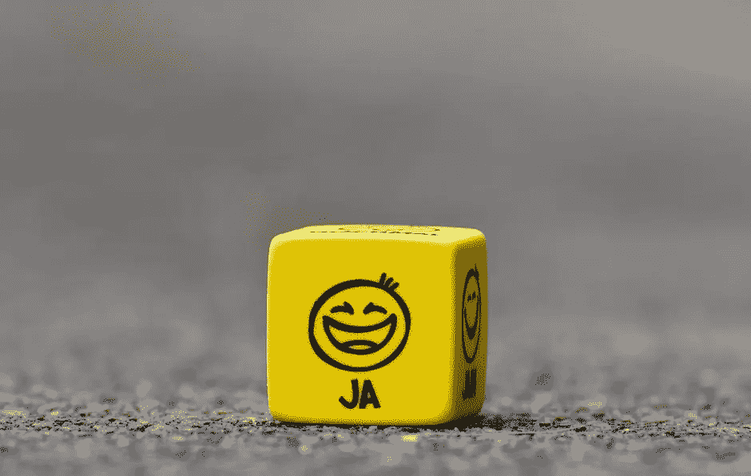
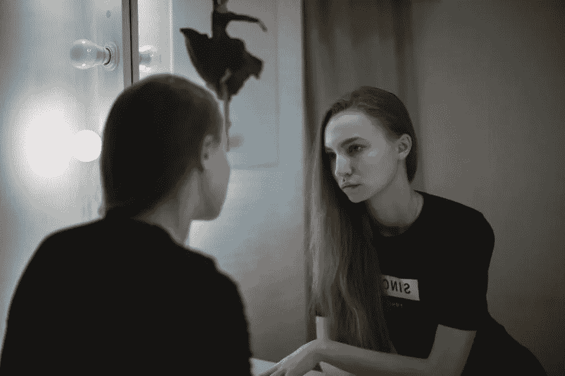

# 惊人生产力的简单秘诀

> 原文：<https://medium.com/swlh/the-secret-to-boosting-your-productivity-by-31-ee8bef287f7d>

## 你准备好释放惊人的生产力了吗？

如果我告诉你有一种方法可以让你的工作效率提高 31%,而你每天只需要花两分钟，连续 21 天，会怎么样？

没错。

每天 2 分钟 x 连续 21 天=生产率提高 31%。

那个公式听起来好得不像真的，是吧？

澄清一下，不，我们不是在说让你持续静脉滴注咖啡因。虽然这可能达到相同的最终目标，但我认为通过你手臂上戳的洞摄入咖啡因比我今天为你准备的更乏味，更不舒服。

话说回来，也许不是。

那么，这个神奇的技巧是什么，能够挖掘出你在这个世界上的无限潜力呢？

很简单:

> *幸福*

没错。

研究一致表明，处于积极状态的大脑比处于消极、中立甚至紧张状态的大脑工作效率高 31%。

这是一个巨大的潜在生产力等待着你去释放，而你所需要的只是一个积极的态度。

## **幸福到底是什么？**

真正的问题是:如今我们大多数人都不擅长快乐。

我知道我是。

我总是向前看，把我的快乐与一些任务的完成或一些关键指标的获得联系起来。

在学校里成绩很好。后来，我找到了一份好工作。

但是，当你的幸福系于未来，系于取得或完成*某事*，那么这意味着幸福总是潜伏在成功的另一边。

在这种情况下，我们的大脑永远不会真正获得幸福。

*为什么？*

因为我们的大脑作弊，不断移动球门柱。当我们完成一项任务时(成功时)，我们的大脑已经在重塑它的预期。

你取得了好成绩？太好了。现在取得更好的成绩。

*你写了本书？*妙极了。现在写一本更好的书。

> 把成功和幸福联系在一起会让两者都变得遥不可及。这是一个永远挥之不去的胡萝卜，只是我们抓不到。

但是不要担心(记住，当你在消极的精神状态下工作时，你的大脑效率会降低)，因为这个被打破的循环不是遗传的作用，而是社会的作用。

从孩提时代起，我们就在一个幸福、成功和认可联系在一起的环境中接受训练。

*不一定非要这样。*

当我们打开表达积极和快乐的方式时，我们的大脑就会变得超负荷。他们突然能够更努力、更快、更聪明地工作。

这有两个原因，这都可以追溯到化学。

还记得我说过这个诀窍不涉及咖啡因或提高成绩的物质吗？

我撒谎了。

剧情转折。是时候拔掉静脉注射管了。

开玩笑的。关于静脉注射。而不是提高成绩的物质。

我们的大脑是一个增强表现物质的糊状工厂。为了理解如何最大限度地提高我们的生产力、智力和能量水平，重要的是首先从最基本的层面上了解我们的大脑内部发生了什么。

# 多巴胺让一切变得更好

真的。

在座的大多数人应该听说过大脑释放的这种小化学物质。多巴胺是一种与奖励动机行为相关的神经递质。

奖励通常会引发多巴胺的分泌，这种分泌会强化行为，让你想在未来再次做这种活动。

药物人为地促进多巴胺的产生，这就是为什么药物(广义上)如此令人上瘾。

这是科学。

我们可以利用的科学。

多巴胺在积极和快乐方面有两种功能。

首先是我们已经讨论过的明显功能:

> 多巴胺只会让你更快乐。

但是快乐本身并不能解释认知能力的惊人提升。

不，那来自多巴胺的第二个功能。

> 多巴胺激活你大脑中的学习中心，让你以新的、令人兴奋的方式适应和成长。

没错，这些小小的多巴胺注射不仅让你快乐，还能让你更有效率，更有能力学习。

# **逆向工程幸福**

前面我们讨论了社会如何训练我们把幸福和成功联系起来，以及两者是如何生活在认知的地平线之外，永远在我们的掌握之外，除了在获得之后的短暂时刻。

不一定要这样。

还记得在文章的开头，我告诉你，连续 21 天每天花 2 分钟，你可以提高 31%的整体生产力吗？

好了，我耐心而执着的读者，我们已经到了今天议事录的*部分。*

## 下面是提高你的生产力/积极性的三个步骤

在接下来的 21 天里，我要你每天:

1.  从写下 3 件你感激的事情开始你的一天
2.  *记下你在过去 24 小时内的一次积极经历*
3.  *每天写一封积极的电子邮件，赞扬你支持网络中的某人*

就是这样。

比整天跟着你注射咖啡因要简单得多。

说真的，就这么简单。

> 这些步骤可以归结为重温积极的经历，并利用这些冥想来重新连接你的大脑选择优先考虑的刺激。

这个练习让你的大脑认识到行为很重要。

最终，你的大脑开始改变它在日常互动中寻找的模式。它不再首先寻找消极的，而是积极的。

在我们的生活中，我们都有一些经常消极的人。他们用悲观的眼光看待世界，用愤世嫉俗和狭隘的思想感染一切，如果你放任不管，这种思想会感染和压倒你。

见鬼，我们甚至不需要超越自己去寻找那个人。往往我们*就是*那个人。

但是在接下来的 21 天里，我们要做的就是打破这个循环。有了意向性，我们将关注我们行为、思维过程和人际交往中的积极模式。

> 如果你坚持这样做，你会发现你的整体幸福感、成功感和生活满意度都有所提升。

所以不要等待，不要拖延。每天为你的幸福投资两分钟。

**感谢阅读！:)**

**你准备好释放你的全部潜力了吗？**

按照这个免费的电子邮件课程一步一步来，我会教你如何建立更牢固的关系，提高生产力，实现财务自由。

[**点击此处参加免费的 5 个势力范围电子邮件课程！**](http://www.thehyperfocusedmind.com/)

## 这个故事发表在 [The Startup](https://medium.com/swlh) 上，这是 Medium 最大的企业家出版物，拥有 289，682+人。

## 在此订阅接收[我们的头条新闻](http://growthsupply.com/the-startup-newsletter/)。

