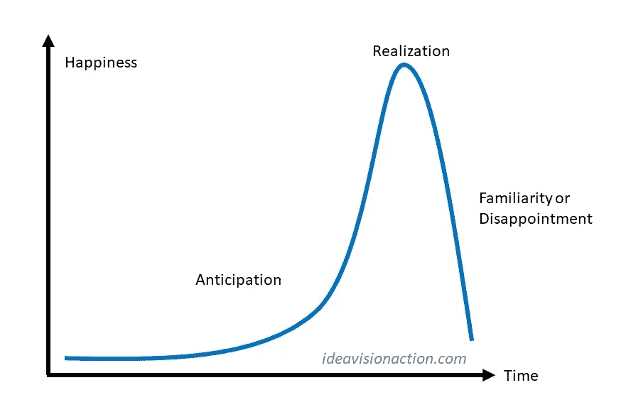
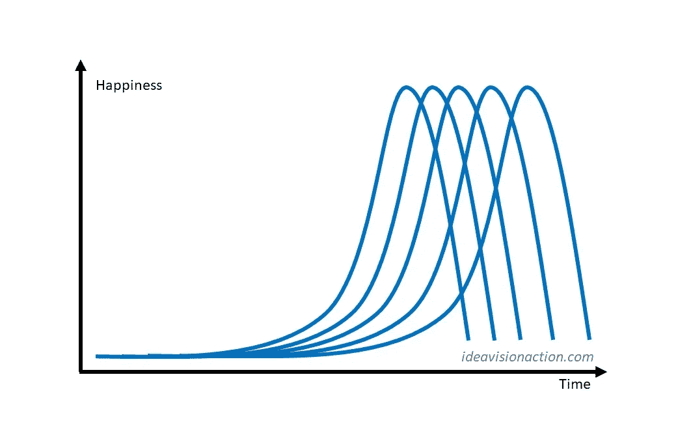

# 快乐的秘密

> 原文：<https://medium.com/swlh/the-secret-to-happiness-b1cdd76cdb8d>

不是你想的那样。

[jeshoots/pixabay](https://pixabay.com/en/laptop-woman-education-study-young-3087585/)

幸福是生活的最终回报，然而我们大多数人都误解了它。让我们找出真正让我们快乐的东西。

**什么会让你快乐？**

如果我问你这个问题，你可能会说出一个愿望。

*   银行里有一百万美元，
*   获得晋升，
*   有一个生活伴侣，
*   …

是这样吗？实现你的愿望真的会让你快乐吗？让我们把这个过程分解一下，分析一下你的欲望对你幸福的影响。

Happiness Curve

**期待**

欲望的第一阶段是期待。在这个阶段，你会意识到一种渴望。你梦想当这个愿望实现时，你的生活会怎样。甚至它的想法也让你更快乐。你采取行动实现你的愿望。越接近实现，越开心。

**实现**

你的幸福在愿望实现时达到顶峰。几天后，奇怪的事情发生了。你要么变得熟悉你的新现实，要么它不像你预期的那样让你满意。无论哪种情况，你的幸福感都会迅速下降。

更奇怪的是，当你熟悉了某样东西，它就成了你的标准。当某样东西成为你的标准时，你就会依恋它。它的存在并没有让你变得更快乐，但它失去的可能性让你感到害怕。

**如何保持快乐**

> ***如果每实现一个目标，我们的幸福感就保证直线下降，如何保持高水平的幸福感？***

幸福曲线回答了这个问题。我们大部分的快乐来自于我们对目标的期待和努力。为了保持高水平的幸福，我们需要做的就是设定有价值的目标并朝着目标努力。

Maintained Happiness

**无聊区、恐慌区、拉伸区**

不过有一个问题。设定一个遥不可及的目标会让我们痛苦。设定一个我们力所能及的目标根本不会让我们兴奋。甜蜜点似乎是设定稍微超出我们舒适区的目标。这样我们知道我们可以达到目标，但这仍然令人兴奋。

塔尔·本·沙哈尔在他的书《更快乐》中定义了三个区域。完全在我们舒适区的活动或目标让我们厌烦。远离我们舒适区的活动会给我们带来压力。这两个区域都让我们不开心。当我们处于拉伸区，即无聊区和恐慌区之间的最佳位置时，我们会感到兴奋和快乐。

当你呆在你的伸展区，你会熟悉它，它会变成你的无聊区。很快，你又变得不开心了。为了避免这种情况，你需要再次摆脱它。这是一个永无止境的循环。

**结论**

让我们快乐的不是得到我们渴望的东西，而是进步，不断改进，一次又一次地走出我们的舒适区，不断设定新的目标并朝着目标努力。这是幸福的秘密。

*阅读下一篇:* [*解释人类所有行为的原理*](https://ideavisionaction.com/personal-development/the-principle-that-explains-all-human-behavior/)

## 这篇文章发表在 [The Startup](https://medium.com/swlh) 上，这是 Medium 最大的创业刊物，有 289，682+人关注。

## 订阅接收[我们的头条新闻](http://growthsupply.com/the-startup-newsletter/)。

