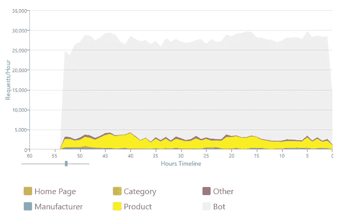
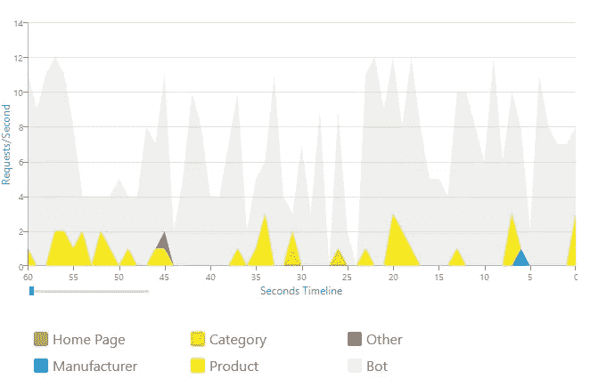

# 我的长尾 SEO 成功的秘密

> 原文：<https://medium.com/swlh/the-secret-to-my-long-tail-seo-success-13f18285f633>

## 这个策略对我来说屡试不爽

[Unsplash](https://unsplash.com?utm_source=medium&utm_medium=referral)

# 对谷歌好，谷歌也会对你好。

*说真的，那是我的秘密！*

当然，**这需要解释**——这也是我将在这篇文章中谈到的。

大约 10 年前，我在谷歌的一个幻灯片演示中看到了这句话。奇怪的是，它甚至不是一个关于**搜索引擎优化**的演示。

取而代之的是，他们的数据中心的能源效率，以及微小的改进，乘以每天数十亿，随着时间的推移，如何累积成非凡的节约。

演讲继续进行，提到了谷歌处理无效 HTML 网页和语法正确的网页的难度；以及好的页面如何在系统中快速跟踪，因为谷歌不必浪费 CPU 周期来破译你糟糕的打字和猜测你的真实意思。

谷歌的观点— **做出好的页面，你会得到回报。**

> 想象一下，谷歌说他们会奖励我为他们省电。我想知道他们还会奖励我什么？

这个简单的问题成了过去十年我在网站上实施的每一个实质性策略的基础。

这篇文章涵盖了我在几年前共同创立的价值数百万美元的电子商务公司 *Inside Stores* 中成功使用的**特定长尾 SEO 策略**，该公司专门从事[室内装饰织物](https://www.insidefabric.com/)和室内[墙面布](https://www.insidewallpaper.com/)。

# 什么是长尾 SEO？

对我来说，也为了这篇文章的目的，长尾搜索引擎优化(SEO)是以下几个方面的结合:

*   在谷歌中获得多词短语的排名；通常由三个或更多单词组成(例如蓝色条纹棉布)。
*   有目的地，但有意义地，根据你认为重要的多词短语，让成千上万的网页在谷歌中排名。

> 让我把话说清楚——长尾并不意味着把成千上万的垃圾页面塞进谷歌。你的网页必须有意义，否则你会受到惩罚。

就我个人而言，我倾向于被非常适合长尾概念的在线机会所吸引——我一直认为这是我的竞争优势。

## 这些页面来自哪里？

页面可以来自任何地方。关键是找到适合大页数的自然群体。

*   个别产品的页面。如果你足够幸运，在你的网站上列出了成千上万的产品，这些产品会在谷歌上得到最多的关注。这些页面上的内容至关重要。
*   顶级类别页面(制造商、颜色、面料风格、设计师等。).虽然这些页面可能通常只代表两个词的短语(蓝色织物，或棉织物)，但它们无疑仍然可以提升您的整体 SEO 足迹。
*   精选产品(Kravet 蓝色棉织物)的狭窄焦点画廊，这些产品是使用创造性编程算法由机器生成的。
*   人类策划的自然搭配的成套产品，就像沙发上可以搭配的枕头的织物图案。

> 我更喜欢网页和网页的集合，可以通过创新的编程机器生成。这是创建成千上万包含大量内容的页面的唯一明智的方法。

## 有什么好处？

如果你有一个拥有数千页的电子商务网站，好处是巨大的。以下是一些大问题:

*   如果你有懒惰的竞争对手，你在谷歌的足迹会比他们大得多。
*   即使你的竞争对手并不懒惰，只要有一点创造性的思维，你仍然可以找到方法在谷歌上放置比他们更多的页面。
*   数以千计的排名页面，如果他们中的一些突然被一个积极的竞争对手击倒，对你的流量的整体影响将是最小的，因为那些有问题的页面将只代表你总数的一小部分。
*   你会对人们在谷歌上输入的内容感到惊讶。追求更长的多词短语不仅让你用一张大网而不是单杆钓鱼，它还提供了一个在追求什么单词组合方面胜过你的竞争对手的机会。做一个更聪明的渔夫。
*   你将从谷歌获得大量的免费流量，这是你永远无法通过点击活动支付的。
*   一旦到达目的地，即使你在度假，交通也会源源不断。
*   最重要的是，在竞争激烈的市场中，拥有一个可靠的长尾战略可能是经商和不经商的区别。

所有这些对收入意味着什么？

> 对于我们的室内装潢织物网上商店，80%的收入来自谷歌的长尾页面，尽管我们在两个词的组合上排名也非常好。

底线— **长尾摇滚！**

# 伟大的内容呢？

咄！但是说真的，如果你没有很棒的内容——回家吧。已经掌握内容游戏的人简直太多了。

要想战胜这些老牌玩家，你需要有一个策略，从一开始就假设内容很棒，然后在此基础上使用更高级的技术——比如本文中概述的长尾 SEO 策略。

# 像谷歌程序员一样思考

我的 SEO 秘方的下一个支柱是不断地问自己关键的问题，比如:

> 如果我在谷歌工作，在某个网站上看到{whatever}，我会有什么反应？

我会认为这会改善谷歌用户的整体体验吗，或者他们会因为我让这些页面在搜索结果中排名靠前而恨我吗？

例如，我在 SEO 社区尊敬的一个人曾经告诉我，在我的电子商务网站上的每一个产品页面上重复样板运输和退货政策会被 Google 认为是重复的内容——因此，我的页面会受到惩罚。

我想了大约一分钟(因为我尊重这位顾问)，然后回答说:我不同意。原因如下:

谷歌当然知道所有的电子商务网站，他们也必须知道顾客想要的运输和退货政策就在他们容易找到的页面上——他们不想去寻找它们。只要保持简短，在每一页上复制这些文本可以极大地改善客户体验。

> 如果我是谷歌的程序员，我会把电子商务网站上的重复发货和退货政策排除在重复内容处罚之外。

这似乎是显而易见的，但我看到这种情况被所谓的专家一遍又一遍地讨论。让我向你保证，在我的一个网站上，同样的政策段落被重复了超过 50 万次，这些页面产生了**数百万美元的收入**——没有罚款。

事实上，我甚至认为，一个聪明的谷歌程序员会，或者至少应该，选择让包含完整政策信息的产品页面比同类产品的竞争页面稍胜一筹。

这只是一个简单的例子，说明我是如何像排名团队中的谷歌程序员一样思考决策的，这个概念可以应用到你在建设网站的过程中需要做出的许多决策中。

# 注意元内容

互联网上有成千上万的关于如何写好 H1 标题和制作 HTML 元标题和描述的帖子，所以我不会深入这个话题，只是说，所有这些都非常重要。

随着时间的推移，我发现一个非常有效的技巧是在 H1、元标题、页面 URL 和主要产品图片 URL 中使用相同的单词短语。看起来这对谷歌来说很重要，几年前我第一次全面尝试后，我的网站流量在两周内翻了一番。

我还精心制作了我的*元描述*，由谷歌显示在搜索结果中，让搜索者知道我们的网站提供了更多他们搜索的任何风格、颜色、品牌或设计师的产品——只需点击一下。把它当成你整个网站的介绍；不仅仅是单个页面或产品的信息。

最后，不要忘记加入一些新的隐形暗示技术，比如 [JSON-LD](https://en.wikipedia.org/wiki/JSON-LD) 。这对电子商务网站尤其重要。

# 帮助谷歌让谷歌变得更好

电影《杰里·马奎尔》中有一个著名的场景，汤姆·克鲁斯乞求小古巴·古丁，“帮帮我，帮帮你。

请记住这一点，因为这正是谷歌对你的要求。

谷歌的搜索使命很简单。为他们的用户提供最好的体验。如果你帮助他们做到这一点，你将获得丰厚的免费流量回报，而且是很多——就这么简单。

当然，他们向几乎所有不是垃圾邮件发送者的人提供免费流量。但是如果你想要的不仅仅是“*几乎任何人”*级别的流量，你需要用优秀的页面和任何你能想到的东西来帮助谷歌明白你的网站比其他网站更出色。

向 Google 传递提示最容易的地方是通过你的页面元数据(meta tags，JSON-LD 等)。).

接下来，确保你所有的图片都有描述性的 URL 和 *alt* 标签。产品页面的链接尽可能描述性的。

> 你的工作是**为谷歌“拼出来”，这样他们就不用浪费时间去猜测是什么让你的网站如此伟大。**

**还记得我开篇讲的关于省电和让页面快速跟踪的趣闻吗？动动脑筋，写下你能做的十件事，来帮助谷歌迅速了解你的网站比竞争对手的网站更好。那就去做！**

**还有一点要记住——搜索者在谷歌里输入各种奇怪的东西。这些短语中的一些对你来说可能完全是古怪的，但是对打字的人来说却不是如此。**

**谷歌将尽力展示一些不错的结果。确保你的网页被包含在内——这就是长尾理论的全部意义。**

**如果你做了正确的工作，你的页面将会作为唯一明显的选择浮在搜索结果的顶端。这就是长尾的魔力，因为有了长尾，你就不会与一大堆超出你控制或运气的外部市场动态作斗争。**

# **他们给你免费送钱，不要吝啬**

**给点尊重。**

> **在我的案例中，如果我必须为点击付费，谷歌发给我的有机流量每年将超过 100 万美元——他们已经这样做了多年。**

**这个话题与上一个密切相关，但我想确保标题突出，因为根据我的经验，网站运营商倾向于认为谷歌是理所当然的——不要！**

**如果谷歌慷慨地给你送来一袋袋免费的现金，你至少可以确保你兑现了提供优质和吸引人的内容的承诺。**

> **这不仅是正确的做法，他们还会因此奖励你。**

**谷歌当然知道你的访问者何时会立即点击后退按钮。很容易看出你的内容不是很好。如果这种情况发生得太频繁，你的网页就会被降级。**

**相反，如果访问者逗留了一段时间，谷歌知道你已经用优秀的内容抓住了他们的注意力，你的页面就会升级——这就是回报。**

**不要为了节省几美元而在内容上吝啬。为创建优秀页面而付出的额外努力将在未来几年内转化为流量年金。**

> **请珍惜谷歌发给你的流量，心存感激。**

# **将谷歌视为吸引顾客的磁石**

**不要假设用户开始购物时输入的内容就是他们最终会购买的内容。当然，这是一个强烈的意图暗示，但游客只需点击一下鼠标就可以进入*完全不同的兔子洞*。**

**利用这一点。**

> **给访问者很多机会保持点击，因为如果你不这样做，他们已经有一只眼睛盯着后退按钮，他们会在心跳中消失。**

**我个人对室内装饰织物的经验是，访问者很少购买与他们最初搜索相似的图案——除非他们搜索特定的项目编号，这通常意味着他们在比较价格。**

**这就是为什么让大量页面进入谷歌是如此重要。无论人们搜索什么，你都希望至少有一个长尾页面显示在结果中，这样你就有机会把他们介绍给你的网站。**

**我确保我的所有登录页面都显示预期的内容，但我也以使浏览变得有趣的方式来制作它们——这是一种经历无数兔子洞和有趣的曲折的体验。**

**大多数购物者天生好奇——利用这一点。**

# **谷歌比你聪明，利用这一点**

**你永远也骗不了谷歌。尝试不仅浪费时间，还会损害你网站的声誉。不管你认为自己有多聪明，你永远也比不上成千上万个博士的智慧总和。**

**我已经长大了，足以记得我们可以用简单的技术操纵谷歌结果的日子，比如跟踪关键词密度和使用同义词库来确保书中的每个同义词都包含在我们的页面上。那些日子早已过去。**

> **相反，利用谷歌的聪明才智。**

***柔道*这项运动告诉学生，你不需要比你的对手更高大、更强壮。如果你掌握了技术，你可以利用它们的动量和体重来对付它们。**

**谷歌的优势在于机器学习、令人惊叹的程序员以及获取互联网上每一条宝贵信息的途径。如果你能学会如何创造性地利用这种能量，这就是黄金。将它用于你的竞争优势。**

> **利用谷歌的知识和行为为你服务，而不是与你作对——就像柔道一样。**

**这实际上是一种祝福，因为我们现在可以创作内容和制作页面，而不必像以前那样笨拙地将文字填充到文本中，或者安排页面布局以符合一些人为的标准。**

**谷歌最新的机器学习排名算法棒极了。让您的网页，无论你想展示你最好的工作。他们的算法会自动知道你的页面是好是坏。**

# **入站链接重要吗？**

**谷歌的业务建立在入站链接上。他们永远都很重要。**

> **然而，当你生成数以千计的长尾页面时，很少会有超过几个离群值得到超过一个或两个外部入站链接，如果有的话。**

**没关系。你的竞争对手会在同一条船上，谷歌只是使用他们可以得到的任何信息——你自己的页面内容。**

**当然，外部入站链接对你的网站仍然非常重要；只是在你的长尾页面上没有那么多。**

## **内部交联**

**我相信强有力的内部交叉战略。交叉链接是指页面使用链接文本链接到你自己网站上的其他页面，这是为了给谷歌更好的提示而有策略地选择的。**

**例如，一个给定页面的链接可能会引用一个普通的 SKU 或 UPC 代码(供比价购物者使用)，而同一页面的其他链接可能会引用*蓝色条纹面料*，或者某个著名设计师的名字。**

**为了提高效率，我以编程的方式做到这一点，它必须自然地适合页面，这样它才能真正改善我的访问者的体验，而不仅仅是为了一些抽象的优化目的而占用页面空间，我的访问者永远不会理解，或者更糟的是，会觉得这很烦人。**

# **成熟很重要——把你的书页放在身边**

**谷歌喜欢经受住时间考验的*【好】*网页。这可能是一个祝福，也可能是一个诅咒，取决于你是老玩家还是新手。**

**一旦你是一个传统网站，页面成熟度对于长尾页面来说是一个极好的竞争护城河。这些类型的页面很少有大量的入站链接，所以你的排名主要是基于你的页面内容和整个网站的权威性。新来的孩子会花几个月的时间努力赶上来；即使它们有几乎相同的内容(比如一个流行商品的产品页面)。**

> **一旦你努力工作，让潜在的成千上万的长尾网页在谷歌排名，你要确保你保持他们在那里。**

**我最后的支柱——**不伤害任何人。****

**在没有首先在 Google 中测试几个页面以确保这些改变不会对你的排名产生负面影响的情况下，对你的整体页面模板进行大的改变要小心。**

**永远不要删除排名页面！**

**这似乎是明智的，但不可避免的是，您可能会有后来停产的产品的页面。然后呢？**

**发挥创意，看看是否有任何非垃圾信息的理由让这些页面存在。**

**就我而言，对于室内装饰织物来说，图案来来去去，人们总是在寻找停产的产品——也许是为了替换损坏的垫子。**

**对我来说，保留这些旧页是完全有意义的；当然有一些变化，并向我们的客户展示使用机器学习找到匹配图像的合理替代方案。**

> **我的长尾页面中有 20%是关于停产产品的，我的客户真的很感激能够找到替代品。这完全是视角和创造性思维的问题。**

# **不完全免费——长尾的真实成本**

**与点击付费相比，有机长尾流量似乎是免费的，但创建和实施这些策略肯定是有成本的——例如，开发者的工资。**

> **我的观点是评估这些成本和回报，就像你评估任何其他营销或点击活动一样。**

**每当我开始一个新项目时，以下是我试图考虑的长尾的一些主要成本:**

*   **开发、测试和调整整体策略**
*   **维护页面内容和页面之间的任何相关交叉链接**
*   **谷歌机器人消耗的额外服务器资源，谷歌的友好机器人定期访问网站寻找变化**

## **Googlebot 对服务器资源的影响**

**下面的图表显示谷歌的机器人点击 insidefabric.com 的[，以灰色显示，与人类访客的所有请求相对照。](https://www.insidefabric.com/)**

**起初，这似乎很奇怪，**谷歌机器人**使用的服务器资源是我们热血朋友的十倍；但没关系，这是一个合理的代价，因为知道谷歌热衷于让我们的页面在其索引中保持新鲜——特别是因为由此产生的有机流量是免费的。**

> **我喜欢说，这是谷歌表达他们爱意的方式。我感觉很被爱！**

**鉴于这个网站有大约 750，000 个页面，一些快速计算显示，谷歌每天都在扫描整个网站。想想看——谷歌认为我的内容足够重要，可以每天浏览每一页。**

**多牛逼啊！**

**我一定是在做正确的事情；否则，谷歌将退回到精选每日扫描，只包括它认为重要的页面子集。**

**我是怎么知道的？像谷歌程序员一样思考，理解他们对电力(以及带宽、存储和 CPU)的明智使用。**

****每小时请求数** 灰色的是 Googlebot。黄色代表单个产品的长尾页面，紫色代表长尾画廊页面(非常具体的产品集合，如 *Kravet 蓝色条纹棉窗帘面料*)。**

****

****每秒请求数** 该图表显示了星期五晚上的一分钟。同样，大多数页面请求都是由谷歌的机器人扫描的——经常达到每秒 12 次。**

**有时候，午夜过后，我观察到每秒 25 个请求的速率。**

****

# **应对谷歌排名算法的变化**

**多年来，我在这篇文章中概述的策略已经证明，随着谷歌不断完善其排名算法，它们通常不会受到负面影响。为什么——因为我所做的一切都是基于善待谷歌这一首要原则，所以他们也会善待我。**

> **当然，你仍然需要遵循谷歌所有的常识性核心指导来获得好的排名，比如使用 HTTPS 和优化你的移动页面。**

# **结论**

**如果你有正确种类和数量的网络内容，我在这篇文章中概述的长尾战略可以带来惊人的利润——尤其是如果你不介意做一点开发来增加你的页面数量。**

**对我来说，如果我不得不为点击活动付费，我在这篇文章中提到的室内装饰织物生意就永远不可能。这种类型的 PPC 费用从每次点击 1.00 美元开始，然后一路上涨。**

**我挑剔的布料购买者优柔寡断的 ***“当我看到它的时候我就知道了”*** 的观点在 PPC 上对我不利，但在长尾理论上完全对我有利，因为我不再需要在 ROI 上与数学斗争。**

**最重要的是，一旦你为自己的具体情况找到了解决方案，长尾理论就是一份持续不断的礼物——相对而言，只需付出很少的额外努力。**

> **谷歌只是不停地给你送来一袋袋现金，即使你在度假；)**

**请记住我的开场白——**

> **对谷歌好，谷歌也会对你好。**

**你可以指望它； ***喜欢重力。*****

**伙计，我就是喜欢长尾，你也会喜欢的。**

## **感谢阅读。如果你喜欢这篇文章，请随意点击那个按钮👏帮助其他人找到它。**

****

## **这篇文章发表在 [The Startup](https://medium.com/swlh) 上，这是 Medium 最大的创业刊物，有+389，305 人关注。**

## **在这里订阅接收[我们的头条新闻](http://growthsupply.com/the-startup-newsletter/)。**

****