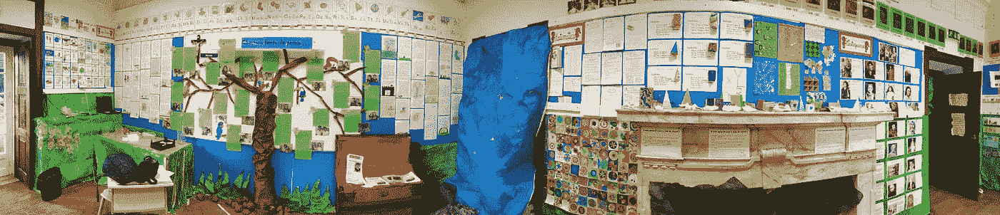

# 达到人生目标所需的动力

> 原文：<https://medium.com/swlh/the-secret-you-need-to-know-to-reach-big-goals-600468dcaae4>

想象那些你必须要做的任务，但是你缺乏做这些任务的动力。它可以是像打扫厨房这样简单的事情，也可以是像审查论文、写论文或做实验这样复杂的事情。当你缺乏动力时，你能做什么来完成你的任务？

最近我就遇到了这种情况，任务很简单。打扫厨房。我缺乏力量和动力，我甚至可以找到有价值的理由来拖延这件事。但是我想——“嗯，我至少可以把餐具放进洗碗机”，然后我想——“嗯，在餐具之后，我可以放这个盘子，那个，还有那个”。很快我意识到找到动力的最好方法是退后一步，放眼全局，然后退后一步，从小事做起。

知道自己的目标很重要，但实现目标往往取决于获得动力的小行动。我应用了这个从小处着手的简单想法，并试图完成我必须完成的整体中的一小部分，以达到目标，这很有效。另一个例子是我正在审查的一篇博士论文。文献综述这一章总是要求很高，因为作者必须综合他的主题所涉及的所有知识。因此，它包含了很多概念，我熟悉其中的一些，但不是全部。所以读书要求高，拖延的倾向高。于是我开始一页一页的读，然后一节一节的读，过了 1h 我读了一大半的章节，获得了动力。

# 战略

秘诀是找到你能做的小任务，获得你达到目标所需的动力。这是我从厨房经验中总结出的三个简单策略…想想吧。

## 1.后退

看似遥不可及的目标背后是一个目的。大局。退一步讲，就是要有大局观。如果你不这样做，你的思想可能会卡在山坡上，你会拖延第一步。不要看斜坡，要看整座山。

## 2.查看详情

大局之后，山。寻找细节，制定计划。为了达到你的目标，你能做的最小的细节是什么，或者你能给出的步骤是什么？也许读一段，或者一页。注意电子表格的第一列，或者编写编程算法的第一行代码。你可以打开电脑或一些你将用来测量的设备。它可以是任何事情，只要它足够小，它就会变得不可抗拒。

## 3.从小处着手

那么，就开始吧。虽然很小，但是做了很多小事情会给你动力去实现你的大目标。每当你之前认为很小的事情变得太难做时，重复这个过程，看看是否有更小的事情你可以做。打个比方，你只停留在夸克上。

你是否有一项大工作要做，却缺乏动力去做？

尝试应用这三个简单的策略，并与他人分享你的经验。

## 这篇文章发表在 [The Startup](https://medium.com/swlh) 上，这是 Medium 最大的创业刊物，有 277，994+人关注。

## 订阅接收[我们的头条新闻](http://growthsupply.com/the-startup-newsletter/)。

