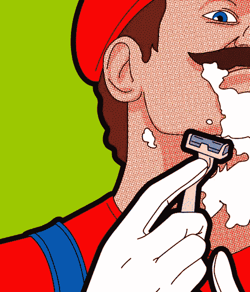
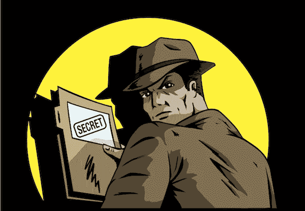

# 你生意的秘密不是秘密。

> 原文：<https://medium.com/swlh/the-secrets-of-your-business-are-not-that-secret-16afa0e02bf9>

我正在和一个远方的朋友聊他的生意。我问了一些基本的问题，比如谁制作了他的视频，谁上传了漂亮的 Instagram 照片，以及他的人才来自哪里。

他很生气，说了以下的话:

“那么，你是在问我的商业模式？”以讽刺的口吻。

我问了另一个问题，关于他是否可能知道任何好的自由职业者，他说:*“你有一个网络，不是吗？”*

这两个回答都告诉我一件事:他有一种稀缺的心态。

我不是想得到几千年前的古老秘密。我问的问题更多的是出于好奇。

# 你的生意不是秘密。

我没有对我的朋友说这件事，尽管我应该说。关于你生意的大部分事情都可以查出来。

例如，他的商业模式很容易实现。他卖课程，做咨询。你只要看看他的视频就知道了。

如果我想偷他雇佣的人，也很容易找到——但我不想。只需要在谷歌上搜索一下，再看一下他在 LinkedIn 上的关系就能找到答案。

# 囤积信息很可笑。

如果我的朋友帮助了我，那么他没有意识到的是，我可以把他带进来。他本可以作为顾问加入。我甚至可能用他的服务来帮助制作视频。

> *“囤积你的信息比把它全部扔掉损失更大”*

# 冷嘲热讽并不能掩盖你的匮乏心理。

我从这位朋友那里得到的讽刺是为了掩盖他们害怕的事实。不想分享是一个人的迹象，他可能有一种稀缺的心态来驱动他们的决定。这位朋友曾经告诉我，他们想在未来 12 个月内买房。

也许他们认为我是实现梦想的障碍，所以他们对一切都保密。他忘了的是，要在 12 个月内拿到房子，你需要努力和协作。一年之内，尝试自己做所有的事情不会让你得到一栋有白色尖桩篱笆的漂亮的新房子。

> *“通过协作将您的努力结合起来，会增加更多价值，从而带来更多金钱”*

# 错失机会的代价。

鉴于这次谈话的结果，公平地说，我不会再向这位朋友寻求帮助，并将重新考虑他们的友谊。

不是因为他们没有帮忙；因为他们拒绝的方式和他们意图背后的自私与我格格不入。

自私会让人们远离你，讽刺和过于直率是不必要的。问题是，以这种方式行事的人忘记了错失机会的代价。这是什么意思？

很简单:在未来，我可能不会再和他们一起工作，这意味着他们可能会错过很多机会。仅仅两周前，没有任何理由，我把这个人介绍给了一个新客户，因为我喜欢他们的工作。我没有要求什么，只是觉得这样做是对的。

如果再给我一次机会，我可能不会做出同样的决定。通过做出愚蠢、自私、短期的决定，你影响了你未来获得机会的机会。这粉碎了你 12 个月内买房的梦想。

# 这是秘密。

你的大部分业务都不是秘密。像中情局一样囤积你的想法和关系会给你带来你想要的相反结果。

人们记得善良、爱、同情以及你带给他们的感受。自私、讽刺和自负不会让任何人感觉良好。

做生意的秘密就是没有秘密。

*原帖*[*【Addicted2Success.com】*](https://addicted2success.com/entrepreneur-profile/the-secrets-of-your-business-are-not-that-secret/)

# 行动呼吁

如果你想提高你的工作效率，学习一些有价值的生活窍门，那就订阅我的私人邮件列表吧。你还将获得我的免费电子书，它将帮助你成为改变游戏规则的在线影响者。

[**点击这里马上订阅！**](http://timdenning.net/free-ebook)

## 这个故事发表在 [The Startup](https://medium.com/swlh) 上，这是 Medium 最大的企业家出版物，拥有 320，924+人。

## 在此订阅接收[我们的头条新闻](http://growthsupply.com/the-startup-newsletter/)。

