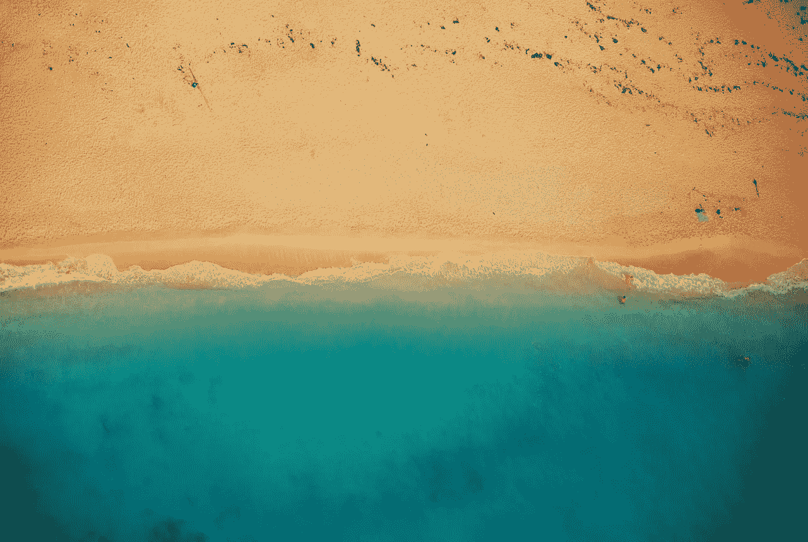

# 放下和头脑清晰的自我延续循环

> 原文：<https://medium.com/swlh/the-self-perpetuating-cycle-of-letting-go-and-mental-clarity-e46a56336c60>

[Foundry/pixabay](https://pixabay.com/en/beach-shoreline-coast-summer-shore-832346/)

三天前，我开始了为期 30 天的头脑清晰实验。这可能是我做过的最有效的个人发展练习。

这个实验并不是给我已经混乱的日常事务增加任何额外的东西。相反，这是关于[放手](https://ideavisionaction.com/personal-development/how-long-does-it-take-to-let-go/)。

我之前的 30 天实验是[减少互联网使用实验](https://ideavisionaction.com/personal-development/my-30-days-reduced-internet-usage-experiment/)。当时我并不知道，这个实验是精神清晰实验的开始。

那时候，我列了一个互联网使用习惯的清单，并在旁边写下理想的用法是什么。我完成了清单中的 90%。

**目前为止的结果**

在精神清晰实验开始的时候，我列了一个需要注意的新清单。我已经减少了咖啡因的摄入量，这对我的睡眠和情绪稳定性产生了巨大的影响。这两者都在我的改进清单上。

我已经减少了分心和每日卡路里。我的清单上还有一个项目可以进一步改进。那就是太空。

**另一个改进点**

我说的空间是指给自己更多的自由时间来恢复和思考。昨天，我又列出了一个仍然消耗我时间和注意力的习惯。

清单上有两个重要的项目。这个博客是其中之一，Steemit 是另一个。对我来说很明显，我不能同时支持他们两个。他们中的一个必须离开。

每一个习惯，个人博客和 Steemit，都可能花费和全职工作一样多的时间，甚至更多。我已经有一份全职工作了。这意味着他们中的一个必须离开。做三份工作是不可持续的。

**Steemit 与自己的博客**

斯蒂米特付钱给我。数目不多，但我得到的回报对未来是有希望的。然而，我不得不潜得更深。这不是我除了全职工作和博客之外能做的事情。

我的博客还没有给我任何报酬，但我已经发表了 120+的帖子和 100K+的文字。我已经建立了一个名单，上面有 30 多个电子邮件简讯订阅者和 300 多个媒体关注者。我知道这些数字并不多，但我是有机构建的，而不是人工构建的。

退出一个我创造了如此之多以至于可以轻易写满一本书和一些后续书籍的项目将是一个遗憾。我想完成前六个月并出版一本书，然后看看我会怎么做。

Steemit 肯定是一个有趣的项目。它有自己的挑战。也许，它会回暖，成为主流，而我此刻正在错过一个机会。也许，它的市值会不断减少，它给用户的回报也会减少。我不知道。

无论哪种情况，决定都是显而易见的。我不得不放弃其中的一个，它必须是 Steemit，因为我已经在我的博客上取得了太多的进展，现在不能退出。

那个决定是一个解放。当我花时间在 Steemit 上搜索一个值得阅读和评论的帖子时，我知道这是在浪费时间。

Steemit 上的信噪比约为 1 比 100。这是一个有趣的帖子，我可以从 vs 100 个无用的帖子中学到一些东西。这是对时间的巨大浪费，即使它承诺了金钱上的回报。

**改进决策**

思维更清晰的一个重要结果是决策变得容易。它们几乎是显而易见的。当我处于那种放松状态时，我会问自己以前怎么没发现这么明显的事情。

决策是人类生活的重要组成部分。犹豫不决不仅让我们无法在生活中取得成功，还会给我们带来很多压力。

我之前已经写过关于[决策](https://ideavisionaction.com/personal-success/from-hesitant-to-decision-maker-in-four-simple-steps/)的文章，但是现在我已经经历了一个更高的精神清晰状态，我可以说精神清晰是决策的一个关键部分。

额外的时间我要做什么？

有四件事我想花更多的时间去做。休养，反思，阅读，写我的书。

**睡眠**

恢复包括更多的睡眠。睡了一夜好觉后的一天和睡了一夜不好觉后的一天，我怎么强调都不为过。

这种差异不仅仅是身体上的，睡眠对精神表现也有很大的影响。我不能仅仅为了每天多工作一个小时而降低自己的精神状态。

> 从你睡眠中偷走的额外一小时的工作在你工作日的剩余时间里要付出更高的代价。

**倒影**

反思我的生活和未来是我喜欢做的事情。这不仅仅是思考和头脑风暴。思考和头脑风暴有它们的位置，但它们不能代替反思。

在反思中，我问自己一个问题，不主动去想。我进入一种放松的精神状态，让答案浮现出来。然后，我写下答案并付诸行动。

有时候，答案不会马上出现，而是在一天的晚些时候，当我在做一些完全不相关的事情时，比如开车。

这些答案是如此微妙，以至于当它们出现时你必须注意到，并在第一时间把它们写下来，因为你永远不知道它们会把你引向何方。

**读数**

上个月我错过的是消费优质内容。我花了很多时间阅读 Steemit 上的低质量内容来评论它们。尽管有一些有趣的东西让我学到了，但至少大部分是不值得我花时间去说的。

不幸的是，我也用 Medium 这样做过。许多操作指南中解释的想法是，你应该阅读和评论别人的帖子，尤其是那些追随者很少的帖子。

我不同意。我建立追随者的策略是在一贯的基础上写我能写的最好的内容。换句话说，我将[专注于要点](https://ideavisionaction.com/productivity/focus-on-the-essentials/)。

如果这个策略行不通，那就顺其自然吧。我不会浪费时间去读低质量的内容，去评论它，去发展我的追随者。

在我的清单上，有太多有趣的、原创的、高质量的书籍、有声读物和帖子让我想去消费。我只是不想消费比那更没意思、更没创意、更没素质的东西，不管是什么原因。

**写我的书**

正如我之前提到的，我的博客上有 120+的帖子和 100K+的文字。有一本书包含了所有的内容。

我不是指发表精选的博文。我指的是基于这些想法的一部完整的书，但是以某种方式组织起来，有一个逻辑流程。每一部分，每一个想法都建立在彼此之上，这本书从基本原理到应用都是完整的。

昨天，我对我所有的博客文章做了一个思维导图，按主题组织，这是一个有趣的练习。我可以看到这些帖子是如何围绕特定主题的，以及它们是如何被组织成一本书的。

当那本书完成并出版时，我会再次考虑这个博客，不管我是否想继续写下去。如果我想继续，我想怎么继续？

**结论**

随着我放弃旧习惯，我的头脑变得更加清晰。然后，我开始意识到在我生命中的这个时刻，其他的习惯并不适合我。放下他们也是合乎逻辑的。

参加 Steemit 和阅读内容只是为了评论，这是两个不适合我的习惯。我让他们走了，创造了更多的空间，这将有助于我的头脑清晰。

此外，我会把这些额外的时间用于更有用的事情，比如休养、反思、消费高质量的内容，以及写书。

> 我越是放手，我的头脑就越清晰。我的头脑越清晰，我就越放松。这是一个自我延续的循环。

*阅读下一篇:* [*放手需要多久？*](https://ideavisionaction.com/personal-development/how-long-does-it-take-to-let-go/) *或报名参加* [*周报*](https://ideavisionaction.com/email-newsletter/) *。*

## 这个故事发表在 [The Startup](https://medium.com/swlh) 上，这是 Medium 最大的创业刊物，拥有 303，461+人关注。

## 在这里订阅接收[我们的头条新闻](http://growthsupply.com/the-startup-newsletter/)。

