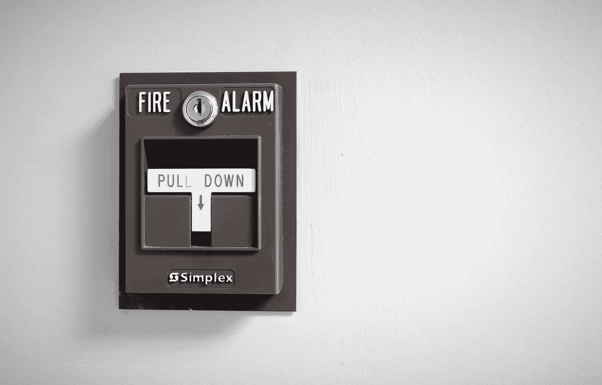

# 紧迫感陷阱

> 原文：<https://medium.com/swlh/the-sense-of-urgency-trap-232b582d3947>

courtesy Pixabay

## 减速以加速。

在我的职业生涯中，我听过无数领导者谈论“紧迫感”。这种完全主观的绩效衡量出现在评论和反馈中，在这些评论和反馈中，某人显然没有以足够的兴奋或精力做某事。

一个人如何恰当地表现出紧迫感？

通常，期望与意图并不一致。

据我所知，卓越的关键是在正确的时间以正确的方式做正确的事情。一个人是否像房子着火了一样跑来跑去似乎无关紧要。然而，出于某种原因，如果一个人对一个问题采取了慎重或谨慎的态度，并且没有表现得像世界末日一样，我们认为他们一定没有意识到这个问题的重要性或风险程度。

根据我的观察，一些最糟糕的决定来自于某人，因为害怕被贴上缺乏紧迫感的标签，疯狂地召集部队进行指挥表演，以显示这个问题有多重要，并证明他们可以火冒三丈地解决这个问题。

随后，当其他人悄悄介入，在匆忙且大多不必要的行动背后进行损害控制时，肇事者因在球上灭火而受到表扬(火仍在燃烧，但现在某个地方显然不那么紧迫)。

当领导者对问题表现出这种反应时，会将不确定性和焦虑传播给团队，这样他们也更容易匆忙得出结论和做出草率的决定。团队非但没有建立信心，反而变得更加紧张，害怕犯错。他们对领导失去了信任。

> **紧急服务提供者的期望特征列表:**
> 
> 成熟的态度。
> 
> 衡量形势并采取适当行动的能力。
> 
> 自信但同时又冷静。
> 
> 能够分散和控制有问题的情况。
> 
> 很强的沟通和人际交往能力。

(来源 Monster.com/UK)

毫无疑问，对一个问题采取漫不经心的态度或以蜗牛的速度前进是不可接受的，但在我看到这种行为特征被误用的地方，情况并非如此。所缺乏的只是适当程度的可见恐慌或反应，而其他人一定认为这相当于承诺或能力的程度。

完全有可能以适当的优先级和专注度工作，而不会变得脸色发紫或表现得好像世界末日一样。有一种正确的方式来思考紧迫感，它不涉及这些往往无效的行为和行动。

重点应该是理解、评估和行动，而不是情绪。一个人清楚而冷静地传达他们认识到了什么是危险，开始采取正确的步骤来诊断问题，并采取适当和及时的行动，一旦理解了正确的行动，就更有可能取得正确的结果。

有些人可能会比其他人更少的情绪和感情用事的话语或手势。这应该不成问题。团队欣赏在压力下保持冷静、思路清晰、行动果断的领导者。作为回应，他们更有可能自己具备这些品质，采取必要的行动，而不会带着恐慌、恐惧或报复的包袱。

另一方面，领导者可能希望不要急于评判冷静、深思熟虑地接受困难消息，并在采取行动前寻求信息和理解的团队成员。他们甚至可能开始时行动缓慢，想要确定他们正在采取的行动。这并不意味着他们不了解情况的紧迫性，他们只是想把事情做好。通常，他们的耐心最终会节省可能因匆忙失误而浪费的时间。

这个故事的寓意是明智地运用紧迫感。有时候，最好的选择是减速加速。不是每个人都以同样的方式表现出紧迫感。学会欣赏你的组织中那些深思熟虑的、安静的和头脑冷静的人，他们为最佳可能的反应创造了空间，而没有所有不必要的折腾。

谢谢你看我的帖子。让我们做这个更好的工作场所的事情。我重视你的反馈、掌声、击掌、难题等。我也被看到在推特和 T2 的 LinkedIn 上闲逛。

## 这篇文章发表在[《创业](https://medium.com/swlh)》上，这是 Medium 最大的创业刊物，有+388，856 人关注。

## 在这里订阅接收[我们的头条新闻](http://growthsupply.com/the-startup-newsletter/)。

