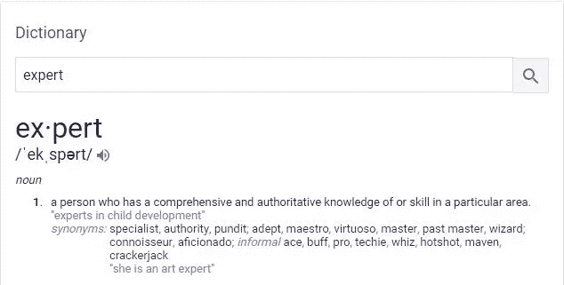
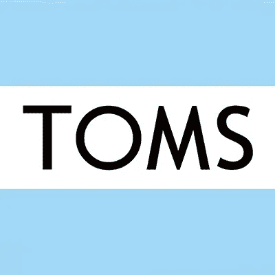
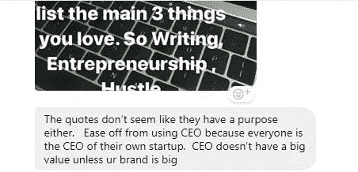

# 后现代主义的短暂终结

> 原文：<https://medium.com/swlh/the-short-end-of-post-moderns-db2bc8243f0f>

我们总是认为我们做的或说的是对的。嗯…我们大多数人！

[_ _ _ _ _ _ _ _ _ _ _ _ _ _ _ _ _ _ _ _ 点击此处收听音频 _ _ _ _ _ _ _ _ _ _ _ _ _ _ _ _ _ _ _ _ _ _ _ _ _ _](https://www.youtube.com/watch?v=tjNIneBeiN4)

我们许多来自后现代世界的人倾向于认为我们总是最好的…

或者最伟大的。

有些人甚至陷入他们自己的谎言中，真的认为他们该死，他们知道 wtf 正在发生。

不要！你不知道。

你可能有它的一部分，但你不知道所有的东西。你还有很多要知道的。

去年秋天，我在*Bikes N’Roses*做自行车机械师，在那里我学到了很多东西，但开始时，我被在那里工作多年的员工吓到了，听起来他们真的知道自己在说什么。

他们做到了。

但是，当我换班的时候，我不断走进商店，我看到那些“无所不知”的员工仍然在学习新的东西，只要他们有机会得到一些脏东西。

许多人说他们是专家(*自认为无所不知)，因为他们知道在他们声称的领域里所有要学的东西，但这真的不是专家这个词的意思。

Definition of expert

我们大多数人都搞错了(嗯，有时我自己也搞混了)。

但是专家是指在某一特定领域拥有全面而权威的知识或技能的人。

换句话说，你可以说你专门从事某项职业，因为你知道的比你需要知道的更多，而不是无所不知。

许多后现代主义者，正如我重复的那样，纠结于定义专家到底是什么以及应该如何扮演角色，但理解了它的真正含义，我们就能为社会带来更大的价值。

## 从不接受建设性的批评

如果你不接受建设性的批评，我劝你改变这种心态。

举起你的自尊，认为你的头衔很重要，或者你的钱更有说服力…

我只能说你在地球上毫无价值。

我记得我从教堂听到一个证词，有一个人很有钱，他总是承认他会给多少钱。

又有一个穷寡妇，没有什么可捐的，就把钱给了主。

据我所知，上帝已经接受了她的奉献并祝福她。他给了她更多，他没有祝福那个爱吹牛的富人。

听着同伴们—

不要到处炫耀。我也是这样开始的，这并不好。人们开始把我当成一个炫耀者。

如果你在做生意，大多数消费者喜欢买东西，因为他们知道会有很大的回报。

举个例子:汤姆。当你从汤姆商店买鞋时，他们会向有需要的人提供另一只鞋。

许多消费者认为哦，这是一个好主意，因为我不会只享受这个产品，但有需要的人也会。

但是，当消费者看到首席执行官或老板表现得傲慢无礼时，这家公司就会失去很多顾客。

当特拉维斯·卡兰尼克(优步首席执行官)不尊重他自己的优步司机时，在他做错事的视频被公布后，人们开始删除这个应用程序。

自负没有价值，只会让你的个性和事业陷入低谷，所以如果你有，就停止它。

## 一个接一个的头衔让你失去了真正的价值

我现在就在那个状态，我有很多关于这个的事情要告诉你。

当我在读蒂姆·布朗(IDEO 的首席执行官)的《设计改变》时，他谈到了标题是如何让你失去真正的意义的。

这样消化它:

想象一下，从今天开始，你将在脸书成为一名 react 本地程序员！太棒了，我们都很高兴你成功了！

现在 3 个月过去了，你是如此的优秀[马克·扎克伯格](https://medium.com/u/c79346ea7c9a?source=post_page-----db2bc8243f0f--------------------------------)觉得你应该成为脸书的首席技术官。

你的头衔从 react 原生程序员变成了 CTO。这很好。

但想象一下，2018 年大衰退发生 6 个月后，你被解雇了，脸书不想为你的职位买单，所以你辞职了，或者只是其他原因。

现在，当你回顾职位的时间表时，你从一名 react 本地开发者>脸书的 CTO >失业。

你如何定义自己？

你真的是那个 CTO 还是那个原生开发者？

你到底是什么？

你到底是什么意思？

今天一整天我都在问自己这个问题。在找到答案之前，这应该是我们都要问自己的问题。

[我的一个朋友阿里·科莱克](https://medium.com/u/50690b6abf89?source=post_page-----db2bc8243f0f--------------------------------)最近和我谈到了这件事。他说

> “不要用 CEO，因为每个人都是自己创业公司的 CEO。除非你的品牌很大，否则 CEO 没有很大的价值。”

永远不要用你的头衔或职业来定义你自己，而是用你真正的意义和你到底是谁来定义你自己！

## 谢谢你看我的文章！欢迎在下面留下评论或了解更多关于我的信息！！

## 如果您错过了我的上一篇文章:

*   [分批完成任务会带来丰硕的成果](/swlh/batching-your-tasks-brings-fruitful-results-c168b4886534)

## 关于作者的更多信息:

我今年 16 岁|是一名 Android 开发人员|文档出版公司的首席执行官|内容营销人员

*   如果你有兴趣和我一起跟进，请查看我的网站:[https://jdombele.wixsite.com/jayson](https://jdombele.wixsite.com/jayson)
*   如果你对我的 ShareMe 创业感兴趣，请查看下面的链接:[www.jdombele.wixsite.com/shareme](http://www.jdombele.wixsite.com/shareme)
*   如果你想在 LinkedIn 上关注我，请点击下面的链接:[www.linkedin.com/in/jayson-dombele-195a55155](http://www.linkedin.com/in/jayson-dombele-195a55155)
*   想要了解政治、商业、科技等方面的新闻吗？https://documentedpress.wordpress.com/

任何问题，业务查询或关注，请随时发送电子邮件给我@:jdapple4357@gmail.com

## 这篇文章发表在[《创业](https://medium.com/swlh)》上，这是 Medium 最大的创业刊物，有 289，682+人关注。

## 在这里订阅接收[我们的头条新闻](http://growthsupply.com/the-startup-newsletter/)。

