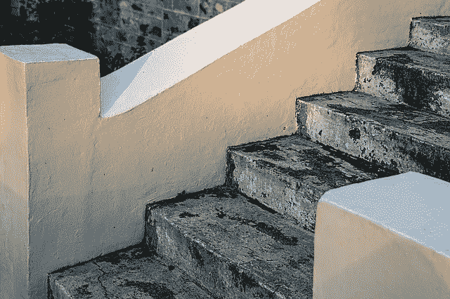

# 进步的简单公式

> 原文：<https://medium.com/swlh/the-simple-formula-of-progress-2fb11578ebce>

[stevepb/pixabay](https://pixabay.com/en/stairs-steps-staircase-upward-1241131/)

今天的智慧来自于两个不同行业的人。一个是美国亿万富翁投资者，一个是尼姑。

我们都会时不时地经历心理上的痛苦。我说的不是像严重抑郁症这样的精神障碍，而是由于未满足的欲望、挑战和失败而产生的不适。

# 如何应对疼痛

我们处理痛苦的默认方式是尽快摆脱痛苦。我们以各种方式做到这一点。

*   我们用分心来逃避它。
*   我们用酒精之类的镇静剂麻痹自己。
*   我们通过表达痛苦来行动。

一位名叫 Pema Chö drö的佛教尼姑在她的音频节目《摆脱困境》中将我们的默认反应称为“挠痒痒”。挠痒痒可以缓解当时的不适，但从长远来看，会让事情变得更糟。

# 我们的默认行为加剧了我们的痛苦

大卫·霍金斯在他的书《放手、压抑和表达》中提到了两种逃避我们痛苦的方法。

当我们压抑痛苦时，我们会用分心的事物或酒精之类的镇静剂来逃避。当我们表达我们的痛苦时，我们对痛苦的原因做出反应。可能对着家人或同事尖叫。

即使表达我们的痛苦此刻感觉很好，很放松，但它会加剧我们的痛苦。下一次我们会更加强烈地感受到它。因此，我们需要更强烈地表达它。

压抑我们的痛苦也是如此。每当我们压抑痛苦时，我们需要更大的剂量。我们需要更多的注意力分散或镇静剂，以便下次不再感到疼痛。

# 忍受痛苦

大卫·霍金斯建议我们不要压抑、表达或试图以任何其他方式改变痛苦。他称这种 [**为放手法**](https://ideavisionaction.com/personal-development/using-emotional-intelligence-to-overcome-your-dysfunctional-patterns/) 。

当你忍受这种不适时，它会逐渐消退。下一次它出现时，它就变得不那么强烈了。最终，它完全消失了。

# 进步的公式

美国亿万富翁投资者雷伊·达里奥在他的著作《原则》中将进步的公式定义为“痛苦+反思”。

> **痛苦+反思=进步**

当我们通过压抑或表达来逃避痛苦时，我们错过了反思痛苦的机会。结果，我们失去了在生活中进步的机会。这就是为什么我们最终会 [**原地打转**](https://ideavisionaction.com/personal-development/why-youre-running-in-circles-and-how-to-break-free/) ，一遍又一遍地重复同样的错误，并且一直停滞不前。

# 加速我们的进步

根据达利奥的公式，我们通过面对痛苦来取得进步，但是我们可以通过 [**走向风暴眼**](https://ideavisionaction.com/personal-development/go-toward-the-eye-of-the-storm/) 来加速这个过程。那就是接受我们舒适区之外的挑战，如果我们成功了，这将使我们受益。

# 定期反思我们的生活

每天结束时，花点时间问自己几个问题并反思这些问题是 [**一种简单却值得的做法**](https://ideavisionaction.com/personal-development/create-your-dream-life-15-minutes-a-day/) 来改善我们的生活。如今，我每天结束时都会问自己两个问题。

*   今天有什么好吃的？
*   还有比这更好的吗？

对于这两个问题，我尽量给出三个左右的答案。我承认某一天什么是好的，但也承认什么需要改进。我想我能做的就是改进这些地方。

在每周、每月、每季度和每年结束时做同样的练习也很有趣。年末是评估过去一年并为下一年制定新目标的绝佳机会。

# 结论

我们被困在生活中，因为我们逃避痛苦。我们都有不同的策略。我们有些人转移注意力，有些人麻木自己，还有些人表达他们的痛苦。每种方法都会加重疼痛，并在下一次变得更加剧烈。

治愈我们痛苦的方法是和它呆在一起，面对它，并反思它。这就是我们如何摆脱困境并在生活中取得进步。

我们甚至可以通过向风暴中心移动来加快我们的进度。这将挑战带出我们的舒适区，如果我们成功，这将使我们受益。

[***注册我的电子邮件简讯***](https://ideavisionaction.com/email-newsletter/) ***每周都会收到我关于个人发展和生活教训的最新帖子的摘要。***

## 这个故事发表在 [The Startup](https://medium.com/swlh) 上，这是 Medium 最大的创业刊物，拥有 334，853+人关注。

## 在这里订阅接收[我们的头条新闻](http://growthsupply.com/the-startup-newsletter/)。

