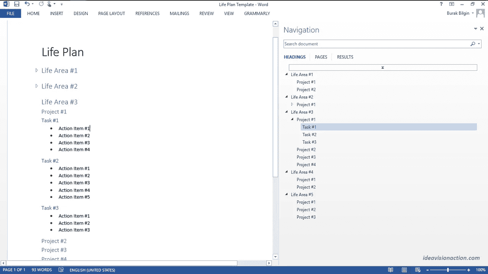

# 时间管理的简单公式

> 原文：<https://medium.com/swlh/the-simple-formula-of-time-management-f8cbb0c81fb9>

[Bru-nO/pixabay](https://pixabay.com/en/clock-pocket-watch-movement-3179167/)

你有时间管理的挑战吗？你是不是看了很多关于时间管理的书，却没有太大的进步？

如果你对这些问题的回答是肯定的，你并不孤单。在我想出自己的系统之前，我也是这样。

时间管理是一个复杂的问题

我们把时间管理当作一个简单的问题。它不是。这是几个问题的结合。我们把时间管理分成两个问题。然后，我们要把每个问题分成更小的部分。

> **时间管理=计划+意志力**

如果你有时间管理问题，你要么是计划有问题，要么是意志力有问题，或者两者都有。如果两者都有也不用担心。我也去过那里。

现在我们有了公式，我们可以分别处理每个组件。在这篇文章中，我将讨论计划的前两个部分。我准备在以后的帖子里讨论第三部分规划和意志力。

**各个击破**

把一个复杂的问题分成更小的问题，分别解决每个部分，叫做 [**分而治之**](https://ideavisionaction.com/personal-development/how-to-tackle-overwhelming-challenges-effectively/) 。这是一个有效的 [**解题方法**](https://ideavisionaction.com/personal-development/the-ideal-solution-to-any-problem/) 。

单独解决它的小部分比瞄准大问题要容易得多。当你解决了小部分，大问题就自动解决了。先说策划部分。

**策划**

我打算把规划问题分成三个部分。

> **计划=分析+优先排序+调度**

在这篇文章中，我将讨论分析和优先化部分。我将在以后的帖子中讨论调度部分。

**分析**

分析部分包括将一个大项目分成更小的任务。你可以把你的生活看作一个大项目，并把它分成几个生活领域。

*   家庭的
*   工作
*   资产
*   社会生活
*   诸如此类…

上面的列表是为了给你一个思路。每个人都有不同的清单。有些人的清单上有几个项目，有些人有很多。

我不是来告诉你如何把你的生活分成不同的部分。这是你必须做出的决定。但是我建议把你的生活分成几个区域，分别关注每个区域。

将每个生活区划分成项目

一旦你有了生活的主要领域，是时候把它们分成项目了。例如，你的工作可能涉及一个以上的项目。再次强调，分别处理这些项目。

现在，检查每个项目，把它分解成任务。其中一些任务将是一次性任务。其他人将重复任务。

> 理想情况下，你应该把每个项目划分到一个点上，这样你就可以一次完成一项任务。

**那可是很大的工作量啊！**

我能听到你在尖叫“工作量太大了！”是的，它是！但是你不必一次就做完所有的事情。此外，你不必为每一个领域、每一个项目或每一项任务去详述。

只需关注最紧急和最重要的领域、项目和任务。这已经涉及到一些优先事项。

如果你不能将一个生活领域、项目或任务划分到单次坐着活动的程度，你就无法将它们安排在某一天的特定时间段。

如果你不能安排一项任务，你就不能完成它。因此，你的 [**时间管理**](https://ideavisionaction.com/?s=time+management) 挑战将会延续下去。

> **安排好的事情，就能完成。**

**我应该使用哪种工具？**

有很多计划、日程安排和待办事项工具。对于分析部分，保持简单。使用 MS Word。

MS Word 有一些不太为人所知的功能，足以进行这样的分析。

*   使用**标题样式**将您的计划分成几个部分。
*   **折叠和展开**标题，关注您正在处理的部分。
*   使用**导航窗格**浏览标题。
*   使用**要点**记下任务。
*   如有必要，在生活区和项目之间插入**分页符**。

在导航窗格中，您可以使用以下功能。

*   在文本编辑器中单击标题可以快速访问它。
*   拖放标题。
*   提升或降低标题。
*   添加新标题或副标题。
*   展开或折叠标题或副标题。
*   调整要显示的标题级别。
*   调整导航窗格的宽度。
*   移动导航窗格。

*MS Word Life Plan Template*

**调整导航窗格的宽度**

规划的概述和细节一样重要。因此，您可以将导航页面的大小增加到屏幕的 50%。

**移动导航窗格**

我更喜欢工作空间在屏幕的左边，导航空间在屏幕的右边。如果您想尝试不同于默认设置的设置，可以移动导航窗格。

**优先排序**

这一步是计划的关键部分。在你的分析中，哪些任务比其他任务更重要？哪些任务不太重要？

在之前的帖子中，我解释过 [**艾森豪威尔矩阵**](https://ideavisionaction.com/personal-development/how-to-deal-with-an-overwhelming-to-do-list-and-overcome-procrastination/) 。艾森豪威尔矩阵是一种对任务进行分类的方法。它有两个层面，重要性和紧迫性。

优先化意味着根据任务的重要性对其进行分类。艾森豪威尔矩阵在重要性维度上有两个类别，重要和不重要。

**ABCDE 方法**

今天，我想介绍 ABCDE 方法。顾名思义，ABCDE 方法有五类。每个字母代表一个类别。

*   A.关键任务。如果不及时解决，会产生严重的后果。
*   B.重要任务。从长远来看，这项任务有很大的好处。
*   C.做得好。
*   D.委派。别人可以比你做得更便宜、更快、更好。
*   E.消除。没有好处。甚至有害。

现在，你必须检查你的计划，并给每项任务分配一个字母。

**资源**

我第一次读到 ABCDE 方法是在 Brian Tracy 的书《焦点》中。我第一次看到艾森豪威尔矩阵是在斯蒂芬·科维的《高效能人士的 7 个习惯》一书中。

ABCDE 方法关注于任务的优先化。艾森豪威尔矩阵也分支到具有紧急性维度的日程安排中。

**委托**

不要小看字母 d，它是这个系统中最避免使用的字母。有两个反对授权的理由。

1.  缺钱
2.  缺乏信任

**缺钱**

在某些情况下，缺钱是一个合理的理由，但并不总是如此。换个角度想想。

*   你每小时的工资是多少，每小时的收入是多少？
*   你要委派手头任务的人的时薪是多少？

如果你的时薪比你要雇佣的人高，那么授权是合理的。

而且，有些人完成一项任务比你更快更好。有一个人每周帮我做一次家务。他们完成任务的时间是我的一半。他们做得比我好得多。我很感激他们的工作。

**缺乏信任**

有些人什么都想亲力亲为。你不能事事亲力亲为来衡量你的生活和事业。

我在帖子里解释过， [**和尚的接客**](https://ideavisionaction.com/business/a-buddhist-monks-take-on-business/) ，员工是一个企业的四大利益相关者之一。如果你想在生活和事业上更上一层楼，你必须开始委派一些任务。

> 如果你很难信任别人，慢慢开始。开始把小任务委派给自由职业者。

提前提出明确的要求，并根据这些要求验证工作。一旦你和自由职业者建立了信任，你就可以增加你委派的工作量。

**结论**

时间管理是一个复杂的问题。可以分为两部分，规划和意志力。规划可以分为分析、优先排序和时间安排。

在分析部分，我们总结出生活中所有领域的概况。然后，我们将每个领域划分为项目、任务和行动项。在确定优先级时，我们为每项任务分配不同的优先级。

授权是时间管理中一个关键但又避免的部分。如果你因为缺钱而回避，那就把你的时薪和一个自由职业者的时薪做个比较。

如果你因为缺乏信任而避免委派，你可以通过委派小任务并跟进来建立信任。

请继续关注我关于时间安排和意志力的帖子。它们也是时间管理的关键部分。

[***注册我的电子邮件简讯***](https://ideavisionaction.com/email-newsletter/) ***，每周都会收到我关于人生经验、个人发展、写作、博客、营销、商业、创业和企业家精神的帖子。***

## 这个故事发表在 [The Startup](https://medium.com/swlh) 上，这是 Medium 最大的创业刊物，拥有 321，672+人关注。

## 在此订阅接收[我们的头条新闻](http://growthsupply.com/the-startup-newsletter/)。

