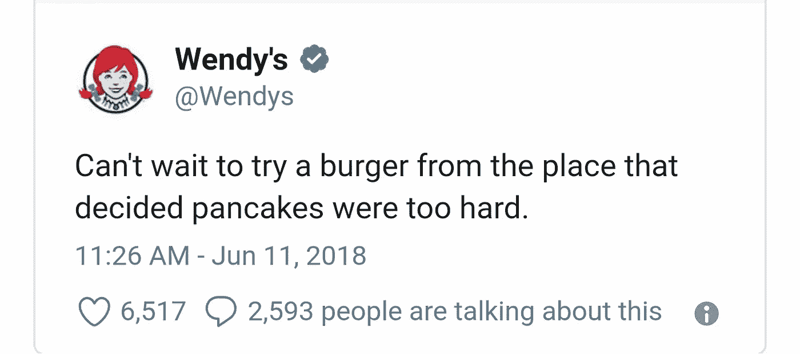

# IHOP 假改名的简单天才

> 原文：<https://medium.com/swlh/the-simple-genius-of-ihops-fake-name-change-marketing-campaign-d92d4d1301ff>

Photo Credit: www.harvardsquare.com

那天我看到 IHOP 宣布他们要“改名”，把 P 换成 B，我知道他们都在做一些事情。

我为什么在 Twitter 上关注 IHOP，这完全是另外一个故事，可能涉及一些真正的高品质大麻和我对食物的怪诞爱情。

虽然我有一部分希望 B 代表培根或核仁巧克力饼，但我读过瑞安·哈乐迪的*相信我，我在说谎*和詹姆斯·阿尔图彻的*重塑自我*等书，从我读到公告的那一刻起，我就明白了发生了什么。

在营销或广告行业中，任何人喝了一两杯酒后，或者因为不在工作而只是实话实说，他们都会告诉你——这一切基本上都是为了把你的胡扯变成一个好故事。一个让人们说话的工具，因为正如那些知道自己在做什么的广告人会告诉你的那样，很少有工具能像口碑一样为他们的目的和职业服务。

你可以在成捆的传单和广告牌上花钱，但如果它不能引起人们的注意并大胆地进入他们的谈话，它真的有什么好处呢？

正如我上面提到的两本书和 IHOP 的创意营销计划本身所证明的那样，让人们说话不一定需要花钱，尤其是在我们生活的这个时代。

IHOP 本身，用一条 tweet 启动了这个球——让我们所有人或多或少地完成剩下的工作。发送那条推文不需要花他们一毛钱，尽管我肯定他们把钱花在了推广选项上，这让他们能够接触到尽可能多的受众。但即使这样，在 30 天的时间里，他们的花费也只是单个广告牌的一小部分。

在宣布更名后的两周内，在没有透露 B 代表什么的情况下，IHOP 和 IHOB 在 Twitter 上总共被提及了 280 万次。

包括老式汉堡连锁店温迪店的这块宝石。

任何媒体都是好媒体。当你的新竞争对手无意中为你做广告时，你就做对了。

IHOP 不会无谓地花钱把招牌上的 P 换成 B——因为他们没必要这么做——主要是因为他们知道自己从未打算真的改名。

当宣布 B 代表汉堡时，它所做的只是突出了一种自 20 世纪 50 年代初就出现在他们菜单上的美国主食。IHOP 内部没有任何变化。像往常一样，只有早餐、生意和汉堡。

然而，在社交媒体上，人们正在失去他们热爱汉堡的集体意识。IHOP 触及了痛处。一个能让所有人都谈论的话题。不仅仅是在推特和脸书上，而是在全国各地的饮水机和潜水酒吧里。你的预期和潜在客户，为你做了大部分工作，甚至没有意识到这一点。

让人们说话对商业来说很重要，如果他们不出现在汉堡、煎饼或菜单上的其他任何东西，曾经在 Twitter 上流行过也没关系。那么，IHOP 的创意营销策略转化为销售了吗？

从短期来看，确实如此。AdAge.com 报告称，该连锁店销售的汉堡数量是以前的 4 到 7 倍，整个连锁餐厅的收入在 7 个销售季度中首次出现增长。尽管很多人都是为了汉堡而来——如果只是出于好奇的话——在大多数地方，煎饼的销量也在上升。

IHOP 知道再有 7 个季度销售额没有增长，因为公司是不可持续的，它必须做些事情让人们说话。它做到了，而且做得很好，花费很少。最重要的是，他们在社交媒体上制造的风暴转化为实际销售，早餐和汉堡业务都在蓬勃发展。

世界各地的公司、企业和营销主管可以也应该从 IHOP 和更名事件中吸取教训。

## 这篇文章发表在《初创企业》杂志上，这是 Medium 最大的创业刊物，有 351，974 人关注。

## 订阅接收[我们的头条](http://growthsupply.com/the-startup-newsletter/)。

