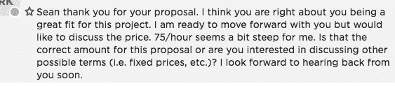
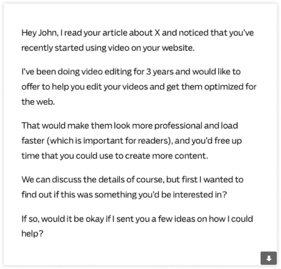

# 发展我自由职业生涯的简单“黑客”

> 原文：<https://medium.com/swlh/the-simple-hack-that-grew-my-freelance-business-b5b639ed1f8d>

Photo by [Paul Bence](https://unsplash.com/photos/KuUxlN0ZjtQ?utm_source=unsplash&utm_medium=referral&utm_content=creditCopyText) on [Unsplash](https://unsplash.com/?utm_source=unsplash&utm_medium=referral&utm_content=creditCopyText)

加里·维称之为“刺拳，刺拳，刺拳…右勾拳”，大公司称之为“品牌意识”…

但是不管你怎么看，如果你不知道如何:

# 首先建立融洽的关系

从小到大，我一直认为销售是一个残酷的过程，你把你的产品硬塞给客户…

一直努力直到他们同意。

我想我不确定为什么我会这样想，也许我只是看了太多遍《华尔街之狼》

但是没有意识到，这种心态延续到了我的自由职业生涯中，并在很长一段时间里破坏了我的成功…

直到有一天，我把自我放在一边，请了一个教练，试图找出我错在哪里。

他从浏览所有的“基础”开始，查看我的个人资料，然后是我的价格，然后是我的照片…

当他看到我的提议时，我真的觉得他的脑袋要爆炸了。

他对我的做法有一些措辞，但真正让我印象深刻的一个类比是他提到 ***我是如何试图在没有先带他们约会的情况下结婚的。***

这很难理解，因为我的目标市场是 25 岁的年轻人，但是在经历了最初的震惊之后，我开始意识到他在说什么…

在经历了一些不同的策略后，我决定接受他的建议，在出售(结婚)前建立一些融洽的关系(带他们去约会)。

# 结果立刻给我留下了深刻的印象

我对这种新方法最大的担忧之一是，我需要多长时间才能开始销售。

这时候我的资金越来越少，急需用钱，但是我的其他方法不管用…

所以我决定回到 Upwork 并尝试一下。

以前，我把求职信当成一份“建议书”，告诉客户我可以如何做他们的工作，什么时候做，价格是多少，然后问他们什么时候想开始工作…

但有了这个新方法，我决定稍微放松一下，把求职信当成一次开场白。

我没有用一连串的信息轰炸他们，也没有用销售来攻击他们，而是决定简单地向他们展示我已经阅读了他们的招聘启事，理解了他们在寻找什么，解释了我过去是如何处理类似情况的，然后就此打住…

结果呢？

令我惊讶的是，回复如潮水般涌来。

事实上，那周我不得不拒绝工作邀请，因为我有太多的回复要处理(没想到会这么顺利，所以我还是提交了很多提议)…

为了让你了解客户的反应，这是我尝试这种新方法后得到的第一个反应。

Besides attempting $75/hr on my first writing job, he loved it

如你所见，我不需要处理我所期待的冗长的独白…

因为客户已经准备好开始了，而且他非常喜欢我的“减压区”,他想马上和我一起工作…

尽管我还没有向他展示“重要的东西”(比如我的作品集或证书)。

# 如何将此应用到您的业务中

方法实际上取决于您的客户在他们的旅程中处于什么位置。

我的大部分工作都是在 Upwork 上完成的，所以客户已经确定了需求，他们已经准备好开始了…

也就是说，我通常会把求职信当作一个开场白，然后就从这里开始。

但另一方面，如果你是那些“传统自由职业者”中的一员，喜欢让事情变得困难，寻找冷漠的客户…

然后你必须采取一些额外的步骤，通常是为客户识别问题，向他们展示你可以如何解决它…并且在建立融洽关系的同时以某种方式做到这一切。

这确实是一件棘手的事情，通常需要几个月的练习，但几个月前我收到了一封来自 Ramit Sethi 的电子邮件模板，这封邮件已经被证明能够得到回复，尽管冷淡的接触不是我的专长…

我决定尝试一下，这么说吧，结果让我大吃一惊。

如果你愿意，这是模板，在他的例子中，他假设你是视频编辑:

Cold Outreach Template

# 我想说的是…

这是一种奇怪的情况，很长的路实际上是一条捷径。

我知道在自由职业的早期压力有多大，你找不到任何客户，看着你的银行账户消失…

这就使你处于攻击模式，试图马上获得销售…

但是正如我的故事所展示的那样，那从来都没有效果，实际上只会让你离你的目标更远。

**对从事自由职业开始有利可图的副业感兴趣吗？如果是这样，我已经为你创建了一个免费的迷你课程——**[**，在这里找到**](http://www.bottomlinegrind.com/free-course/) **。**

## 这篇文章发表在 [The Startup](https://medium.com/swlh) 上，这是 Medium 最大的创业刊物，拥有 276，798+人关注。

## 在此订阅接收[我们的头条新闻](http://growthsupply.com/the-startup-newsletter/)。

