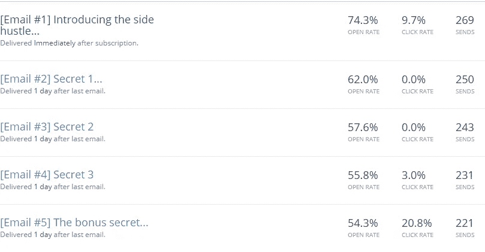

# 这个简单的调整让我的网站转化率提高了 30%

> 原文：<https://medium.com/swlh/the-simple-tweak-that-grew-my-website-conversions-by-30-eecf9ae38f66>

Photo by [William Stitt](https://unsplash.com/photos/7XNnaWIJTcM?utm_source=unsplash&utm_medium=referral&utm_content=creditCopyText) on [Unsplash](https://unsplash.com/?utm_source=unsplash&utm_medium=referral&utm_content=creditCopyText)

你认为你的网站的转换率是多少？

1%?

2%?

可能 10%？

我知道如果你在 6 个月前问我这个问题，我会说 1%让我做脏鸟…

但是学了一个简单的概念，把我的比例提高了 30%，就不再是这样了。

# 前两年我的网站…

像大多数企业家一样，当我创建第一个网站时，我认为“专业性”和“多种选择”是成功的两大关键。

我认为我的网站访问者希望看到他们能得到的所有选择，除此之外，我认为更多的选择意味着更多的机会…

这在表面上是有道理的，但是无论我写了多少博客或者我的网站上有多少访客，我都不可能获得超过 1%的转化率。

这种情况持续了几年，我最终开始认为这是行业规范，直到有一天我听 Neil Patel 说登录页面不应该有超过一个选项。

之后他给出了一堆理由，我记不全了，但有一点让我印象深刻，那就是这些登录页面应该只有一个目的…

有点像“如果你向每个人推销，你就向任何人推销”。

所以听到这个消息后，我对我的网页做了一些改动，并开始喜欢上了这些改进…

但是有一天我突然意识到,“成功”的网站并不像其他典型的网站那样设计……

相反，他们是:

# 美化登陆页面

就在这个概念击中我之后，我开始看到以前从未见过的东西。

而不是随大流，拥有看起来像 95%的其他网站一样的网站…

我的“英雄”走了一条不同的路，真的只是为他们的网站做了一个美化了的登陆页面。

为了给你一个这样的例子，看一看:

[www.clickfunnels.com](http://www.clickfunnels.com)

www.sumo.com

【www.backlinko.com 

[www.getdigitalpress.com](http://www.getdigitalpress.com)

正如你所看到的，他们不仅有一个 90%(或更多)的网站美化了的登陆页面…

但同时每个网站只有一个工作。

我什么意思？

看看点击漏斗——他们的主要目标是让你注册免费试用

看看相扑吧——他们的主要目标也是让你注册免费试用

**看看 back linko**——他的主要目标是获得你的电子邮件地址

**看看尼古拉斯·科尔** —他的主要目标是创造销售线索…

# 看到这个之后，我把这些变化应用到我的网站上

在我职业生涯的这个阶段，我对完全拥有网站感到沮丧，老实说，我只是依靠 Upwork 来寻找新客户，所以我不太关心创建一个“美化”的登录页面…

相反，我决定彻底删除我的网站，代之以一个简单的登陆页面([见这里](https://sean-meyer.mykajabi.com/p/free-course))。

起初我很担心，因为这意味着我不能再在自己的网站上写博客了，但后来我看了数据，意识到我在 Medium 上一周内获得的访问量比我在自己的网站上一年获得的还要多…

所以不管怎样，我继续前进，在 Medium 上发布了几篇博客文章，并在头两周看到了这些数字:

这已经很神奇了，但是我开始注意到我的读者也更加关注我的邮件了…

告诉我，当你真正关注你的理想客户，而不是广撒网，试图吸引任何愿意听你说话的人时，会有多大的不同。

# 我想说的是…

我仍然认为网站是重要的，并不试图讨厌它们，但我想说的是大多数网站弊大于利。

也许你不需要像我一样走极端，用单独的登陆页面替换你的整个网站，但是请记住，如果你尝试向每个人推销…

你不向任何人推销。

## 这篇文章发表在[《创业](https://medium.com/swlh)》上，这是 Medium 最大的创业刊物，有 283，454+人关注。

## 订阅接收[我们的头条新闻](http://growthsupply.com/the-startup-newsletter/)。

