# 一个可以立即改善数据可视化的想法

> 原文：<https://medium.com/swlh/the-single-idea-that-will-instantly-improve-your-data-visualizations-66f60067108a>

Photo by [Lui Peng](https://unsplash.com/@luipeng?utm_source=medium&utm_medium=referral) on [Unsplash](https://unsplash.com?utm_source=medium&utm_medium=referral)

## 信噪比:降低噪音，提升信号。

## 用易读的格式表示数据非常有用。您可能希望在讲座中分享一些发现，或者为您的软件应用程序创建一个仪表板。为此，您可以使用各种软件工具和解决方案。在这篇文章中，我想分享一些构建既有效又美观的数据可视化的技巧。你可以在任何软件中应用这些原则。

## 核心思想:信噪比

**设计数据可视化的最基本和最重要的原则是实现高信噪比。**这是什么意思？信号是您希望您的听众或读者看到并理解的原始数据。噪音是指所有不能提供额外信息的图形。**你要把尽可能多的数据放到可视化中。“嘈杂”的元素应该被带走。**

想象一下，你正在用一支笔来绘制你的数据，而不是软件。每画一条线，问问自己:“这条线对让数据更清晰有用吗？”表达方式不同:如果你将图表分解成元素(线条、形状、类型)，*这些部分中哪些对数据有贡献，哪些没有？*

一个明显的例子是 3D 的使用。Excel 仍然提供构建三维条形图的选项，尽管它不再是默认选项。3D 有什么问题？如果我们看看我们的基本原则，很明显，3D 引入了额外的元素，而没有增加新的信息。

## 噪音更小

我将用一些虚构的数字给你演示一个例子。一切都是用 Excel 2016 自带的默认模板设计的。

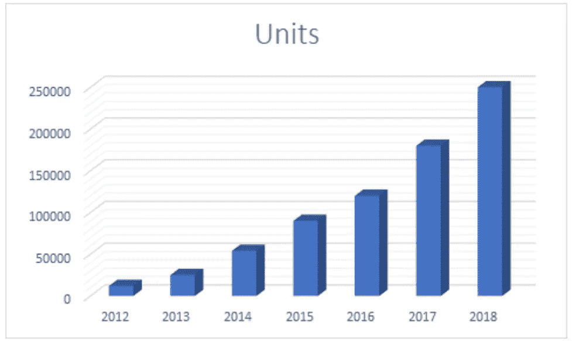

This template can be found in Excel 2016

您以前可能遇到过带有这种图形的商业演示。这不是每阿瑟坏可视化，但它有一个坏的信噪比。回到笔的比喻，有相当多的元素，我需要画出没有任何信息。

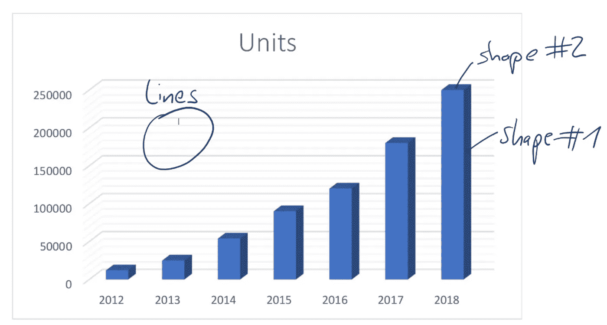

Lots of unnecessary elements

**3D 元素:填充的形状不提供任何信息。事实上，它们让读者感到困惑，因为它们引入了一个模糊的高度。**

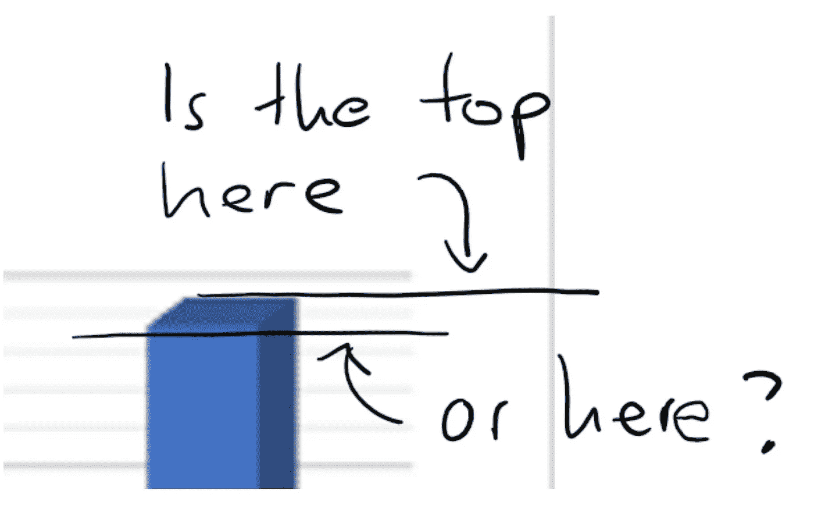

The problem with 3D charts

两边也一样:有什么有用的信息吗？只是阴影。底纹支持数据吗？事实并非如此。是噪音。

然后是背景中精心制作的网格。它支持数据吗？不完全是，但是你可以说有必要读取值。的确如此，但这不是最好的解决方案。**你的读者很懒:他们不想看图表的顶部，然后沿着线向左，然后离开线去寻找数字，然后再搜索线。对于一个简单的数字来说，这是一大堆的工作！**

让我们看看当我们实现那些东西时会发生什么。我们将踢 3D 效果和网格。

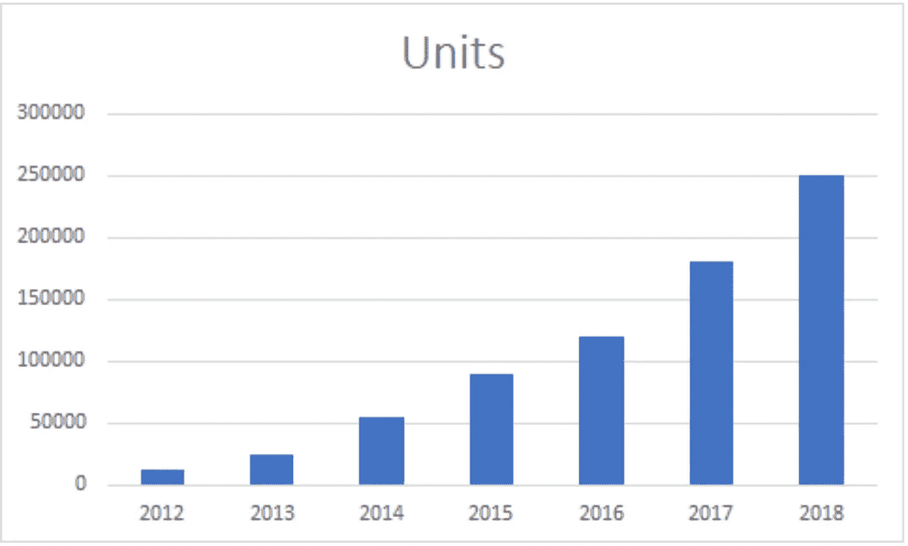

好吧，这样更清楚了。混乱的信息少了，噪音也少了。但是对于我们的读者来说，仍然有很多工作要做，尤其是找出确切的值。幸运的是，我们可以很容易地添加这些内容。

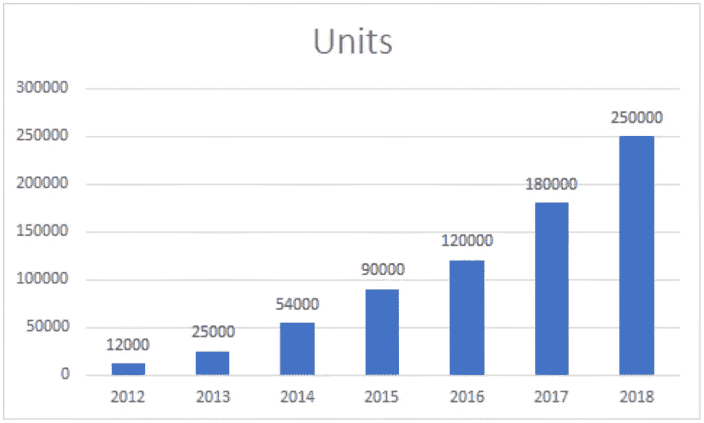

现在，我们已经把标签直接贴在条上了。我们可以去掉网格线，它们已经没有用了。

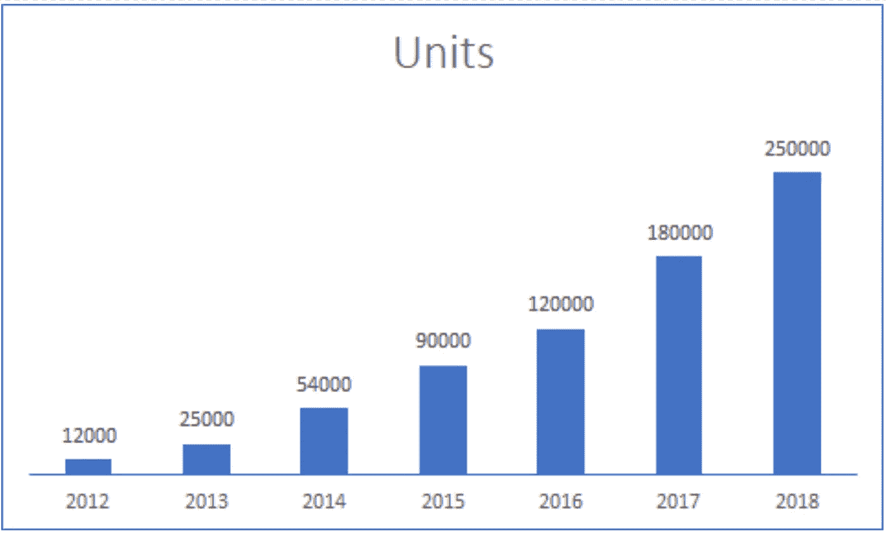

这是相当少的，已经是一个非常好的结果。我们可以对数字和条形的易读性做一些改变。条形可以更宽，数字的格式也可以不同。

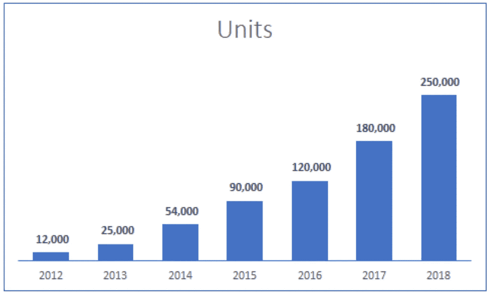

Fewer elements will increase readability

在我们通过去除不必要的元素来降低噪声之后，我们可以考虑增强信号。

第一部分是极简主义的练习:在不破坏图表的情况下，我能拿走多少？下一部分将是关于增加更多的信号。

## 更多信号

如上所述，信号是传递数据的部分。有些情况下，您可能会让图表保持原样。所有的数据都是同等重要的，所有的条形图和标签都是平等的。如果这是你想要传达的信息，那没关系。

> 在许多情况下，您确实希望强调您的数据。为什么这很重要？它到底有什么重要的？

在我们的示例中，我们希望将重点放在当前年份。我们可以通过降低其他数据的重要性和增加我们想要强调的数据的重要性来增加视觉层次。

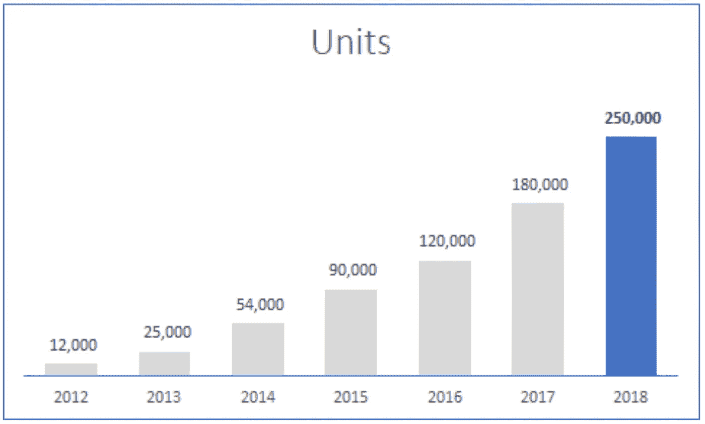

2018 will be a great year for our company.

读者应该看什么是很清楚的:唯一有颜色和粗体文本的条。这个酒吧不一样。**通过增加视觉重要性，我们增加了更多的信号。读者知道去哪里找。**

最后，我们将在标题中添加更多关于图表的信息。

Get some information in the title

**这是干净的，简约的，有很大的信噪比。一切都有目的，没有多余的。**

让我们做另一个简单的例子。我最近遇到了一个演示，它的元素看起来像这样。

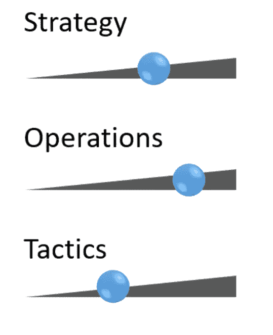

3D orbs and triangles

看起来这些元素有某种“滑块”的东西，你只是想触摸和拖动它们。问题是，这些元素没有控制功能，它们出现在演示文稿中，而不是出现在软件中。看看我们的信号和噪声核心原理，我们将如何改进它们？和以前一样，我们先去掉 3D 效果。你可以总是放弃 3D 效果，我还没有遇到过它有任何用处的可视化效果。

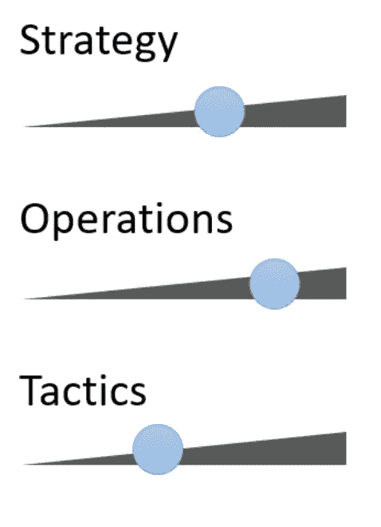

尽管如此，还是有很多噪音，尤其是那些三角形。让我们把它们做成长方形。

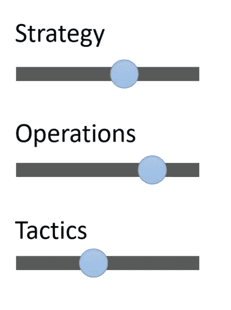

矩形要平静得多。我们仍然有两种不同的视觉形状，矩形和圆形。我们如何进一步简化它？我们所拥有的还有点模糊。这个圆占矩形的百分之几？实际上，我认为我们根本不需要圆圈，因为它不是控制元素。我们可以用一种更简单的形式来代替它——你猜对了:长方形。

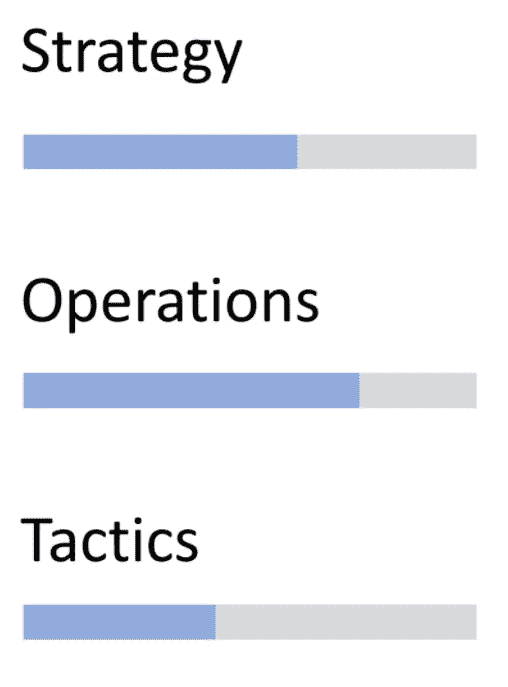

现在已经很清楚了。噪点很少，只有两个彩色矩形。眼睛将会看到它们在左侧共享相同的起点，并在同一点结束。共享基线使得比较变得容易。我将添加更多的层次，降低文本的视觉重要性，并推动酒吧更接近文本。

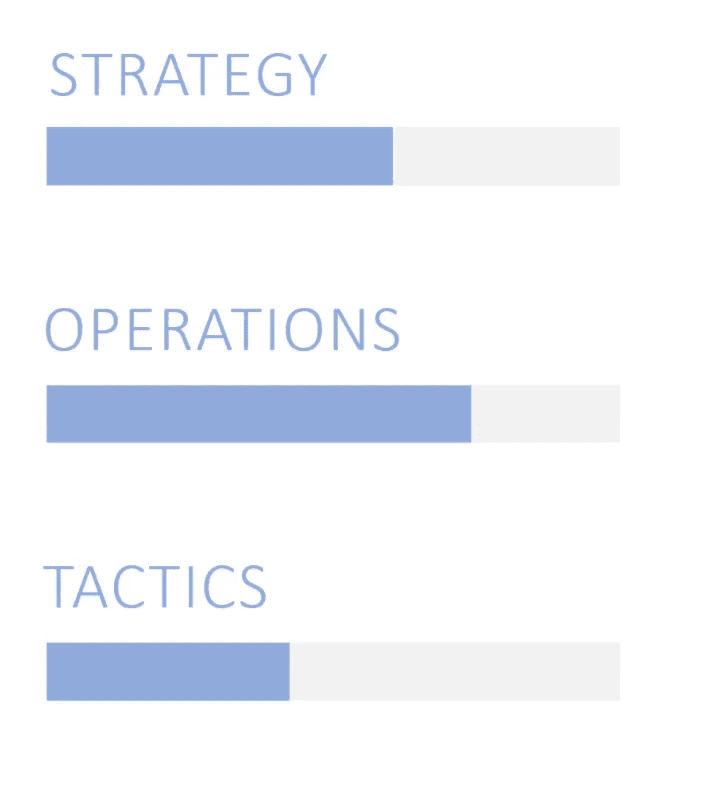

Only 2 colors, no special effects, easy to read.

我们从一个非结构化和噪音的布局到非常简约和干净的东西。

## 结论

原则很简单:让你的数据尽可能简单。

删除所有增加视觉噪音的元素和效果，尤其是 3D 效果(阴影、阴影、灯光)以及渐变。

然后，如果你需要强调一个元素，引入一个层次。

通过设置浅灰色来降低次要元素的重要性。通过添加颜色和加粗来增加焦点元素的重要性。

> 你的数据可视化将不会在好莱坞的作品中使用，它不需要爆炸，3D 和花哨的效果。它需要尽可能简单，即使这会让它变得“无聊”。但是无聊在这个领域是好的:它意味着它很容易阅读和理解。

*感谢您的阅读，如果您想要更多关于这个主题的文章，请告诉我。如果你愿意，你也可以给我发送可视化的好的和坏的例子！*

## 这篇文章发表在[《创业](https://medium.com/swlh)》上，这是 Medium 最大的创业刊物，有 301，336+人关注。

## 在这里订阅接收[我们的头条新闻](http://growthsupply.com/the-startup-newsletter/)。

