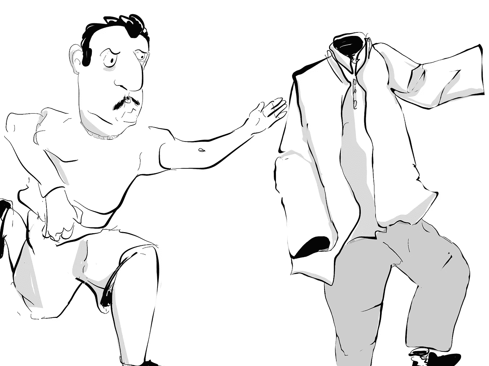

# 从初创公司到公司的缓慢漂移，以及成长的痛苦

> 原文：<https://medium.com/swlh/the-slow-drift-from-startup-to-corporation-and-the-pains-of-growing-up-3bb50eaa6a82>

Source: Lucas Amunategui

不，我不是像史蒂夫·乔布斯或多夫·查尼那样被扫地出门的创始人。我甚至不是创始人。我只是一个成功乘坐过几次并注意到一种模式的员工。这是显而易见的，真的，但每次还是让我大吃一惊…我喜欢我的老板，我根据他们有多聪明来选择我的工作。如果我不认为我的老板比我聪明，不愿意或没有时间来指导和教导我，我不会在那里工作。

我注意到的一件事是，随着公司的发展壮大，随着职业的发展，我和老板之间的关系会慢慢疏远。我怀念这种接触、集思广益和活力，但最重要的是，我怀念这种关注。但这不是抱怨或寻求帮助，这只是当你为一家成功的公司工作时事情的发展方式。另一方面，当事情出现不同的结果时，你应该感到担心。这可能意味着你在一家停滞不前的公司，或者你周围的人缺乏雄心壮志。

我曾经和以前的老板开玩笑说，我太喜欢他了，只有他解雇我，我才会离开。他做了，嗯，不是真的解雇，更多的是在经济低迷时期的裁员…我想念他。

问题的一部分是我(你没想到会这样，对吧？).我正在学习成长，在我们创造的职业文化中承担更多的责任，不管我们愿不愿意，只要花三分之一的时间。这意味着学会领导，学会指导，学会欣赏和参与我周围人的工作。每个人的职业生涯都有一个关键点，那就是不再仅仅是你一个人的事了。

我们在工作上花了太多时间，以至于不能像对待家人一样对待身边的人。现在是我扭转这种注意力需求的时候了。我该花时间和我周围的新人在一起了，那些仍在寻找自己立足点的人，那些寻求参与、集思广益并向高级职员学习的人。是时候回报了。

如果你觉得这有帮助，请分享并鼓掌——感谢阅读！

曼努埃尔·阿穆纳特吉

在[**amunategui . github . io**](http://amunategui.github.io/)和在【ViralML.com】**的 [**获得它和更多。**](http://www.viralml.com/)**

好的——注册下面我的电子邮件群，然后**我会向你发送我的免费电子书，介绍如何成为(更好的)数据科学家**(即使你对电子书不感兴趣，也要注册)。感谢阅读！！

## 这个故事发表在 [The Startup](https://medium.com/swlh) 上，这是 Medium 最大的创业刊物，拥有 358，974+人关注。

## 在此订阅接收[我们的头条新闻](http://growthsupply.com/the-startup-newsletter/)。

