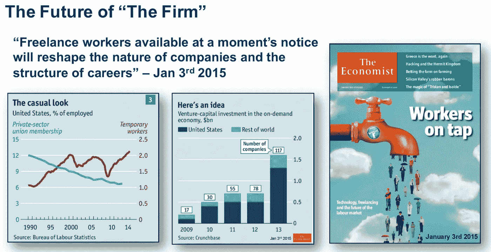

# 世界上最聪明的人不会为你工作

> 原文：<https://medium.com/swlh/the-smartest-people-in-the-world-don-t-work-for-you-46d7b69eb65d>

传统公司的日常业务听起来就像上个世纪一样。你可以众包你的品牌，你的工程，你的设计和你的业务所需的几乎所有东西，就像你可以在 AirBnb 上找到一个很好的旅行之家，而不是那个价格相同的蹩脚酒店。在[奇点大学](http://singularityu.org/)指数领导力会议上，德勤咨询公司的[Marcus killes](http://www2.deloitte.com/us/en/profiles/mshingles.html)做了一个很棒的演讲，激发了我写这篇文章的灵感。

The Economist Jan 2015 — slide by Marcus Shingles, Deloitte Consulting

千禧一代想要灵活的工作时间，他们希望能够随时随地在家里/办公室/咖啡馆工作。他们经常在正常工作时间之外工作，更喜欢自由职业，工作时间灵活，在线合作。

未来 10 年内，将有 30 亿新的思维进入网络，许多人将只在网上学习和工作，永远不会成为公司的全职员工。

经典的股权/股票期权所有权不是已经过时了吗？

当我 20 年前开始工作时，初创企业员工所有权模式还是一种新模式。大多数人只是为了工资和奖金为大公司工作，工会正在与资本主义模式作斗争，管理层为所有者做决定，非所有者的“顺从”雇员紧随其后。工会更加强大，罢工和街头抗议非常普遍(至少在欧洲是这样)。

这种创业模式现在非常普遍，如果你想在硅谷和许多其他地区创业，没有硬股权或至少是可观的股票期权，你根本不会考虑雇佣任何人。每个为你工作的人都必须拥有一些生意。就连《T4》中的脸书涂鸦男也可能身价 5 亿美元(今天是 10 亿美元？).太好了。

随着越来越多的人想在他们想去的时间和地点做自由职业者，这在未来 20 年会是什么样子？经典的创业所有权模式是正确的方法吗？

你有一个商业想法。你需要联合创始人带来你做不到的东西(对我来说，很多东西，尤其是技术，我不会编码)。你与他们分享初始股权，然后与你雇佣的每个人分享股票期权，希望他们能坚持足够长的时间，这样他们就值得你给他们的股权。他们的赌注正相反，他们希望他们拥有的公司的微小所有权将为他们为你工作的岁月买单，公司将变成下一个脸书并上市。

尽管这是硅谷的标准，但这种“员工所有权”的愿景在今天对我来说似乎完全过时了。“全职员工”会越来越少。

每个人现在和将来都应该根据他们的实际贡献获得报酬，而不是根据他们作为全职员工在公司所花的时间(授予股票期权)。

应该出现一种新的模式，可以帮助自由职业者根据需要进出项目和公司，并以灵活的方式获得补偿。开源模型是鼓舞人心的，它们用可见性、认可和自我提升来补偿最好的贡献者。

这有意义吗？还是我们将保持相同的股权/股票期权结构？你认为这些新模式会取代传统的股权分享吗？你想到了什么作为合作和创建大型项目的新方法的开端？

发表于*[**# SWLH**](https://medium.com/swlh)**(***创业、流浪、生活黑客)**

******