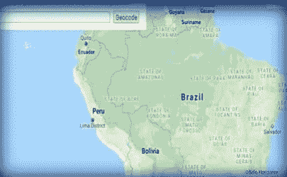

# 频谱网络| GIS 未来的独特标志

> 原文：<https://medium.com/swlh/the-spectrum-network-unique-token-for-the-future-of-gis-3c0b0b40e161>

**GIS 和频谱网络**

地理信息系统(GIS)是一个用来获取、存储、操作、分析、管理和展示所有类型的地理数据的系统。这项技术的关键词是地理——这意味着部分数据是空间的。在 GIS 数据采集方面产生了巨大的费用，包括外业工作、从中央数据中心下载数据，有时还必须手动数字化 Google Satellite Maps 提供的投影高分辨率图像的形状文件。显然，将来需要更便宜的策略来与现在已经过时的 GIS 操作方法竞争。

这就是光谱网络发挥作用的地方。基于全球最通用、最受欢迎的区块链策略，即以太坊 ERC20 标准。SpectrumTokens 弥合了数据采集和成本管理之间的巨大鸿沟。

**频谱网络项目**

通过一种称为地理编码的独特算法，SPEC 对地球进行空间编码。可以肯定地说，现在确实存在一个隐球。在这种情况下，整个地球将被完全数字化，并可以使用 Dapp SpectrumNetwork 功能提供的高级实用程序以 KML 和 KMZ 格式无缝导入几乎所有的地理信息软件。SpectrumToken 具有时间和数据消耗更少的优势，可以通过我们的 web-wallet dapp 接口轻松调用，该接口链接到 glovis 和 ESRI 服务器以进行验证，从而正确显示令牌中的 GIS 数据。通过这种方式，SPEC 可以让人们构建这样的系统，其中的数据本质上是公开的，没有人控制它，任何人都可以访问它——并且任何人都可以查看数据贡献的完整历史。

**那么，如果任何人都可以公开访问 GIS 数据，谁来支付费用呢？**

没有免费数据这种东西——“免费”的开放数据一直是通过税收支付的。所以，即使使用基于区块链的数据会花费一些钱。在未来，SPEC 将运行在它自己的区块链上，有一个 dApp UI，可以购买 SPEC 和一个更便宜的映射策略，我们将以非常非常实惠的价格提供，以 SPEC 支付。

【SPEC 提议如何实现受控价格？

通过在受控交易所上市，持有者将不得以更低的价格卖出或买入

比 SPEC 预售价。通过这种方式，代币的价值最终得以保留，保证受到监管，并将交易者的止损降至最低。"**受控交易所？"**受控制或监管的外汇不鼓励抛售和抛售，因为这是导致货币贬值的主要负面因素。

**频谱网络令牌**

Spectrum Network 是为地理空间数据管理人员和金融活动开发的，包括加密货币和菲亚特，用户可以选择买卖我们的代币。菲亚特选项仍在开发中，将在我们成功迁移到我们自己的区块链后，在我们的网络钱包和移动钱包 API 界面中启用。

**为什么是 SpectrumNetwork？**

Spectrum Network token 不仅仅是一个普通的 erc20 令牌，没有任何用途，只用于交易所的交易。与常规或传统技术相比，频谱网络令牌是效用令牌，被空间编码以弥合空间位置数据整理和成本管理之间的重复间隙。同时，使其可以作为加密货币发行和销售，可以使用当地的法定货币以及通过其他加密货币和数字银行账户购买。

**频谱网络路线图**

**令牌信息**

👉硬币算法= ERC20

👉令牌符号=规格

👉总代币供应量= 10 亿(仅流通 5 亿)

👉十进制= 18

👉烧伤=否

👉采矿=否

👉象征性价格

ICO = 0.01 美元

清单= 0.05 美元

*软帽 1500 ETH*

*硬盖 3000ETH*

**令牌分配**

**私人销售信息**

这次私人销售将只对大投资者开放。这些投资者希望长期成为 SpectrumNetwork 的一部分。这一提议附有高额奖励。

👉私人投资者将在代币购买中获得 60%的红利。这意味着购买总额将增加 60%。

👉私人投资者将获得每月 40%的独家免费分配，分配时他们的钱包中持有的任何数量的 SPEC 令牌。我们的技术支持团队将亲自验证他们所有的钱包，并适当地贷记每个钱包。

👉要购买特殊代币
,请至少发送一个以太网到官方合同地址，然后领取代币；
令牌合同地址；0x 259059 f 137 CB 9 b 8 f 60 AE 27 BD 199d 97 abb 69 e 539 b

1 乙醚= 10 万+ 6 万规格
2 乙醚= 20 万+ 12 万规格
4 乙醚= 40 万+ 24 万规格
10 乙醚= 100 万+ 60 万规格
50 乙醚= 500 万+300 万规格。

气价:100 gwei
气限:100000gwei

点击查看详情👉[https://docs . Google . com/forms/d/e/1 faipqlsck3i _ mt 3 oczx-qklr 2 iww 4-9 ratio E7 h1 fhcnkdqfqtnnta/view form](https://docs.google.com/forms/d/e/1FAIpQLSck3i_MT3OCzx-QKLr2IWw4-9rAtOiOe7h1fhCNKdQFqtNNTA/viewform)

***“规格已经在 DeltaRelay 和 Tokenjar 上列出”***

**其他待批申请:**

👉SatoExchange

👉硬币壁虎

👉密码键盘

👉共同市场资本

👉阿蒂斯·图尔巴

👉DDEX

👉以太飞行者

👉普兰德克斯

👉Forkdelta

基于光谱网络的基本思想和目的，该项目具有良好的前景。频谱网络旨在解决海量地理空间数据的存储和显示问题。通过 SpectrumNetwork，整个地球将被完全数字化，并可以使用我们的 Dapp 功能提供的高级实用程序无缝导入到几乎所有地理信息学软件中。SpectrumNetwork 令牌的其他用途支持全球不断增长的加密货币用户所面临的银行、交易和兑换挑战。我们的实用令牌可以通过 ERC20 dApp 兼容性的优势导入到基本地理信息学软件中。Web-GIS 开发人员现在可以利用区块链工程无缝地将我们的令牌用于重大项目，而不是像 Spectrum Network 那样利用大量的财务和时间资源来获取相同的数据。这个项目将会变得很大，适合投资。便宜的 ico 价格，好的团队，大的社区，在好的交易所上市，这个项目对每个人都有好处。

**SpectrumNetwork 的社交账户**

Twitter: [【HTTPS://twitter.com/spectrumtoken](https://www.google.com/url?q=https://twitter.com/spectrumtoken&sa=D&ust=1537612239305000&usg=AFQjCNGxbQmMXxyZ2XdRUXxxh0CanPa7qQ)
**【Facebook:** [【HTTPS://facebook.com/thespectrumnetwork](https://www.google.com/url?q=https://facebook.com/thespectrumnetwork&sa=D&ust=1537612239305000&usg=AFQjCNF7nkYtv9hoDIJvM0nwvSjGbx8RZQ)
****【Medium:】** [【HTTPS://medium.com/@SpectrumNetwork](https://www.google.com/url?q=https://medium.com/@SpectrumNetwork&sa=D&ust=1537612239305000&usg=AFQjCNE5aYP_UzwgvTyqvYN_WwmGR_n6Ww)

**电报频道:**** [**电报组:**](https://www.google.com/url?q=https://t.me/spectrumnetworkchannel&sa=D&ust=1537612239305000&usg=AFQjCNFX7Ef4xFpkr2gwEf-cA5AohuZQng) [【topic=4637194.msg43149859#msg43149859](https://www.google.com/url?q=https://t.me/spectrumnetwork&sa=D&ust=1537612239305000&usg=AFQjCNEuD9spM8FNhiPv7KMnXHNzf2adjQ)

**网址:**【https://www.the-spectrumnetwork.com 

个人信息:

推特:@ aricryptoker | https://www.facebook.com/aricryptoker[脸书](https://www.facebook.com/aricryptoker) |电报:@powkijan |

## 这篇文章发表在 [The Startup](https://medium.com/swlh) 上，这是 Medium 最大的创业刊物，有+ 377，008 人关注。

## 订阅接收[我们的头条新闻](http://growthsupply.com/the-startup-newsletter/)。

