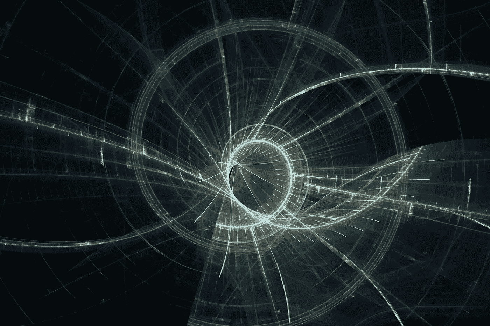

# 生命的螺旋

> 原文：<https://medium.com/swlh/the-spiral-of-life-45440891e5ed>

## 进化与重复

部分由于简单和我们的朋友辛巴、丁满和彭彭，我们总是在一个“生命循环”的背景下考虑生活。基本上，死亡以一种连续的和某种程度上可预测的方式再生生命。在我们信任的圈子里！这是最简单也是最令人欣慰的思考方式，但是“生活”和“可预测的”这两个词我就是不明白。

我们的生活，以及我们祖先的历史，是在一个螺旋的旅程中，而不是在一个圆形的路径上，随着时间的推移而进化。当然，有某种程度的可预测性(我很肯定我明天会醒来)，但除此之外，我们都很容易受到未知和不可预见的情况的影响，并且在达尔文式的适者生存自然进化中有惊人的学习、适应和剥离层次的能力。

"完美不是不再增加，而是不再减少. "东南大学

我们所知的生命更多的是一种高度脆弱的不断扩展的“一体性”。渐进和永恒的向外运动。如果你是斐波那契、黄金分割率和我们亲爱的朋友“圆周率”的粉丝，你会有同感。

随着时间的推移，我们在细胞形成和再生过程方面的生理和生物增长，以及我们的个性和关系的发展，因为它们暴露于更多的经历和更大程度的可变性，当然更符合螺旋结构。对我来说，这似乎不可能是一个循环，因为我们再也不是原来的我们了。

沿着我们创造有意义的目标的旅程，螺旋向外进入无限，虽然它看起来像一条完全稳定的线，但肯定有更多我们无法理解的微观峰、谷和障碍，但从宏观层面来看，一切都是平静而美丽的。真的很迷人。

把它应用到你的工作、人际关系或任何你遇到的事情上。虽然有时候你看起来好像在原地打转，但你仍然在前进，仍然在学习、忍耐和进步。我的朋友就是我所说的生命的螺旋。

# 令人欣慰的叙述

我们通过叙事生活，这是我们的线性思维工作、记忆和创造现实的纹理和目的的方式。在这样做的时候，我们也在寻找它，经常是强迫它或者至少是试图去寻找它。为我们自己写作和创造，反映我们所知道的，我们所期待的，我们所习惯的。

但这不是现实。这不是我们真正的叙述。真正的本土是不可强迫的，它一直在进化，由一些不同的，独特的，你以前没有读过，听过，见过的元素和经历组成。

真正的叙事是激烈的，不舒服的。很焦虑，没有安全感。这是那些紧张、空虚和沉默的奇怪时刻。比如高点和低点之间的空间。就像灰度上的无限阴影，而不是我们熟悉的调色板。我们已经接受的可能性事件和现实的边缘。舒服地麻木，就像以前一样。

但是麻木不是我们所追求的，它不是我们的本质，如果我可以建议(你可以这样认为)这不是我们在这里应该成为和经历的。

生活是变化的。无论你怎么描述它:进化过程、思维、自由意志、时间本身。这是未知的变化在我们面前和周围展开的元素，这是给我们带来一些意义的本质，否则就是一系列已知事件在我们的脑海中以重组的方式简单地重放，以我们为主角。我们到底是谁，我们到底是什么，我们的生活和叙事到底是什么，都是未知的。

我不知道它是什么或意味着什么，但我知道…我们不应该强迫它。我们不得不跌跌撞撞，随波逐流，绊倒，撞个满怀。时不时地淡入淡出，体验各种看似无穷无尽的生活之流。

我们应该尝试和观察我们所拥有的时间，并愿意继续前进，适应不断变化的潮流和环境，而不是强迫他们进入舒适和可预测的叙事。

当然，你会爱上它的。每一秒钟。

# 今天的垃圾想法

我以为这一切都结束了，然后我更进一步。

害怕选择

选择不一定是决定。如果你没有足够的信息来做一个统计上站得住脚的决定，仅仅是选择。把结果和决定分开。你总会明白的。恐惧引发恐惧。勇气产生勇气。永远紧张，因为你在乎。紧张就冲进去。愿意成为评判者，让别人来评判你和你的工作。将失败/成功与结果分开。你可以赢/输，也可以成功，只要不分别输/赢。

问与说

生活中最伟大的事情不过是提出并好奇地尝试回答一个伟大的问题？生活很简单。同样成功。“讲一个很棒的故事。”做简单的事情，然后出现。不要太担心未来和庞大的目标。

做吧，做好它

如果它值得你花费时间/注意力，那么它就值得你花费时间/精力。我们可能只有一次机会去做这件事，去做，去读，去听，去联系，所以真的去做吧。

迈克·梅普斯

他的话:不知道你的人生“礼物”？你的使命还是激情？多和牛逼的人在一起，就出来了。太多的人反而把时间花在担心别人的想法上。有数十亿美元的想法散落一地，每个人都忙着看着对方而没有注意到。

验证成瘾

我们花费/花费/浪费了多少时间、注意力和精力来消费和验证我们已经知道或同意的东西？我们最好找出对我们信念的不同意见或挑战，来建立和加强我们的深度/程度理解。找到弱点并填补它们。

## 这个故事发表在 [The Startup](https://medium.com/swlh) 上，这是 Medium 最大的创业刊物，有 286，184+人关注。

## 订阅接收[我们的头条](http://growthsupply.com/the-startup-newsletter/)。

