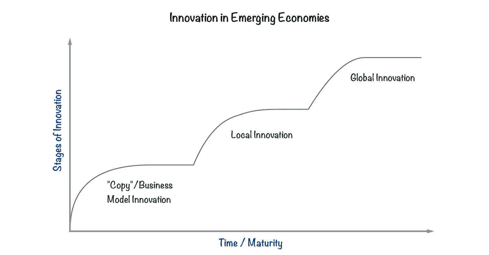
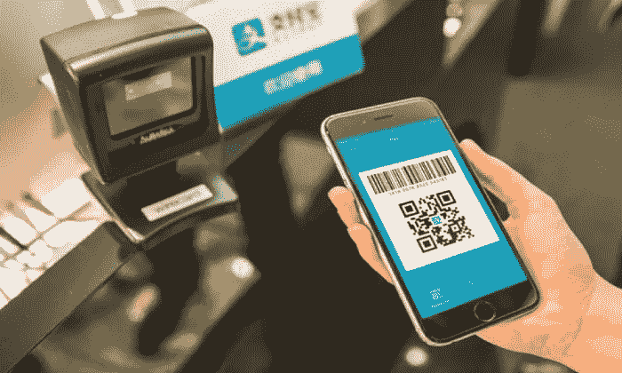
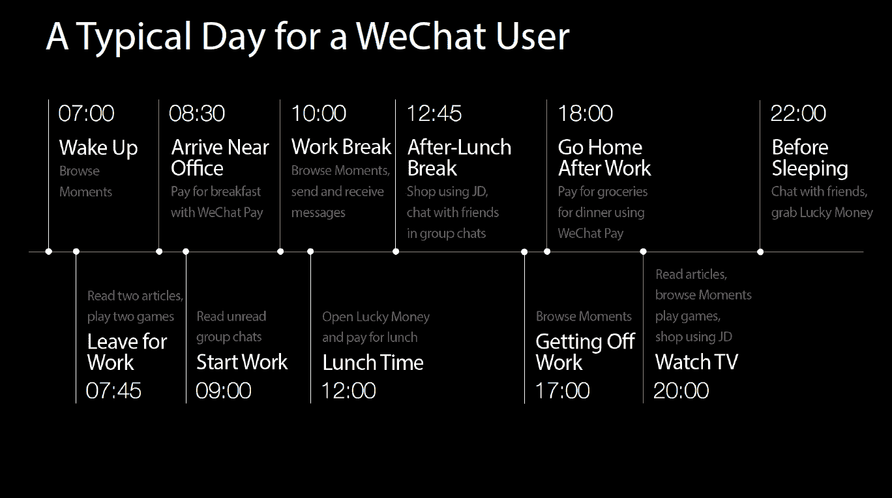

# 创新的传播

> 原文：<https://medium.com/swlh/the-spread-of-innovation-1556109a9668>

## 为什么新兴经济体不仅仅是复制

威廉·吉布森曾打趣道，“未来已经在这里了——只是分布不均匀而已”。

那么未来如何分配呢？

对此普遍持有的观点是，创新发生在西方世界，尤其是在美国，发展中市场的国家只是复制在美国行之有效的东西，或者美国的公司慢慢扩展到这些市场。

但事实真的是这样吗？新兴经济体可以不“创新”而只是复制吗？我认为这是一个非常简单和不完整的观点。

思考新兴市场创新的一个更好的方式是，按照如下所述的三个阶段绘制一条创新曲线。

*   第一阶段是复制在发达市场行之有效的东西(“商业模式创新”)
*   第二阶段是技术创新，为当地市场改进产品，并在当地市场进行创新
*   第三阶段是技术创新，打造全球产品

## 第一阶段——商业模式创新

想象你自己是一个新兴市场的企业家。你处于一个快速增长但不成熟的市场，有一套在其他国家得到验证的想法在你的国家并不存在。

很明显，追求这些唾手可得的果实比尝试一些全新的东西更有意义。

因此，第一步确实是复制，也就是说，把已经在美国或其他地方显示出一些吸引力的东西拿来，然后应用到新兴市场。

但是注意，因为涉及到抄袭，不代表没有创新。当然，这不是技术创新，但通常涉及“商业模式创新”，即根据国家的细微差别来调整商业模式或方法。

一个很好的例子就是货到付款系统，这种系统在印度等市场的电子商务中很流行。当电子商务在那里被“复制”时，企业意识到消费者主要想用现金支付。信用卡没有很高的渗透率，但更重要的是不太被信任，所以他们把“货到付款”作为一种接受支付的形式嵌入到他们的产品中。

## 第二阶段——本地创新

下一阶段是本地创新。这涉及到的是修改或建立在被复制的产品之上，以适应当地市场的独特需求。但这与第一阶段的不同之处在于，这可以被合理地归类为技术创新，并可能领先于世界上其他市场——只是它仅限于本地市场。

这种创新有时会以附加功能的形式出现。有时是全新的产品，用来解决国家存在的问题。

以阿里巴巴早年在中国所做的事情为例，当时他们面临着我上面提到的同样的信任问题。为了解决这个问题，他们创建了一个信托托管系统。这是一个产品的首次演变，后来成为一个移动支付平台，现在拥有超过 5 亿用户。移动支付现在在中国几乎无处不在，远远领先于美国等地。

以下节选自马云*内部演讲:相信明天:*

> 支付宝是怎么来的？当时，我去了一家银行，银行说‘我们不能(在网上)这么做，因为这是一种金融产品。’但如果一家中国公司不付款，一些国际公司就会来付款，我们最终会成为受害者。当我在达沃斯时，我去听了克林顿关于领导力的演讲。我突然明白了那意味着什么:大胆地做你相信的事情，做不会伤害你的国家或你的客户的事情。所以我决定去做，并投入一切。如果张先生从李先生那里买了东西，但李先生没有发货，张先生可以通过支付宝付款，如果他被骗走了 100 万元人民币，我们会补偿他 100 万元人民币。人们认为我在虚张声势，但我真的准备好了报销的钱。我们把系统设置得又好又干净，我没有拿一分钱，所以可以随时检查。那样的话，政府会想:如果你不这么做，谁会呢？

再比如腾讯的微信。最初的消息应用成为世界上第一个超级应用，现在拥有超过 10 亿用户。正如人们所料，它让用户给家人和朋友发信息，分享生活时刻。但它也允许他们点餐、预订乘车、查看电影时间、支付费用等等。这是世界上第一个大规模的超级应用，也是中国本土创新第二阶段的一个明显例子。

Source: WeChat

## 第 3 阶段—全球创新

第三阶段是全球范围的技术创新，这实质上意味着不仅在本地市场创新，而且在全球范围内创新。

顺便说一句，在阶段 2 和阶段 3 之间还有一个中间阶段(类似于阶段 2.5)，这涉及到更发达市场中的公司看到一个在当地创新的公司的成功，并看到一个在他们国家工作的机会，然后复制它(即“反向复制”)。这方面的一个例子是微信的成功，主要是在中国，这导致其他地方的消息应用程序试图扩展到其他服务，并成为像微信一样的超级应用程序。

但阶段 3 涉及真正的全球创新，即当最初处于阶段 2 的公司决定将其产品推向全球，并在全球范围内而不是在本地范围内进行创新。

举几个中国的例子来说明全球创新正在新兴市场发生，无人值守的自行车共享和短视频应用程序在中国真正起步。

中国是无站台自行车共享领域的先驱，早在其他国家真正大规模存在之前，许多初创公司，如摩拜单车和 ofo，就已经获得了牵引力和规模。随着类似的创业公司开始在其他国家兴起(3.0 阶段)，ofo 和 Mobike 也开始在国际上扩张，在欧洲、澳大利亚和美国的城市开展业务。

中国在全球创新的另一个例子是短视频应用。首先，Musical.ly 是一款中国社交视频应用，可以立即在全球范围内使用，在美国比在中国更受欢迎。看到它的成功，字节跳动“克隆”了它，并将其改编为适合中国市场的 Douyin。尽管面临激烈的市场竞争，但斗印在中国真正起飞了，现在拥有超过 1.5 亿的 dau。随后，他们还以 Tik Tok 的名字在全球范围内推出了这款应用，这款应用也在许多市场，尤其是亚洲市场大放异彩。这是 Q1 2018 年应用商店下载量第一的应用。

## 结束语

认为所有创新都发生在西方的观点已经过时，越来越多的新兴经济体正在本国创新。

此外，正如上面的例子所强调的，中国也在许多垂直领域激励西方创新(阶段 2.5 创新)，并在其他领域进行全球创新(阶段 3 创新)。随着时间的推移，他们可能会成为越来越多垂直领域的全球创新者。

其他新兴市场经济体尚未进行全球创新，大多数仍处于“复制”阶段或在本地创新。然而，我预计印度和印度尼西亚等少数几个国家会慢慢走过第二阶段，并有可能在未来成为某些领域的全球创新者。

## 脚注

我第一次接触到这个概念是在肖恩·赖因的优秀著作《山寨中国的终结》中

尽管在中国以外有一些用户，微信在全球其他国家还没有真正成为事实上的通讯应用(尽管他们在中国以外的用户群很小，主要由在中国有朋友或家人的人组成)，所以我认为就目前而言，它是本地创新而不是全球创新的更好例子。然而，这无疑是西方世界其他公司试图效仿的一种模式，但迄今为止成效有限。

公司也可能立即尝试全球创新，但这种情况更为罕见。

*感谢阅读！欢迎分享这篇文章，并写一个回应来分享你的想法。我是* [*tanayj*](http://www.twitter.com/tanayj) *在推特上如果你想进一步讨论！*

## 这篇文章发表在 [The Startup](https://medium.com/swlh) 上，这是 Medium 最大的创业刊物，拥有 337，320 多名读者。

## 在这里订阅接收[我们的头条新闻](http://growthsupply.com/the-startup-newsletter/)。

