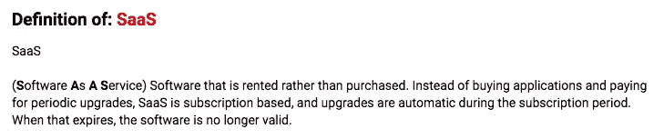
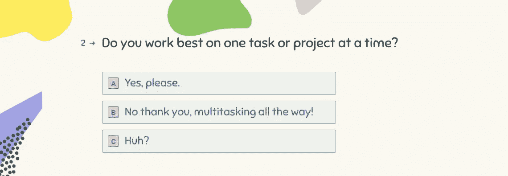
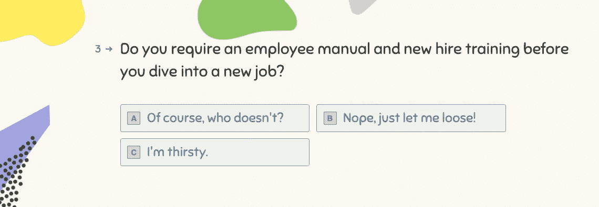
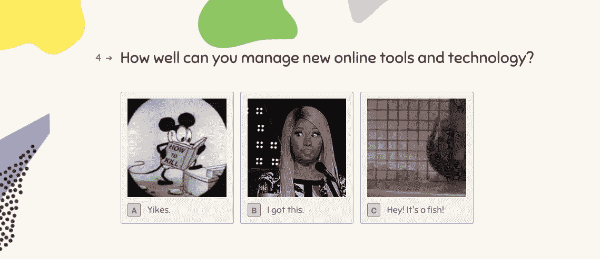
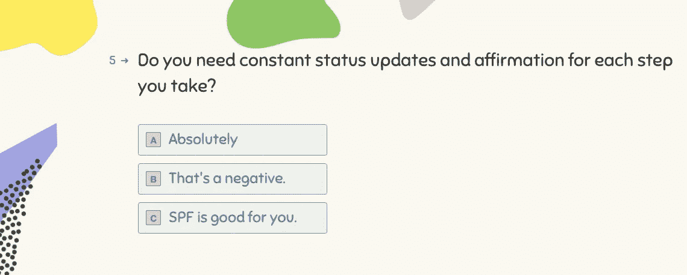
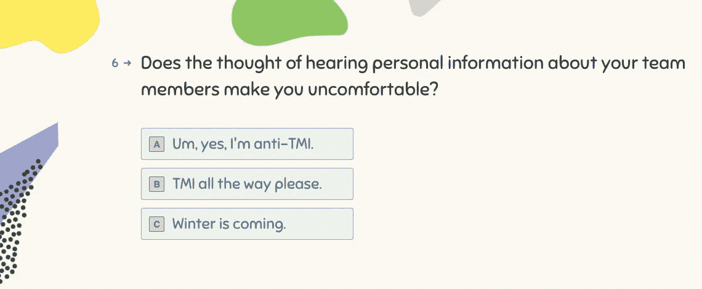

# 创业生活小测验:你认为你能 SaaS 吗？

> 原文：<https://medium.com/swlh/the-startup-life-quiz-so-you-think-you-can-saas-bbea8b68e7bb>

如果在过去的 10 年里，你曾经找工作、反省或质疑过自己的存在，那么在追求职业幸福的过程中，你可能会遇到 SaaS 创业公司的工作机会。

[https://www.pcmag.com/encyclopedia/term/56112/saas](https://www.pcmag.com/encyclopedia/term/56112/saas)
SaaS-y, not to be confused with Sassy

无论你是刚刚走出校门，还是还在课本的战壕里，或者已经进入职业生涯，有着多年的经验和伤痕，没有什么能让你为在创业公司工作做好准备**。**

不管你在和谁说话，也不管你在读哪篇文章。对于初创公司，无论是不是 Saas，都有一个简单而不可避免的事实。

大多数创业公司都会失败。

哎哟。

业内人士曾说，四分之三的人失败了，但最近这一数据上升到了十分之九——主要是因为越来越多的创新者投身创业。

## 了解你的角色，但不要放慢脚步

如果你正在读这篇文章，并且你是一名**的初创公司创始人**，那么你已经很清楚形势对你不利。你正在积极地为成为那 10%中的独角兽而奋斗。

如果你是一名求职者，一旦你克服了现实的打击，那么你有两条路可以选择。你要么尽可能远离为创业公司工作，要么你可以说，“我想为创业公司工作。”

如果你正在考虑**加入一家大公司的创业公司**，那么就支持你和你的钢珠(是的，这也适用于女性)。

从第一天起，取决于你所承担的角色，有许多因素会影响你在创业公司工作的最终成功(或失败)。

为科技创业公司工作需要的不仅仅是勇气或技能。加入一家创业公司需要考虑很多事情。

## 为了确保万无一失，请参加这个测验:

## 事实就是事实，这是创业生活的 7 个事实

我们讨论一下，好吗？

## **事实 1:如果你不想在朝九晚五之外工作，那么你就不应该去创业公司找工作。**

初创公司的工作空间本质上是随意的，因为工作中的创始人本身就是创新和创业的产物。他们不是来照看孩子的，而是在这条道路上合作，产生真正的影响。很多时候，即使在纸面上有层次，也没有明显的层次。规则是没有规则。

## **事实 2:如果你不能兼顾工作，然后再多做一些，那就不要考虑为创业公司工作。**

通常情况下，项目会被搁置，以利于新的项目或众所周知的需要扑灭的大火。某一天天空可能是蓝色的，第二天可能是紫色的，你只能跟着它跑。最好的创业公司可能会让你同时戴着几顶帽子，也许戴得太多了，以至于你的头皮永远见不到阳光。如果你不玩杂耍，那就说明事情不对劲。

## 事实 3:如果你需要一个指导者或一份手册来帮助你，那么你最好现在就结束你的创业求职。

这并不是说你不会学习或成长。相反，你会因为触手可及的 C 级管理而得到跨越式的拉伸和充实。但是你将会驾驶你自己职业发展的航船，所以如果你天生不积极，那么你的航船将会很快沉没。不要成为下一个泰坦尼克号。

## 事实 4:如果即将到来的新应用和软件平台的冲击让你焦虑和不安全，那么在科技初创公司工作可能是一个糟糕的主意。

没有人说你必须知道如何用烤面包机编写代码或组装电脑(除非这是你被雇佣的真正目的)，但你绝对应该对技术有一定程度的热情。如果除了你自己(和你的创始人)之外，你还需要相信什么，那就是你的产品。直到你获得了真正的牵引力，突破了，都是你(和团队的其他人)。

## 事实 5:如果在工作中完全自主的想法会引起恐慌，那就避开创业公司的角色。

希望在创业环境中工作意味着获得高度自主的工作。你的作品可能过了几天才被人看到，更不用说被人喜欢或讨厌了。伴随着高回报和认可的还有你彻底失败的时候。自治的工作组通过试错来完成工作，但还是完成了。

## 事实 6:如果你需要把个人生活和职业生活黑白分明地分开，那么为一家像 SaaS 创业公司这样的小公司工作不适合你。

尤其是在开始的时候，你可能会花更多的时间和你的团队在一起，而不是和你的初恋男友或女友在一起。相应地，你会听到或者看到在公司环境中通常不会看到的事情。天堂？地狱？你决定吧。

## 事实 7:如果你需要被告知去实现你的目标，那么你已经失败了。

在创业公司找到一份工作只是一个开始。初创公司的入门级工作很少见，但这并不意味着你不会一毕业就被聘用。甚至实习生也可能在实习的另一面醒来，得到一份工作邀请和一个轻松的头衔。但是在一个小团队中工作意味着所有人都在甲板上，在可预见的未来，你只需要把手放在那里。

## 那么在创业公司工作是什么样的呢？

很难。

但是为创业公司工作的好处就在那里——如果你能读懂字里行间的意思。这是一份真正由你决定的工作。

有很多初创公司在寻找人才，故事主管实际上是其中之一。一定要尽快回来看看有什么机会。

或者更好的是，给我们写封短信，我们可以讨论一下你的测验结果:

 [## 开始形成

### →

app.storychief.io](https://app.storychief.io/capture/490?source=20427) 

## 这个故事发表在[的创业](https://medium.com/swlh)上，这是 Medium 最大的创业刊物，有 338，320 多人关注。

## 订阅接收[我们的头条新闻](http://growthsupply.com/the-startup-newsletter/)。

