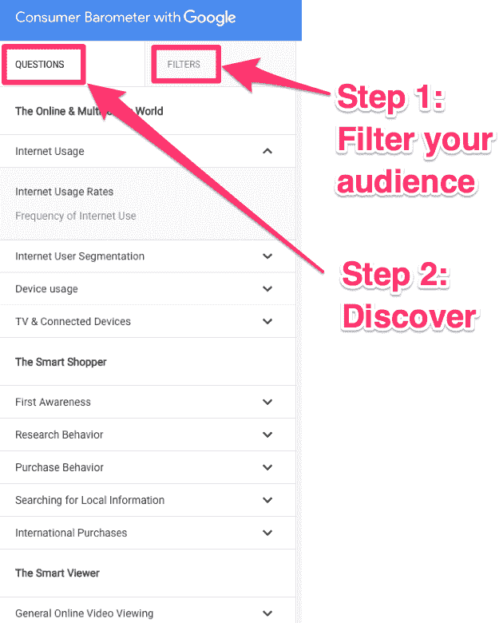
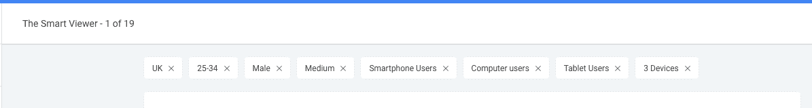
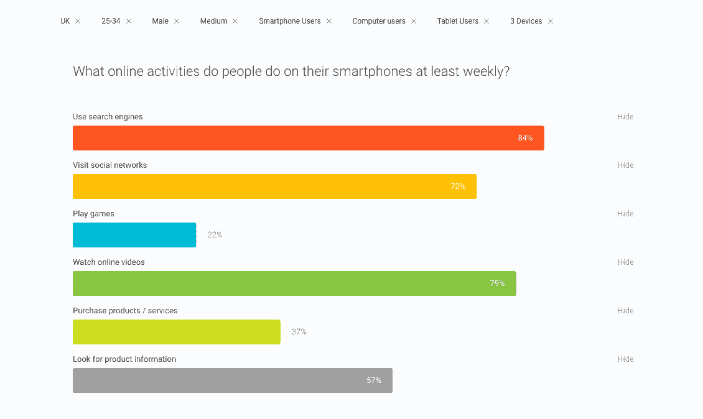
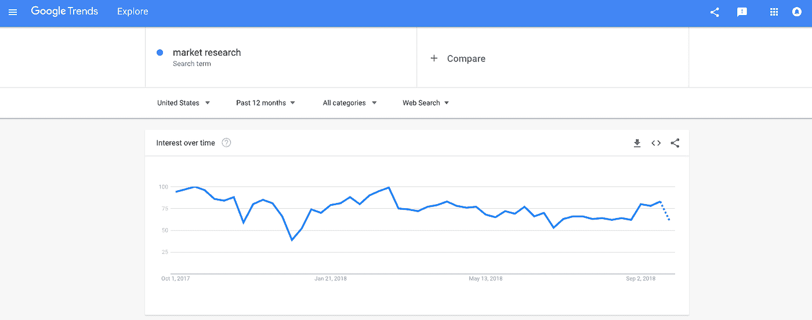
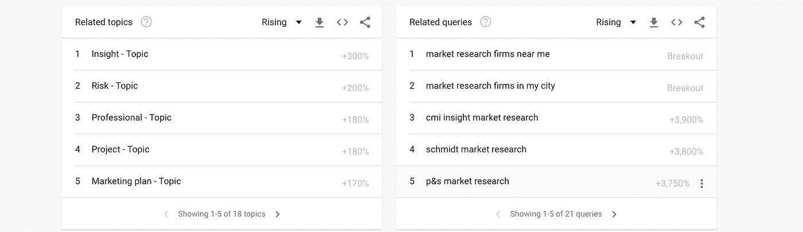
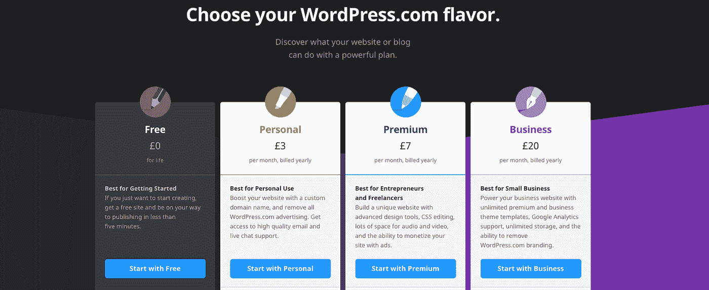
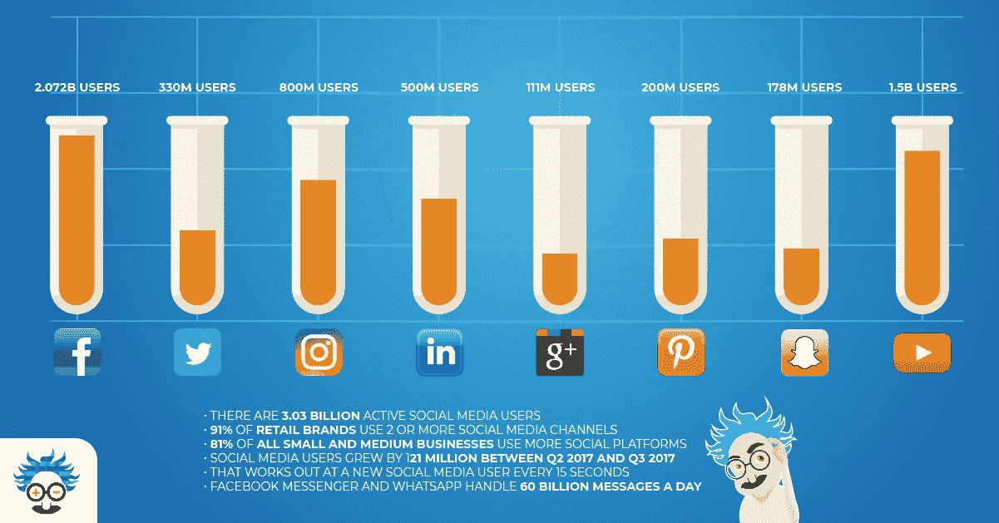

# 创业营销路线图(内置 GPS):如何从头开始制定预算和战略

> 原文：<https://medium.com/swlh/the-startup-marketing-roadmap-with-built-in-gps-how-to-budget-and-strategize-from-the-ground-up-4d0d23af1dd>

如果你参与了一个初创企业，你自己企业的创始人或个体企业家，你会明白初创企业营销策略的选择是多么广泛…

……更令人困惑的是，这些工具、渠道和策略中的大多数都将自己贴上了“**营销必备**”的标签。将这些令人迷惑的选择和少量的创业营销预算(每个企业在起步时都必须进行调整)放在一起，很可能你们中的大多数人都处于困境。

这就是为什么我创建了这个路线图(内置 GPS)。这些方向将作为任何小企业的框架，无论他们的利基或行业。

但是在我们进入数字营销的具体细节，以及如何增加你的受众和客户之前，我想把一些事情完全弄清楚:

> 成功的营销需要时间或金钱，最好两者兼而有之。

你们中的一些人可能预算不多，这很好，在这个指南**中，你会了解到你可以在哪里省钱**，我会给你指出其他文章(那将帮助你节省那些非常重要的钱)。请记住，无论你在哪里削减营销开支，你都需要投入更多的时间。

换句话说，你的预算越少，你就必须越努力工作(但这是有趣的部分！).

当你测试了这些基本的创业营销策略后，你可以优化你的营销预算，在成功的策略上花钱，减少失败的策略，因为…

… **你在有效的营销机器上投的钱越多，你得到的就越多！**

# 创业营销路线图第一步:市场研究

在你做任何事情之前，你必须了解你的目标市场和受众。这意味着研究！

你们中的许多人会认为你的市场研究阶段已经随着产品开发而结束了，但是为了恰当地营销你的业务，了解你的受众的偏好是至关重要的。

在我们的创业营销路线图的这个阶段，你只需要找到正确的信息输入到 GPS 中。如果你不知道你的目的地、途经地、路线偏好(最快、最短、最省油)或你路上的潜在交通，你将到达某个地方，但几乎肯定会是错误的地点和错误的旅程。

首先创建一个 [***客户形象***](https://www.einsteinmarketer.com/customer-avatar-target-market/) ，并将其转化为更详细的战术分析，用于制定战略。

换句话说，考虑你的完美目标客户，并据此创建一个虚拟形象，研究这个虚拟形象，直到你对他们最常用的媒介、他们的信任点、他们的决策影响力、他们一天中有空的时间、他们最大的痛苦、他们的目标……一切都有了清晰的了解……

…这一点非常重要。你越了解你的目标市场，你的营销策略就越有成本效益。

例如，知道你的目标受众使用 [*LinkedIn*](http://linkedin.com/einsteinmarketer) 是很好的，但更好的是知道他们最常使用 *LinkedIn* 是在周三上午 7:30-10 点之间。这种详细的知识是优化你的营销预算(时间和金钱)的最佳方式。

进行市场调查可能会很昂贵，尤其是如果你把这项工作外包给一家专业公司，但是如果你预算紧张，想尽可能地省钱，我有一些建议:

# 客户头像

相信我，从对目标客户的详细描述中，你会震惊于你能学到什么样的策略。

为自己准备一份我们的 [*客户头像工作表*](https://www.einsteinmarketer.com/customer-avatar-target-market/59711_einsteinmarketer_020317-2/) 。至少花一个小时填写。尽可能深入地描述你的目标市场的一切！

# 消费者晴雨表(与谷歌合作)

这个工具是免费的，每个人都可以使用，并且有大量非常有用的信息，特别是对于处于营销活动研究阶段的企业。

[***消费者晴雨表***](https://www.consumerbarometer.com/en/) 是我建议你们所有人查看的东西，以便更好地了解顾客对数码产品的看法及其购买流程。

使用 ***过滤器*** 选项来定位关于您的客户头像的信息。浏览消费者晴雨表中的所有选项，不要忽略任何东西！如果你认为某件事不重要，它可能会在以后花费你大量的时间和金钱。谈到互联网使用和用户行为，你应该相信谷歌。他们对此略知一二。

为了确保您正确使用这个神奇的工具，我将通过一个例子来说明。

因此，假设我的目标市场在英国，年龄在 25-34 岁之间，主要是男性，中等收入，拥有 3 种设备(手机、电脑和平板电脑)，他们不是父母，他们最近的网上购买是书籍/DVD，他们最喜欢的业务类别是旅游…

…我会使用过滤器菜单来定位所有这些。

现在我已经把信息缩小到我的目标客户，我要尽可能多地了解他们。因此，我会转到“问题”选项卡，选择一个问题，在这种情况下，*“人们每周至少在智能手机上做些什么在线活动？”*

然后，我可以使用这些数据来制定更具成本效益和针对性的营销策略。例如，看看上面的结果，我的目标受众将搜索和观看视频作为他们最喜欢的智能手机活动。如果我想通过这种设备向他们营销(我的另一项研究告诉我，这种设备在这个市场领域越来越受欢迎)，我必须将搜索和视频纳入我的战略。

虽然客户晴雨表不如对你的目标客户进行市场调查那样强大(这通常需要大量的金钱和时间，或者两者兼而有之)，但对于预算较少的初创企业来说，这是一个很好的起点。

# 谷歌趋势

一个简单却非常有价值的工具，由 Google 开发。就像消费者晴雨表一样， [***趋势***](http://trends.google.com/) 是免费的，但它不是提供关于你的目标市场行为的信息，而是显示某些关键词的搜索量趋势。

这意味着，你可以发现人们是否在搜索与你的商业理念相匹配的关键词，并且你可以查看“相关搜索”。

通过这项研究，你可以更好地了解为什么人们会在你的领域搜索，甚至更好地了解他们在寻找什么(这通常会引导你找到你的目标受众正在试图解决的问题)。

留意上升趋势！如果你在曲线成长之前发现了它，它可能会推动你的创业更上一层楼。

# 调查

最古老、最传统、也可能是最好的市场调查形式是可信调查。

没有比这更好的方式来获得特定问题的特定答案。

这些都很昂贵(在时间和金钱上)，而且让人们参与进来也很困难(人们不喜欢做一些不劳而获的事情)，所以你要么变聪明，要么花钱。

如果你真的付不起这种老派研究的费用，为什么不创建一个折扣，让潜在客户或现有客户在完成你的调查后得到。

试试像 [*SurveyMonkey*](https://www.surveymonkey.co.uk/welcome/sem/?iv_=__iv_p_1_a_1402109516_g_58134154794_c_269087241027_k_survey%20monkeys_m_e_w_kwd-307993045135_n_g_d_c_v__l__t__r_1t1_x__y__f__o__z__i__j__s__e__h_9044987_ii__vi__&cmpid=&cvosrc=&keyword=survey%20monkeys&matchtype=e&network=g&mobile=0&searchntwk=1&creative=269087241027&adposition=1t1&campaign=60_Shared_Google_UK_English_Search_Brand_Alpha&cvo_campaign=60_Shared_Google_UK_English_Search_Brand_Alpha&cvo_adgroup=&dkilp=&cvo_creative=&utm_source=adwords&utm_medium=ppc&utm_content=269087241027&utm_adgroup=58134154794&utm_term=survey%20monkeys&utm_bu=Core&utm_network=g&utm_campaign=1402109516&gclid=Cj0KCQjw3KzdBRDWARIsAIJ8TMR7JGihrzg4ysO-zjKEIaWpiMzjMAtrcnoixDZGrjkUIpZgdEUH-ewaAsBmEALw_wcB) 这样的服务，他们为基本账户运行一个免费程序(可能就是你！).

# 创业营销路线图第二步:网站

你**绝对不能在**上妥协的一件事，就是你的网站。如果你想在数字营销的任何地方获得*，你必须拥有并控制自己的网站。*

*你可能听说过，只使用社交媒体资料就可以在网上开展业务，或者在像 *Medium* 这样的网站上发布内容就足够了…*

*…不是的。*

*当你依赖一个网络或任何其他形式的外部内容托管网站时，你是在把你的信任放在别人的手里。这可不好。你想掌控一切。如果他们做了更新，或者改变了他们的服务条款，或者做了任何对你有负面影响的事情，你只能怪你自己。*

*不仅如此，你并不真正拥有和控制网站上最重要的资产，流量。*

*这些访问者来查看你的初创企业的数字档案，当你拥有自己的网站时，他们的价值**是**100，000 倍！(稍后我会解释原因！)*

*所以，无论你做什么，确保你购买和控制你的网站！这会花钱，但这是不可避免的。如果拥有自己的网站花费了你很大一部分预算和时间，那就这样吧。值了。*

*说到网站主持人和建设者，我建议选择 [*WordPress*](http://wordpress.org/) ，或者如果你正在开一家网店，选择 [*Shopify*](http://shopify.com/) 。*

**

*Shopify 和 WordPress 都有不同的月付费套餐，我建议不要选择最便宜的。等你想规模化的时候你会后悔的。慢慢来，研究每个包的特点，找到最适合你的创业和最适合你的目标市场的功能。*

*如果你不擅长建立自己的网站，那就去 fiverr.com*雇一个便宜的自由职业者来帮你完成这项工作吧！**

# **创业营销路线图第三步:社交媒体**

****

**我知道几乎每个人都会鼓励你专注于一个社交媒体渠道(或所有渠道)，但我希望你忽略这一点。**

**当你开始创业时，在**的两个**网络上开始你的社交媒体之旅。不多不少。二是完美的数字。**

**在这一点上，你可能希望我一口气说出你必须使用的确切网络，然后解释为什么你必须使用它们，但是我不能…**

**…因为除了一个共同点之外，每个人的答案都是不同的…**

# **必备网络**

**无论你的行业、产品、品牌、产品、个人偏好如何，你绝对必须有一个 [***脸书页***](http://facebook.com/einsteinmarketer) 供你创业(尤其是创业营销)。**

**脸书是迄今为止世界上最大的社交网络，每月活跃用户超过 22.3 亿，我敢肯定，无论你的位置多么小，你的观众都在那里！**

****顺便说一句:**没有比[重新利用你已经拥有的社交媒体](https://www.einsteinmarketer.com/repurpose-content-social-media/)更简单的方式来创造内容了。**

**更重要的是，对于调查新人和新企业的人来说，脸书几乎被视为一个社会证明资源。如果你想调查一个人或一家公司，你要做的第一件事就是搜索脸书。确保人们在寻找你的时候找到你。你不能推销看不见的东西。**

****

**脸书也是世界上第一或第二(取决于你问的是谁)最有效的广告平台。在营销之旅的某个时候，你会想要利用这一点。所以，你越早有侧写越好。**

**当你建立了一个商业页面，分享这个页面并试图获得尽可能多的喜欢，使用我们的指南， [***如何不花一分钱获得脸书商业页面的喜欢***](https://www.einsteinmarketer.com/facebook-page-likes/) ，最大限度地发挥你的努力。**

# **你的第二个网络**

**你必须给你的社交媒体档案最大可能的成功机会，为了做到这一点，你应该只专注于另一个平台(脸书之后)。**

**我不能告诉你确切的网络应该是什么，这取决于你的业务，更重要的是，你的目标受众。只要确保你的目标是一个大的网络，作为你的市场聚集点。**

**用你的研究来决定哪一个网络是最有效的。这是一个至关重要的决定，不是你可以随意猜测的。**

**我建议选择以下三个中的一个作为你创业营销的第二网络:**

**[***–insta gram***](http://instagram.com/einsteinmarketer)**

**[***–推特***](http://twitter.com/einsteinmktr)**

**[***–领英***](http://linkedin.com/einsteinmarketer)**

# **第 1 部分到此结束…**

**我开始写这篇文章时并没有想到它会成为一个多部分的系列，但这就是我将要做的。**

**不要担心，当我完成下一部分时，我会用这篇文章的其余部分更新这个页面，所以**收藏或标记它**，或 [*关注我们*](http://facebook.com/einsteinmarketer) 了解这篇文章其余部分的更新…**

**…或者继续查看，不会花很长时间，我保证！**

**到目前为止，我们已经完成了数字营销工作的基本设置，从第 4 步开始**我们将深入研究战略**，我还有更多**你不能错过的宝贵资源**(以及大多数初创公司浪费预算的所有东西！)**

**当你在等待我们的创业营销路线图的第二部分时，请查看一下 [***如何在不花一分钱的情况下获得脸书页面的喜欢***](https://www.einsteinmarketer.com/facebook-page-likes/) ，或者了解更多关于如何从 [***Instagram 标签***](https://www.einsteinmarketer.com/instagram-hashtags/) 中获得最大收益的信息。**

****

## **这篇文章发表在 [The Startup](https://medium.com/swlh) 上，这是 Medium 最大的创业刊物，拥有+ 372，390 名读者。**

## **订阅接收[我们的头条](http://growthsupply.com/the-startup-newsletter/)。**

****