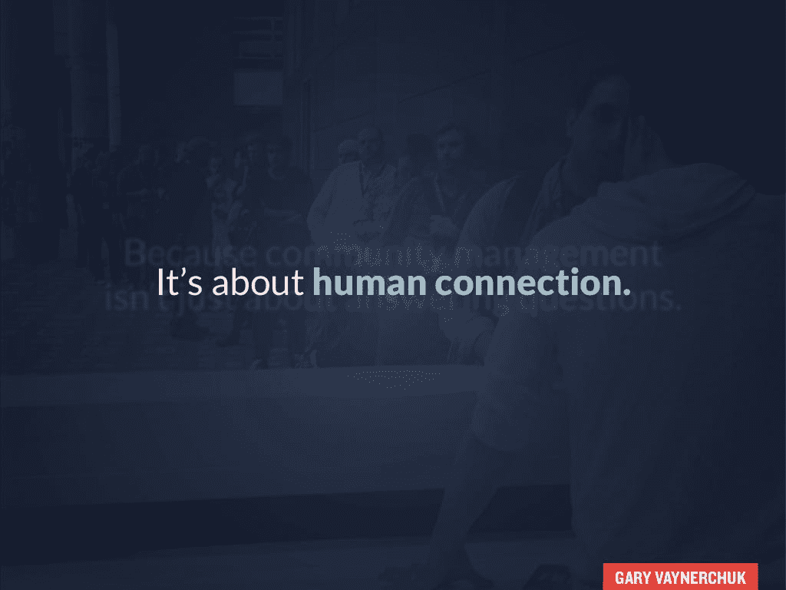

# 这家初创公司的指南是如何充分利用在脸书度过的“美好时光”

> 原文：<https://medium.com/swlh/the-startups-guide-to-making-the-most-of-time-well-spent-on-facebook-18c242be3ada>

Facebook and Instagram will now offer tools for users to manage time.

扎克已经发誓遵守他的诺言。脸书发布了新工具来管理你在脸书和 Instagram 上的时间。作为一名消费者，这可能意味着对这些平台的使用更加*有意*。

然而，对于像你这样的初创公司来说，这意味着你的品牌有机影响力的进一步下降。

随着科技界继续就“时间花得值”展开辩论，是时候让像你这样的小企业主明白它的含义了。

今天，让我们揭开“时间花得值”的帷幕，看看它是如何影响新闻提要的。然后，我将分享创业公司可以实施的五个策略，以充分利用这些变化。

## 解码“花得值的时间”

2013 年，设计伦理学家 Tristan Harris 创办了非营利组织“[时间用得其所](http://humanetech.com/)”该计划的目标是塑造技术，让我们过得更好，更有意义。

他强调了社交媒体平台是如何无意识地引诱我们在他们的平台上花更多的时间。

在它获得大量关注后，2018 年 1 月，扎克伯格[承认了这个运动](https://www.facebook.com/zuck/posts/10104413015393571)。他宣布，他今年的重点是让我们花在脸书的时间物有所值。

现在，让我们进入伤害的部分，好吗？

扎克伯格先生透露，来自企业的帖子阻碍了人们在脸书的体验。

“但最近我们从我们的社区得到反馈，公共内容——来自企业、品牌和媒体的帖子——正在挤掉让我们彼此联系更多的个人时刻。”

他接着说，他的产品团队现在将如何关注有意义的互动。从本质上讲，商业、品牌和媒体页面都需要让路。

> “随着我们推出这项服务，您将会看到更少的公开内容，如来自企业、品牌和媒体的帖子。你看到的公共内容也将遵循同样的标准——它应该鼓励人们之间有意义的互动。”

对创业公司意味着什么？

如果你的品牌页面倾向于给你的粉丝提供被动的体验，那么脸书将会惩罚你。

不过，别担心。

这里有五种方法可以在新闻提要中成功地通过新的“花得值的时间”算法。

## 在不断变化的脸书新闻中获得知名度的 5 个简单营销策略

脸书有 20 亿用户。如果你在这个平台上找到了自己的路，那么对于像你这样的初创公司来说，仍然有巨大的价值。这里有一些方法可以让你适应脸书算法的最新变化。

## 1.放弃交战诱饵战术

你是那些引诱粉丝评论并对更新做出反应的企业之一吗？

类似于“如果你是一个史努比狗爱好者，就像这样。”

Engagement bait tactics no longer work…

另外，你有没有引诱你的追随者帮他们的朋友添加标签，并在你的更新上评论“是”呢？

嗯，坏习惯很难改掉。

脸书已经停止了这样的战术。

如果你继续使用它们，那么你的页面将会从新闻提要中被降级。

现在:

你需要通过与用户分享相关的故事来鼓励有意义的对话。所以集思广益，想出激发**真实参与**的点子。

一个很好的例子是《等待但为什么》的每周餐桌对话。他们号召他们的社区公开讨论他们可能感兴趣的话题，比如“普遍基本收入”。

Wait But Why dinner table on universal basic income…

尽管他们在自己的网站上使用链接帖子更新来邀请他们的粉丝，甚至他们的[脸书帖子](https://www.facebook.com/waitbutwhy/posts/new-dinner-table-is-universal-basic-income-a-good-idea-how-about-in-the-future-w/1219859794729586/)也看到了深入的评论(如下图所示)。

Snapshot of the in-depth comments on the dinner table

## 2.请求你的超级粉丝“先看看”邀请他们加入你的脸书小组。

你所有的追随者并不平等。一方面，你有固定的粉丝，他们偶尔会看到并喜欢你的内容。

然后，你就有了“超级”粉丝。他们会热情地关注和参与你发布的每一个更新。你可以把他们想象成凯文所说的“[真正的粉丝](https://kk.org/thetechnium/1000-true-fans/)”，他们会购买你创造的一切。

1,000 true fans illustration…

在脸书，你可以要求你的超级粉丝将你的页面标记为“收藏夹”这确保了当你在你的页面上发帖并参与更新时，他们会得到通知。

为了确保你的超级粉丝永远不会错过更新，你可以告诉他们如何标记“先看”这里有一个社交媒体审查员的视频，展示了这一功能的实际应用。

接下来，引导超级粉丝热情的一个好方法是将他们连接成一个紧密团结的社区。

脸书甚至为你提供链接一个组到你的页面的选项。事实上，扎克伯格先生提到，新闻提要将会看到更多来自群体的更新。

> “您将看到的第一个变化将是新闻订阅，在这里您可以从朋友、家人和群中看到更多信息。”

因此，建立一个团体并邀请你的“超级粉丝”加入是有意义的。在小组中，你可以就与你的品牌产品密切相关的受众兴趣展开常规对话。

记住，你建立这样一个社区的目标是[鼓励人际关系](https://www.slideshare.net/vaynerchuk/140722-human-sideoncm?ref=https://cdn.embedly.com/widgets/media.html?src=https%3A%2F%2Fwww.slideshare.net%2Fslideshow%2Fembed_code%2Fkey%2F4kYG01fUu6GNio&url=https%3A%2F%2Fwww.slideshare.net%2Fvaynerchuk%2F140722-human-sideoncm&image=https%3A%2F%2Fcdn.slidesharecdn.com%2Fss_thumbnails%2F140722-humansideoncm-140728123103-phpapp01-thumbnail-4.jpg%3Fcb%3D1422371523&key=a19fcc184b9711e1b4764040d3dc5c07&type=text%2Fhtml&schema=slideshare)(正如加里·维所说)。

2017 年，尼拉杰·乔希(Neeraj Joshi)成立了一个简单的脸书团队 [Pushstart](https://www.facebook.com/groups/Pushstarter/) 。几个月内，它成为印度[最活跃的创业社区之一](https://hackernoon.com/how-i-built-the-most-active-startup-community-of-india-dfd83e8fe687)。当我向他询问参与人数时，他说 86%的小组成员每月都很活跃。

86% of total Pushstart members are monthly active!

为你的团队找到最初的贡献者是一项挑战。然而，如果你一直积极地与你的成员互动，寻求反馈，并倾听他们的意见，你就会找到最佳时机。

下面是 Pushstart 创始人 Neeraj Joshi 关于建设繁荣社区的头号建议。

> “提供足够的价值，这样口碑才会产生。让人们更容易与朋友分享你的社区，并相应地激励他们。”

事实上，作为一家初创公司，你应该[做不可扩展的事情](http://paulgraham.com/ds.html)。为你的品牌创建一个脸书档案并利用它来获得反馈，这并不是一个完全坏的主意。

音乐社交网络应用 [Mudzic](https://play.google.com/store/apps/details?id=com.editsoft.ansh.mudzic&hl=en) 遵循了这一策略。他们创建了一个真实的个人资料，并利用它从目标受众那里获得初步反馈。他们的创始人 Ananyaa Goel 在下面分享了该策略的详细说明。

> “我们创建了一个脸书账户，与我们的观众进行一对一的反馈会议。我们还用它来发布应用程序的定期更新，并分享它的进展(甚至在其他脸书小组)。
> 
> 我们不仅收到了非常棒的反馈和产品改进想法，还为 Mudzic 找到了更多的用户。事实上，我们从这项活动中获得的三个忠实用户继续使用我们的应用程序。"

你也需要保持谨慎的策略，因为如果多人同时访问，脸书可能会禁止你的个人资料。穆季奇也是如此。

## 3.启动

我知道，我知道。

站在镜头前太恐怖了；忘了直播吧。

如果我告诉你，直播视频的观看量[是普通视频](https://newsroom.fb.com/news/2016/03/news-feed-fyi-taking-into-account-live-video-when-ranking-feed/)的三倍呢？

当你现场直播时，观众会产生一种紧迫感。此外，该视频仍然可以作为一个常规帖子出现在你的脸书页面上。

事实上，你可以在你的脸书小组上直播(如果你遵循前面的策略)。如果你开展增值活动，你的社区将会期待现场会议。你可以期待高水平的参与。

这里有一个一小时的教育 AMA 会议的例子，由 Pushstart 与一位行业影响者进行。

Look at the high levels of engagement on the video!

你也可以进行现场投票，并要求参与现场比赛。否则，你可以选择通过做一些像爆西瓜一样荒谬的事情来娱乐你的观众，创造兴奋感(比如 BuzzFeed)。

是的，你可以变得有创意——但是要记住你的目标受众，并且在你做之前确定你为什么要直播。每周一次的视频直播可以开启相关对话，为你的品牌创造真实的参与度。

## 4.将文本内容转换成视频和图形格式

除非你一直生活在岩石下，否则你可能已经知道，让人们离开脸书现在比以往任何时候都更加困难。

如果你发布一个你网站的链接，那么它只会吸引很少的追随者。确保内容可见性的一个方法是广告。我们会在下一个策略中讨论。

**然而，你也需要改变你看待脸书的方式。**

*不要指望每一篇《脸书邮报》都能吸引成千上万的直接访问者，你需要把它当成一个* **认知平台。**

通过在脸书上发布你的内容，你是在投资你品牌的长期发展。如果可能的话，尝试直接在脸书实现你的商业目标。

作为一家初创公司，你最有可能为你的博客创建文本[长格式内容](https://elitecopywriter.com/long-form-content/)。现在，你需要想出**办法，让同样的内容在脸书**上进行本地消费。

当然，你可以把你文章的摘录作为文本更新。然而，视频和图像往往在脸书上表现更好。

首先，我们来看看如何把你的文章转化成视频。 [Lumen5](https://lumen5.com/) 是一个人工智能驱动的平台，用于创建引人入胜的视频。

Gary-Yau-Chan 尝试将一篇长篇文章转换成脸书本地视频。以下是他报告的结果:

> “结果显示，B2B 电子表格视频(花了 30 分钟重新调整用途)已有 1370 人观看，有 530 次观看，被分享 10 次，有 8 条评论，有 20 个赞。我有 20%的保留率，所以大约有 100 人看完。绝对值得。”

接下来，让我们看看如何将内容转换成图片。照片往往在平台上获得最高的参与度。

但是，你还是想贴一个你网站的链接吧？

你可以上传一张图片(包含你文章的摘录)到脸书上。然后，在你的更新描述中添加一个链接。这里有一个在他们的[脸书页面](https://www.facebook.com/brainpickings.mariapopova/)上这样做的例子。

An important takeaway from the article is repurposed into a picture…

当你在脸书上接触用户几次，他们就会想起你的品牌。最终，他们会访问你的网站，看看你的内容，并可能购买你的产品。

## 5.学习有效的脸书广告

接下来是最后一条不受欢迎的建议——接受脸书和所有社交媒体现在是一种付费模式。

那些免费获得成千上万粉丝的辉煌日子早已成为过去。随着越来越多的企业加入广告的行列，广告将会变得更加昂贵。

现在，你要么完全放弃社交媒体这条船。然而，这并不是一个明智的举动，因为这些平台吸引了大量的消费者关注。

一个明智的策略是尝试廉价的社交媒体广告。你每天只需要 5 美元。脸书广告由这三个要素组成:你的创意、辅助文案和你的目标受众。

你可以从选择对你的品牌感兴趣的普通观众开始。例如，B2B 内容创作机构 Codeless 选择了以下广泛的受众开始其广告活动。

然而，提炼和修剪你的观众是必不可少的。在他们的实验中，Codeless 为他们培养的定制观众看到了 0.17 美元的点击费[。](http://getcodeless.com/content-marketing-case-study/#bonus)相比之下，普通观众的点击费为 0.57 美元。

为了增加另一个层次的复杂性，您还可以在活动中试验媒体资产。以下是 Codeless 看到的自定义帖子与特色帖子以及视频帖子的示例结果。

要了解更多，并开始与脸书广告，你可以阅读[缓冲区的指南在这里](https://blog.bufferapp.com/facebook-ads)。

## 最后的想法

随着脸书向用户提供更多控制，收紧对品牌的控制，你需要不断发展你的战略。这篇文章中的五个策略一定激发了一些改变你的脸书营销的想法。

然而，采取行动和测试是提高你对受众理解的关键。现在，到野外去实验，找到适合你的方法！

你有没有向初创公司推荐其他策略来充分利用“花得值的时间”请在评论中告诉我。

[*钦坦扎拉尼*](http://chintanzalani.com) *是一位对创业、内容战略和数字营销充满热情的作家。你可以在*[*EliteCopywriter.com*](http://elitecopywriter.com)*聘请他，为你的品牌打造有效的内容营销策略。*

## 这篇文章发表在 [The Startup](https://medium.com/swlh) 上，这是 Medium 最大的创业刊物，拥有+368，366 名读者。

## 在这里订阅接收[我们的头条新闻](http://growthsupply.com/the-startup-newsletter/)。

