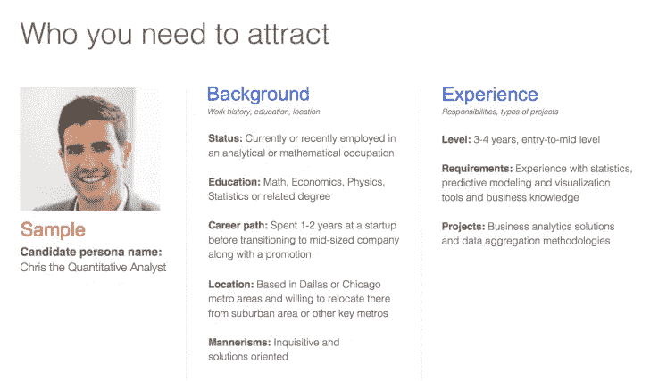

# 你希望已经拥有的创业公司招聘流程

> 原文：<https://medium.com/swlh/the-startups-hiring-process-you-wish-you-already-had-da042b566c09>

一步一步的招聘蓝图，从在哪里找到候选人到他们和你在一起的第一个 100 天。

Photo by [Priscilla Du Preez](https://unsplash.com/photos/XkKCui44iM0?utm_source=unsplash&utm_medium=referral&utm_content=creditCopyText) on [Unsplash](https://unsplash.com/search/photos/interviewing-millenial?utm_source=unsplash&utm_medium=referral&utm_content=creditCopyText)

一次，一位禅师在教他的学生。他给学生们讲了一个故事，一只野兔在丛林中被一群狼追赶。老师问学生，他们认为谁会坚持下去。学生们异口同声地喊道:“哦，主人，狼会的。它们是一个群体，速度很快，是掠食者”。

禅师叹了口气，用柔和的语气回答道:“不正确，应该是兔子。狼群只是在追逐一顿美餐，野兔在为自己的生命而战”

我们创始人是兔子。大多数员工都是狼。你可以雇佣业内最优秀、最聪明的人，但除非他们真的与你的愿景一致，否则他们只是寻找食物的狼。

作为一个初创公司的创始人，你需要组建一个团队——“狼群”。那是第一批十名员工。他们将塑造你的梦想和愿景，并塑造公司文化。它们将会决定你前进的方向——成长还是衰落！

那么，如何才能找到合适的员工呢？

我已经在创业领域工作了十年，身兼数职——风险投资人、天使投资人和企业家。我一直认为招聘是全球企业关注的一个主要问题。

从我的招聘经验来看，我曾将我的团队扩大到 35 人，然后现在减少到 6-8 人，我已经通过不那么容易的方式学到了一些东西，以下是我对其他创业者的建议。

# 第一步:寻找哪些角色？

在招聘过程开始之前，对你自己和公司做一个内部评估。在一张纸上，画出你的产品和你所处阶段的路线图。它会让你清楚地了解你在做什么，以及哪里需要帮助。您需要帮助的点是您需要雇佣的点，例如开发、营销或销售。

如果你是一家技术企业，那么技术团队将是你的第一个雇员，否则将是销售人员，他们将验证你的产品或服务的需求，看看人们是否愿意购买。

我先雇佣了技术团队，然后是销售发展代表 SDR，最后是营销经理。

最近，我与 SalesQualia 的首席执行官 Scott Sambucci 交谈时，他提到在你作为创始人完成前十笔销售后，雇佣你的销售人员，因为这样你就知道这个系统是如何工作的，你就知道从你的销售雇佣中能得到什么。

让一名联合创始人专门负责产品，一名高级人员负责账户、运营和管理。

# 第二步:定义你理想的候选人简介(ICP)

第二点，也可能是最关键的一点，是为你已经确定要招聘的关键职位创建一个理想候选人的档案。你希望他们拥有什么样的品质，你希望他们拥有什么样的价值观和视野，你真正希望他们拥有什么样的能力等等。

Source: [http://blog.indeed.com/](http://blog.indeed.com/)

这不是一种一厢情愿的做法，而是一种非常有战略意义的做法，从长远来看，这种做法肯定会让你省去很多麻烦。

1)定义候选人必须具备的行为特征，这将有助于他们轻松执行他们被聘用的角色，并融入公司文化，例如，25-35 岁的销售人员，外向，喜欢挑战，坚持不懈，独立工作，以过程为导向，阅读量大等。

2)明确你希望未来员工具备的能力将缩短学习周期，并让候选人在一半的时间内变得高效，例如，销售主管必须了解 CRM 工具、销售漏斗、销售线索挖掘等。

# 第三步:去哪里找他们？

我觉得找到创业人才最好的方法就是进入他们的空间。例如，如果要找销售人员，去 LinkedIn 如果要找开发人员，去 Hacker News 或 Angel 如果要找营销人员，去脸书集团。

如果你信任你的团队，那么即使是远程工作也被证明是一个明智的选择。记住，天赋胜过位置。如果你信任你的流程和候选人的能力和表现记录，那么员工在哪里工作就不重要了。如果他们准时交付成果，并了解他们的情况，那么天空就是你的极限。Alore 的营销团队完全分散在各个城市和国家，这对我们来说很好，因为他们是一群高效快乐的人，传递着价值。

作为一家初创公司，雇佣人才中介或专业人力资源服务可能会变得昂贵，在自由职业者或 Upwork 上寻找合适的人可能会变得乏味，所以我推荐几个网站来寻找为我们工作过的候选人。

[天使名单](https://angel.co/)

[来自 YCombinator](https://news.ycombinator.com/jobs) 的黑客消息

[脸书集团](https://www.facebook.com/groups/ideasthatscale/)——根据你想招聘的职位进行选择

Reddit 和[Quora](https://www.quora.com/)——找出合适的话题，或者如果你已经有了粉丝，就发布公开的问题

LinkedIn——如果你能负担得起他们与创业相关的一揽子计划，那就太好了，否则就发挥创意，在你的状态中写下招聘信息，并经常发布空缺职位。

【Remote.co 号

[remove . io](https://remotive.io/)

推荐:始终让你的员工了解招聘模式，并推荐他们认为能很好融入公司文化的候选人。激励正确的招聘。

 [## 为什么你想在作为员工 1-10 加入创业公司之前阅读这篇文章-生产力…

### “你这是在自寻死路！有这么多跨国公司，你到底为什么要为一家初创公司工作…

blog.alore.io](https://blog.alore.io/why-youll-want-to-read-this-article-before-joining-a-startup-as-employee-1-10/) 

# 第四步:预先筛选简历——哪些应该列入候选名单？

一旦你发布了你的职位空缺，你迟早会收到申请，每个候选人都声称自己对创业公司的热爱和对各自工作的热情，以及他们如何完美地适合所申请的角色。—穿过杂草以节省时间。我建议以下扫描正确应用程序的技巧:

*   寻找关键词——你认为必须具备的技能和品质
*   不要寻找多年的经验，而是他们所做的实际工作。
*   寻找可转移的技能
*   寻找可以用数字说话的成就——如果你可以量化你的成就，并且是数据驱动的，这对一家初创公司来说是件好事
*   有求职信吗——写求职信的候选人会付出比简历更多的努力来介绍自己。从中发现价值。
*   视觉吸引力——这个人的简历是否整洁、语法正确、没有错误——你会惊讶于许多候选人没有注意到这个基本的东西

让其他人筛选简历作为交叉检查。然后给入围的候选人打 10 分钟电话，了解更多关于他们简历的信息。

给这个人的动机和驱动力一个权重，并且只带着一个目标进行评估。"你愿意每天和这个人一起工作吗？"作为一个团队规模很小的初创公司，这比你想象的要重要得多。

***我发现面试初创公司员工的两个有用技巧:***

1)提前 30 分钟或之后给他们打电话。这并不是说你不重视他们的时间，而是在一家初创公司，你必须是让意想不到的事情出现的专家。你处理这个问题的能力取决于你的心理弹性。提前 30 分钟打电话可能会让你的思维更加僵化。

2)让他们更多地谈论他们的失败，而不是他们的成功——让他们说他们想说的任何故事——你在听他们说这三件事:

a)他们引用数据和数字吗？

b)他们的故事结局是积极的还是消极的，例如，即使以失败告终，如果他们谈论学习，这是积极的，如果他们谈论再也不想让这种事情发生，这是恐惧和消极的。

c)他们是否倾向于讨论对自己或他人的责备，或者分享这种责备等。(显示团队精神和责任感)

根据你面试的职位，给候选人一条明显不正确的信息，检查他们是否注意到了。一个观察力敏锐、自信的员工每天都可以避免许多糟糕的情况发生。

# 第五步:让数据指引方向

一旦你预先筛选了候选人，就给他们发一份行为测试。这些是以科学数据为基础的测试，用于检查员工的能力，并有助于最佳聘用。他们基本上是根据职位的理想状况来衡量你的候选人。他们将这些数据与数百万个数据点进行匹配，并对该人的匹配程度、他们的动力和动机以及经理如何从候选人身上获得最佳表现进行评估。如果差距太大，那么最好在这一点上分道扬镳。如果差距很小，那就进入下一阶段。

我推荐的行为测试:

[PI 测试，](https://www.predictiveindex.com/)

[贝尔宾试验](http://www.belbin.com/)，

[零风险](https://www.zeroriskhr.com/)

如果行为测试显示出良好的结果，那么发送一个案例研究来解决或邀请进行一轮评估/面谈。如果候选人已经越过了这一切，那么你就可以开始讨论薪水了！

专业提示:对于高客户面对的角色，让候选人跟随你一天是一个很好的做法。我对我的销售候选人就是这样做的，到目前为止，它帮助大多数候选人从一开始就意识到他们是否有能力主持这个节目。

# 第六步:激励

要明白，一家初创公司有许多优势需要平衡。例如，如果你是白手起家，那么支付高薪就是一个问题，你不能在不清楚每个新员工可能何时离职的情况下，就给他们提供股权。

除非他们是联合创始人，否则你不能指望新来的高管是无薪的，你可以用很高的薪酬找到一个并不真正需要的人。这可能会成为你个人的累赘。

同时，你需要付给他们足够的钱，让他们的经济需求得到满足，让他们没有在工作之外的生活中履行财务承诺的压力。每个人都有自己的财务负担——教育管理信息系统、学生贷款或支持家庭等。财务安全对快乐员工的生活很重要。

此外，就像某个聪明人曾经说过的“如果你认为雇佣专业人士很贵，那就试着雇佣业余人士”。

我完全理解这是一个很难处理的问题。我建议大致遵循以下原则:

a)对于初级职位，你需要支付标准工资，并在两者之间有一个基于绩效的津贴。

b)对于中层管理人员，根据资历、经验和待遇提供员工持股计划。真正有才华的员工在任何他们想去的地方都会有需求，因此给他们留下来的正确理由是很重要的。

c)对于高级雇员，提供 0.5%至 3%的股权期权(融资前阶段)，条件是他们在初创公司完成 2-3 年的服务。这不仅会激励员工留下来，还会让他们更加努力地工作，因为现在他们会真正感受到所有权，感受到你在需要时为之付出的汗水。

# 第七步:登机井

创始人需要创建一个强大的入职流程。就像你想让客户很好地参与进来并对你赞不绝口一样，也要把努力延伸到你的团队。适当的入职培训有助于团队更快地进入高效状态。

拥有工具、时间、文档、沟通计划等的适当列表。让新员工清楚，这样他们就没那么多时间去思考“该做什么”

创建和更新你的入职计划以跟上公司的发展和阶段是很重要的。例如，你希望销售人员在起步阶段做的事情，在扩展阶段会有很大不同。

员工需要清楚未来 15、30、60、90 天对他们的期望，以及管理层计划如何衡量。

公司文化非常重要，公司必须制定计划或框架，让员工融入一种文化。这当然是一个无形的、不可量化的方面，但却是团队成功的核心。例如，对我来说，拥有一个善于阅读、非常互动、善于沟通、热爱网络、以数据为导向并能一起玩乐的团队非常重要。

在入职的最初阶段，确保你与新同事和新员工谈论你对公司的愿景，以及公司在未来 3、6、12、18、24 个月的计划。

# 第八步:在 30、60 和 90 天试用期内检查兼容性

一旦你雇佣了一个人进入你的创业公司，在 30 天、60 天和 90 天内评估他们的进度。

前 30 天:提供最初的帮助和指导，以理解他们的角色。确保他们融入你的公司文化。为他们的职能设定一些可实现的、现实的目标。

第 3 天-第 60 天——这是你开始注意到他们变得独立，开始处理小事情的时候。为这段时间设定里程碑，并让新员工在角色中保护自己

第 6 天——第 90 天——这是可见的结果必须开始显现的时候。在 90 天结束时，如果候选人没有表现出可识别的专业进步，那么他们将成为永久雇员，同时扩大他们的角色和责任。

给创始人的建议:在你拥有 30 名员工的时候，作为创始人，你需要真正了解每一位员工，花时间与团队互动，在工作之外多了解他们一点，以了解他们的动机

# 招聘会停止吗？

一般来说，最广为人知的建议是保持“永远雇佣”的模式。当你的客户流失率在最初几年很高时，这非常有用。新来的员工可能会也可能不会融入初创企业的文化。永远做好招聘广告，每周花 30%的时间与未来的员工、候选人等保持联系。你可能认为这很多，但经验告诉我，除非你努力从灰尘中发现钻石，否则你将不得不满足于任何出现在你面前的东西，以防你没有为自己创建候选人管道。

然而，我认为招聘也可以停止。招聘在最好或最坏的情况下都会停止。例如，如果你无法获得任何收入，利润也将下降，你会倾向于冻结招聘，只与现有团队合作，专注于恢复盈利。

或者，当你的团队表现最佳，并且你认为没有必要再招人时，你也可以停止招人，因为扩展已经进入了一种几乎自动化的模式。这是大本营的大卫·汉森所说的。他们冻结了招聘，因为“[只有大约 50 人，没有全职经理，感觉我们现在正处于 Basecamp 浪潮的关键转折点](https://m.signalvnoise.com/things-are-going-so-well-were-doing-a-hiring-freeze-5f66372a4214)(不包括客户支持)”

最后，我想说，对于创业公司来说，招聘必须得到应有的重视。大多数创业公司的创始人都被产品或服务所困扰，并把招聘作为最后一刻的事情。当你有合适的人才做合适的工作，而不必每隔几个月就花时间培训和入职时，你会节省无数的工时和三倍的生产力。简而言之，通过创建一个理想的候选人档案(ICP)，为他们制定一个适当的入职计划，好好激励他们，然后作为一个最佳实践，永远保持招聘模式，始终知道你想招聘什么样的角色，你在寻找什么样的特质。永远雇佣与你公司的使命和愿景一致的候选人。选择那些除了薪水和金钱之外还有其他动机的人。他们是将会有所作为并带来改变的人。

我很乐意听听你对如何在初创公司招聘员工的想法，以及你遵循的最佳实践。

如果你发现了这篇有价值的文章，你可能也会喜欢这些关于如何在工作中建立一个强大的有凝聚力的团队的想法。

*原载于 2018 年 5 月 28 日*[*blog . alore . io*](https://blog.alore.io/startups-hiring/)*。*

## 这个故事发表在 [The Startup](https://medium.com/swlh) 上，这是 Medium 最大的创业刊物，拥有 328，729+人关注。

## 在此订阅接收[我们的头条新闻](http://growthsupply.com/the-startup-newsletter/)。

