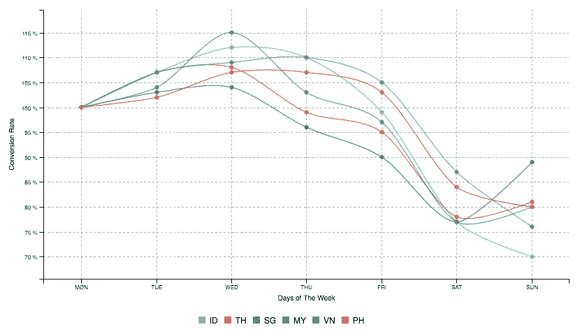

# 2017 年东南亚电子商务状况

> 原文：<https://medium.com/swlh/the-state-of-ecommerce-in-southeast-asia-in-2017-5a779f962623>

## m **ost** c **关于**关键电子商务指标**的综合研究**来自**海洋**的数千家电子商务运营商

*我们非常兴奋地于本周发布了我们最新的海洋电子商务状况白皮书，该白皮书利用了来自该地区 1000 多家电子商务商家的 iPrice 专有数据。你可以在这里* *查看英文报告全文(并下载 PDF)* [*。*](https://iprice.my/insights/stateofecommerce2017/)

根据[谷歌-淡马锡](https://www.blog.google/documents/16/Google-Temasek_e-Conomy_SEA_Spotlight_2017.pdf) [经济海洋聚焦 2017 年报告](http://www.temasek.com.sg/Documents/userfiles/files/e-Conomy%20SEA%20Spotlight%202017%20Full%20Report.pdf)，2017 年是东南亚电子商务至关重要的一年，第一手商品的商品总值(GMV)超过 100 亿美元，高于 2015 年的 55 亿美元，过去几年的复合年增长率(CAGR)惊人地达到 41%。

在其他重大事件中，2017 年的 SEA 电子商务见证了[亚马逊期待已久的进入 SEA 的市场之一](https://techcrunch.com/2017/07/26/amazon-prime-now-launches-in-singapore-its-first-market-in-southeast-asia/)、Shopee 的移动优先平台的快速崛起、[laza da 的在线革命运动创下的 2.5 亿美元破纪录销售额](http://markets.businessinsider.com/news/stocks/Lazada-extends-record-breaking-streak-with-USD-250-million-GMV-haul-in-the-grand-finale-sale-of-Online-Revolution-1011613636)以及中国的死敌[阿里巴巴](https://www.cnbc.com/2017/06/28/alibaba-to-invest-1-billion-dollars-into-lazada.html)和[腾讯](https://www.bloomberg.com/news/articles/2017-05-08/garena-rebrands-as-sea-after-raising-550-million-in-new-funding)为试图“赢得”市场而部署的越来越多的资本。

在这些引人注目的事件和塑造行业的投资背后，有成千上万各种形状和规模的电子商务公司，在该地区截然不同的市场条件下运营。

我们的目标是，通过 2017 年电子商务报告，从数千家电子商务运营商的角度揭示一些最重要的电子商务指标，突出每个市场之间的差异和相似之处。

我们的研究利用了 iPrice 的专有数据，这些数据来自在 6 个最大的东南亚市场运营的 1000 多家电子商务公司([印尼](https://iprice.co.id)、[马来西亚](https://iprice.my)、[新加坡](https://iprice.sg)、[泰国](https://ipricethailand.com)、[菲律宾](https://iprice.ph)和[越南](https://iprice.vn))。)

海上电子商务是一个移动优先的经济体，当谈到移动商务在每个电子商务运营商产生的流量中的重要性时，它超越了所有西方经济体。

Mobile Traffic

移动在 SEA 电子商务中的崛起似乎势不可挡。在过去的 12 个月里，移动平均增长了 19%，现在占整个电子商务网站流量的 72%。

领先的是印度尼西亚，它现在拥有惊人的 87%的移动流量份额。在 SEA 的国家中，没有一个国家的桌面流量占网络流量的 30%以上。

对于任何电子商务运营商来说，最重要的指标之一就是转化率。转化率既反映了公司营销活动的质量，也反映了网站的有效性。最简单的定义是，转化率是网站访问转化为产品购买的百分比。提高转换率可以对企业的底线和盈利能力产生巨大的影响。

这一基本指标在不同东南亚国家的商人中有何不同？

Conversion Rates per Country

以海上平均转化率为参考(1x)，越南商家领先，转化率比平均高出 30%。新加坡显示出第二高的转化率，与印度尼西亚接近。

数据显示，转换率和每个电子商务市场的成熟度之间的相关性较低。

篮子大小是任何电子商务运营商的另一个关键指标，严重影响企业的单位经济盈利能力。该指标衡量客户在一段时间内的每笔订单的平均总支出。

篮子的大小在各个垂直行业和每个商家的市场定位中是不同的。我们对各种垂直行业的商家进行的大样本分析缓解了这些因素，从而使得国家之间的篮子大小比较特别有趣。

Basket Size per country vs. GDP per country

## **工作&商店**

东南亚消费者在什么时候购物最多，这一趋势在该地区是否一致？

Orders per time of the day

考虑到当地国家的平均订单数量(100%)，订单数量在上午 9 点到下午 5 点之间最高，此时人们通常在工作或上学，新加坡人除外，他们似乎比其他国家的人更喜欢晚上购物，在晚上 10 点达到高峰。从各国的情况来看，下午 5 点到 7 点之间会有一个低谷，人们通常在这一时段通勤和吃饭，然后在晚上 11 点之前回到网上购物。

## **周三高峰**

消费者在一周的哪几天购物最多？周末是商家推出特价商品的好时机吗？

Conversion Rate by Days of the Week

以周一为基准值，电子商务商家在周末的转化率会下降高达 30%，这在整个地区都是一致的。

不出所料，导致周末转化率下降的主要因素是移动使用比例的大幅上升。

另一个一致的趋势是周三的转化率峰值，平均比平均周转化率高 4%到 15%。

在 SEA 的每个国家，商家为其消费者提供哪些支付解决方案来完成购买？

由于该地区(新加坡除外)的信用卡普及率较低，东南亚的电子商务参与者不得不面对独特的挑战，而西方电子商务市场对此一无所知。由于这一结构性缺陷，本区域出现了更加多样化的支付解决方案。

每个国家表现出非常不同的模式，这突出了商家在以一刀切的方式进行区域扩张时所面临的挑战。

Payment solutions offered by merchants

越南和菲律宾 80%以上的玩家都提供货到付款

银行转账是另一种非常受欢迎的跨海支付方式，印度尼西亚、越南和泰国分别有 94%、86%和 79%的商户提供银行转账。

在泰国和越南，几乎 50%的商家提供线下销售点(即 7/11)

分期付款在越南(47%的商家)和印度尼西亚(42%)都非常流行(而且越来越流行)

# 方法学

iPrice 是 1，000 多家海外电子商务商家的首选联盟平台。我们的客户群包括该地区最大的电子商务品牌，如 Lazada、Shopee 或 Bukalapak，以及数百家年收入低于 100 万美元的电子商务商家。

该报告基于对 2016 年 7 月至 2017 年 6 月期间所有这些公司的匿名数据的分析，针对以下市场:印度尼西亚、马来西亚、新加坡、泰国、菲律宾和越南

为了提供最具洞察力和代表性的指标，我们所有的转化率和平均订单价值指标都采用基于商家的权重(相对于基于订单的权重)，以避免最大玩家的数据出现偏差。

您可以查看东南亚电子商务的完整报告，或点击此处下载 PDF 文件[。还有](https://iprice.my/insights/stateofecommerce2017/)[印尼语](https://iprice.co.id/insights/stateofecommerce2017/)、[泰语](https://ipricethailand.com/insights/stateofecommerce2017/)和[越南语](https://iprice.vn/insights/stateofecommerce2017/)版本。

## 感谢您阅读这篇文章——如果您喜欢这篇文章，请在下面给它一个心形或推荐它，这样其他人也可以找到它:)

## 这个故事发表在 [The Startup](https://medium.com/swlh) 上，这是 Medium 最大的企业家出版物，拥有 295，232+人。

## 在这里订阅接收[我们的头条新闻](http://growthsupply.com/the-startup-newsletter/)。

