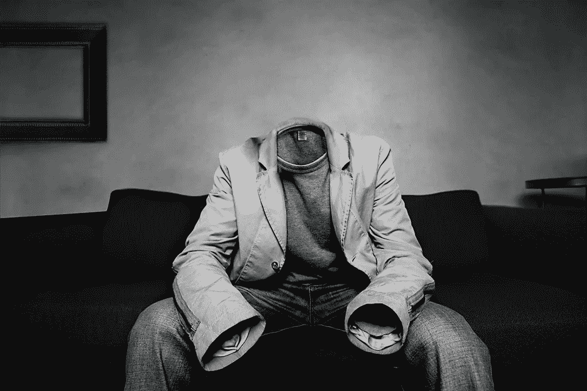

# 状态更新寿命

> 原文：<https://medium.com/swlh/the-status-update-life-ec5e4a35b208>

## 是的，我们看到你了。

我们喜欢给彼此看似无意义的生活事件状态更新，主要是为了证明我们的工作、目的和创造。

“妈妈，看我今天做了什么。看我做了什么。你为我骄傲吗？我做得好吗？我达到你的期望了吗？你看见我了吗？”

还有，“这是我做的。我确实很忙。看看我能做的所有事情，我积累的所有想法。我聪明了吗？我如何比较？你看见我了吗？”

是的，我们看到你了。

我们立刻热情地渴望展示、宣传和展示我们所做的一切，就好像生活只是地位或金币的积累一样。

> “你可以让这个人不再为社交媒体做贡献，但你不能让这个人不再需要社交地位。”—泰勒·华莱士

但是为什么呢？我们对如何度过时间、与他人相比我们的能力以及我们行动和决策的总体目的缺乏安全感。没有人知道为什么有人在这里或做什么，这让我们很不舒服。它让我们害怕和不舒服，因为它阻止我们预测未来。来自他人的认可使我们所做的工作和所做的决定合法化，这是对无形的努力和过程的鼓励。

我们消费体验主要是为了体验之外的目的，比如呈现(身份)、拥有感(权利和记忆)和安全感(对未知的不安全感以及控制和预测的欲望)。

f 那个

为你而做。能力本身就足够了，不需要证明。

生活不仅仅是一系列的进展更新和检查点，它是一个(你的)旅程，如果你要消费，贡献而不是杂乱的空间。

没人在乎你做了什么。重要的是你为什么这么做，以及它有什么贡献。当你接受自己是归属时，你就会归属。如果它真的很重要，如果它是用来影响和制造影响的，那些寻求它的人会看到它。让他们自己去发现和欣赏它，不管它值不值得。

是的，我们看到你了。

# 原始想法…

> 有目的和一致的压力，在我们能力的边缘是成长，是好的，是生活和成为。安逸和自满是停滞和耐心等待死亡的中心。

伪装的机会

巨大的机会往往被伪装在表面上，最初被认为是没有吸引力、令人不安和有风险的。它们很少是显而易见的或清楚的，否则它们就不是机会。真正的好机会不是未被满足或未被追求的潜力，而是看不见的进步。

屏幕时间黑客:多过少

离开屏幕一段时间，但是如果你打算无意识地滚动屏幕，观看或做其他任何事情，同时，用它们淹没你自己，以高度集中的剂量将它们从你的系统中排出，直到你的大脑和眼睛都被它们处理掉。那就去享受现实生活吧。

还能活 30000 天

普通人的寿命大约是。82 岁，这意味着我们大约有 30，000 天的寿命。如果你 25 岁，那么 9000 年已经过去了。这让你对自己的时间有什么感觉？

无处不在的记忆

我们的记忆是我们的感知，我们对环境的看法。我们将我们的感官体验与我们经历和理解的叙事和文化/社会规范融合在一起。我们为自己建立了一个关于我们的观点应该是怎样的精神声誉，所有的事情都应该与我们所知道的相符。

我们将一切编织在一起，使我们的经历与现状相匹配，是一种集体经历，但最终它们，特定的时刻，是并且永远是独特的，这就是我们如何记住地点和时间。每个人都有自己的版本，他们选择编织并符合他们创造的过去和未来的故事。

现代性的比较文化

平衡远比混乱更可怕。我们是否总是竞相比较并加速积累和发展“更多”而不是“更好”或“足够好”的状态/认知。

## 这篇文章发表在《初创企业》杂志上，这是 Medium 最大的创业刊物，有 302，074 人关注。

## 订阅接收[我们的头条新闻](http://growthsupply.com/the-startup-newsletter/)。

