# 从零开始创建自己的自主网站的一步一步的指南

> 原文：<https://medium.com/swlh/the-step-by-step-guide-to-starting-your-own-self-hosted-website-from-scratch-d10a8e6ccf0c>

Photo by [William Iven](https://unsplash.com/@firmbee?utm_source=medium&utm_medium=referral) on [Unsplash](https://unsplash.com?utm_source=medium&utm_medium=referral)

## 技术挑战初学者的终极指南:)

你已经决定了。是时候开始你自己的网站了。

为什么？

你是个作家。一个艺术家。一个有创造力的人，有重要的信息要分享。

随着你能力的增长，你开始意识到你需要自己的网站来有效地分享它们。

你知道拥有自己的网站会让你看起来更专业，它会给你更多的灵感，让你的创造力更上一层楼。

但是你不确定如何开始。作为一个不懂技术的人，你的脑袋里充满了问题:

*   如何创建自己的网站，有自己独特的网址和简单易用的界面？
*   你如何让你的网站看起来像那些你崇拜的顶级博客和作家的网站？
*   托管和自托管网站有什么区别？

你拖延，害怕离开脸书或你的旧博客。过去的每一天都是充满遗憾的一天，因为你还没有建立自己的网站。

我理解你——我也经历过。

但是最近，我自学建立了几个自己的网站，你猜怎么着？

没你想的那么难！

在梳理了几十篇文章后，我从头开始创建了一个完整的网站(请继续关注更多信息)，并在没有搞砸的情况下将一个网站从一个主机转移到另一个主机(我告诉你，这是一个奇迹)。

如果你也想学习如何建立自己的网站，这篇文章将告诉你入门所需的一切，即使你目前对网站一无所知。

下面是建立你的第一个自主网站的分步指南。

# 为什么你应该有一个自我托管的博客/网站？

对于想写博客或把内容放到网上的人来说，有两种主要的选择:托管和自托管网站。

## 托管网站

拥有一个托管网站就像是一个租房者，而不是房主。

一方面，你有地方住，你的房东负责一定的费用和维护。

另一方面，你依靠房东的仁慈来为你维持生活，你不能随心所欲地重新设计房子。

说到托管网站，你的“房东”就是你的主机。主机是提供技术和服务的企业，这样你可以很容易地在互联网上创建一个网站。

这些公司向想要在网上写作和发布内容的初学者和爱好者免费(或便宜)提供一体化服务。知名主持人有 Wordpress.com、博主、Wix、Squarespace、Weebly 等。

这些托管平台允许您立即开始发布内容，而不必管理所有烦人的幕后工作，如 SSL 认证、升级和其他技术配置。

但在某些时候，你会碰到天花板。托管平台有其缺点，它们:

*   限制您可以添加或更改的网站内容
*   让你的网站很难赚钱——例如，创建一个电子邮件列表，增加你的受众
*   最糟糕的是，如果托管平台发生了任何事情，或者你以某种方式冒犯了他们，他们有完全的权力将你的内容从存在中抹去。没有第二次机会。

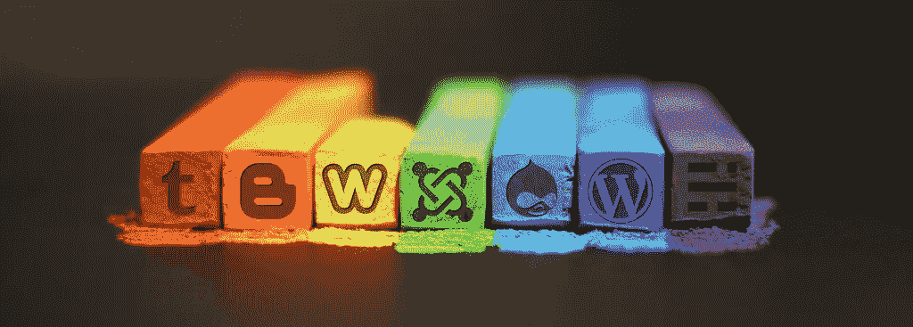

[Flickr](https://c1.staticflickr.com/5/4184/34264487702_a0d2448d1a_b.jpg)

## 自托管网站

如果你想要更多的自由和控制你的知识产权，那么你需要一个自托管网站。

通过自主托管，你可以创建自己的网站，然后通过托管公司购买空间来存储你的网站并向公众开放。

基本上，拥有自己的自托管站点可以让你拥有最大的灵活性和定制性。你完全拥有内容和网站，你可以做任何你想做的事情。你:

*   对网站的一切有更多的控制
*   拥有更多存储空间
*   通过你的网站赚钱和培养观众
*   包括额外的铃铛和哨子，为了好玩或者必要

不过，也许你已经知道这些了。磨蹭够了，让我们进入正题:

# 如何创建自己的自主网站/博客

如果你像大多数想创建自己网站的人一样，你不会对从头开始编写任何东西感兴趣。

你只是想要一个简单明了的平台来与更多的观众分享你的想法、产品和想法，并拥有自托管带来的灵活性。

以下是如何一步步实现这一点的方法:

1.  选择一个主机
2.  选择域名
3.  创建您的博客
4.  规划你的内容

在本文的其余部分，我们将深入研究每个步骤的细节。

# 1.选择一个全面的网络主机提供商

一个自托管的网站需要一个住的地方。这就是网站托管提供商的用武之地。

有各种主机以不同的价格提供不同的服务。知名主机有: [Siteground](https://www.siteground.com/?referrer_id=7948873) *、Bluehost、GoDaddy 等等。

如果你愿意，你可以花几个星期比较不同的主机供应商。但是我假设，作为一个初学者，你现在没有那种兴趣和时间，所以让我切入正题。

在选择主机时，以下是一些需要注意的事项:

*   **定价**:不要只寻找最低的广告价格。要知道，你必须每年为在主机服务器上保留你的网站的权利付费，一些主机利用这一点，提供非常低的介绍费，然后以更高的价格续订。
*   **客服**:特别是作为一个初学者，你需要一个拥有出色的 24 小时客服的主持人，这样你就可以在紧急情况下找到某人，或者如果你只是需要找人帮你解决你从未见过的情况。
*   质量:你想要一个为你的网站提供快速、可靠服务的主机。崩溃或加载时间过长的网站会让访问者望而却步，这是你无法承受的。与其找一个不在乎你或你的网站的廉价主机，不如花更高的价钱买一个质量更好的主机。
*   **其他好处**:当你的网站开始吸引成千上万的访问者时，你的主机是否提供额外的好处，如每日备份、额外的域名、免费的网站转让和选项(如 CDN 整合)，以保持网站的平稳运行？这些额外津贴现在对你来说可能没什么意义，但它们*以后会派上用场。*

## 我个人推荐: [Siteground](https://www.siteground.com/?referrer_id=7948873)

根据我的研究，提供最佳功能组合的网站主机是 [Siteground](https://www.siteground.com/?referrer_id=7948873) *。

*   定价方面，不贵也不便宜，但是合理。
*   他们提供三层主机服务:Startup(为一个网站提供主机服务)、Grow Big 和 GoGeek(最后两层为多个网站提供主机服务)。他们承诺优秀的网站速度，并履行承诺。
*   后端(也称为 cPanel)清晰易用。简单的设置！

我目前使用 GrowBig 选项，该选项提供多个网站的主机、免费 SSL 证书(这可以安全地加密敏感信息)、免费电子邮件帐户、每日备份、免费站点传输等等。

更好的是， [Siteground](https://www.siteground.com/?referrer_id=7948873) 提供出色的客户支持，包括 24/7 实时聊天和电话支持。当我自学如何从零开始转移和设计自己的网站时，这非常有帮助。

我的建议是:如果你需要网站转让方面的帮助，或者想要托管多个网站(我推荐，因为你可能有一天想要更改网站名称，或者为单独的主题建立单独的网站)，请使用 [Siteground 的](https://www.siteground.com/?referrer_id=7948873) GrowBig 计划，并订阅最长 3 年的开放期限(在你首次购买后，续订价格会上涨)。

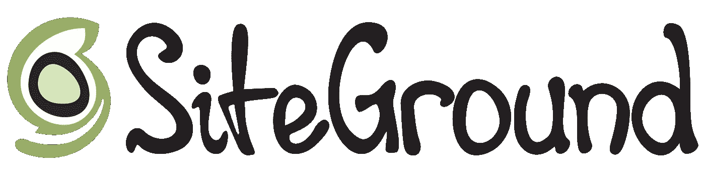

[Elementor.com](https://elementor.com/wordpress-hosting/siteground/)

如果你选择了一个糟糕的主机，你会给自己制造很多麻烦，从隐藏的费用到糟糕的服务，再到你网站的缓慢加载时间，甚至网站崩溃。

但是如果你选择了一个好的主持人，用天才汉弗莱·鲍嘉的话说，这将是“一段美好友谊的开始”

# 2.选择您的网站(域名)

一旦你选定了主机，就该给你的网站命名了。

有些人会花上几个月甚至几年的时间为他们的网站挑选一个完美的名字。不要。域名不会永远一成不变，尤其是当你刚刚起步的时候，你还有改变的空间。

选择一个足够好的，然后开始。随着你的学习和成长，你可能会改变你的想法，也可能不会，但你有足够的时间去改变。

但是，如果你在游戏的这个阶段让域名选择这样的事情绊倒了你，你可能会错过扩大你的观众和业务的绝佳机会。

以下是一些建议:

## 如何选择有效的域名

谈到域名，这里有一些最佳实践指南，可以帮助您选择最有帮助的一个:

*   有些人喜欢在他们的网站上使用自己的名字(例如:sethgodin.com)，但是不要这样做，除非你打算永远不卖你的网站。你不想让别人把你的个人品牌带向你从未想过的方向。
*   使用一个描述你的网站使命或目的的名字(例如。iwillteachyoutoberich.com)
*   使用一个描述你的网站目标受众的名字(例如 techsavvymama.com)
*   避免含糊或误导的域名(即。tinybuddha.com 不是讲佛教的)
*   注意笨拙的拼写。Therapist Finder 有一个不幸的网址“therapistfinder.com”，如果你看不出为什么这是一个有问题的名字，去掉前三个字母😦)
*   如果你的域名很长，不要担心(不管怎样，大多数人不再输入完整的网址。他们点击链接并依赖自动填充)
*   一般来说，使用。com 仍然是经验法则。。org 通常用于非营利组织。net 没有很强的公众认知度，其他的扩展对大多数在线用户来说还是太陌生了。

使用上面的提示，列出一个潜在的域名列表，并把它们缩小到你最喜欢的。然后是时候注册你的最终选择了。

> 注意:如果你不能在两个真正好的名字中选择，你可以两个都买。
> 
> 你可以让名字留在那里，或者如果你有时间建立两个网站，请随意这样做，特别是如果你已经购买了 [Siteground](https://www.siteground.com/?referrer_id=7948873) 的 Grow Big 软件包，它允许你托管多个网站。
> 
> 你可以做我做的事情，用一个网站作为实践的实验网站，一个作为人们看到的实际网站。

## 如何注册你的域名(这样除了你没人能用！)

当你想锁定你的域名时，你必须在一个叫做域名注册商的地方购买/预订。

就我个人而言，我使用 Namecheap 是因为就像它的名字一样:它很便宜。非高级域名的费用不到 10 美元。

你的域名注册商通常没有你的网络主机提供商重要。你只需要一个价格合理的注册商。

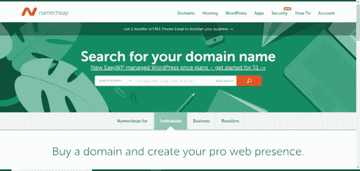

所以，当你有了域名的想法，去域名注册商那里输入它们，看看它们是否可行。

在 Namecheap 上，该网站还显示不同的扩展和价格。它看起来会像这样:

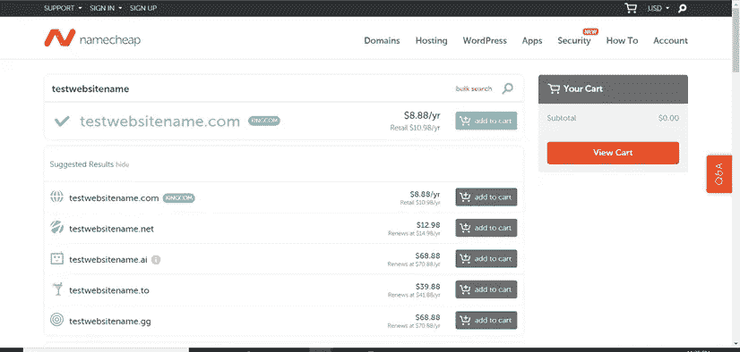

> 注意:你通常可以在你的主机上注册你的域名。但是最好还是把它们分开，因为 a)这样更便宜，b)如果你决定换主机，这样就不会那么麻烦了。我得到了这个教训。

最后一点:记得每年更新你的域名——大多数网站允许你设置自动更新，我推荐这样做。

如果你不小心让你的域名过期，你通常有几个星期的宽限期来更新你的域名，然后再把它发布到野外(即域名市场)。

但是如果你想让你的域名和网站不打嗝，最好不要冒过期的风险。有了 Namecheap，自动续费很容易。只需在您的帐户控制面板中打开此按钮:

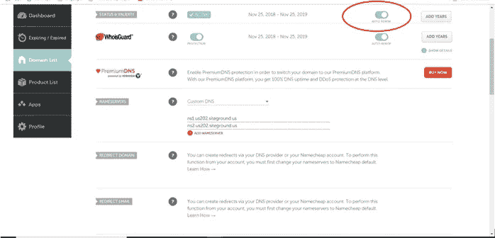

Namecheap

# 3.从头开始创建你的博客

如果你选择使用 [Siteground](https://www.siteground.com/?referrer_id=7948873) ，我推荐使用 Wordpress 软件来设置你的站点。方法如下:

首先，进入“我的账户”，点击 WordPress 安装程序:

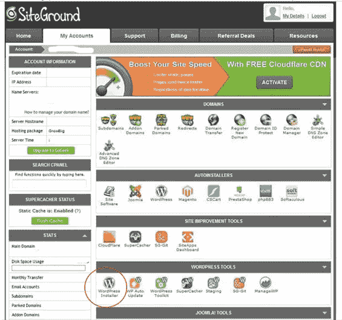

然后点击“立即安装”

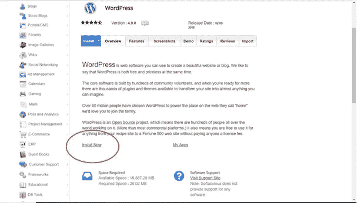

一旦完成，回到你原来的 cPanel(转到你的站点仪表板→点击“账户”→点击绿色的“转到管理面板”按钮，你会看到你的 Wordpress 仪表板:

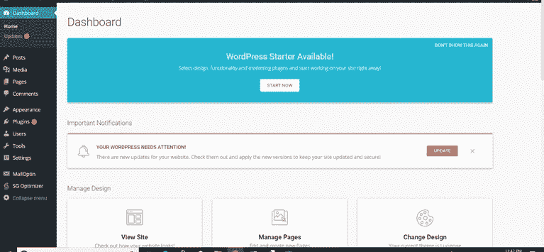

点击左边的“外观→主题”,选择你想要的主题，然后点击“激活”按钮。

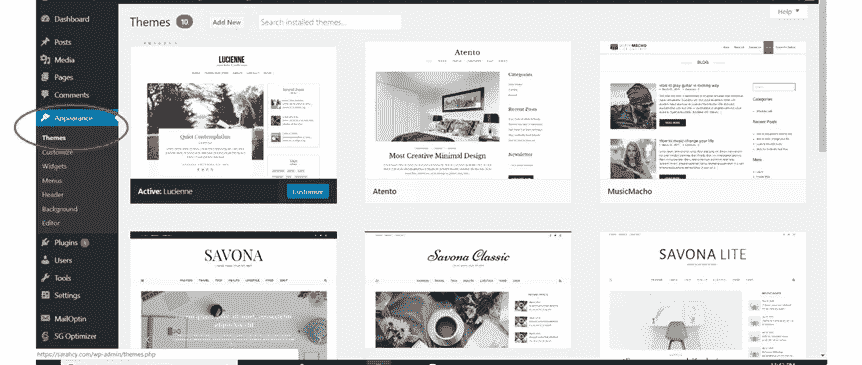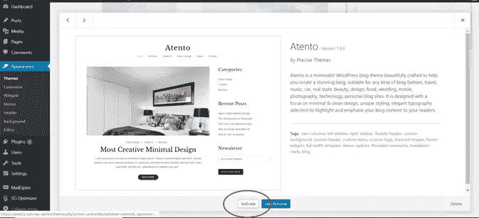

之后，你可以通过点击蓝色的“定制”按钮来定制你的站点，这将会弹出:

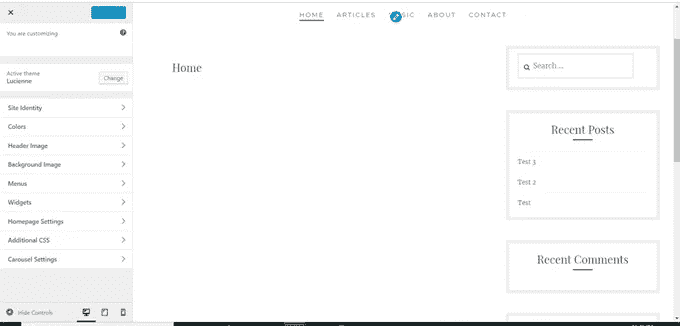

在左侧菜单中，您可以通过更改网站标题和标语(参见:“网站标识”)、颜色、标题和背景图片、菜单(网站顶部的不同导航链接，例如:主页、博客、关于、联系人)等来设计您的网站。

如果您想创建博客文章，只需进入您的仪表板，单击“文章”，然后单击“添加新内容”(在左侧菜单上):

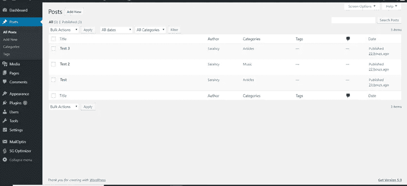

现在你可以随心所欲地写作和出版了！

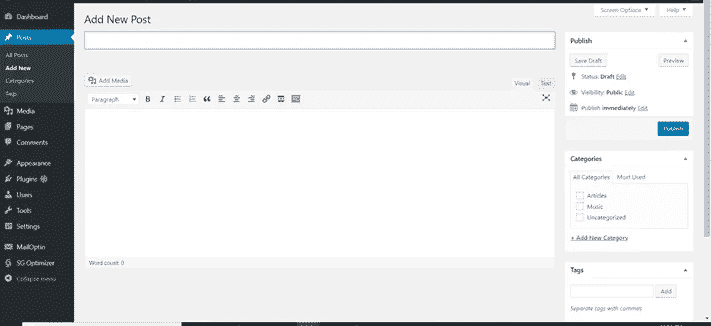

许多博客完全致力于如何让 Wordpress 做令人惊奇的事情，所以我将把它留给他们来教你细节，但这基本上是你如何开始的。

将来，你可以通过输入你的域名，然后添加“wp-admin”(例如:testsitename.com/wp-admin)，轻松访问你的 WordPress 仪表盘

# 4.计划并发布您的内容

既然你的网站已经建立起来了，你可以随意发布任何你想发布的内容。

如果你想要一个成功的网站，内容当然是最重要的因素。所以继续磨练你的写作技巧，想出一个定期发布文章的计划，培养一批忠实的读者(建立一个电子邮件列表)，发展你的网站！

关于写作和高质量内容创作的技巧，请查看以下文章:

 [## 想成为伟大的作家吗？那就不要专注于写作。(改为这样做)

### “按程序办事，不按情绪办事。到时候停！”—亨利·米勒

writingcooperative.com](https://writingcooperative.com/want-to-be-a-great-writer-then-dont-focus-on-writing-do-this-instead-120bf7ba7061)  [## 好的作品不是写出来的，而是汇编出来的

### 瑞安·哈乐黛和德里克·哈尔彭的两堂强有力的写作课

writingcooperative.com](https://writingcooperative.com/good-writing-is-not-written-its-assembled-3e77f950cd11)  [## 如何写出吸引人、引人入胜、坚持被阅读的不可抗拒的标题！

### “不要根据封面来判断一本书，”他们说。

writingcooperative.com](https://writingcooperative.com/how-to-write-irresistible-headlines-that-entice-intrigue-and-insist-on-being-read-9bc7925fa8c)  [## 当你没什么可写的时候，想出点子的 5 种方法

### 如果你想成为一个严肃的作家，你必须写作。很多。

writingcooperative.com](https://writingcooperative.com/5-ways-to-come-up-with-ideas-when-you-have-nothing-to-write-about-8ee1dc3b32a0) 

# 欢迎来到你的全新网站！

仅此而已。

这就是你如何从零开始建立自己的自托管网站。

不太难，如果你愿意尝试的话。

想出一个域名确实是整个过程中最冗长的部分。虽然你也可以花一些时间来玩你的网站设计，看看各种插件。

(如果你不知道插件是什么，它们是为你的网站增加特性和功能的软件，允许你创建登陆页面来获取电子邮件线索，跟踪网站访问者，等等)

现在你有了自己的网站，你是自由的——自由升级，自由试验，自由在网站上以你喜欢的任何方式创建和设计你的家。

所以勇往直前去征服吧！

# 准备好设置您的网站了吗？

[Siteground](https://www.siteground.com/?referrer_id=7948873) 链接是附属链接。如果你选择尝试一下[的场地](https://www.siteground.com/?referrer_id=7948873)，并通过[这个链接](https://www.siteground.com/?referrer_id=7948873)前往那里，请在下面的评论中告诉我，我会尽全力帮助你的！

## 这篇文章发表在 [The Startup](https://medium.com/swlh) 上，这是 Medium 最大的创业刊物，有+397，714 人关注。

## 订阅接收[我们的头条新闻](http://growthsupply.com/the-startup-newsletter/)。

