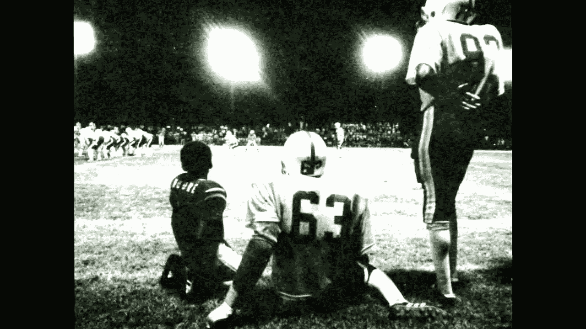
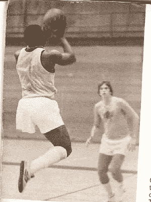

# 卡尔·舒格福特·约瑟夫的故事

> 原文：<https://medium.com/swlh/the-story-of-carl-sugarfoot-joseph-3fc8d72edf92>

## 是什么阻碍了你？

An older, grainy picture of Carl (#63)

卡尔“甜脚”约瑟夫在佛罗里达州塔拉哈西由一个有 10 个孩子的单身母亲抚养长大。他在一个贫穷的烟草农场长大，这个地方没有什么公园和娱乐设施。他玩街头足球，上公立学校。

童年早期的奋斗促使他在以后的生活中更加努力地工作。

7 年级时，卡尔加入了篮球队。他站在篮筐下，练习直接跳起扣篮。

在高中，他踢足球，打篮球，跑田径。他几乎在每项运动中都创下了学校记录。在区级比赛中，他以 5 英尺 8 英寸的身高赢得跳高冠军，然后转身掷出 40 英尺的铅球和 130 英尺的铁饼。

在高中，当他和一个比他块头大得多的球队比赛时，他几乎整场比赛都被包夹，他有 11 次铲球，一次拦截和一次阻挡。

他继续在白求恩-库克曼学院打球，担任中后卫。他们最终赢得了联盟冠军，他的几个队友继续在 NFL 打球。他后来在那里执教。

然而最令人难以置信的不是他的运动生涯。

卡尔生来就没有左腿。

他参加的所有比赛都处于劣势。当其他运动员用两条腿跑跳时，卡尔用一条腿单脚跳。他甚至没有假肢。只有心。

当在一次采访中被问及他的局限性是什么时，卡尔简单地说“我没有任何局限性”。

那么，你的借口是什么？

## 这个故事发表在 [The Startup](https://medium.com/swlh) 上，这是 Medium 最大的企业家出版物，拥有 299，352+人。

## 订阅接收[我们的头条](http://growthsupply.com/the-startup-newsletter/)。

