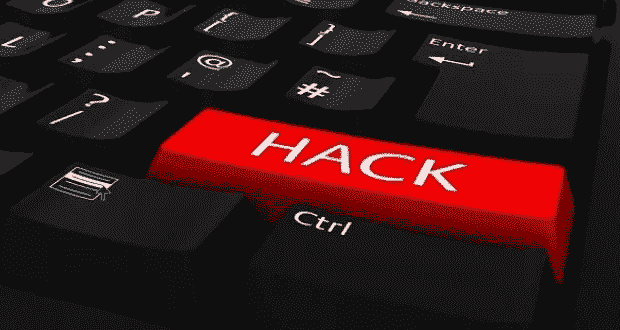
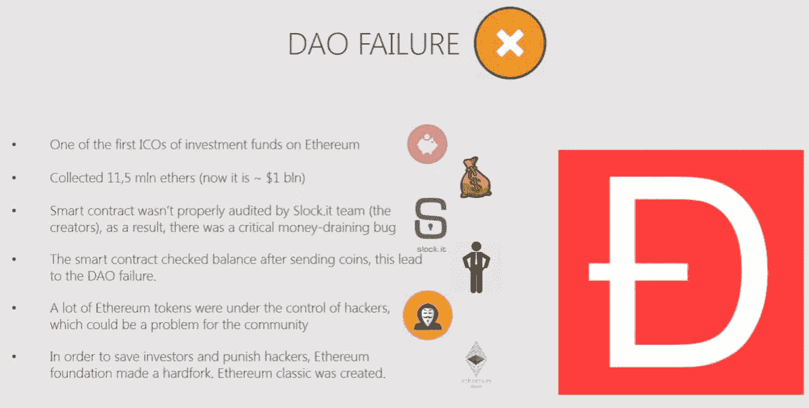
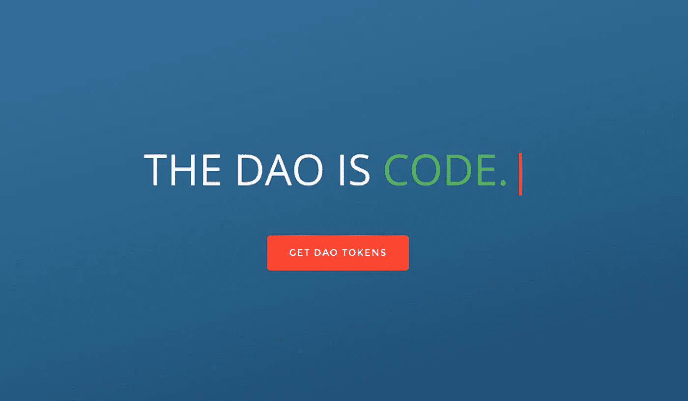

# 道的故事——它的历史和后果

> 原文：<https://medium.com/swlh/the-story-of-the-dao-its-history-and-consequences-71e6a8a551ee>

通过区块链技术成功实现的最不可思议的概念之一是 DAO，一个去中心化的自治组织。分散的自治组织是通过智能合同运作的实体。它的金融交易和规则被编码在一个区块链上，有效地消除了对中央管理机构的需要——因此有了“分散的”和“自治的”这样的描述

分散的自治组织(称为 DAO)旨在像风险资本基金一样为加密和分散的空间运作。缺乏中央集权降低了成本，理论上为投资者提供了更多的控制和机会。

2016 年 5 月初，以太坊社区的一些成员宣布了道的诞生，它也被称为创世道。这是在区块链以太坊建造的智能合同。编码框架是由 Slock 开源开发的。但是它是由以太坊社区的成员以“道”的名字部署的。DAO 有一个创建期，在此期间，任何人都可以向一个唯一的钱包地址发送以太，以换取 1-100 范围内的 DAO 令牌。创作期获得了意想不到的成功，它成功筹集了 1270 万英镑(当时价值约 1.5 亿美元)，成为有史以来最大的众筹基金。在某个时候，当乙醚的交易价格为 20 美元时，来自 DAO 的乙醚总价值超过 2.5 亿美元。

实质上，该平台将允许任何有项目的人向社区提出他们的想法，并有可能从 DAO 获得资金。任何持有道令牌的人都可以对计划进行投票，如果项目盈利，就可以获得奖励。资金到位后，情况开始好转。

# 刀的伟大开始出了问题

然而，2016 年 6 月 17 日，一名黑客在编码中发现了一个漏洞，允许他从 DAO 中榨干资金。在攻击的最初几个小时，360 万 ETH 被盗，当时相当于 7000 万美元。一旦黑客造成了他想要的破坏，他就撤回了攻击。

在这个漏洞中，攻击者能够在智能契约更新其余额之前多次“要求”智能契约(DAO)归还以太。两个主要问题使得这成为可能:事实上，当创建 DAO 智能合约时，编码者没有考虑递归调用的可能性，以及事实上，智能合约首先发送 ETH 资金，然后更新内部令牌余额。

重要的是要明白这个错误并不是来自以太坊本身，而是来自这个建立在以太坊上的应用程序。为 DAO 编写的代码有多个缺陷，递归调用漏洞就是其中之一。看待这种情况的另一种方式是比较

以太坊到互联网和任何基于以太坊的应用到网站——如果一个网站不工作，并不意味着互联网不工作，它只是说一个网站有问题。由于未知的原因，黑客停止了清空 DAO，尽管他可以继续这样做。以太坊社区和团队很快控制了局面，并提出了多种解决方案。

然而，这些资金被存入一个账户，该账户有 28 天的持有期，因此黑客无法完成他的逃跑。为了退还损失的钱，以太坊硬分叉发送黑客资金到原来的所有者可用的账户。代币所有者获得的汇率为 1 ETH 比 100 DAO 代币，与首次发行的汇率相同。

不出所料，黑客是刀末日的开始。许多以太坊用户对黑客攻击本身提出质疑，他们认为硬分叉违反了区块链技术的基本原则。更糟糕的是，2016 年 9 月 5 日，加密货币交易所 Poloniex 将 DAO 令牌除名，北海巨妖在 2016 年 12 月也做了同样的事情。

与 2017 年 7 月 25 日发布的美国证券交易委员会(SEC)的裁决相比，所有这些问题都相形见绌。这份报告指出:

由一个被称为“道”的“虚拟”组织提供和出售的代币是证券，因此受联邦证券法的管辖。该报告确认，分布式账本或基于区块链技术的证券的发行人必须登记此类证券的要约和销售，除非适用有效的豁免。那些参与未注册发行的人也可能因违反证券法而承担责任。

换句话说，道银行的发行与正在进行首次公开发行的公司遵循相同的监管原则。据 SEC 称，DAO 及其所有投资者违反了联邦证券法。

# 道兴衰的持续影响

虽然 DAO 项目已经结束，但它的影响仍在继续。当前的区块链开发团队不断地从 DAO 的例子中寻找指导——不要做什么。

首先，关于建立安全的区块链平台的重要性，DAO 给了我们宝贵的一课。道的黑客攻击并不是以太坊区块链固有的问题；它来自一个被聪明的黑客利用的编码漏洞。如果代码写得正确，黑客攻击是可以避免的。

其次，SEC 对 DAO 的裁决鼓励了区块链的初创公司想方设法避开安全注册和联邦监管。公司做到这一点的方法之一是使用 SAFT 方法。如果代币在区块链平台上具有合法的实用价值，

它们违反了豪威案的一个组成部分，因此不能被列为证券或受 SEC 监管。

没有刀，谁知道还需要教什么课。

## 这个故事发表在 [The Startup](https://medium.com/swlh) 上，这是 Medium 最大的企业家出版物，拥有 298，432+人。

## 订阅接收[我们的头条](http://growthsupply.com/the-startup-newsletter/)。

