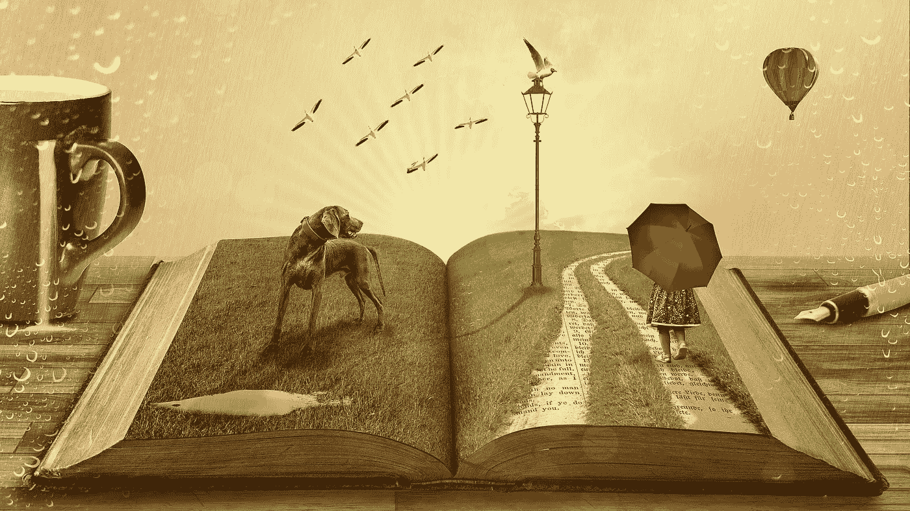

# 有效学习的微妙艺术

> 原文：<https://medium.com/swlh/the-subtle-art-of-effective-learning-3180e9ca013e>

[Source](https://pixabay.com/en/narrative-history-dream-tell-794978/)

纵观历史，关于学习的一个关键误解一直受制于社会:无论哪种练习方法能带来最直接的进步，都一定是最有效的。

例如，考虑一个篮球运动员，他经常从弧线的中心投三分球，当他继续练习从那个点投篮时，他就会进入状态…