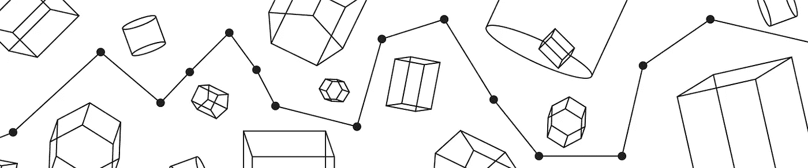
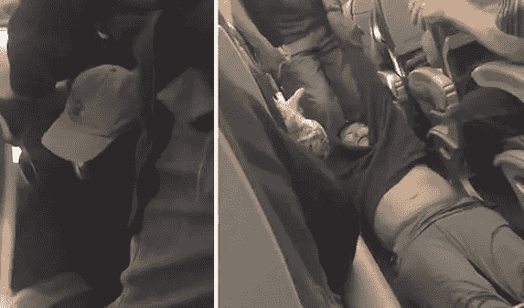
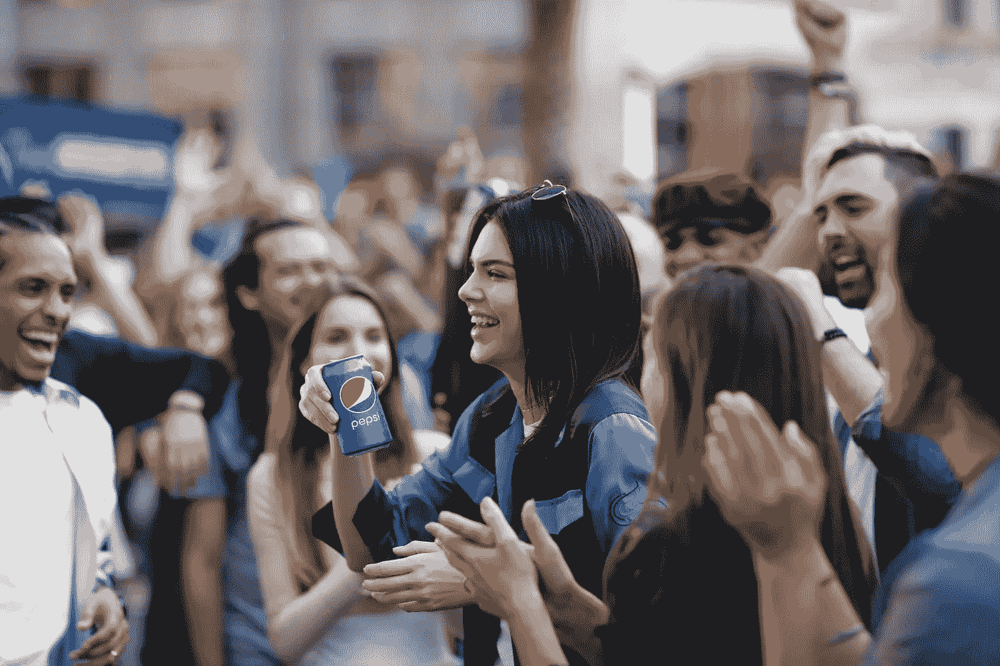

# 你的客户体验的总和比你想象的更有价值

> 原文：<https://medium.com/swlh/the-sum-total-of-your-customer-experience-is-worth-more-than-you-think-b8fd3697d43f>

## 是时候开始思考你的整体客户之旅了，它是你营销品牌的最有效工具。

几周前，我参加了明尼苏达大学的一个小型小组讨论。在这个团队中聚集了许多来自不同角色的设计专业人士，他们都来自某个机构。从创始业主到开发者、社交媒体战略家、市场调研、体验设计师(me)等。我们是一个充满活力的团队，是现代机构当前构成中的一个有趣样本。我们已经得到了提前学习的样本问题，一个可以浓缩成几个主题的列表(首先让我说 Snapchat 被提到如此之多，你会认为世界上没有其他可用的东西)。这些问题是一般性的，学生的问题，我记得当我坐在他们的座位上时(尽管在不同的位置)我也有类似的问题。有一个问题引发了一场有趣的对话“在社交媒体时代，广告的未来是什么？”

很高兴你问了。

## 服务产品的融合

在这次小组讨论之前，发生了两件真实的事情，我知道如果有机会的话，这些事情会在对话中发挥重要作用。这两个事件是[联合航空公司的“乘客重新分配”](http://thetrendingreport.com/united-airlines-has-passenger-beat-up-for-not-giving-up-seat/)和[百事可乐的肯达尔·詹娜广告](http://www.nbcnews.com/news/nbcblk/pepsi-ad-kendall-jenner-echoes-black-lives-matter-sparks-anger-n742811)，其中一名模特带领抗议者最终用一罐百事可乐团结了世界的种族紧张局势。

A passenger is forcefully removed from the plane when he refused to de-plane. There’s lots of explanation, reasoning, etc however in my opinion both parties could have handled the situation a lot better. The officer especially.

这两个事件对未来几年广告业的发展有着直接的影响。每一个都预示着一个不断发展的市场和不断变化的消费者需求的重叠性。每种情况都需要公关、广告、品牌、营销等的组合，所有这些都包含在我所说的客户体验中。

## 经验的总和将压倒所有广告或营销你的品牌的尝试

大约一个月前，我写了一篇名为 [*体验为王*](/swlh/rise-of-the-experience-consultant-ee8bc2f5a44e) 的文章，探讨了当前机构和大型咨询公司联合起来关注客户体验设计的趋势。随着支持客户体验设计及其对组织或品牌的巨大好处的数据不断涌入，我们将继续看到这一趋势。在那篇文章中，我对广告做了一个陈述:

> 可以说，体验是广告、营销和品牌意识的新形式，并将在未来形成。由于我们的互联世界，这些新的伙伴关系将必须实时管理关系、体验和对话。明白这一点的公司会找到在独特的接触点取悦客户的方法——“体验为王”

这与经济学人智库去年发表的一份报告一致，该报告称[“客户体验”将取代“大众广告成为客户的首选渠道”](https://contently.com/strategist/2017/06/08/failing-digital-customer-experience/)**“在新的数字经济中，确保客户体验将决定成败。”**

当看上面提供的两个真实世界的例子时，这些陈述是正确的。在这次混乱之后，曼联要恢复过来会有多难？他们有绝对的把握能防止它再次发生吗？我确信这两个问题的答案都是肯定的，有解决这两个问题的答案。如果答案存在，那么问题就变成了我们该向谁求助？如果我们调查一下联合航空公司事故的原因，我们会发现每家航空公司都超额预订了航班。每个人(通常)都有一个剧本，如果这成为一个问题，如何激励顾客自愿让座。你看，航空公司超额预订航班是有商业意义的，因为数据显示 6-15%的乘客没有乘坐航班([点击此处查看更多有趣信息](https://techcrunch.com/2017/04/11/overbooking/))，这意味着航空公司使用算法来预测他们应该超额预订的频率和旅行计划。事实上，他们知道如果让顾客不高兴，一年中的哪些时间和哪些旅行会给他们带来更大的“成本”。

> “……就像超级碗比赛一样，如果有人不能回家过圣诞节，对我们的不利影响是巨大的。最坏的情况是，有人在心里记下永远不要再和我们一起飞行。”

他们的客户对航班的体验直接影响到他们公司的成功。如果这些“客户接触点”中的任何一个与另一个不同步，客户忠诚度和满意度都会受到影响。在这些情况下，广告成为一个更大的参与计划中的一个项目，甚至可能是一个更小的预算项目？那么这些公司向谁寻求帮助和支持呢？他们的合作伙伴需要充分了解他们的商业模式，以及这种商业模式如何受到客户体验和旅程的影响。一个好的旅程如果没有跟上时代的步伐，可能会改变，因为外界因素会不断地影响它，一旦旅程变得消极，就需要更多的钱来让你的信息变得积极。它变成了你对成千上万人说的话，人们天生相信家人和朋友胜过你，这不仅是基本的心理学，也是常识。

## 通过数百万个渠道传递你的信息

你会看到，不是你在电视上的广告会把人们带到你的航空公司或喝你的汽水。当然，这可能会产生一些意识，我不想淡化让你的产品或服务在那里的重要性，但这个世界不再是由几个信息渠道统治。不，现在有几百万个。数以百万计的服务，部落，社交渠道，有影响力的人，你块茎，播客，世界在不断沟通，有更多的人对小品牌的人有影响力的意见。利基群体可能成为你的品牌的命脉。这些有影响力的人有能力做他们的名字所暗示的事情，影响观众把他们的购买力用在付给他们最多钱的人身上(好吧，不是所有人都卖光了，但是除此之外，他们没有工作怎么会坐在那里看起来很好呢？)当这组学生被问及他们目前如何搜索产品时，他们只知道一些网站、社交工具、朋友、有影响力的人和流行文化，但他们每个人在购买之前都会做一些社会调查。

## 影响者权力:巨大的权力伴随着巨大的责任

百事和肯达尔·詹娜走的是影响者路线，因为他们可以接触到他们想要的观众，并且确信狂热的粉丝会大肆宣传她是其中的一员。这不是一个坏主意，事实上，如果做得正确，它可以非常成功(Fyre Festival post pending ),但是我不禁看到了对影响者营销的巨大不信任。这些人被给予、支付或鼓励以公开和公平的方式“评价”产品。据推测。任何心理学家都会告诉你，可以说人们通常不会“恩将仇报”。我不想反对影响者营销，但我想说的是，不是每个影响者都值得你花时间，每当一个品牌与一个演员、影响者等上床时，他们都与那个人决定用他们的时间做什么有关，不管是好是坏。

Saving racial injustice one product placement at a time. I honestly think it was an innocent mistake of Pepsi and yes its a little in bad taste timing wise and content wise but I’d like to see how diverse the team was that worked on this was. I think we’d all be surprised and maybe realize that people were truly trying to say something meaningful in a silly commercial for a beverage…who knows.

当百事的广告做得不好时，不仅百事不得不从负面评论的漩涡中走出来，而且肯达尔·詹娜也很快被拖进了他们的泥潭。人们会很快开始将经历联系起来，不管这是否是预期的结果。他们与一个人的经历会影响另一个人，或者永远与另一个人联系在一起(或者直到他们忘记这件事)。

## 对此该怎么办

这篇文章的要点不是我不相信影响者营销(我不是一个超级粉丝，但它很有效)，而是统治你用来与你的受众沟通的渠道，并重新专注于为他们提供优质服务和产品，会有更大的价值。噱头不会长久。如果没有投入适当的时间和精力，它们很快就会产生效果，而且经常会导致糟糕的体验。花费大量的金钱来制作“病毒式”视频是很好的，但是如果你的客户体验中有一些点导致客户在愤怒中失去理智，你就会花更多的钱。也许是遗留的后端系统使你的公司无法进入新的技术时代，并导致你的内部团队以蜗牛般的速度工作。你应该明白，再多的广告或营销也不能解决这些问题。有一个更大的图景，这个更大的图景可以让你的投资获得比预期更大的回报。事实上，从员工道德到产量增加，更大的图景也能产生外部效应。在客户旅程中提高积分不仅会让您的客户满意，而且对您组织的好处也不容忽视。

我建议从这里开始:

1.  **盘点你的经历**:如果你不知道你目前正在从事或正在从事的工作，就不可能知道你需要解决或改进什么。这可以采取多种形式，通常是文档的集合。想想社交媒体渠道、应用程序、网站、客户服务、反馈表、实体店、技术人员、送货司机等等。
2.  谁是你的观众？一旦你对自己提供的东西有了概念，确保你知道你在和谁说话。没有什么比采访调查更好的了。冷硬数据和基于移情的信息(采访等)的某种组合是首选。
3.  **你的客户之旅是什么样的？**我们知道这些经历。我们知道谁在经历这些。我们不知道的是它们在解决实际需求方面有多有效。计划规划这个旅程，确保对成功和失败有所了解。为了感同身受，我喜欢捕捉每个阶段的情绪状态。
4.  **围绕每个项目建立一个商业案例。作为一名设计师，我想说的是，你需要在这些决策中运用商业头脑，并开始将它们货币化。一个航空公司因为一年以上的糟糕体验而失去一个客户的成本是多少？十点多怎么样？尽你最大的能力去做，记住糟糕的体验不仅仅会导致客户流失。如果这些人开始负面评价并告诉他人，那么客户收益就会下降。有处理负面事件和问题的成本，雇佣额外的支持人员，为错误或糟糕的经历买单，雇佣公关公司等等。根据问题的不同，这个列表还可以继续下去。**
5.  投资有意义的东西。如果你需要更多的广告，那么尽一切办法把你的钱投资到这些渠道上。确保没有其他的事情阻碍你的公司充分利用花在广告代理上的时间和金钱。
6.  **求助**。有很多专业人士将此作为他们的生活。如果你需要帮助来排列你的清单，那么就请人吧。如果你根本做不出清单，那就雇人。不知道如何处理你的清单？雇个人。就个人而言，我喜欢抓住机会，集思广益找出解决方案。构建该解决方案的原型，然后帮助完成构建。这是一个梦想成真。

不要低估客户体验对你的组织的影响。明智的投资和资源配置会带来丰厚的回报。我不是建议你取消价值数百万美元的超级碗广告，而是说超级碗广告的回报并不能解决你的问题。你的品牌吸引了更多的目光，但如果这些目光所附的嘴不喜欢它们所经历的，你的麻烦就比以前更大了。

[Dribbble](https://dribbble.com/WattleandDaub)|[Twitter](https://twitter.com/Wattle_n_Daub)|[insta gram](https://www.instagram.com/wattlendaub/)

## 这个故事发表在 [The Startup](https://medium.com/swlh) 上，这是 Medium 最大的创业刊物，有 292，582+人关注。

## 订阅接收[我们的头条新闻](http://growthsupply.com/the-startup-newsletter/)。

