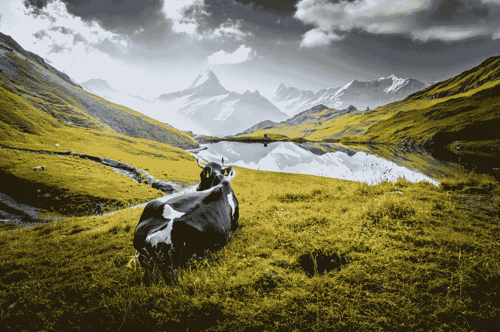

# 素食主义的(令人惊讶的)伦理

> 原文：<https://medium.com/swlh/the-surprising-ethics-of-veganism-5dcc73c9e92a>

有些人是混蛋。他们并不真正关心其他人，更不用说动物了。然而，我们大多数人都能看到我们非人类邻居的美丽和高贵。我记得在我长大的时候有一个老人在我身边。我想他经历过一次战争，朝鲜战争。他经历了很多，他知道很多，他很乐意分享。他是那种会给你建议的人，不管你…