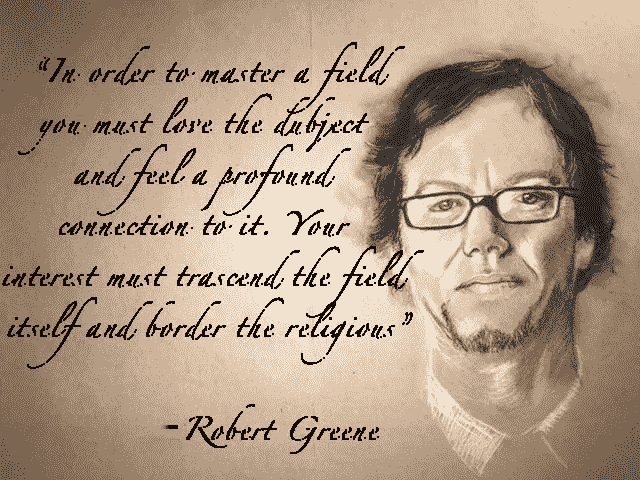
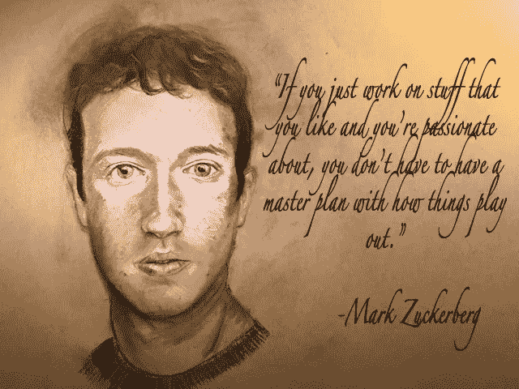

# 改变世界的惊人秘密

> 原文：<https://medium.com/swlh/the-surprising-secret-to-changing-the-world-dd4d2519f940>

Photo by [Simone Busatto](https://unsplash.com/photos/WZh1QZFB4kc?utm_source=unsplash&utm_medium=referral&utm_content=creditCopyText) on [Unsplash](https://unsplash.com/?utm_source=unsplash&utm_medium=referral&utm_content=creditCopyText)

# 介绍

你越想影响世界上的其他人，你就越不用考虑别人。事实上，你越想影响世界，你就越需要考虑自己。

> "我要做的事情太多了，所以我会花前三个小时祈祷。"—马丁·路德

不要误解，但最终创造出在全球范围内改变大量个人的结果的原因、结果和驱动力，是由一台不知疲倦的机器驱动的，这台机器不断寻求扩张——这台机器被称为个体自我，被驱动以最大化其潜力。

> 秘诀在于，你需要不断努力，这比什么都重要，不仅要最大限度地发挥你的潜力，还要认识到你有无限的潜力，不断努力拓展你的个人成长，这样你才能:

1.  提高你的觉悟(甘地，马丁路德金，特蕾莎修女)。
2.  选择正确的职业——你生来就要从事的职业(脸书的马克·扎克伯格的代码)。
3.  变得如此优秀，以至于你能够超越你的领域，重写它的规则(埃隆马斯克与特斯拉的电动汽车)。
4.  达到一种我称之为“贪婪的热情”的状态，这种状态将你的“工作”环境转化为引人入胜的乐趣，创造出无尽的动力和能量，让你渴望[以最佳状态度过每一刻](/swlh/8-reasons-most-people-arent-successful-and-8-ways-to-ensure-you-ll-succeed-7e8be17e5187)(所有那些一生中没有一天工作的人)。

> 对自己的彻底承诺，或“彻底自私(以一种好的方式)”被伪装成“改善世界”或“服务他人”，而事实上这是简单的自然选择，驱使一个人如此擅长某事，从而使他们感到有责任去接触尽可能多的人。

埃隆·马斯克是如此优秀，以至于他能够回馈社会。

马克·扎克伯格是如此优秀，以至于他能够回馈社会。

*但是回馈并不是驱使他们达到实际创造回馈结果的原因。*

我怎么知道这个？因为他们服务的人也是天生自私的，他们允许自己被感动。他们也只是关心，因为这对他们最好。

如果你不相信我，那就去问问数百名失败的公司创始人和非营利组织创始人，他们生产的产品或服务无人问津。

> 让你(以及扎克和马斯克)贪婪热情的内在力量、驱动力和一切都是自私的——对自己的承诺。
> 
> 追求卓越的动力。
> 
> 这一成就的副产品变成了触及人们的工作。

这并不是一件坏事，就像许多术语和概念一样，我们误解了它们。

最后——这绝不是一篇消极的文章，尽管我知道有些人会选择这样理解。

# 你认为是什么驱使人们去改变世界？

“改变世界”到底是什么意思？

在当今世界，我们通常在我们所做的工作和成为我们最好的人的背景下使用它。

> 像马克·扎克伯格和埃隆·马斯克这样的人是不是一开始就想‘改变世界’？或者他们正在努力成为最好的自己？

像马克·扎克伯格(向前移动被称为扎克)和埃隆·马斯克(后来被称为马斯克)这样的人所采取的驱动力和动机，给了他们为扎克“连接世界”和为马斯克“解决人类最大的挑战”的驱动力和动机。

这是一种对自我的承诺，一种彻底的自私，致力于最大化自己的潜力，其影响的副产品是别人(世界)如何采纳你的效果。

# 我的简短故事和作品灵感

当我写东西的时候，我觉得我站在世界之巅。那是一种无法形容的火，在它活动的每一秒都让我如饥似渴。

被驱使去读和写，学习和创造。

> 与他人分享它才是有意义的，因为关系使它有意义。没有与他人的关系，什么都不重要。
> 
> 为什么？因为人类物种因为大量合作而成功。如果我们没有与关系合作的能力，自然选择早就杀死我们了。

当我要点击发布时，我觉得好像我在外太空，看着地球，实际上推动地球在世界上留下凹痕。

我相信我生来就是为了写作，当我看着自己变得最好的时候，我什么也不想做。

**这是我需要的全部财富，这是扎克和马斯克需要的全部财富**。

他们从未被金钱所驱使。

扎克毫不犹豫地拒绝了 10 亿美元，马斯克放下了他辛苦赚来的 1.8 亿美元的积蓄来拯救他的公司。

我现在有这种感觉，并相信这是我最终会产生巨大影响的原因和创造者，随之而来的是财务表现。

几千年来，圣贤们一直说要为他人服务，让自己充满激情，这已经被误解，并在情感上削弱了许多人。

我这样说不是作为一种哲学上的陈述，我是作为一个事实来说的。

例如，当我们忍住不去挽回某人的感情时，我们没有教导他们，这是对他们的伤害，几代人都受到了影响——包括我自己，直到现在。

他们说，为他人服务让自己变得忠诚。这是衰退的秘诀，而不是进化——这正是我们在当今世界所目睹的。

> 这绝对不是说没有同情心或不敏感。用同情去理解，但更真实。
> 
> 运用敏感性，传递智能沟通。

**我们天生首先自私地生存，为他人服务有助于这种生存。**

> **如果我们没有生存的动力，为他人服务就没有任何意义，因此我们不会去做。**

当我们达到这种自我承诺的状态，并看到它的劳动成果时，生活变得如此令人兴奋和充实，旅程变成了它自己的奖励——贪婪的热情本身就是奖励的载体。

你过好每一刻，过好每一天，你的时间慢了下来，因为它太有意义了。

好消息是，当我们最大限度地发挥我们的潜力时，我们对他人产生了最大的影响，通常是为了进步和更好(尽管这总是可以争论的),当然，马克·扎克伯格和埃隆·马斯克是改变世界的伟大人物。

我指出他们的“为什么”，不是外在的(人性，联系人们)，而是内在的(尽我所能影响更多人，成长为我最好的)——这导致了他们最有效和最终的结果。

**我编织了我自己的人生经验，以及我是如何从创业到写作的，并最终向你提供了我所使用的三步过程，以及先驱心理学家米哈里·齐克森米哈里博士为创造你自己的“贪婪的热情”所开出的处方**，个人扩张的内在驱动力需要被驱动以每天“贪婪地”做足够多的事情，这最终需要创造一些大胆的事情，从而改变世界。

在这种情况下，我将“贪婪”定义为一种渴望存在并变得更好的状态。可能不完全正确。我只是碰巧喜欢这个词，它准确地表达了我阅读和写作时的感受。

我不想让它结束。

我每一秒钟都在狼吞虎咽。

我品尝每一秒钟就像我打破了三天的斋戒。

*   * *此外，我不是“专业的”心理学家或精神病学家，尽管我阅读了数百本书，远远超出了本科或研究生学位在该领域给你的基础知识，而且我在过去两年里一直接受组织心理学博士的指导。我还会指出，在一家公司的领导岗位上雇用和解雇 100 多名员工、领导团队实现财务目标以及领导人们实现职业生涯的工作经历，让我们对人们的动力和动机有了真实的了解。以至于我现在以指导高绩效者为生。尽管如此，请认识到这仍然只是我的观点。***

最后:

> **科学上的任何突破都可能来自系统之外。“专家”是对给定科学的规定范围内的发展知识最熟悉的人。**
> 
> **——Maxwell Maltz 博士，医学博士，FICS，心理控制论的作者；销售了 3000 万册的开创性书籍。**

# **第一个**

是什么让最大的变革推动者有足够的动力去思考，去相信他们可以首先改变世界？

是什么让他们相信他们有能力做出如此大胆的事情，让我们这个拥有 70 亿人口的庞大世界变得与以前不同？

是什么驱使马克·扎克伯格大胆地“连接世界”，又是什么驱使埃隆·马斯克去迎接人类面临的最大挑战，比如能源和外太空？

结果是你如何做你正在做的事情，原因是为什么。

一个简单而深刻的秘密是当地的环境，这种环境将看似“努力工作”的事情转化为“引人入胜的乐趣”——贪婪的热情。

在你的生活中，每天都工作，一天也不工作。

> **你的工作被体验为你自己的延伸**，被激励和兴奋地驱动着成为你最好的自己——利用你选择的职业或技能作为载体，以越来越快的速度最大化你的潜力。

**当你看到自己的成长越来越快，并开始越来越快地看到反馈，你就继续加速个人成长，从而产生更多改变游戏规则的工作，最终传播到其他人。**

这是真的，因为人们分享也是出于自私的原因。无论是因为他们发现了很酷的东西而进行的口碑营销，还是因为代表了他们的立场而分享一篇文章。

分享不是关心他人。分享是自私的。

最好的自然选择。自私的人卖给自私的人。

# 1.达到贪婪热情的第一步

> "自私的基因实际上解释了利他的个体，对我来说这是非常清楚的."理查德·道金斯博士；传奇生物学家，《自私的基因》的作者

承认并接受你的自私，并感激这对你有好处。

这不是一件坏事，不需要压制，而是应该接受。

我们是自私的有机体，为了生存而生，是[40 亿年遗传成功的结果。](/@ARTaghavi/8-reasons-most-people-arent-successful-and-8-ways-to-ensure-you-ll-succeed-7e8be17e5187)随波逐流，不要抗拒。

抵制自然选择永远不会奏效，而且会导致失败。

扎克伯格和马斯克(以及我们所有人)从根本上来说都是自私的，并不像我们希望的那样受到“连接世界”等外部因素的驱动。

> 它们本质上是由情感驱动的，这些情感触动了它们已经变得有意义的深层共鸣——主要基于过去的苦难(这很常见)。

这是一种内在驱动力的结果，这种驱动力来自于坚定的信念和他们自己的信念——以及相信他们能够实现如此大的想法(无论它们是什么)以满足他们追求最佳状态的信心。

埃隆·马斯克可以开创任何事情，他会做得很大。

别人可能会攻击同样的问题，做的小一万倍。

唯一的区别是对他们的规模、能力、信念和信心的看法。

** * *快速提示:这篇文章的目的不是要抨击马克·扎克伯格或埃隆·马斯克，也不是说所有的人都是坏人，因为他们自私。我是实事求是的，并指出我最近认识到的关于人性的一个严酷事实。许多人会对此感到愤怒和困扰，或者说承认我写这些真相的方式是不道德的。我甚至不是说我们不应该积极地改变它们，因为我们作为有知觉的生物，拥有意识之光。然而，我要说的是，我们 95%的行为都是无意识的，我们被束缚住了，因此一般来说是被自私所驱使。****

*进一步注意到理查德·道金斯博士也说过:*

> “让我们努力教导慷慨和利他主义，因为我们生来自私。让我们明白我们自己自私的基因在做什么。因为我们可能会有机会打乱他们的设计，这是其他物种从未渴望过的。”

回到我们预定的节目:

# **2。追随你个人独特的爱好——第二步**

## 从这里开始:你必须做你不能不做的事

> “你拥有一种内在的力量，这种力量试图引导你完成人生的任务。你在有生之年要完成的事情。在童年时，这种力量对你来说是清楚的，它引导你走向符合你的活动和倾向的活动和主题，从而引发了深刻而原始的好奇心。在这中间的几年里，随着你更多地听取父母和同龄人的意见，这种力量会逐渐消失。这可能是你不快乐的根源。你对自己的身份和独特之处缺乏了解。走向精通的第一步总是向内。了解你到底是谁，并与那种与生俱来的力量重新连接。清楚地知道这一点，你就会找到通往正确职业道路的道路，其他一切都会水到渠成。”罗伯特·格林,《掌握》的作者

格林的意思是，你天生就擅长某件事，而且与这件事的联系比其他任何活动都要紧密。这就是你在基因上与地球上其他 70 亿人不同的地方，他们长期与你在一起，在合作的自然选择过程中发挥作用，使人类成为获胜的物种。

不是情商或者智商的问题，是个性的问题。

所以每个人都不聪明也不笨。每个人都只擅长一件事(或一类事)。

他引用了古希腊诗人品达的话并转述如下:

> “你生来就有特殊的性格和倾向，这标志着你是命运的一部分。这就是你的本质。有些人永远不会成为自己；他们不再相信自己；他们顺应了别人的口味，最后戴上了一个掩盖自己本性的面具。如果你允许自己通过关注自己内心的声音和力量来了解真正的自己，那么你就能成为你注定要成为的人——一个个体，一个大师。

这种力量是对我们个人差异的颂扬，小时候就很容易了解。

它可能是你多年来一直想知道或被你吸引的一项活动，并且一直是你想抓的痒处。

你必须自私地选择你的生活，因为它需要是你擅长的事情。

你一定不要感到内疚，不要理会那些反对你的人，比如父母和同龄人，他们告诉你要谨慎行事，或者选择一条不同的道路。

我这样做了四年，并为此付出了代价。如果你想利用日复一日的驱动力和热情，你必须找到跟随这一召唤的勇气，这是熟练工作和成为最好的必要条件。

不必是今天，也不必是现在。慢慢来。我去了三家不同的公司，才建立起信心和勇气，知道我需要写作。

这就是格林得出结论的原因:

Art by Juan Jiminez

# **成为你最好的自己，改变世界**

在一个拥挤的世界里做到最好需要这种与你的手艺的深层联系，这样你的工作才不会感觉像工作。

更不用说，你一生中有三分之一的时间在‘工作’，如果它不有趣、不愉快，那就太可惜了。

超越“其他人”已经够难了，要超越最好的人需要与你的技能相联系。

你需要每一寸，正如我们刚刚读到的，它始于跟随那种深深的倾向和活动，这种倾向和活动点燃了你内心的爱与和平的情感，这最终体现在你的工作中，然后让别人感受到。

我说的是那 1%或者 0.1%。你如何与他们竞争？

这些人致力于他们不能不做的事情。

对我来说，就是写作和阅读。我不能不做。

迄今为止，在我五年的创业历程中，我从未能够做到这一点。

小时候就有迹象，但它在我生命的大部分时间里都处于休眠状态。在早些年，直到不久前，我只是专注于走自己和父母认为正确的道路。

真的没有什么可担心的了。上大学赚钱。叫我大器晚成吧。

在我第一次尝试进入一家刚刚关闭的公司后，我开始注意到写作的问题。当我开始全职创业的第二年时，我迷失在书籍中，贪婪地试图尽可能多地吸收。

我意识到我从那次尝试快速启动一个大想法的经历中学到了很多，也许我可以用我的许多经验来回报。

我开始注意到写作把我带到了另一个地方。我开始注意到自己在这方面有多擅长，进步有多快。

一天，我带着父母的狗在公园散步，突然有一种灼热感，就是人们所说的“肚子里的火”。

我终于明白了那是什么，我以前从未有过这样的感觉。它占据了我的整个身体。我回到家，以从未有过的最深沉的心流阅读和写作。我对正在发生的事情非常兴奋，我无法控制它。

我知道我发现了一些东西，但事后看来，我当时并不太清楚是什么。

那天的外在表现激发了我阅读和写作的热情。就像，我感觉被召唤去立即阅读和写作。对人性的渴望是它的结果，我想知道一切。我可以永无止境地做这些事情，而没有一刻被认为是“工作”,这激发了我每天永无止境的能量。

> 从那天起，我最终犯下的错误是，我没有把那种召唤引导到我自己和那种活动中，因为，我对此并不自私。

更确切地说，我把它引导到我已经被控制的其他外部力量中。

我全身心地投入到快速成长的科技初创企业中，因此我的收获是:

“我喜欢实践生产力、个人成长和哲学，所以我应该制作[生产力应用](https://chrome.google.com/webstore/detail/sprint-for-gmail/elejjipohnpknkkfgfaalphfingmhnlc?hl=en)(后来演变成[学习软件](http://www.traena.io))来以我所知道的最好方式帮助人们。”

虽然我是一个生产率呆子，喜欢优化自己的一切(我读和写的最多的东西)，但我把它引向的活动是错误的。向大型企业出售软件的活动并没有让我产生强烈的热情。

如果我被叫去编码(扎克伯格)，也许会是一个不同的故事。

这并没有让我每天都想撕了它。它仍然需要巨大的意志力才能出现，如果你想每天都做一些让你满意的事情，并发挥出你绝对的最佳状态，这种意志力最终不会持久。

所以我犯了两个错误:

*   第一，销售软件并不是我唯一的天赋(我不写代码)。
*   第二，我在错误地思考“为他人服务”。我在想，我需要帮助别人，这是出于我自己的原因，这将使我每天对我的工作充满热情和贪婪。但这是不正确的。

我需要练习我最擅长和最喜欢的活动，这样我就可以每天醒来都感觉自己处于最佳状态，所以成为那天的最佳状态是我唯一的最终目标。

> 当这个飞轮获得动力时，你开始以越来越快的速度扩张，你开始看到你内在无限潜力的证据(最终有能力和信念在全球范围内创造变化)，你对什么是可能的信念会冲破屋顶。

这将使我最终对人类产生最大的影响——最大化我自己的潜力。

我意识到不自私和做命中注定属于我的事情会阻碍我——也可能阻碍其他人。

正是这种自私让人类拥有无限的潜力。

这很重要，因为这是让“工作”变得愉快的原因，而且是关于我(或你)的。

> “驱使动物提升其基因的神经化学是驱使你关心你的遗产的东西。理解这一点对你的幸福很重要。”— [洛蕾塔·布莱宁博士](https://www.psychologytoday.com/blog/your-neurochemical-self/201108/the-animal-urge-leave-legacy)

# **所以我们知道如何选择我们的活动，但是是什么创造了“贪婪”的无尽热情呢？**

现在我们知道马克·扎克伯格不是被“连接世界”的动机驱使去为人类服务的，那么他是如何被驱使的呢？

当有人说一个问题让他们如此恼火时，他们想致力于解决它，他们是在致力于自己的(自私的)情感。

不是因为那些受苦的人(尽管重新将它放在上下文中以感动和影响他人确实使它变得有意义，但他们的意图和动力仍然来自克服个人挑战和做出改变，为他们自己和他们的实现过上有意义的生活)。结果变成人被改变。

所以下一次有人说他们关心人类的未来，想让它变得更好时，他们还不知道或者将要艰难地学习的是，他们需要首先做一些扩展自己的事情，这样他们才能变得足够好，让足够多的人注意和关心。

因为受到影响的人也很自私，他们只关心你所做的对他们有帮助的事情。

所以对于扎克伯格来说，当他说:

Art by Juan Jiminez

当他第一次创办脸书时，这意味着:“我是最好的程序员和软件制造商，女孩们不喜欢我，所以我用这种技能创建了一个网站，这样女孩们就会喜欢我。”

众所周知，这是扎克最初的动机，没什么大不了的，也不罕见。

大多数男人的动机是寻找伴侣，而永远吸引不到伴侣是一种巨大的恐惧。

随着他的进化和吸引异性的满足，他在大学里超越了女孩，为他周围的每个人服务。

随着他超越他的学院，并进一步发展，它成为美国所有的学院。

随着他超越美国的大学生，他进一步发展，然后变成了“我想连接世界”，这是每个伟人的原始征服，即“留下遗产”或“改变世界”。

这就是为什么扎克伯格一生中从未工作过一天，而表现最好的人也从不工作。他们只是有*贪婪的热情，然后他们原始的天性接管他们，成为他们最好的。*

他们发现了自己独有的活动，这让他们的大脑在工作时变得活跃，增加和扩展了自己，使工作变得如此有趣和充实。每一刻都是火，渴望更多。

因此，我们似乎是在为比我们自己更伟大的事业而努力，最终我们会创造出不仅仅是我们自己的东西，但这种动力来自于其他东西。

这种动力来自于内在的自私和对我们所做事情的热爱，因为这让我们觉得我们对他人(这个世界)拥有最大的控制力、影响力和影响力。

> 像许多人一样，我克服了童年时代的挑战，直到最近才摆脱，并且痴迷于用文字来表达。
> 
> 我是为自己而写，但我尽我所能让它写得又好又密，这样它就能触及和影响尽可能多的人。
> 
> 如果你认为这是自私的，它就是。但这要求我做到最好，尽我所能影响他人。
> 
> 如果你不做任何不是特别自私的事情，你就不会有每天都过着充满活力、丰富多彩的生活所需的贪婪热情。

这就是为什么如此多的公司员工很难对他们的工作感到满意，公司企业的结构不是为人们扩展自己而建立的，而是为人们维护自己而建立的。

做你喜欢的事情，没有空间去推动和扩张到人们认为你在一家大公司着魔了(你是，以一种好的方式)(如果你这样做，每个人都会认为你很奇怪，取笑你或者只是想知道为什么)。

人们认为这是努力工作或天赋或运气或任何这些事情，但它不是。

这给了一些人破釜沉舟、全力以赴的勇气。

是什么让马斯克有风险偏好，把他一生积蓄的 1.8 亿美元押在他刚刚通过出售一家公司辛苦赚来的钱上。不是为了别人，是为了他的进化。

我最终决定跟随我的召唤去阅读和写作，其他的都不重要了。我的银行账户中缺少“适当的融资渠道”,风险。什么都不重要。

这是我所需要的全部财富。

> 这就是几千年来圣贤们所说的“被上帝召唤”。
> 
> 这就是当时宗教学者如何被推动通过娴熟地撰写最好的宗教书籍来为他人服务，这就是现在埃隆·马斯克和马克·扎克伯格如何被推动建立改变世界的公司。

这是驱使最优秀的创始人一直工作的原因，因为不是工作，而是他们。

这是让最好的作家一直阅读和写作的原因，因为这不是作品，而是他们。

最优秀的艺术家、音乐家、创作者就是这样练就了一万个小时。他们发现了自己生来要做和擅长的事情，他们一生中从未工作过一天，但他们确实投入了 10，000 个小时，因为这是为了他们，他们热爱每一分钟。

# 3.找到对你有意义的东西

有很多方法可以达到你的个人真相。

许多人是被过去的苦难或需要克服的个人挑战所驱使，这些都可以被重新融入到隐藏的礼物中。

我们知道扎克伯格做到了这一点，我们大多数人都有一个问题要克服。

我[克服了自己的渺小，以我希望被对待的方式被对待](/the-mission/this-5-minute-daily-habit-will-get-people-to-treat-you-how-you-want-to-be-treated-be5cf1a52828)，并因此写下了我所写过的最具病毒式传播的文章。

我的朋友很矮，但通过成为一名大商人，他向世界证明了自己的高大。

我不是说这是理想的，但如果有一个潮流，就接受它。

Ta-Nehisi Coates 在纽约公共图书馆的[演讲后改变了我的生活——我对他谈到的对黑人的不公正感到非常愤怒。](https://www.nypl.org/audiovideo/ta-nehisi-coates-khalil-gibran-muhammad)

我现在正在写电影剧本和电视剧本来根除这个问题，因为它给我带来了痛苦的情绪。

我想将这种情绪融入到我的工作中，以影响他人。

克服痛苦或与他人的痛苦联系起来，并将其重新置于背景中以克服痛苦，是通过贪婪的工作过贪婪生活的一种常见方式。

在他的开创性著作*中，米哈里·齐克森米哈里博士建议:*

承认痛苦或创伤，即使在童年，也有隐藏的天赋。你的工作是把它解释为一个可能的挑战，从而拥抱它来改善你自己。这给了你目标。然后你会意识到世界上还有很多和你一样的人在遭受同样的问题。成为你最好的自己是你的使命，这样你就可以影响到其他有你问题的人。

Cziksentmihaly 称之为“耗散结构”，即从无序中获得有序的能力。

他进一步指出:“这种挑战会延伸到其他人或整个人类。”

他讲述了一个美丽的故事，一个(匿名的)成功的高调的人，他称之为“E”。

e 的父母来到美国时除了梦想一无所有，经济上也很贫困。在他 7 岁生日时，他们给他买了一辆自行车。

一天，当他骑着它的时候，被一个富有的医生的车撞了。医生承诺，如果他的父亲不向警方报案，他将支付医疗费。他的父亲，除了相信医生，别无选择，同意了。医生失踪了，无处可寻。e 的父亲被迫负债，从此一蹶不振，成了一名酒鬼

齐克森米哈里继续说道:

> “这件事可能是一个创伤，给 e .留下了永远的伤疤，使他变成一个愤世嫉俗的人，从现在起无论如何都要为自己的利益着想。相反，e .从他的经历中吸取了一个有趣的教训。他用它创造了一个生活主题，不仅赋予了自己的生活意义，还帮助减少了许多其他人经历中的熵(无助感)。他决定成为一名律师，不仅是为了改善自己的生活，也是为了确保他所遭受的不公正不会如此轻易地再次发生在处于他这种地位的人身上。一旦他为自己设定了这个目标，他的决心就不会动摇。”

e 最终成为一名首席律师，然后成为一名法官，成为为移民和少数民族争取民权政策和立法的美国总统的助手。

Cziksentmihaly 博士总结道:

> E 的例子说明了人们如何伪造发现的生活主题的几个共同特征。首先，这个主题在很多情况下是对早年遭受的巨大个人伤害的反应。变成孤儿，被遗弃或者受到不公正的对待。
> 
> 外部事件永远不会决定主题是什么。重要的是一个人对苦难的解释(和意义)。

他继续说道:

> “那么下一个问题是，一个人的苦难导致了什么样的负熵生命主题呢？如果一个被暴力父亲虐待的孩子得出结论，这个问题是人性固有的，所有的男人都是软弱和暴力的，他或她对此无能为力。
> 
> 另一方面，为了在痛苦中找到目的，一个人必须把它解释为一种可能的(个人的)挑战，这种挑战对其他人或整个人类都是普遍的。在 E 的案例中，将他的问题表述为由于被剥夺权利的少数民族的无助，而不是由于他父亲的过错。然后，e 能够发展适当的技能来面对他从个人生活中的错误根源所看到的挑战。因此，无论他为自己的问题找到什么样的解决方案，不仅对他自己有益，而且对其他许多人也有益。这种概括解决方案的利他方式是典型的负熵(积极解释)生活主题给许多人的生活带来了和谐。"

# 结论

这就是为什么这么多人被驱使去成功。如果你想成为最好的自己，改变世界，第一步就是要开始说出硬道理。

*   有什么是你不能不做的？
*   什么能让你发挥出最好的水平？
*   为什么要改变世界？

答案没有好坏之分，它们只是让我们成为人类的条件。

对于马克·扎克伯格来说，它始于编码以获得女孩。现在是连接整个世界。

对我来说，就是写作，向世界证明自己。

# 对你来说是什么？

我们的线路和复杂的头脑想出了各种各样的方法来赋予事件意义。

如果你想像马克·扎克伯格(Mark Zuckerberg)和埃隆·马斯克(Elon Musk)那样改变世界，那就从带着贪婪的热情生活开始，这种状态让每时每刻都充满激情和兴奋——在这种状态下，永远不会有工作，因为这一切都是为了让自己成长。

你被驱使去最大化你的潜力，这只会随着你成长的越来越快而被推向越来越高的水平。

你的想法越来越大，你开始影响越来越多的人。

> 但是要知道，你影响的人越多，你就越不需要考虑他们的潜力，你就越需要考虑最大化你的潜力。

以这种方式工作，你会有很多乐趣，所以改变世界甚至都不重要。

这些人很幸运，有一天醒来发现自己像埃隆·马斯克或马克·扎克伯格一样改变了世界。

## 这个故事发表在 [The Startup](https://medium.com/swlh) 上，这是 Medium 最大的企业家出版物，拥有 275，554+人。

## 订阅接收[我们的头条新闻](http://growthsupply.com/the-startup-newsletter/)。

