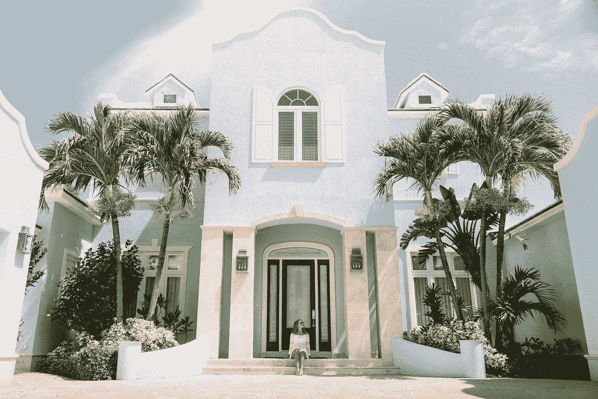

# 房屋所有权的惊人真相

> 原文：<https://medium.com/swlh/the-surprising-truth-about-home-ownership-2d58dfec1c0c>

“woman sitting in front of building” by [Jared Rice](https://unsplash.com/@jareddrice?utm_source=medium&utm_medium=referral) on [Unsplash](https://unsplash.com?utm_source=medium&utm_medium=referral)

当我告诉人们我选择租房时，他们经常会感到惊讶。

我有一份收入稳定的好工作。我应该买自己的房子，对吗？

不一定。自有住房有正反两面。 人们的生活境遇不一。有些人看重**的灵活性甚于扎根。**