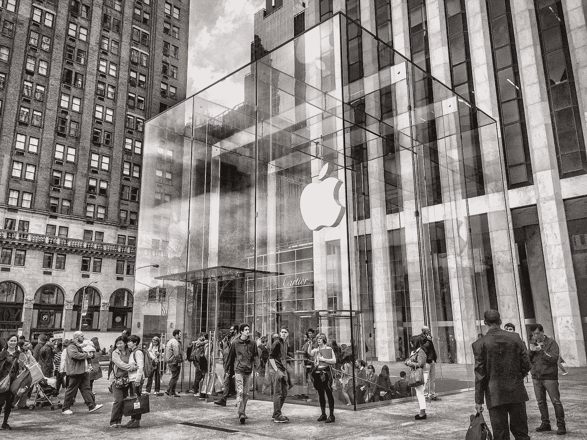
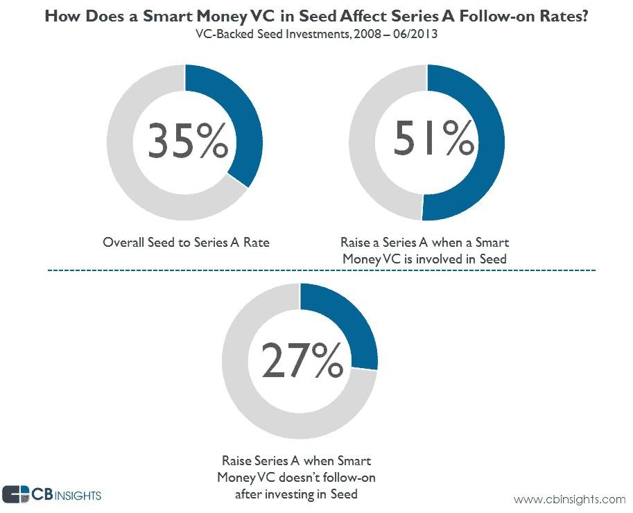
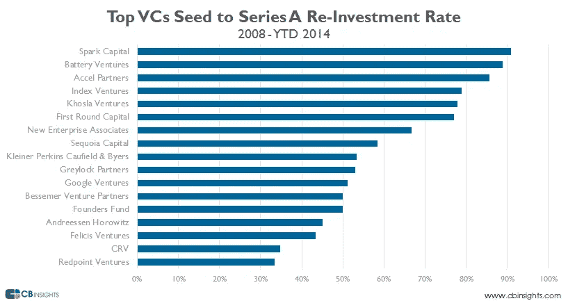

# 从风投那里筹集种子资金的惊人真相

> 原文：<https://medium.com/swlh/the-surprising-truth-about-raising-your-seed-round-from-vcs-a0e6af038e46>

## 信号的潜在力量可能会让你的 A 系列获得高分，也可能会毁了你的 A 系列

你可能去过苹果商店。即使你只走过一次，你也会注意到苹果商店似乎总是挤满了顾客。与此形成鲜明对比的是，尽管有温暖的装饰、大量乐于助人的员工和一系列设备，微软的零售店似乎从来没有足够的顾客。

Photo by [Pixabay from Pexels](https://www.pexels.com/photo/5th-avenue-america-apple-store-architecture-279166/)

史蒂夫·乔布斯喜欢看到人们在苹果商店前排长队购买最新的苹果产品。为什么？

1.  长长的队伍可能是该产品需求旺盛的最明显的信号。
2.  长长的队伍[以低得多的成本增加了产品的价值和吸引力](https://www.theatlantic.com/business/archive/2015/01/the-logic-of-long-lines/384870/)。
3.  长长的队伍产生了吸引新闻媒体、更多顾客和社交媒体的免费宣传。(想想《T4》中的那些台词吧，它们引起了嫉妒，也让旁观者渴望尝一尝。)

一些餐馆已经将“等待文化”作为质量的标志，食客们最终将食物看得比休闲时间更重要。在 [*影响力:说服心理学*](https://www.amazon.com/Influence-Psychology-Persuasion-Robert-Cialdini/dp/006124189X) 一书中，罗伯特·恰尔迪尼讨论了当一个穿着西装的衣冠楚楚的男人迈出第一步时，人们将如何更容易地违反法律——比如在红灯时乱穿马路。同样，车越贵，如果司机没有注意到灯已经变绿，人们等按喇叭的时间就越长。

你看，信号无时无刻不在传播。[信号理论](https://en.wikipedia.org/wiki/Signalling_theory)通过潜移默化地影响大众的决策和行动，对文明产生了强大的拉力。事实上，如果没有信号理论，炫耀性消费或[凡勃伦商品](https://en.wikipedia.org/wiki/Veblen_good)就不会存在，因为寻求地位象征的动机会消失。

Photo by [Artem Bali from Pexels](https://www.pexels.com/photo/come-in-we-re-awesome-sign-1051747/)

信号理论的要点是，在任何时候、任何情况下，你都在向你周围的人传播你的信仰、价值观、身份、个性和生活方式，通常具有重大的社会意义。信号理论有助于描述双方(个人或组织)访问不同信息时的行为。通常，一方必须选择是否以及如何发送该信息，另一方必须选择如何解释该信号。

> 你是一个电台。你总是在广播。不管你喜不喜欢，只要活着就关不了。
> 
> 你也是一个无线电接收器。你不断实时解读他人的广播，做出快速判断。

你通过教育向潜在雇主表明你的能力，通过免赔额和保费水平向保险公司表明你的风险偏好。生活在保守地区？在你的汽车保险杠上贴一张自由贴纸。住在自由区？在你的车上贴一张保守的保险杠贴纸。人们对你的反应会非常不同，即使其他什么都没有改变，你也从来没有说过一句话。

近年来，信号理论的使用势头越来越猛*以至于*维塔利克·布特林错误地[用它作为论据](https://www.bbc.co.uk/news/technology-36185622)来反驳克雷格·赖特声称自己是中本聪的说法。

## 信号传递如何影响风险投资融资

不出所料，信号理论也捕捉到了风投和初创公司之间的动态。风险投资和创业公司之间，以及风险投资和其他投资者之间存在信息不对称。初创企业的创始人比新股东和债权人更了解他们企业的运营和前景。由于风险投资通常不像企业家一样拥有相同的信息，他们必须发现有助于定义公司概况的信号(如尽职调查)。

这些信息不对称源于两个来源:“隐藏信息”和“隐藏行为”。“隐藏的信息导致逆向选择，例如，投资者无法区分高质量和低质量的企业家。“隐藏行动”导致道德风险问题，本质上是投资者无法判断企业家决策的努力水平和质量。

Photo by [Gladson Xavier from Pexels](https://www.pexels.com/photo/war-chess-59197/)

创投资本家通常关注你公司的信息以及它所传达的信息，因此他们可以预测其他创投资本家对每一条信息的反应。风投们喜欢互相攀谈，常常表现得像旅鼠一样。当他们发现没人想投资你的公司时，他们会很不情愿这样做。如果像红杉这样的顶级风险投资公司突然决定投资你的初创公司，这向更大的行业发出了信号，你的初创公司值得关注。这对你的初创公司来说是一个巨大的福音，让他们的一些“社会证明”感染到新面孔的公司。优柔寡断的风投会更快拿定主意，那些之前放弃你公司的风投会重新考虑他们最初的决定。

对于初创公司来说，每一次融资活动都在内部向公司员工传递信息，在外部向更大的市场传递信息。 [研究人员发现](https://www.gsb.stanford.edu/insights/vc-funding-signals-growth-strategy)在早期的几轮融资中，员工流动率在融资活动之前显著下降，这表明即使在工资上涨之前，这个信号也是可信的。它告诉员工，“嘿，我们是一家好公司。”员工开始相信公司的未来，决定留下来。

融资事件向更大市场发出的信号表明，这家特别的初创企业值得关注。随着初创企业数量超过潜在投资基金，融资活动本身与它注入公司的资源数量一样重要。

**你筹集资金的时间长短也发出了一个信号。一旦你投出了第一个投资者，时间就开始计时了。消息很快就传开了，说你正在“市场上”筹集资金。一两个月后，如果你仍然没有产生强烈的兴趣，你就有被视为受损商品的风险。**

你从哪家风投那里融资也很重要。当大多数创业者想到 VC 时，他们会想:“哦，我要赚钱了！”就好像他们要去一家银行，不管是哪家银行。风险投资的选择非常重要，因为风险投资公司将会影响下一轮投资以及你实施策略的方式。

> 这种投资者信号对风险融资动态有着巨大的影响。如果红杉想投资，其他所有投资者也会这么做。如果红杉之前给了你种子资金，但现在不想继续下去，你可能已经死了。——克里斯·狄克逊

## 种子期的信号风险

Overall, 35% of VC-backed Seed companies go on to raise a Series A. But if a company has a smart money VC in their seed round, their chances of raising a Series A go up drastically, to 51%. Only 27% of startups raise a Series A when a smart money VC doesn’t follow-on to their Seed investment in the A (versus 35%). This is the signaling risk.

风险投资发出的信号将对风险融资动态的演变产生巨大影响。来自 CBInsights 的研究表明，35%的风险投资支持的种子公司筹集了 A 轮融资，但当这些种子投资来自所谓的"[智能资金](http://venturehacks.com/articles/dumb-money)"风险投资(除资本外，还提供知识、经验和网络)时，这一比例跃升至 51%。背后有一个大牌风投会大大增加你获得 a 轮融资的机会。但**的统计数据只是故事的一部分，掩盖了更复杂的现实。**

到了进行首轮融资的时候，如果你的种子风投选择领投这一轮，这就向市场发出了一个强有力的信号:你的初创公司背后正在发生一些好事，参与进来将是一个明智之举。

Photo by [rawpixel.com from Pexels](https://www.pexels.com/photo/two-person-shaking-each-others-hands-872957/)

但是如果你的风投不跟进会怎么样呢？

假设红杉之前给了你种子投资，但现在不想继续了。市场得到了同样的信息:“如果对你的创业公司的表现最有洞察力的投资者没有领导他们的首轮融资，我们应该远离他们。如果他们不会拿自己的资本冒险，我们为什么要冒险？”很快[你就会被视为受损商品](https://www.cbinsights.com/research/signaling-risk-venture-capital/)。CBInsights 的数据显示，如果聪明的风投没有跟进，你筹集 A 轮融资的几率会骤降至 27%。

投资者在种子期投入有限的资金是有原因的:管理他们的风险资本。也就是说，有选择权*而不是*跟随他们的初始资金投资一个有前途但根本上未经证实的项目。通常情况下，种子投资产生的回报[不足以](http://christophjanz.blogspot.com/2016/09/should-you-take-small-checks-from-deep.html?m=1)推动大型风投公司——即使是小额投资的 100 倍回报也达不到风投通常追求的目标。

种子风投通常分为两大阵营:

*   那些希望建立廉价“期权投资组合”的人缺乏信心
*   那些想要坚定投资的人

第一个阵营进行投机性种子投资，为利润更高的首轮融资铺平道路。只需一笔小额种子投资，风投就可以获得进入后期融资的特权，允许他们优先选择表现最好的初创公司。

因此，风险投资引导的“超级种子”变得越来越普遍。在你人生的任何阶段，从顶级风险投资基金获得资金往往会最大化你的成功机会——或者行业会让你相信——前提是你的公司发展迅速且表现良好。大牌风投和大笔融资的诱惑并非没有风险。“品牌”种子风投对下一轮的姿态具有如此强大的信号力量，以至于他们可以杀死你和/或控制这一轮的定价。你可能不太清楚你要加入的社会契约，尤其是如果风投不坦率或不透明的话:“你可以拿走我们的钱，利用我们的建议、专业知识、品牌和网络，但我们将来可能不会支持你。你今天享有的竞争优势——在招聘、关闭客户或合作伙伴、获得宣传等方面。—也许有一天会成为你脖子上的锚。通过拿走我们的钱，你实际上增加了你的风险。”在资金确认后，创始人往往过于兴奋，以至于无法决定他们愿意承受多大的风险。

> …你需要小心那些在相当短的时间内连续完成 20-30 笔种子交易的基金。
> 
> 与接受这笔资金的公司谈谈，看看他们是否得到了支持。我曾与一位这样的企业家详细交谈过，他告诉我，他很少收到风投的消息。他被非正式地告知，他们将他视为一个“选项”，可以等待，看看是否有另一家风投公司提出报价。
> 
> —马克·苏斯特，前期投资公司

风险投资的世界很小，信息传播很快。如果你的种子风投没有跟进，就不能保证你还能从其他风投那里获得“公平”的首轮融资估值。它还可能影响到其他投资者，在某些情况下，他们甚至可能串通起来压低你的估值。不管是哪种情况，你都有可能以更低的估值、更少的资本和更少的股本告终。

即使你的种子风投决定继续进行首轮投资，也不一定意味着他们会给予大力支持。你必须对风险投资公司进行的定位练习有所了解。例如，对一个风投来说，说“我们会一直给你开第二张支票，前提是你能得到我们喜欢的外部线索”是相当容易的。但是第二张支票金额很小。风投可以说他/她支持后续行动，但不需要向你的公司投入大量资金。这个令牌数量并不能从根本上解决你的信号问题。新的投资者会问自己，“为什么一级基金 X 不在下一轮中领先或共同领先，并向前倾斜？”即使有一个顶尖的风险投资人跟进，数据也会变得更好，但你真的无法避免这种发出风险信号的方式。

一些风投会支持 AngelList 辛迪加，并自动跟随资金进入首轮融资，从而避免该结构带来的信号风险。其他风险投资公司投资大量种子，市场明白他们不可能跟随整个投资组合。因此，它们通过宽度有效地稀释了信号效应。

Photo by [Pixabay from Pexels](https://www.pexels.com/photo/abstract-accuracy-accurate-aim-262438/)

对于创始人来说，从风投公司那里拿钱通常更好，这些风投公司对种子资金和首轮融资一样挑剔。按照定义，这些钱更难获得。最好的办法是**与你的未来投资者就他们的种子战略**进行一次非常详细和公开的对话:

*   每个基金每年投资多少种子？
*   你总是写第二张支票吗？
*   你多久结束一次 A 系列赛？
*   你希望看到什么样的里程碑？

不要试图耍小聪明，让拍卖进行下去。不要购买你的条款清单。如果你这样做了，一旦估值达到只剩下一个风投的程度，这个风投就会左顾右盼，看不到任何人，这可能会被解读为你的公司不值得高估值的信号。你最后剩下的风投可能会临阵退缩，让你一笔交易也没有。把拍卖留给你被收购或上市的时候吧。

记住，你不是在找种子投资者，**你是在找种子*和*A 轮投资者。**

消除信号风险的唯一可靠方法是成为真正不可抗拒的投资。你的成长越强劲，你就会有越多的投资者排队，不管你的种子风投是否跟进。更多的竞争意味着更公平的估值和更少的股权损失，同时仍然能够利用风投的专业知识和网络。

如何实际做到这一点是一个十亿美元的问题。