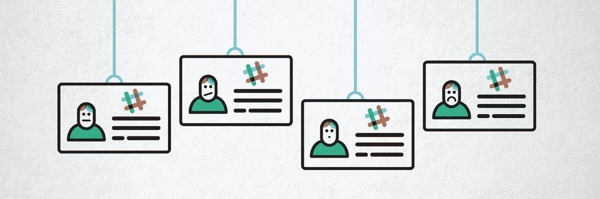
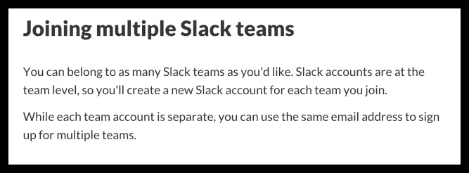

# 斯莱克犯了一个令人惊讶的简单错误

> 原文：<https://medium.com/swlh/the-surprisingly-simple-thing-slack-got-wrong-b16f489395e>

我是一个松弛的球迷有一段时间了。我是我的公司 HubSpot 的 Slack 的早期用户之一(我们在 HubSpot 实验室的一个小型全球分布式小组中使用它)。我们现在已经在全公司范围内采用了它。

Slack 把 UX 和入职的大部分事情都做对了。这是他们取得巨大成功的原因之一。

这就是为什么他们犯了一个非常非常严重的错误，这令人惊讶(也令人恼火):

当被邀请加入其他团队时，用户需要创建单独的“帐户”。

这是他们网页上的措辞。

From the Slack website

等等！什么？现在是 2016 年，这又不是 Google+，为什么我不能有一个*身份/账户，然后用它加入我想加入的任何球队？*

我不太确定 Slack 是如何结束他们的工作的，但我有一个很好的理论——基于在早期 inbound.org(一个营销社区网站)犯下同样的错误。

事情是这样的。当我们开始的时候，我们为自己构建了社区软件——因为它不是*的意思是*成为一个产品或平台，它只是为了这个用例。然后，我们收到了一些将它用于其他目的的请求。因此，从 n=1 到 n=2 最简单的方法就是为另一个实例复制数据库。这造成了 Slack 的同样问题——用户帐户是*实例*的一部分，而不是全局的。我们随后修复了这个问题。

所以，也许 Slack 的问题是 Slack 早期为自己开发软件*时的产物。然后，当他们决定将它用于*其他*团队时，他们只是做了和我一样的事情——走权宜之计，这在当时往往是正确的做法。*

鉴于跨组织渠道用例现在是如此重要，我希望 Slack 团队已经找到了偿还技术债务的方法，并让事情走上正轨。

而且，就科技债务而言，这一笔的利率相当高。以后尝试“统一”东西会越来越贵(问问谷歌就知道了)。这也使得 Slack 没有一个简单的方法来引用像 twitter 这样的用户(Medium 和几乎所有其他人都允许你这么做)。

> Slack 现在是一个网络，网络需要支持一个中央用户身份。只是很好，干净，生活。

但是，除此之外，我们很酷，懒散。我不会和你分手的。我只是认为你应该从大学债务中走出来，这样你就可以尽你所能做到最好。