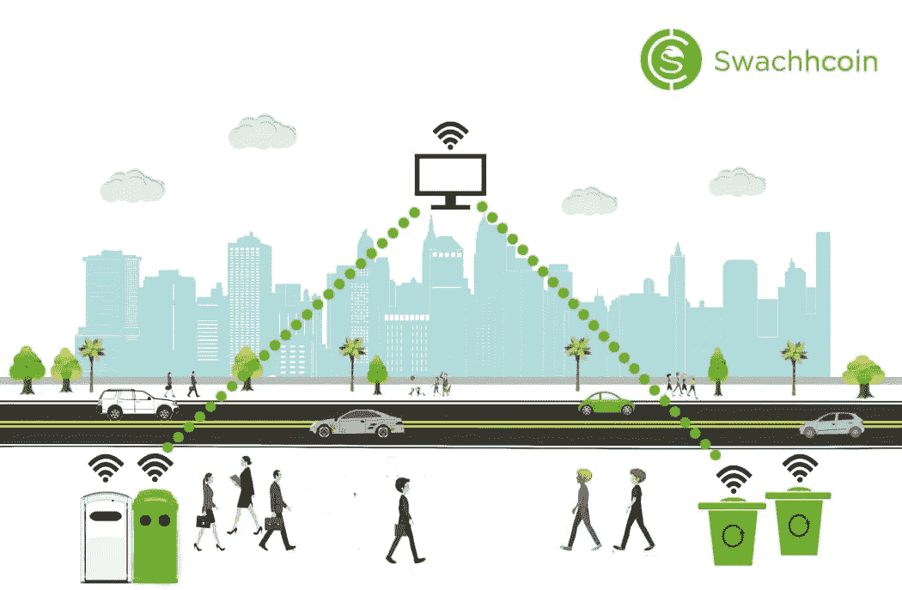

# 具有智能废物管理的 Swachh 生态系统

> 原文：<https://medium.com/swlh/the-swachh-ecosystem-with-smart-waste-management-fd48da75845e>

> Swachhcoin 旨在创建一个分散的废物管理生态系统，将废物视为最大的未开发资源，并以任何可能的方式利用它来满足人类的需求。

改革庞大而低效的废物管理部门绝非易事。这个庞大的行业每年产生数十亿磅的废物，并造成大量没有得到合理利用的不必要的废物。创新将要求客户、废物管理厂和回收中心之间的互动方式发生翻天覆地的变化。

但是变革从来没有像现在这样必要。一连串的效率和沟通问题阻碍了材料的有效利用和消费者对资源的获取。这可能是为什么 76%的垃圾没有得到处理的一个原因，相当于全球每年大约 15 亿吨垃圾。随着人口的增长和世界各地持续产生未使用的废物看不到尽头，这个问题可能只会变得更糟。

***swachhoin 正在利用分散的区块链技术，尝试探索一套可能的解决方案，以解决废物管理行业目前面临的问题*** *。*废物处理和管理流程中的问题的长期存在意味着解决方案和修复行业将始终是一个可行的市场。

但是 Swachhcoin 明白，要解决废物收集、管理和回收社区中的大量复杂问题，需要一种多方面的方法。因此，Swachhcoin 推出了一系列新项目，要求建立一个全新的生态系统，准备动摇废物管理部门。

Swachh Ecosystem with Smart Waste Management

## *智能合同集成

智能合约是 Swachhcoin 生态系统的基础。许多智能合约有助于促进复杂基础设施中不同实体之间的各种不同的交互。此外，通过分散的自治组织结构，社区对生态系统中慈善部分的发生有直接的投入。

## * SwBIN

SwBin 是该公司正在创造的一种创新的新型垃圾箱。在其开发的最后阶段，它将提供给废物管理公司，以分配到不同的地点。垃圾箱将被整合到生态系统中，作为消费者存放垃圾并最终获得奖励的手段。

## * SwAPP

为了简化流程并为消费者创新用户界面，生态系统还将实现 SwAPP 作为一个分散的用户界面系统。特别是，SwAPP 将使用地理位置为用户提供最近的可用垃圾桶列表，以存放他们的一次性废物。

## * SwATEL

Swachh 生态系统中的这个子生态系统作为系统的大脑运行，在整个系统中，在消费者、废物设施等之间传输各种类型的信息。这种信息处理方法以其处理信息的能力而闻名，其处理信息的方式为整个系统提供了明显的效率提升。信息存储在一个开放的公共分类账上，对系统中的所有参与者都可见。

## * SwIOT

SWIOT 被称为 Swachh 物联网。这个子生态系统有助于将系统的所有可行部分连接在一起，将组织模型的传统人工操作部分与组成新秩序的对象(如 SwBIN)相结合。

## **结论**

Swachhcoin 的复杂生态系统试图将几个组成部分结合起来，为废物管理行业的复杂问题提供简洁的解决方案。SwBIN 和 SwAPP 致力于使用户界面更易访问，使废物管理过程对消费者来说更容易，而 SwATEL 和 SwIOT 在后台工作，将子系统连接在一起，并改善整个生态系统的功能。

> 要了解 Swachhcoin 的工作，请在各种社交媒体上关注我们。([脸书](https://www.facebook.com/swachhcoinofficial/)， [Instagram](https://www.instagram.com/swachhcoin/) ， [Twitter](https://twitter.com/SwachhCoin) ， [Bitcointalk](https://bitcointalk.org/index.php?topic=3034091.new#new) ， [Github](https://github.com/SwachhCoin) ， [LinkendIn](https://www.linkedin.com/company/swachhcoin/) ， [Reddit](https://www.reddit.com/r/swachhcoin/) ， [Medium](/@swachhcoin) 和 [Telegram](https://t.me/SwachhcoinOfficial)
> 
> 如果你有更多的问题，请随时给 info@swachhcoin.com 发邮件。

## 这篇文章发表在 [The Startup](https://medium.com/swlh) 上，这是 Medium 最大的创业刊物，拥有 339，876 多名读者。

## 在这里订阅接收[我们的头条新闻](http://growthsupply.com/the-startup-newsletter/)。

