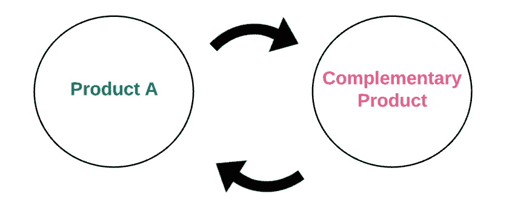

# 构建以太坊的分散式应用生态系统所获得的协同效应

> 原文：<https://medium.com/swlh/the-synergies-gained-from-building-on-ethereums-decentralized-app-ecosystem-22a709a675d2>

当第一部家用电话在 19 世纪 70 年代安装时，销售它们的公司有一个问题:如果你只能给几个人打电话，电话就没什么用了。

然而，随着网络的扩展，这一挑战变得越来越容易，因为每一个新客户出现在电话簿中都会增加产品作为通信工具的整体价值。

这个概念——被称为**“网络效应”**——在科技繁荣时期进入复兴，因为像脸书和苹果生态系统这样的平台凭借庞大的用户群迅速获得了巨大的市场份额。

就像电话一样，具有强大内置网络效应的科技产品往往会成为最有利可图和可持续发展的业务。

我说“有利可图”是因为具有强大网络效应的公司通常会导致“赢家通吃”的动态，从而获得巨大的市场份额。我说“可持续”是因为一旦他们获得了多数席位，人们完全离开或转向另一个网络的吸引力就越来越小。

快进到 2017 年，大家都在四处寻找下一个暴走的网络效应。

在我为以太坊和去中心化网络开发的过程中，我发现以太坊上的去中心化应用被一种全新的网络效应所赋能，或者我称之为“协同效应”。

让我们从更仔细地观察一些经典的网络效果开始，并展示以太坊如何为基于它的应用程序开发人员提供一个有吸引力的环境。

# 直接网络效应

LinkedIn 是网络效应发挥作用的经典例子。每个加入该平台的新员工都通过增加现有用户的网络潜力来为他们增加价值。平台上的会员越多，雇主加入的吸引力就越大。

每个加入平台的新雇主都会增加价值，因为你现在有更多的就业机会可供选择。随着这种病毒式网络的增长，转向一个网络更小的 LinkedIn 克隆版变得没有吸引力。

这种良性循环通常会导致一两家公司在[幂律分布](https://en.wikipedia.org/wiki/Power_law)中占据 80%的市场份额。

YouTube、Airbnb、优步、脸书、WhatsApp 和易贝也是建立在直接网络效应上的企业的有力例子。

# 间接网络效应

当我们通常谈论这些网络效应时，我们通常指的是**直接网络效应**:使用量的增加导致价值的直接增加。

然而，还有另一种类型的网络效应，称为“**间接网络效应**”，其中产品使用量的增加为*互补*产品创造了更多价值，这创造了一个增加原始产品价值的各种生态系统。

比如我们拿 Mac 电脑来说。它有一些直接的网络效应——例如，Mac 用户数量的增加增加了它的价值，因为更多的人可以共享兼容的文件。

但是由补充 Mac 应用程序产生的间接网络效应可能更重要:Mac 用户数量越多，对兼容 Mac 应用程序的需求就越大，这导致对软件公司和开发者构建 Mac 应用程序的需求更大。更多的开发导致更低的价格和更多种类的应用程序，让 Mac 用户过得更好。

这种硬件/软件模式适用于许多市场:

*   iPhone(硬件)和 iPhone 应用程序(软件)
*   Android 手机(硬件)和 Android 应用程序(软件)
*   ATM 卡(硬件)和兼容的柜员机(软件)
*   电视(硬件)和电影/电视节目(软件)
*   电动汽车(硬件)和电动加油站(软件)

在每一种情况下，您都有一些标准的硬件平台，以及各种补充的软件和服务。

类似地，我们可以认为间接网络效应存在于网络平台本身和所有为网络构建的应用程序之间——具体来说，每一个加入网络平台的新用户都创造了对网络应用程序的更多需求，这反过来又创造了更多种类的网络应用程序并使用户受益。

但是这种间接的网络效应是否也存在于两个建立在网络平台上的互补软件产品中呢？

# 网络应用之间的网络效应摩擦:专有 API

从表面上看，照片分享服务和云存储服务似乎为间接的网络效应做好了准备。我们可以认为，照片共享服务使用率的增加会导致云存储服务使用率的增加，因为照片共享服务必须在某个地方存储越来越多的照片，而云存储服务需要客户存储大量的东西(如照片)。

理论上，对云存储服务需求的增加创造了更多种类的云存储服务和更低的价格(由于更多的竞争)，这最终对照片共享服务更有利。

但这里的问题是，与硬件/软件范式不同，今天网络上没有单一的“照片共享服务”或“云存储服务”标准。

像 Instagram 这样的集中式平台经常不得不在他们愿意实现的开放性和对其核心技术和数据的控制之间做出权衡。创建共享的技术标准是伟大的，但当相互竞争的技术公司都希望自己的 R&D 得到充分代表时，这可能会很困难。

因此，与标准硬件平台和补充软件带来的间接网络效应不同，我们最终拥有了*专有的*云存储平台和*专有的*照片共享服务。他们如何找到协同效应？嗯，他们通过直接将*专有的*API 连接在一起来实现。

考虑一下亚马逊 S3 为其云存储服务提供的专有 API。为了在亚马逊 S3 和 Instagram 之间建立一个集成，这两个产品必须直接合作——insta gram 需要注册，创建一个亚马逊账户，为服务付费，并构建新的后端代码，插入亚马逊的专有 API。如果 Instagram 发现需要另一种云存储服务(如谷歌云平台)，它需要注册、创建一个帐户并为该服务付费，并构建附加的后端代码，插入谷歌的专有 API 等。一个接一个的专有 API。

很快，您的应用程序架构就会变成这样:

你准备好另一只鞋掉下来了吗？那么，让我们来看看当你在以太坊这样一个开放的、去中心化的平台上构建时，这一切是如何变化的。

# 以太坊如何解决协同问题

以太坊是一个区块链，内置了图灵完全编程语言和状态管理功能，使得编写智能合约和分散应用程序变得简单。理论上，这使我们能够建立一个更加“去中心化的网络”。

就像当前的 web 一样，我们发现以太坊平台和所有建立在其上的应用程序之间存在间接的网络效应——每个加入该平台的新用户都会产生对分散式应用程序的更多需求，这反过来又会产生更多种类的分散式应用程序。这是双赢。

但是还有更多。

在以太坊上构建应用程序的美妙之处在于，它的去中心化、无权限和开放的特性允许互补的应用程序作为一等公民无缝地相互集成。

专有 API 不是问题，因为每个应用程序都是在同一台虚拟机(又名以太坊虚拟机(EVM))上编写的，并且使用相同的底层语言(又名 EVM 代码)、相同的原语(又名智能合同、账户、地址、交易、消息等)。)、相同的费用结构(也称为天然气价格)、相同的州验证逻辑(例如工作证明、利益证明)、相同的钱包等。

换句话说，**一切都是围绕一个单一的共享标准**构建的。

因此，我们可以清楚地看到，在以太坊上构建的每一个互补的分散式应用程序之间也有间接的网络效应*——添加的每一个新应用程序都可以与其他现有应用程序无缝集成，这反过来增加了平台上所有应用程序的价值。*

每当这些应用程序中的任何一个添加新用户时，它都会增加该应用程序的价值，这反过来又会间接增加平台上所有其他应用程序的价值(同样，因为能够无缝集成并相互受益)。

最棒的是，所有这些协同作用会自动出现。

总的来说，去中心化的网络将应用程序从建立不成比例的直接网络效应和垄断性的商业行为推向一个间接网络效应和在以太坊上建立的每个应用程序之间的协同作用。希望这能带来更多的选择、灵活性和自由。

# 构建在以太坊上的分散式应用程序之间协同作用的一个例子

但这真的会发生吗？好吧，这已经发生了，至少在去中心化的应用微观世界里。

首先，考虑这些以太坊应用程序:

**:一个建立在以太坊上的平台，它以分散的方式提供计算基础设施，以创建一个全球计算市场。任何人都可以贡献和/或购买的“全球超级计算机”。**

**[**Oracalize**](http://www.oraclize.it/) :外部 Web APIs 和以太坊上的去中心化应用程序之间的数据载体，通过加密证明来加强安全性。**

**[**uPort**](https://www.uport.me/) :基于以太坊构建的数字身份服务，在与智能合约和其他 uPort 身份交互时，无论是链上还是链下，都可以简单安全地声明一个人或实体是谁。**

**[**Gnosis**](https://gnosis.pm/) :一个在以太坊区块链上运作的去中心化预测市场。通过使用该平台，个人和公司将能够预测未来事件(例如，预期的股票基本面、价格发现等。)**

**[**Aragon**](https://aragon.one/faq) :一个建立在以太坊之上的分散治理平台，为管理的分散服务和实体提供各种服务。**

**最后，让我们看一个以太坊上真实世界自动协同的例子。**

**假设您正在构建一个分散的保险应用程序。随着生态系统中 uPort 的加入，您不再需要自己进行 KYC 和数字签名，并且可以无缝地使用 uPort 来验证用户的身份。类似地，以太坊上的其他应用程序也自动受益于 uPort 提供的身份服务。每次 uPort 增加一个新用户，整个生态系统都会受益，因为使用 uPort 的任何应用程序都可以验证更多的用户。**

****

**随着假人加入生态系统，您可以使用他们的分布式即插即用计算平台在您的保险应用程序中运行各种服务。类似地，以太坊上的所有其他应用程序都自然而然地受益于他们的服务。每当假人增加一个新用户(即机器)，它就为系统增加了更多的计算能力，并使整个生态系统受益。**

****

**通过添加 Gnosis，您的保险应用程序可以获得对不确定结果的市场预测，即您平台上的借款人将会违约。类似地，其他所有基于以太坊的应用都受益于他们自己应用的预测市场。每次 Gnosis 增加一个新用户，都会使它的预测市场平台变得更好，从而使整个生态系统受益。**

****

**通过添加 Oracalize，您现在可以获取外部信息，如价格源、报价等。类似地，构建在以太坊上的其他应用程序也受益于 Oracalize，因为它现在具有获取外部信息的能力。**

****

**随着 Aargon 加入生态系统，您现在可以创建一个投票管理系统，帮助以快速、廉价和公平的方式处理保险索赔。类似地，以太坊上的所有其他应用程序都可以在自己的应用程序中无缝地使用 Aargon 的治理系统。加入阿尔贡平台的每一个用户都让他们的服务变得更好，这有利于整个生态系统。**

****

**…等等。**

**所有这些集成都无缝地发生，没有定制集成、后端、支付模型、API 等等。**

**这只是可能性的小规模版本。这些自动的协同作用有着无限的可能性。**

# **以太坊的讽刺之处在于:消除摩擦让垄断变得困难**

**这一切的另一面是，依靠以太坊的直接网络效应建立大型企业变得更加困难。彻底简化的生态系统使得转向替代服务的成本大大降低。即使从最终用户的角度来看，从一个服务切换到另一个服务也变得简单得多，只要他们在底层以太坊平台上，并且拥有跨任何应用程序工作的以太坊帐户/地址。**

**与我在本文开头使用的 LinkedIn 示例不同，围绕任何服务创建“护城河”都变得很困难，因为大多数专有拼图已经从图片中移除。当现实世界的企业选择以太坊作为他们的竞技场时，这种“垄断抵抗”特性将如何发挥作用还有待观察。**

**不管结果如何，我个人对一个系统的巨大潜力感到兴奋，在这个系统中，应用程序和用户可以几乎没有摩擦地创造价值。**